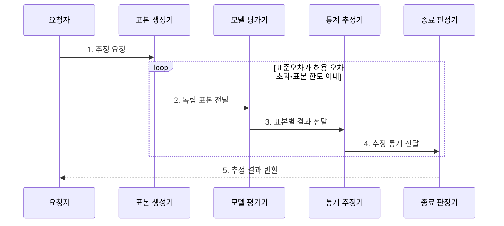

---
sidebar:
  order: 17
  label: "017. 몬테카를로 방법 (Monte Carlo Method)"
  badge:
    text: "기출 • 50%"
    variant: note
title: "몬테카를로 방법 (Monte Carlo Method)"
date: "2026-07-29T11:46:12+09:00"
tags:
  - "notes-basic-theory"
weight: 17
extra:
  question_no: "017"
  source_status: "기출"
  source_history: "131회"
  priority: 50
  priority_note: "불확실성 시뮬레이션의 적용 판단에 재사용"
---

## 미리 알고가기

- **몬테카를로 방법(Monte Carlo Method)**: 확률분포에서 반복 추출한 난수 표본의 통계량으로 직접 계산하기 어려운 값을 근사하는 기법
- **난수(Random Number)**: 확률분포에 따라 무작위로 생성한 수
- **확률분포(Probability Distribution)**: 확률변수의 값별 발생 가능성
- **독립 표본(Independent Sample)**: 서로의 발생에 영향을 주지 않는 표본
- **표본평균(Sample Mean)**: 표본값 합을 표본 수로 나눈 통계량
- **표본 수 $n$**: 평균과 표준오차 계산에 사용한 독립 표본 개수
- **표준오차(Standard Error)**: 표본마다 달라지는 추정량의 변동 크기로 정밀도를 나타내는 척도
- **신뢰구간(Confidence Interval)**: 반복 표본에서 정한 비율로 모수를 포함하도록 만든 추정 구간
- **허용 오차(Tolerable Error)**: 추정값과 목표값 사이에서 받아들일 수 있는 최대 오차로, 표본 생성을 멈출지 판단하는 기준
- **병렬 처리(Parallel Processing)**: 서로 독립된 표본 생성•평가를 여러 처리 장치에서 동시에 수행하는 방식
- **결정론적 구적법(Deterministic Quadrature)**: 정해진 격자점의 함수값을 합쳐 저차원 적분을 근사하는 기법
- **추정량(Estimator)**: 표본으로부터 모수나 목표값을 계산하는 규칙이며 표본마다 값이 달라져 표준오차의 측정 대상이 됨
- **모수(Parameter)**: 확률분포나 모집단의 특성을 나타내는 고정된 값이며 신뢰구간이 반복 표본에서 포함하도록 설계하는 추정 대상
- **분산(Variance)**: 값들이 평균에서 떨어진 정도의 제곱 평균이며 몬테카를로 추정 결과의 변동성을 나타냄
- **해석해(Analytical Solution)**: 수식 변형으로 정확한 값을 닫힌 형태로 구한 해이며 계산이 어려울 때 몬테카를로 근사를 고려함
- **고차원(High Dimension)**: 확률변수나 적분 축이 많아 규칙적 격자점 수가 급증하는 상태이며 몬테카를로법 선택의 조건
- **희귀사건(Rare Event)**: 발생 확률이 매우 작아 일반 무작위 표본에서는 관측 횟수가 부족해질 수 있는 사건
- **중요도•층화 표본추출(Importance•Stratified Sampling)**: 중요도 표본추출은 희귀하지만 영향이 큰 영역을 더 자주 뽑고 가중치로 보정하며, 층화 표본추출은 모집단을 층으로 나눠 각 층에서 표본을 확보하는 분산 감소 기법
- **제어 변량(Control Variate)**: 기댓값을 아는 상관 변수를 함께 관측해 추정량의 무작위 변동을 줄이는 기법
- **독립 난수 스트림(Independent Random Stream)**: 병렬 작업마다 겹치지 않는 난수열을 배정해 표본 간 상관을 막는 생성 흐름
- **격자점(Grid Point)**: 각 입력 축을 일정 간격으로 나눠 만든 함수 평가 위치이며 결정론적 구적법의 계산량을 좌우함
- **매끄러운 함수(Smooth Function)**: 입력 변화에 따라 값이 급격히 끊기지 않아 적은 격자점으로도 구적 오차를 줄이기 쉬운 함수
- **서버 용량 계획(Server Capacity Planning)**: 부하 표본으로 처리 한도 초과 확률을 추정해 필요한 서버 자원 규모를 정하는 작업
- **시스템 신뢰도(System Reliability)**: 정해진 기간에 시스템이 요구 기능을 고장 없이 수행할 확률이며 장애 조합 표본으로 추정하는 대상
- **복합 장애(Combined Failure)**: 둘 이상의 부품이나 구성요소가 함께 고장 나 시스템 기능을 중단시키는 사건

## Ⅰ. 개요

- 정의/개념: **난수 표본** 통계로 목표값을 근사하는 수치 기법
- 배경/필요성: 해석해가 없거나 **고차원 격자**가 폭증할 때 근사

### 쉽게 이해하기 (학습용)

- 무작위 점이 목표 영역에 포함된 비율처럼 표본 통계량으로 직접 계산하기 어려운 값을 추정한다.

## Ⅱ. 특징

> 표본 수가 네 배가 될 때마다 파란 $1/\sqrt{n}$ 선의 상대 표준오차는 절반이 되며, 독립•동일 분포와 유한 분산을 가정한 이론값이다.

- **독립 표본평균**의 표준오차가 $1/\sqrt{n}$로 감소
- **독립 표본** 생성으로 표본 단위 **병렬 처리** 가능
- **신뢰구간•표준오차**로 추정 정밀도 정량화

독립•동일 분포이며 분산이 유한한 표본 $X_i$의 평균은

$$
\operatorname{SE}(\bar X)=\frac{\sigma}{\sqrt{n}}
$$

여기서 $\sigma$는 모집단 표준편차, $n$은 독립 표본 수다.

### 쉽게 이해하기 (학습용)

- 주사위 결과의 높고 낮은 치우침은 평균에서 상쇄되지만 일부가 남아 표준오차가 천천히 줄어든다.

## Ⅲ. 구조 및 구성요소

| 구성요소 | 책임 |
|:---|:---|
| 표본 생성기 | 목표 **확률분포**에서 독립 표본 추출 |
| 모델 평가기 | 표본을 입력해 **모델 출력값** 산출 |
| 통계 추정기 | **표본평균**•표준오차 계산 |
| 종료 판정기 | 허용 오차•표본 한도로 **반복 종료** 판정 |

### 쉽게 이해하기 (학습용)

- 표본 생성기와 모델 평가기가 관측값을 만들고, 통계 추정기와 종료 판정기가 오차 범위를 확인한다.

## Ⅳ. 흐름도

**동작 원리**

1. **추정 요청**: 목표 분포•허용 오차•표본 한도 설정
2. **독립 표본 전달**: 목표 분포에서 입력 생성
3. **표본별 결과 전달**: 모델의 관측값 산출
4. **추정 통계 전달**: 평균•표준오차로 추가 표본 여부 판정
5. **추정 결과 반환**: 종료 조건 충족 후 신뢰구간 확정

### 쉽게 이해하기 (학습용)

- 주사위를 여러 작업자가 따로 던져 결과를 장부에 합치듯, 독립 표본을 생성•평가하고 신뢰구간이 허용 폭 안에 들 때까지 반복한다.

## Ⅴ. 종류 및 비교

| 수치 적분 기법 | 몬테카를로법 | 결정론적 구적법 |
|:---|:---|:---|
| 적용 기준 | 고차원 적분•**확률적 모델** | 저차원•**매끄러운 함수** |
| 핵심 특징 | **무작위 표본** 평균으로 근사 | **구적 공식** 가중합으로 근사 |
| 한계 | 고분산•**희귀사건** 표본 부족 | 차원 증가에 따른 **격자 폭증** |

### 쉽게 이해하기 (학습용)

- 축이 몇 개인 매끄러운 면은 정해진 격자점을 찍는 구적법, 축이 많아 격자가 폭증하면 무작위 점을 찍는 몬테카를로가 적합하다.

## Ⅵ. 실무 고려사항 및 대책

| 고려사항 | 대책 | 효과 |
|:---|:---|:---|
| 난수 표본의 상관으로 독립 가정이 깨져 **표준오차 과소평가** | 검증된 생성기와 독립 난수 스트림 분할 | 표본 간 독립성과 **신뢰구간 정확도** 향상 |
| **희귀사건** 표본 부족으로 꼬리 확률 추정 실패 | 중요도·층화 표본추출과 가중치 보정 | 희귀 영역의 **추정 분산 감소** |
| 높은 분산으로 허용 오차까지 필요한 표본 수 급증 | 제어 변량 등 분산 감소 기법 적용 | 동일 정밀도의 **표본·연산 비용 절감** |
| 종료 기준 부재로 과다 반복·낮은 정밀도 조기 종료 | 신뢰구간·허용 오차·표본 한도 동시 정의 | 목표 정밀도에서 **반복 종료 일관성** 확보 |

### 쉽게 이해하기 (학습용)

- 작업자별 난수 스트림을 분리해 같은 표본의 중복 생성을 막는다.

## Ⅶ. 결론

- 문제 차원•**허용 오차•계산 예산**으로 방법과 표본 수 결정

### 쉽게 이해하기 (학습용)

- 오차 막대를 절반으로 줄이려면 독립 표본이 네 배 필요하므로, 원하는 신뢰구간 폭과 계산 예산을 함께 놓고 표본 수를 정한다.
