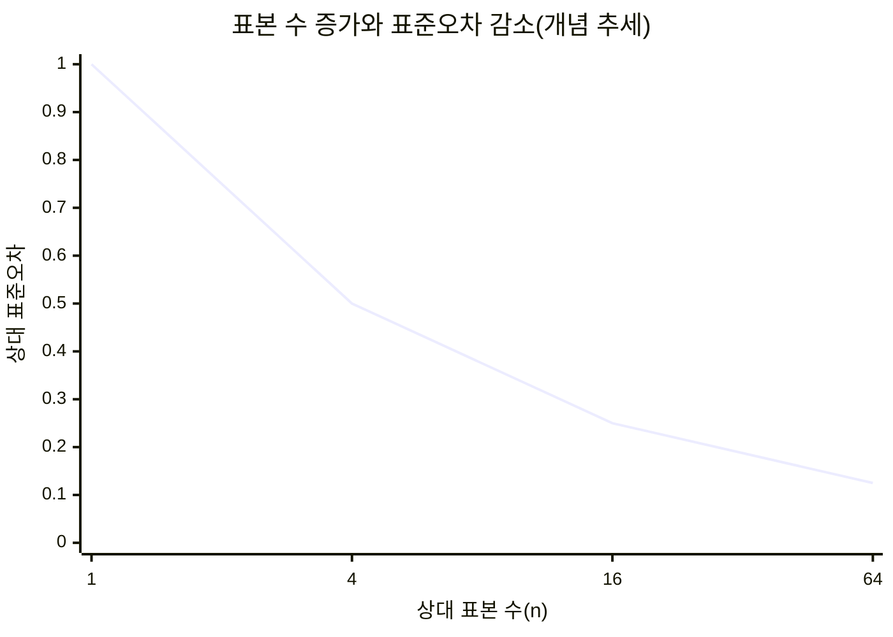
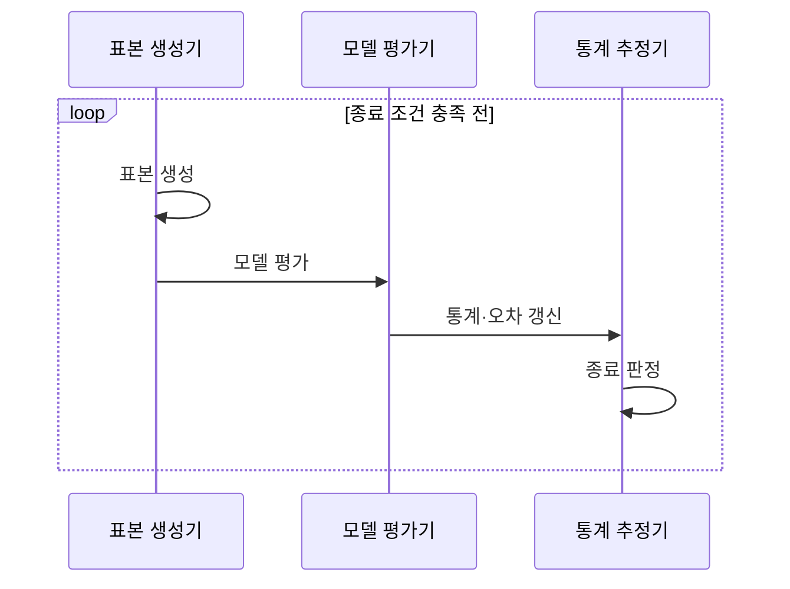

---
sidebar:
  order: 17
  label: "017. 몬테카를로 방법 (Monte Carlo Method)"
  badge:
    text: "기출 · 50%"
    variant: note
title: "몬테카를로 방법 (Monte Carlo Method)"
date: "2026-07-27T21:38:00+09:00"
tags:
  - "notes-basic-theory"
weight: 17
extra:
  question_no: "017"
  source_status: "기출"
  source_history: "131회"
  priority: 50
  priority_note: "불확실성 시뮬레이션의 적용 판단에 재사용"
---

## 미리 알고가기

- **몬테카를로 방법(Monte Carlo Method)**: 난수 표본의 통계로 직접 계산하기 어려운 값을 근사하는 기법이며, 무작위 게임으로 유명한 몬테카를로 지명에서 이름을 따 연못에 자갈을 흩뿌려 면적을 짐작하는 장면처럼 이해할 수 있음
- **난수(Random Number)**: 확률분포에 따라 무작위로 생성한 수
- **확률분포(Probability Distribution)**: 확률변수의 값별 발생 가능성
- **독립 표본(Independent Sample)**: 서로의 발생에 영향을 주지 않는 표본
- **표본평균(Sample Mean)**: 표본값 합을 표본 수로 나눈 통계량
- **표본 수 $n$**: ‘엔’으로 읽고 항목 개수(Number)의 머리글자를 쓰는 통계 관례에 따라 평균과 표준오차를 계산한 독립 표본 개수를 나타내며 차트의 가로축과 종료 조건이 되는 변수
- **표준오차(Standard Error)**: 표본마다 달라지는 추정량의 변동 크기로 정밀도를 나타내는 척도
- **신뢰구간(Confidence Interval)**: 반복 표본에서 정한 비율로 모수를 포함하도록 만든 추정 구간
- **허용 오차(Tolerable Error)**: 추정값과 목표값 사이에서 받아들일 수 있는 최대 오차로, 표본 생성을 멈출지 판단하는 기준
- **병렬 처리(Parallel Processing)**: 서로 독립된 표본 생성·평가를 여러 처리 장치에서 동시에 수행하는 방식
- **결정론적 구적법(Deterministic Quadrature)**: 정해진 격자점의 함수값을 합쳐 저차원 적분을 근사하는 기법
- **추정량(Estimator)**: 표본으로부터 모수나 목표값을 계산하는 규칙이며 표본마다 값이 달라져 표준오차의 측정 대상이 됨
- **모수(Parameter)**: 확률분포나 모집단의 특성을 나타내는 고정된 값이며 신뢰구간이 반복 표본에서 포함하도록 설계하는 추정 대상
- **분산(Variance)**: 값들이 평균에서 떨어진 정도의 제곱 평균이며 몬테카를로 추정 결과의 변동성을 나타냄
- **해석해(Analytical Solution)**: 수식 변형으로 정확한 값을 닫힌 형태로 구한 해이며 계산이 어려울 때 몬테카를로 근사를 고려함
- **고차원(High Dimension)**: 확률변수나 적분 축이 많아 규칙적 격자점 수가 급증하는 상태이며 몬테카를로법 선택의 조건
- **희귀사건(Rare Event)**: 발생 확률이 매우 작아 일반 무작위 표본에서는 관측 횟수가 부족해질 수 있는 사건
- **격자점(Grid Point)**: 각 입력 축을 일정 간격으로 나눠 만든 함수 평가 위치이며 결정론적 구적법의 계산량을 좌우함
- **매끄러운 함수(Smooth Function)**: 입력 변화에 따라 값이 급격히 끊기지 않아 적은 격자점으로도 구적 오차를 줄이기 쉬운 함수
- **서버 용량 계획(Server Capacity Planning)**: 부하 표본으로 처리 한도 초과 확률을 추정해 필요한 서버 자원 규모를 정하는 작업
- **시스템 신뢰도(System Reliability)**: 정해진 기간에 시스템이 요구 기능을 고장 없이 수행할 확률이며 장애 조합 표본으로 추정하는 대상
- **복합 장애(Combined Failure)**: 둘 이상의 부품이나 구성요소가 함께 고장 나 시스템 기능을 중단시키는 사건

## Ⅰ. 개요

- 정의/개념: **난수 표본** 통계로 목표값을 근사하는 수치 기법
- 기존 한계: **해석해** 부재·고차원 **격자 폭증**으로 직접 계산 제약

### 쉽게 이해하기 (학습용)

- 연못 넓이를 자로 잴 수 없을 때 하늘에서 자갈을 마구 뿌린 뒤 연못에 빠진 자갈 수를 전체 자갈 수로 나누면 연못이 차지한 비율이 나오는데, 식으로 딱 떨어지게 구할 수 없는 값을 이렇게 무작위 표본의 비율로 대신 얻는 것이 몬테카를로 방법이다

## Ⅱ. 특징

- **독립 표본평균**의 표준오차가 $1/\sqrt{n}$로 감소
- **독립 표본** 생성으로 표본 단위 **병렬 처리** 가능

> 표본 수 4배마다 표준오차가 절반이 되는 제곱근 반비례

### 쉽게 이해하기 (학습용)

- 자갈 100개를 뿌려 얻은 값보다 두 배 정밀한 값을 얻으려면 자갈을 200개가 아니라 400개 뿌려야 하고, 대신 자갈 하나가 어디 떨어지든 다른 자갈과 상관이 없어 열 사람이 40개씩 동시에 뿌려도 결과가 같다

## Ⅲ. 아키텍처 및 구성요소

| 설계 요소 | 설명 |
|:---|:---|
| 표본 생성기 | 목표 **확률분포**에서 **독립 표본** 추출 |
| 모델 평가기 | 표본을 입력해 **모델 출력값** 산출 |
| 통계 추정기 | **표본평균**·**표준오차** 계산과 종료 판정 |

> 요약: 생성·평가·추정을 반복해 **허용 오차**에 도달할 때까지 근사

### 쉽게 이해하기 (학습용)

- 자갈을 집어 던지는 사람이 표본 생성기, 자갈이 연못 안인지 밖인지 확인하는 사람이 모델 평가기, 지금까지 센 비율과 그 비율이 얼마나 흔들리는지를 계산해 그만 던져도 된다고 외치는 사람이 통계 추정기이며, 오차가 아직 크면 그 외침이 다시 던지는 사람에게 돌아간다

## Ⅳ. 원리 및 절차 흐름도

| 절차 | 설명 |
|:---|:---|
| 표본 생성 | 목표 **확률분포**에서 독립 난수 추출 |
| 모델 평가 | 표본별 **모델 출력값** 계산 |
| 통계·오차 갱신 | **표본평균**·분산·**신뢰구간** 갱신 |
| 종료 판정 | **허용 오차**·계산 한도로 반복 여부 결정 |

> 요약: **표준오차**가 허용 범위에 들 때까지 표본 누적

### 쉽게 이해하기 (학습용)

- 자갈 한 줌을 던져 안팎을 세고 지금까지의 비율을 고쳐 잡는 일을 되풀이하다가, 그 비율이 흔들리는 폭이 미리 정한 허용 오차보다 작아지거나 정해 둔 던지기 횟수를 다 쓰면 그 자리에서 멈춘다

## Ⅴ. 종류 및 비교

| 수치 적분 기법 | 몬테카를로법 | 결정론적 구적법 |
|:---|:---|:---|
| 적용 기준 | 고차원 적분·**확률적 모델** | 저차원·**매끄러운 함수** |
| 핵심 특징 | **무작위 표본** 평균으로 근사 | **구적 공식** 가중합으로 근사 |
| 한계 | 고분산·**희귀사건** 표본 부족 | 차원 증가에 따른 **격자 폭증** |

> 요약: **차원 수**에 따른 계산량을 기준으로 두 근사법 선택

### 쉽게 이해하기 (학습용)

- 축이 두세 개뿐이고 값이 완만하게 변하는 문제는 바둑판처럼 규칙적으로 점을 찍어 훑는 편이 정확하지만, 축이 스무 개만 돼도 바둑판 점 수가 곱셈으로 불어나 계산량이 한도를 넘으므로 그때는 그 넓은 공간에 무작위로 점을 흩뿌리는 몬테카를로가 남는 선택이 된다

## Ⅵ. 실무 사례

1. **서버 용량 계획**은 부하 표본으로 **용량 초과 확률** 추정
2. **시스템 신뢰도**는 장애 조합 표본으로 **복합 장애** 확률 추정

### 쉽게 이해하기 (학습용)

- 다음 분기 트래픽이 어떻게 튈지 모르니 시간대별 부하를 난수로 수천 번 만들어 보고, 그중 지금 서버 용량을 넘긴 횟수가 전체의 몇 퍼센트인지를 세어 증설 여부를 정한다
- 부품마다 고장 확률을 넣고 장애 시나리오를 수천 번 굴려, 전원과 디스크가 같은 시각에 함께 죽어 서비스가 멈춘 경우가 몇 번 나오는지를 세어 이중화 수준을 정한다

## Ⅶ. 결론

- **허용 오차**·계산 비용으로 **표본 수**·종료 시점 결정

### 쉽게 이해하기 (학습용)

- 정확도를 한 자리 더 올리려면 던지는 횟수가 백 배로 뛰므로, 얼마나 정밀해야 하는지와 계산에 쓸 수 있는 시간을 먼저 정해 두고 그 안에서 표본 수를 잡는다
