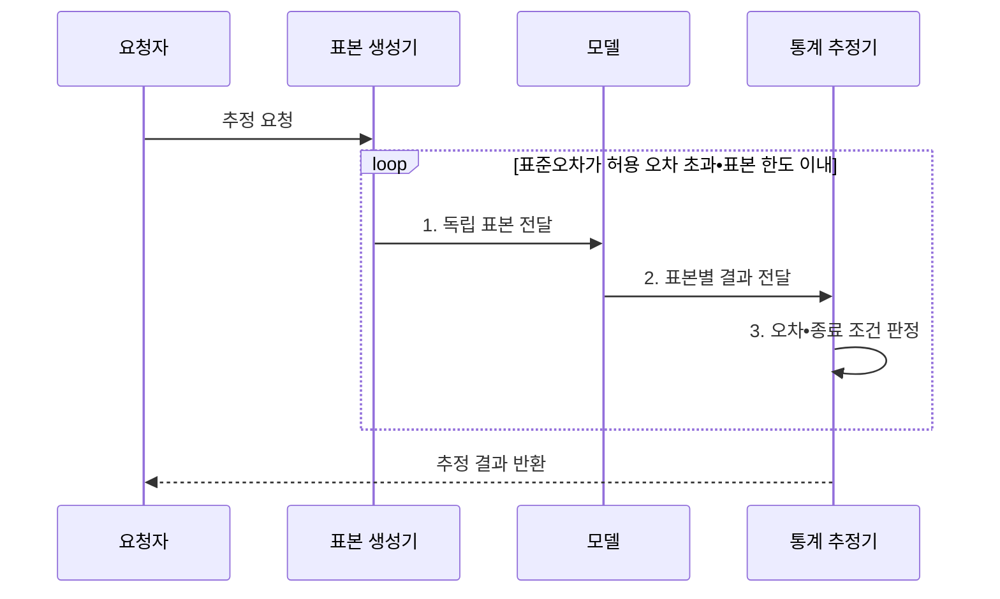

---
sidebar:
  order: 17
  label: "017. 몬테카를로 방법 (Monte Carlo Method)"
  badge:
    text: "기출 • 50%"
    variant: note
title: "몬테카를로 방법 (Monte Carlo Method)"
date: "2026-08-03T09:07:03+09:00"
tags:
  - "notes-basic-theory"
weight: 17
extra:
  question_no: "017"
  source_status: "기출"
  source_history: "131회"
  priority: 50
  priority_note: "불확실성 시뮬레이션의 적용 판단에 재사용"
---

## Ⅰ. 개요

핵심 용어

- **몬테카를로 방법(Monte Carlo Method)**: 확률분포에서 반복 추출한 난수 표본의 통계량으로 직접 계산하기 어려운 값을 근사하는 기법
- **해석해(Analytical Solution)**: 수식 변형으로 정확한 값을 닫힌 형태로 구한 해
- **고차원(High Dimension)**: 확률변수나 적분 축이 많아 규칙적인 격자점 수가 급증하는 상태
- **난수 표본(Random Sample)**: 목표 확률분포에 따라 무작위로 추출한 관측값

- 정의/개념: **난수 표본** 통계로 목표값을 근사하는 수치 기법
- 배경/필요성: 해석해가 없거나 **고차원 격자** 가 폭증할 때 근사

#### 한줄 요약

- 무작위 점이 목표 영역에 포함된 비율처럼 표본 통계량으로 직접 계산하기 어려운 값을 추정한다.

## Ⅱ. 특징

핵심 용어

- **독립 표본(Independent Sample)**: 서로의 발생 결과에 영향을 주지 않는 표본
- **표본평균(Sample Mean)**: 표본값의 합을 표본 수로 나눈 통계량
- **표준오차(Standard Error)**: 표본마다 달라지는 추정량의 변동 크기로 정밀도를 나타내는 척도
- **신뢰구간(Confidence Interval)**: 반복 표본에서 정한 비율로 모수를 포함하도록 만든 추정 구간
- **독립•동일 분포(Independent and Identically Distributed, IID)**: 표본들이 서로 영향을 주지 않고 같은 확률분포를 따르는 조건
- **유한 분산**: 확률변수의 분산이 무한하지 않아 표준오차를 정의할 수 있는 조건

> 표본 수가 네 배가 될 때마다 파란 $1/\sqrt{n}$ 선의 상대 표준오차는 절반이 되며, 독립•동일 분포와 유한 분산을 가정한 이론값이다.

- **독립 표본평균** 의 표준오차가 $1/\sqrt{n}$로 감소
- **독립 표본** 생성으로 표본 단위 **병렬 처리** 가능
- **신뢰구간•표준오차** 로 추정 정밀도 정량화

독립•동일 분포이며 분산이 유한한 표본 $X_i$의 평균은

$$
\operatorname{SE}(\bar X)=\frac{\sigma}{\sqrt{n}}
$$

여기서 $\sigma$는 모집단 표준편차, $n$은 독립 표본 수다.

#### 한줄 요약

- 주사위 결과의 높고 낮은 치우침은 평균에서 상쇄되지만 일부가 남아 표준오차가 천천히 줄어든다.

## Ⅲ. 구조 및 구성요소

핵심 용어

- **확률분포(Probability Distribution)**: 확률변수가 가질 수 있는 값과 각 값의 발생 가능성을 나타내는 규칙
- **추정량(Estimator)**: 표본으로부터 모수나 목표값을 계산하는 규칙
- **허용 오차(Tolerable Error)**: 추정값에서 받아들일 수 있는 최대 오차로 표본 생성을 멈추는 기준
- **표본평균(Sample Mean)**: 표본값의 합을 표본 수로 나눈 추정값
- **표준오차(Standard Error)**: 반복 표본에 따라 달라지는 추정량의 변동 크기
- **표본 한도**: 계산 예산 안에서 생성할 수 있는 최대 표본 수

| 구성요소 | 책임 |
|:---|:---|
| 표본 생성기 | 목표 **확률분포** 에서 독립 표본 추출 |
| 모델 평가기 | 표본을 입력해 **모델 출력값** 산출 |
| 통계 추정기 | **표본평균**•표준오차 계산 |
| 종료 판정기 | 허용 오차•표본 한도로 **반복 종료** 판정 |

#### 한줄 요약

- 표본 생성기와 모델 평가기가 관측값을 만들고, 통계 추정기와 종료 판정기가 오차 범위를 확인한다.

## Ⅳ. 흐름도

핵심 용어

- **난수 표본**: 목표 확률분포에 따라 무작위로 생성한 모델 입력
- **모델 평가**: 생성된 표본을 모델에 넣어 추정에 사용할 출력값을 구하는 과정
- **표본 한도**: 계산 예산을 넘지 않도록 생성할 수 있는 최대 표본 수
- **표준오차(Standard Error)**: 표본마다 달라지는 추정량의 변동 크기를 나타내는 척도
- **허용 오차(Tolerable Error)**: 추정값에서 받아들일 수 있는 최대 오차
- **신뢰구간(Confidence Interval)**: 정한 신뢰수준에서 모수를 포함하도록 계산한 추정 구간

**동작 원리**

1. **독립 표본 전달**: 목표 분포에서 입력 생성
2. **표본별 결과 전달**: 모델의 관측값 산출
3. **오차•종료 조건 판정**: 평균•표준오차로 추가 표본 여부 결정

#### 한줄 요약

- 주사위를 여러 작업자가 따로 던져 결과를 장부에 합치듯, 독립 표본을 생성•평가하고 신뢰구간이 허용 폭 안에 들 때까지 반복한다.

## Ⅴ. 종류 및 비교

핵심 용어

- **결정론적 구적법(Deterministic Quadrature)**: 정해진 격자점의 함수값을 가중합해 저차원 적분을 근사하는 기법
- **매끄러운 함수(Smooth Function)**: 입력 변화에 따라 값이 급격히 끊기지 않아 적은 격자점으로도 오차를 줄이기 쉬운 함수
- **희귀사건(Rare Event)**: 발생 확률이 매우 작아 일반 무작위 표본에서는 관측 횟수가 부족해질 수 있는 사건
- **격자 폭증**: 입력 차원이 늘어 각 축의 격자점 조합 수가 급격히 증가하는 현상
- **몬테카를로법(Monte Carlo Method)**: 무작위 표본의 통계량으로 직접 계산하기 어려운 값을 근사하는 기법
- **구적 공식(Quadrature Formula)**: 정해진 점의 함수값과 가중치를 합해 적분값을 근사하는 식

| 수치 적분 기법 | 몬테카를로법 | 결정론적 구적법 |
|:---|:---|:---|
| 적용 기준 | 고차원 적분•**확률적 모델** | 저차원•**매끄러운 함수** |
| 핵심 특징 | **무작위 표본** 평균으로 근사 | **구적 공식** 가중합으로 근사 |
| 한계 | 고분산•**희귀사건** 표본 부족 | 차원 증가에 따른 **격자 폭증** |

#### 한줄 요약

- 축이 몇 개인 매끄러운 면은 정해진 격자점을 찍는 구적법, 축이 많아 격자가 폭증하면 무작위 점을 찍는 몬테카를로가 적합하다.

## Ⅵ. 실무 고려사항 및 대책

핵심 용어

- **독립 난수 스트림(Independent Random Stream)**: 병렬 작업마다 겹치지 않는 난수열을 배정해 표본 간 상관을 막는 생성 흐름
- **중요도•층화 표본추출(Importance•Stratified Sampling)**: 영향이 큰 영역을 더 자주 뽑거나 모집단의 각 층에서 표본을 확보해 분산을 줄이는 기법
- **제어 변량(Control Variate)**: 기댓값을 아는 상관 변수를 함께 관측해 추정량의 무작위 변동을 줄이는 기법
- **분산(Variance)**: 값들이 평균에서 떨어진 정도의 제곱 평균으로 추정 결과의 변동성을 나타내는 척도
- **표준오차(Standard Error)**: 표본에 따른 추정량의 변동 크기로 정밀도를 나타내는 척도
- **신뢰구간(Confidence Interval)**: 정한 신뢰수준에서 모수를 포함하도록 만든 추정 구간

| 문제 | 대책 | 효과 |
|:---|:---|:---|
| 난수 표본의 상관으로 독립 가정이 깨져 **표준오차 과소평가** | 검증된 **독립 난수 스트림** 분할 | 표본 간 독립성과 **신뢰구간 정확도** 향상 |
| **희귀사건** 표본 부족으로 꼬리 확률 추정 실패 | **중요도•층화 표본추출** 과 가중치 보정 | 희귀 영역의 **추정 분산 감소** |
| 높은 분산으로 허용 오차까지 필요한 표본 수 급증 | **제어 변량** 등 분산 감소 기법 적용 | 동일 정밀도의 **표본•연산 비용 절감** |
| 종료 기준 부재로 과다 반복•낮은 정밀도 조기 종료 | 신뢰구간•허용 오차•표본 한도 동시 정의 | 목표 정밀도에서 **반복 종료 일관성** 확보 |

#### 한줄 요약

- 작업자별 난수 스트림을 분리해 같은 표본의 중복 생성을 방지한다.

## Ⅶ. 결론

핵심 용어

- **신뢰구간 폭**: 추정값의 불확실성을 나타내는 신뢰구간 상한과 하한 사이의 길이
- **계산 예산**: 표본 생성과 모델 평가에 사용할 수 있는 시간과 연산 자원의 한도
- **몬테카를로법(Monte Carlo Method)**: 난수 표본의 통계량으로 값을 근사하는 기법
- **구적법(Quadrature)**: 정해진 격자점의 함수값을 가중합해 적분값을 근사하는 기법

- 고차원은 **몬테카를로**, 저차원 매끄러운 함수는 **구적법** 선택

#### 한줄 요약

- 오차 막대를 절반으로 줄이려면 독립 표본이 네 배 필요하므로, 원하는 신뢰구간 폭과 계산 예산을 함께 놓고 표본 수를 정한다.
