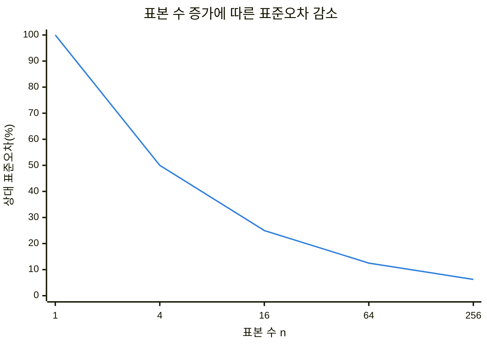
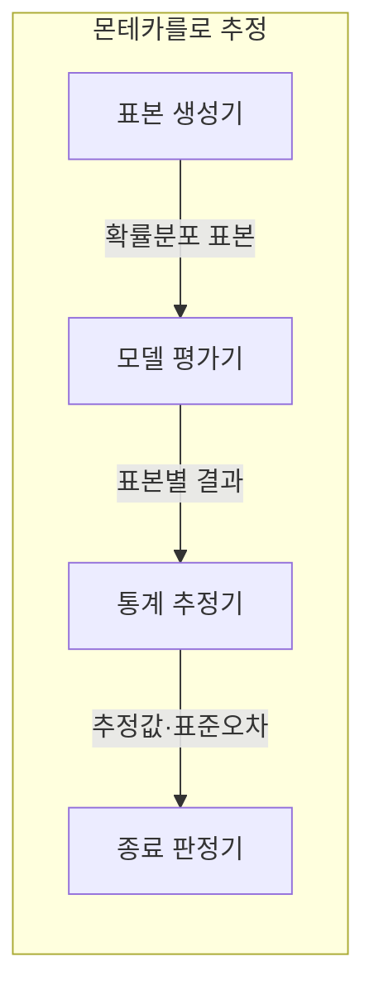
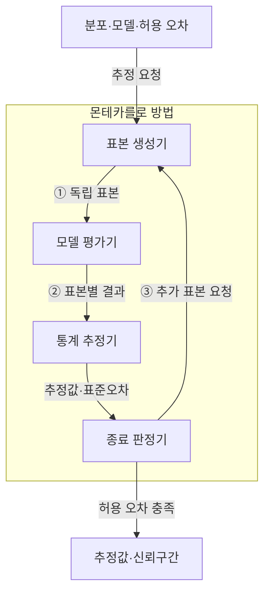
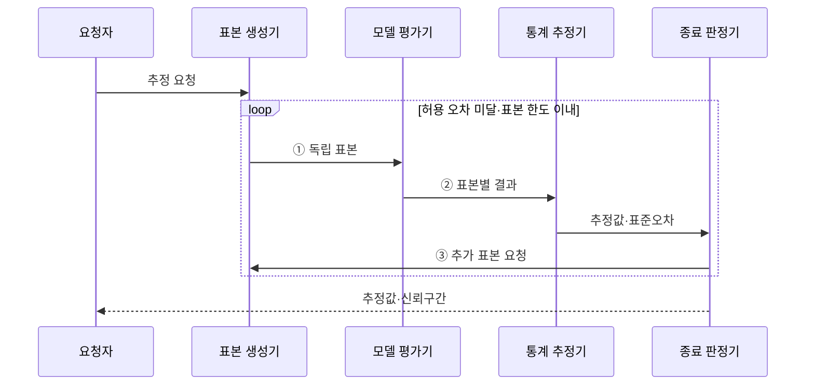

---
sidebar:
  order: 17
  label: "017. 몬테카를로 방법 (Monte Carlo Method)"
  badge:
    text: "기출 · 50%"
    variant: note
title: "몬테카를로 방법 (Monte Carlo Method)"
date: "2026-07-28T19:27:00+09:00"
tags:
  - "notes-basic-theory"
weight: 17
extra:
  question_no: "017"
  source_status: "기출"
  source_history: "131회"
  priority: 50
  priority_note: "불확실성 시뮬레이션의 적용 판단에 재사용"
---

## 미리 알고가기

- **몬테카를로 방법(Monte Carlo Method)**: 확률분포에서 반복 추출한 난수 표본의 통계량으로 직접 계산하기 어려운 값을 근사하는 기법
- **난수(Random Number)**: 확률분포에 따라 무작위로 생성한 수
- **확률분포(Probability Distribution)**: 확률변수의 값별 발생 가능성
- **독립 표본(Independent Sample)**: 서로의 발생에 영향을 주지 않는 표본
- **표본평균(Sample Mean)**: 표본값 합을 표본 수로 나눈 통계량
- **표본 수 $n$**: 평균과 표준오차 계산에 사용한 독립 표본 개수
- **표준오차(Standard Error)**: 표본마다 달라지는 추정량의 변동 크기로 정밀도를 나타내는 척도
- **신뢰구간(Confidence Interval)**: 반복 표본에서 정한 비율로 모수를 포함하도록 만든 추정 구간
- **허용 오차(Tolerable Error)**: 추정값과 목표값 사이에서 받아들일 수 있는 최대 오차로, 표본 생성을 멈출지 판단하는 기준
- **병렬 처리(Parallel Processing)**: 서로 독립된 표본 생성·평가를 여러 처리 장치에서 동시에 수행하는 방식
- **결정론적 구적법(Deterministic Quadrature)**: 정해진 격자점의 함수값을 합쳐 저차원 적분을 근사하는 기법
- **추정량(Estimator)**: 표본으로부터 모수나 목표값을 계산하는 규칙이며 표본마다 값이 달라져 표준오차의 측정 대상이 됨
- **모수(Parameter)**: 확률분포나 모집단의 특성을 나타내는 고정된 값이며 신뢰구간이 반복 표본에서 포함하도록 설계하는 추정 대상
- **분산(Variance)**: 값들이 평균에서 떨어진 정도의 제곱 평균이며 몬테카를로 추정 결과의 변동성을 나타냄
- **해석해(Analytical Solution)**: 수식 변형으로 정확한 값을 닫힌 형태로 구한 해이며 계산이 어려울 때 몬테카를로 근사를 고려함
- **고차원(High Dimension)**: 확률변수나 적분 축이 많아 규칙적 격자점 수가 급증하는 상태이며 몬테카를로법 선택의 조건
- **희귀사건(Rare Event)**: 발생 확률이 매우 작아 일반 무작위 표본에서는 관측 횟수가 부족해질 수 있는 사건
- **격자점(Grid Point)**: 각 입력 축을 일정 간격으로 나눠 만든 함수 평가 위치이며 결정론적 구적법의 계산량을 좌우함
- **매끄러운 함수(Smooth Function)**: 입력 변화에 따라 값이 급격히 끊기지 않아 적은 격자점으로도 구적 오차를 줄이기 쉬운 함수
- **서버 용량 계획(Server Capacity Planning)**: 부하 표본으로 처리 한도 초과 확률을 추정해 필요한 서버 자원 규모를 정하는 작업
- **시스템 신뢰도(System Reliability)**: 정해진 기간에 시스템이 요구 기능을 고장 없이 수행할 확률이며 장애 조합 표본으로 추정하는 대상
- **복합 장애(Combined Failure)**: 둘 이상의 부품이나 구성요소가 함께 고장 나 시스템 기능을 중단시키는 사건

## Ⅰ. 개요

- 정의/개념: **난수 표본** 통계로 목표값을 근사하는 수치 기법
- 기존 한계: **해석해** 부재·고차원 **격자 폭증**으로 직접 계산 제약

### 쉽게 이해하기 (학습용)

- 무작위 점이 목표 영역에 포함된 비율처럼 표본 통계량으로 직접 계산하기 어려운 값을 추정한다.

## Ⅱ. 특징

- **독립 표본평균**의 표준오차가 $1/\sqrt{n}$로 감소
- **독립 표본** 생성으로 표본 단위 **병렬 처리** 가능

■ **표준오차 $1/\sqrt{n}$**

> 표본 수 4배마다 표준오차가 절반이 되는 제곱근 반비례

### 쉽게 이해하기 (학습용)

- 표준오차를 절반으로 줄이려면 표본 수를 네 배로 늘려야 하며 독립 표본은 병렬 생성할 수 있다.

## Ⅲ. 아키텍처

**도표안 A — 구조도**

**도표안 B — 동작 흐름도**

**도표안 C — sequenceDiagram**

| 구성요소 | 책임 |
|:---|:---|
| 표본 생성기 | 목표 **확률분포**에서 독립 표본 추출 |
| 모델 평가기 | 표본을 입력해 **모델 출력값** 산출 |
| 통계 추정기 | **표본평균**·표준오차 계산 |
| 종료 판정기 | 허용 오차·표본 한도로 **반복 종료** 판정 |

**동작 원리**

- **① 독립 표본**: 목표 분포에서 상호 독립인 입력 생성
- **② 표본별 결과**: 모델 실행으로 목표 통계의 관측값 산출
- **③ 추가 표본 요청**: 허용 오차 미달이면 표본 생성 반복

### 쉽게 이해하기 (학습용)

- 표본을 생성·평가하고 추정 오차가 허용 범위에 들 때까지 반복한다.

## Ⅳ. 종류 및 비교

| 수치 적분 기법 | 몬테카를로법 | 결정론적 구적법 |
|:---|:---|:---|
| 적용 기준 | 고차원 적분·**확률적 모델** | 저차원·**매끄러운 함수** |
| 핵심 특징 | **무작위 표본** 평균으로 근사 | **구적 공식** 가중합으로 근사 |
| 한계 | 고분산·**희귀사건** 표본 부족 | 차원 증가에 따른 **격자 폭증** |

### 쉽게 이해하기 (학습용)

- 저차원 매끄러운 함수는 구적법, 고차원·확률적 모델은 몬테카를로가 적합하다.

## Ⅴ. 실무 고려사항 및 대책

| 고려사항 | 대책 | 효과 |
|:---|:---|:---|
| 난수 표본의 **상관·편향** | 검증된 생성기·**독립 시드** 분할 | **추정량 편향** 방지 |
| **희귀사건** 표본 부족 | **중요도·층화 표본추출** 적용 | 분산·필요 **표본 수** 감소 |
| **고분산**으로 수렴 지연 | **제어 변량** 등 분산 감소 적용 | 동일 비용의 **표준오차** 감소 |
| 오차 기준 없는 **과다 반복** | 신뢰구간·**허용 오차·표본 한도** 정의 | **종료 조건** 일관성 확보 |
| 서버 용량의 **초과 확률** | 부하 표본 기반 **초과율** 추정 | **증설 규모** 판단 |

### 쉽게 이해하기 (학습용)

- 표본 독립성과 분산을 관리하고 신뢰구간·계산 한도로 종료한다.

## Ⅵ. 결론

- 고차원·확률 모델은 몬테카를로, **허용 오차·예산**으로 표본 수 결정

### 쉽게 이해하기 (학습용)

- 목표 정밀도와 계산 예산을 함께 정해 표본 수를 결정한다.
