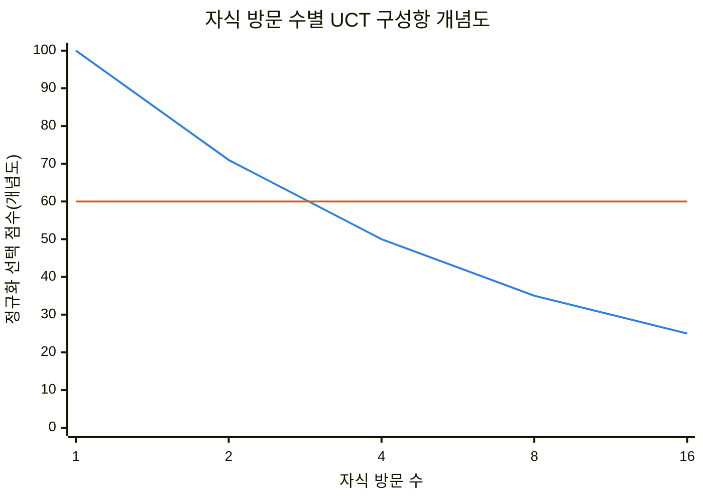
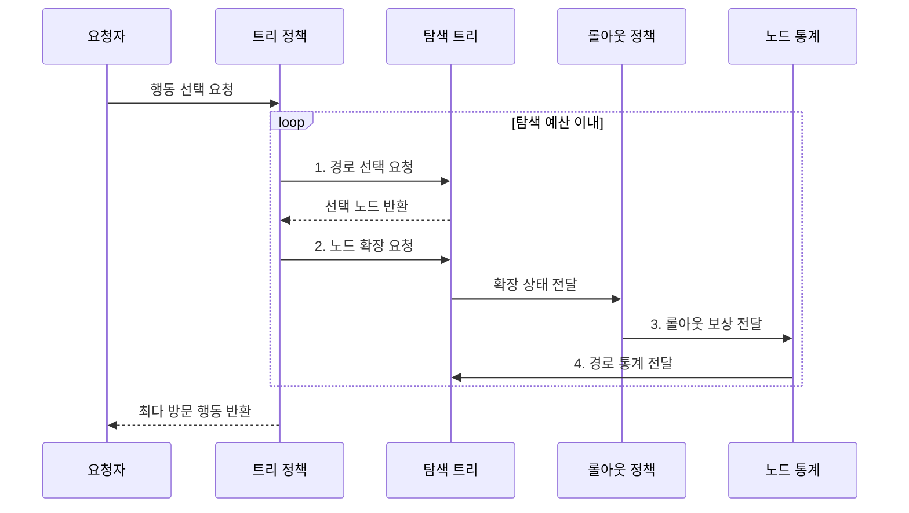
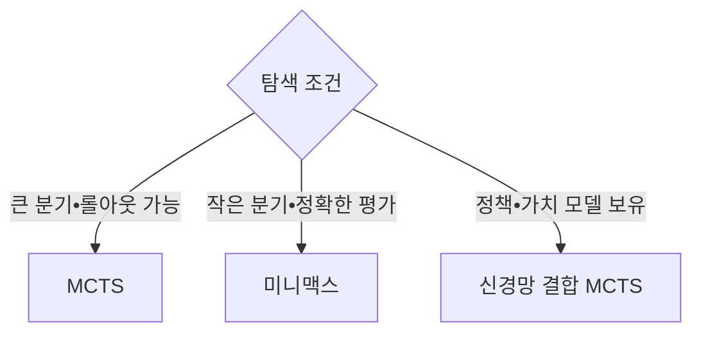

---
sidebar:
  order: 18
  label: "018. 몬테카를로 트리 탐색 MCTS (Monte Carlo Tree Search)"
  badge:
    text: "기출 • 50%"
    variant: note
title: "몬테카를로 트리 탐색 MCTS (Monte Carlo Tree Search)"
date: "2026-07-29T11:47:01+09:00"
tags:
  - "notes-basic-theory"
weight: 18
extra:
  question_no: "018"
  source_status: "기출"
  source_history: "135회"
  priority: 50
  priority_note: "최근 기출, 선택•확장•롤아웃•역전파 절차가 핵심"
---

## 미리 알고가기

- **몬테카를로 트리 탐색(Monte Carlo Tree Search, MCTS)**: 선택•확장•시뮬레이션•역전파를 반복하여 보상 추정치가 높은 경로에 탐색을 집중하는 의사결정 기법
- **상태 공간 트리(State Space Tree)**: 상태를 노드, 행동을 간선으로 표현한 탐색 공간이며, MCTS가 반복하며 실제로 키워 나가는 부분을 탐색 트리라고 부른다.
- **분기 계수(Branching Factor)**: 한 노드에서 생성되는 자식 노드 수
- **보상(Reward)**: 행동 결과의 목표 달성도를 나타내는 값
- **롤아웃(Rollout)**: 현재 상태부터 종료까지 모의 진행해 행동 보상을 추정하는 절차
- **트리 적용 신뢰 상한(Upper Confidence Bound applied to Trees, UCT)**: 평균 보상과 방문 횟수를 결합하여 활용 가치와 탐색 필요성을 함께 반영하는 MCTS 노드 선택식
- **UCT 선택 점수**: 평균 보상 $\bar X_i$와 탐색 보너스 $c\sqrt{\ln N/n_i}$를 더한 값이며, $N$은 부모 방문 수, $n_i$는 자식 방문 수
- **탐색•활용(Exploration•Exploitation)**: 저방문 후보와 고평균 보상 후보의 선택 균형
- **역전파(Backpropagation)**: 롤아웃 보상을 선택 경로의 통계에 반영해 다음 선택을 개선하는 절차
- **미니맥스(Minimax)**: 상대의 최선 대응을 가정한 결정 규칙
- **평가 함수(Evaluation Function)**: 비말단 상태의 유리함을 점수로 추정하는 함수
- **알파제로(AlphaZero)**: 정책•가치 신경망과 MCTS를 결합해 다음 행동을 선택하는 학습 시스템
- **트리 정책(Tree Policy)**: UCT로 탐색 트리의 기존 노드를 따라가며 확장할 상태와 행동을 선택하는 규칙
- **롤아웃 정책(Rollout Policy)**: 확장한 상태부터 종료 상태까지 모의 행동을 선택하여 보상 표본을 만드는 규칙
- **노드 통계(Node Statistics)**: 각 상태 노드의 방문 횟수와 누적•평균 보상을 저장하여 다음 UCT 선택에 제공하는 값
- **탐색 예산(Search Budget)**: MCTS가 반복할 수 있는 시간•롤아웃 횟수•계산량의 한도이며 소진 시 현재 최선 행동을 반환하는 종료 조건
- **루트 행동(Root Action)**: 현재 상태를 나타내는 탐색 트리의 루트에서 직접 이어지는 행동이며 반복 종료 후 최다 방문 기준으로 선택하는 최종 결정
- **롤아웃 편향(Rollout Bias)**: 롤아웃 정책이 특정 행동이나 결과를 치우치게 표본화하여 노드의 보상 추정을 왜곡하는 위험
- **탐색 상수(Exploration Constant)**: UCT에서 저방문 행동의 탐색 보너스 크기를 조절하는 계수
- **가상 손실(Virtual Loss)**: 병렬 탐색 작업자가 같은 경로에 몰리지 않도록 선택 중인 노드의 가치를 일시적으로 낮추는 값
- **사전확률(Prior Probability)**: 정책 신경망이 탐색 전에 각 행동에 부여하여 유망 분기의 우선순위를 정하는 확률
- **지평선 효과(Horizon Effect)**: 제한된 탐색 깊이 밖의 중요한 결과를 보지 못해 미니맥스의 현재 행동 평가가 왜곡되는 현상
- **정책 신경망(Policy Network)•가치 신경망(Value Network)**: 정책 신경망은 유망 행동의 확률을, 가치 신경망은 현재 상태의 예상 결과를 추정해 AlphaZero의 MCTS 선택과 평가를 안내함
- **로봇 작업 계획(Robot Task Planning)**: 로봇의 가능한 동작 순서를 상태와 행동으로 표현하고 롤아웃 보상으로 충돌 없이 목표를 마칠 순서를 선택하는 작업

## Ⅰ. 개요

- 정의/개념: **롤아웃 보상**을 트리에 누적해 행동 선택
- 배경/필요성: 큰 **분기 계수**에서 제한 예산으로 행동 결정

### 쉽게 이해하기 (학습용)

- 수많은 게임 수를 모두 읽는 대신 몇 번의 모의 대국으로 유망한 수를 찾고, 남은 탐색 예산을 그 주변에 집중한다.

## Ⅱ. 특징

- **롤아웃** 보상 평균으로 비말단 상태의 행동 가치 추정
- **UCT**로 탐색•활용 균형 조절해 유망 분기 집중
- **탐색 예산** 소진 시점의 최선 행동 반환

| 계열 | 수식•의미 |
|:---|:---|
| ■ 파란색 선언 | **탐색 보너스**: 방문 수 증가 시 감소 |
| ■ 주황색 선언 | **평균 보상**: 비교용 고정 예시값 |

> **개념 데이터**: 저방문 행동의 선택 기회 보완

### 쉽게 이해하기 (학습용)

- UCT는 고보상 수와 저방문 수의 선택 기회를 조절한다.

## Ⅲ. 구조 및 구성요소

| 구성요소 | 책임 |
|:---|:---|
| 트리 정책 | **UCT**로 탐색•활용 균형을 맞춰 경로 선택 |
| 탐색 트리 | **상태 노드**와 행동 간선 보관 |
| 롤아웃 정책 | 확장 노드부터 종료까지 **모의 진행** |
| 노드 통계 | **방문 횟수**•누적 보상 보관 |

### 쉽게 이해하기 (학습용)

- 트리 정책이 UCT로 경로를 고르고, 롤아웃 보상과 방문 횟수를 노드 통계에 누적한다.

## Ⅳ. 흐름도

**동작 원리**

- **1. 경로 선택 요청**: UCT 점수가 높은 경로 선택
- **2. 노드 확장 요청**: 미시도 행동을 노드로 추가
- **3. 롤아웃 보상 전달**: 종료까지 모의 진행
- **4. 경로 통계 전달**: 방문 횟수•누적 보상 갱신

### 쉽게 이해하기 (학습용)

- 유망한 가지를 고르고 새 수를 붙여 끝까지 모의 대국한 뒤, 승패 보상을 지나온 노드에 거꾸로 적어 다음 UCT 선택에 재사용한다.

## Ⅴ. 종류 및 비교

| 게임 트리 탐색 기법 | MCTS | 미니맥스 |
|:---|:---|:---|
| 적용 기준 | **분기 계수** 크고 롤아웃 가능 | 분기 작고 **평가 함수** 정확 |
| 핵심 특징 | **UCT**•롤아웃으로 유망 분기 집중 | 상대 최선 가정 **최소•최대 역전파** |
| 한계 | **롤아웃 편향**•저방문 분기 오판 | 평가 오차•**지평선 효과** |

### 쉽게 이해하기 (학습용)

- 둘 수가 너무 많아 전부 읽기 어렵지만 모의 대국은 가능하면 MCTS, 수가 적고 중간 판세 점수가 정확하면 미니맥스가 맞는다.

## Ⅵ. 실무 고려사항 및 대책

| 고려사항 | 대책 | 효과 |
|:---|:---|:---|
| 롤아웃 정책의 **보상 편향** | 기준 정책 검증•**가치 모델** 보정 | **행동 가치** 왜곡 감소 |
| **탐색 상수** 부적합 | 도메인•예산별 **UCT 상수** 조정 | **탐색•활용 비율** 조절 |
| 저방문 행동의 **높은 분산** | 평균 보상•**방문 수** 동시 검증 | 우연한 **고보상 선택** 방지 |
| 병렬 롤아웃의 **경로 집중** | **가상 손실**•통계 동기화 적용 | 병렬 탐색의 **경로 분산** |
| **정책•가치 신경망** 결합 | 사전확률•가치로 **탐색 유도** | 제한 예산의 **유망 분기 집중** |

### 쉽게 이해하기 (학습용)

- 롤아웃 정책이 한 수에 치우치면 보상 추정도 편향된다.

## Ⅶ. 결론

- 분기 크기•롤아웃 가능성•**평가 신뢰도**로 탐색법 선택

### 쉽게 이해하기 (학습용)

- 선택지가 많고 모의 실행이 가능하면 MCTS, 롤아웃 편향이 크면 미니맥스를 검토한다.
