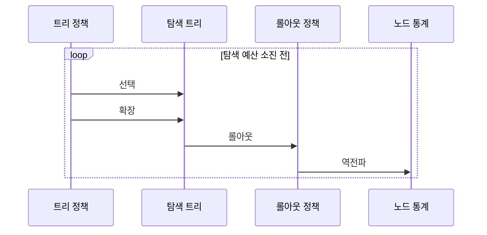

---
sidebar:
  order: 18
  label: "018. 몬테카를로 트리 탐색 MCTS (Monte Carlo Tree Search)"
  badge:
    text: "기출 · 50%"
    variant: note
title: "몬테카를로 트리 탐색 MCTS (Monte Carlo Tree Search)"
date: "2026-07-26T22:16:20+09:00"
tags:
  - "notes-basic-theory"
weight: 18
extra:
  question_no: "018"
  source_status: "기출"
  source_history: "135회"
  priority: 50
  priority_note: "최근 기출, 선택·확장·롤아웃·역전파 절차가 핵심"
---

## 미리 알고가기

- **상태 공간 트리(State Space Tree)**: 상태를 노드, 행동을 간선으로 표현한 탐색 공간이며, MCTS가 반복하며 실제로 키워 나가는 부분을 탐색 트리라고 부른다.
- **분기 계수(Branching Factor)**: 한 노드에서 생성되는 자식 노드 수
- **보상(Reward)**: 행동 결과의 목표 달성도를 나타내는 값
- **롤아웃(Rollout)**: 현재 상태부터 종료까지 모의 진행해 행동 보상을 추정하는 절차
- **트리 적용 신뢰 상한(Upper Confidence Bound applied to Trees, UCT)**: 평균 보상과 방문 횟수를 결합해 활용 가치가 높거나 덜 방문한 자식 노드를 선택하는 MCTS의 경로 선택식
- **탐색·활용(Exploration·Exploitation)**: 저방문 후보와 고평균 보상 후보의 선택 균형
- **역전파(Backpropagation)**: 롤아웃 보상을 선택 경로의 통계에 반영해 다음 선택을 개선하는 절차
- **미니맥스(Minimax)**: 상대의 최선 대응을 가정한 결정 규칙
- **평가 함수(Evaluation Function)**: 아직 끝나지 않은 중간 상태를 보고 그 판이 누구에게 얼마나 유리한지를 점수로 매기는 함수이며, 이 함수가 있어야 끝까지 두어 보지 않고도 가지를 평가할 수 있어 미니맥스의 전제가 되고 이것이 없을 때 MCTS의 롤아웃이 대신 들어온다
- **몬테카를로 트리 탐색(Monte Carlo Tree Search, MCTS)**: 롤아웃 보상을 트리에 반영해 유망한 행동에 탐색을 집중하는 기법
- **알파제로(AlphaZero)**: 정책·가치 신경망과 MCTS를 결합해 다음 행동을 선택하는 학습 시스템
- **트리 정책(Tree Policy)**: UCT로 탐색 트리의 기존 노드를 따라가며 확장할 상태와 행동을 선택하는 규칙
- **롤아웃 정책(Rollout Policy)**: 확장한 상태부터 종료 상태까지 모의 행동을 선택하여 보상 표본을 만드는 규칙
- **노드 통계(Node Statistics)**: 각 상태 노드의 방문 횟수와 누적·평균 보상을 저장하여 다음 UCT 선택에 제공하는 값
- **탐색 예산(Search Budget)**: MCTS가 반복할 수 있는 시간·롤아웃 횟수·계산량의 한도이며 소진 시 현재 최선 행동을 반환하는 종료 조건
- **루트 행동(Root Action)**: 현재 상태를 나타내는 탐색 트리의 루트에서 직접 이어지는 행동이며 반복 종료 후 최다 방문 기준으로 선택하는 최종 결정
- **롤아웃 편향(Rollout Bias)**: 롤아웃 정책이 특정 행동이나 결과를 치우치게 표본화하여 노드의 보상 추정을 왜곡하는 위험
- **지평선 효과(Horizon Effect)**: 제한된 탐색 깊이 밖의 중요한 결과를 보지 못해 미니맥스의 현재 행동 평가가 왜곡되는 현상
- **정책 신경망(Policy Network)·가치 신경망(Value Network)**: 정책 신경망은 유망 행동의 확률을, 가치 신경망은 현재 상태의 예상 결과를 추정해 AlphaZero의 MCTS 선택과 평가를 안내함
- **로봇 작업 계획(Robot Task Planning)**: 로봇의 가능한 동작 순서를 상태와 행동으로 표현하고 롤아웃 보상으로 충돌 없이 목표를 마칠 순서를 선택하는 작업

## Ⅰ. 개요

- **정의/개념**: **롤아웃** 보상 통계를 트리에 반영해 행동을 고르는 탐색 기법
- **기존 한계**: **분기 계수**가 크면 **탐색 예산** 안에 전수 탐색 불가

### 쉽게 이해하기 (학습용)
- 바둑에서 지금 둘 수 있는 자리가 200군데인데 자리마다 공평하게 끝까지 두어 보는 대신 승률이 좋아 보이는 자리에 시간을 더 몰아 두어 보고 그 결과로 다시 어디를 더 볼지 정하는 식으로, 정해진 생각 시간을 유망한 쪽에 몰아 쓰는 것이 몬테카를로 트리 탐색이다

## Ⅱ. 특징

- **평가 함수** 없이 **롤아웃** 보상 평균으로 행동 가치 추정
- **UCT**로 탐색·활용 균형 조절해 유망 분기 집중
- **탐색 예산** 소진 시점에 즉시 최선 행동 반환

### 쉽게 이해하기 (학습용)
- 중간 판을 보고 몇 점짜리인지 매기는 눈이 없어도 그 자리부터 아무렇게나 끝까지 두어 이겼는지만 세면 그 수의 가치가 잡히고, 많이 이긴 수에 시간을 몰아주되 아직 안 둬 본 수도 가끔 찔러 보며, 생각할 시간이 끝난 그 순간 지금까지 가장 많이 둬 본 수를 바로 답으로 낸다

## Ⅲ. 아키텍처 및 구성요소

| 설계 요소 | 설명 |
|:---|:---|
| 트리 정책 | **UCT**로 탐색·활용 균형 맞춰 경로 선택 |
| 탐색 트리 | **상태 노드**와 행동 간선 보관 |
| 롤아웃 정책 | 확장 노드부터 종료까지 **모의 진행** |
| 노드 통계 | **방문 횟수**·누적 보상 보관 |

> 요약: 경로 선택과 **롤아웃** 보상이 **노드 통계**로 순환

### 쉽게 이해하기 (학습용)
- 지금까지 둬 본 수들이 가지처럼 뻗은 판이 탐색 트리이고, 그 가지 중 어디로 내려갈지 고르는 규칙이 트리 정책, 고른 자리에서 끝까지 대충 둬 보는 규칙이 롤아웃 정책, 가지마다 몇 번 둬 봤고 몇 번 이겼는지를 적어 둔 장부가 노드 통계이며 그 장부가 다시 트리 정책의 판단 근거로 돌아간다

## Ⅳ. 원리 및 절차 흐름도

| 절차 | 설명 |
|:---|:---|
| 선택 | **UCT** 최대 경로로 확장 대상 하강 |
| 확장 | **미시도 행동**을 새 자식 노드로 추가 |
| 롤아웃 | **롤아웃 정책**으로 종료 상태까지 모의 진행 |
| 역전파 | 경로상 **방문 횟수**·보상 통계 갱신 |

> 요약: 예산을 소진한 뒤 루트에서 가장 많이 방문한 행동 선택

### 쉽게 이해하기 (학습용)
- 장부에서 유망한 가지를 따라 내려가 아직 안 둬 본 자리에 새 가지 하나를 붙이고 거기서부터 끝까지 대충 둬서 이겼는지 졌는지를 확인한 뒤, 그 결과를 되짚어 올라오며 지나친 모든 가지의 장부에 한 줄씩 더하는 일을 시간이 다 될 때까지 되풀이한다

## Ⅴ. 종류 및 비교

| 게임 트리 탐색 기법 | MCTS | 미니맥스 |
|:---|:---|:---|
| 적용 기준 | **분기 계수** 크고 롤아웃 가능 | 분기 작고 **평가 함수** 정확 |
| 핵심 특징 | **UCT**·롤아웃으로 유망 분기 집중 | 상대 최선 가정 **최소·최대 역전파** |
| 한계 | **롤아웃 편향**·저방문 분기 오판 | 평가 오차·**지평선 효과** |

> 요약: 평가 함수의 유무를 기준으로 **MCTS**와 **미니맥스** 선택

### 쉽게 이해하기 (학습용)
- 체스처럼 한 수마다 갈래가 서른 개쯤이고 중간 판을 점수로 정확히 매길 줄 알면 상대의 최선 대응까지 되짚어 계산하는 미니맥스가 정확하지만, 바둑처럼 갈래가 수백 개라 다 세지 못하고 중간 판에 점수 매길 방법도 마땅치 않으면 끝까지 둬 보고 승패만 세는 MCTS가 맞는다

## Ⅵ. 실무 사례

1. **AlphaZero**는 **정책·가치 신경망**과 MCTS로 착수 선택
2. **로봇 작업 계획**은 **롤아웃 보상**으로 동작 순서 선택

### 쉽게 이해하기 (학습용)
- AlphaZero는 신경망이 이 자리들이 유망하다며 후보를 미리 좁혀 주면 그 좁혀진 후보만 MCTS로 되풀이해 둬 보고, 가장 많이 검증된 자리에 실제로 착수한다
- 로봇 팔의 동작 순서 후보를 시뮬레이터에서 끝까지 돌려 보고 부딪히지 않고 목표를 마친 횟수를 세어, 성공이 가장 잦았던 순서를 실제 실행 순서로 고른다

## Ⅶ. 결론

- **평가 함수** 부재·큰 분기면 MCTS, **롤아웃 편향** 통제

### 쉽게 이해하기 (학습용)
- 후보가 너무 많아 다 볼 수 없고 중간 상태에 점수를 매길 방법도 마땅치 않을 때 MCTS가 답이 되지만, 끝까지 둬 보는 그 대충 두기가 한쪽으로 치우치면 장부에 적히는 승률 자체가 틀어지므로 그 치우침을 함께 살펴야 한다
