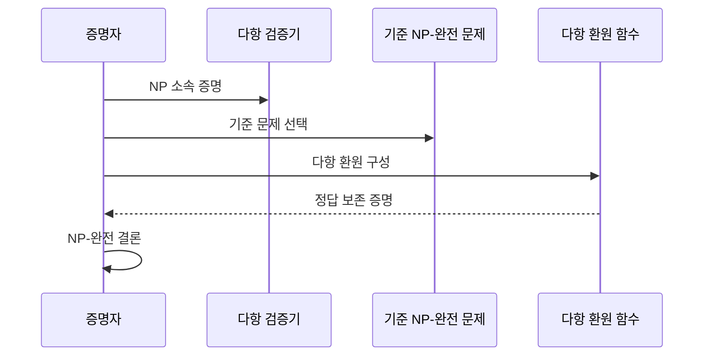
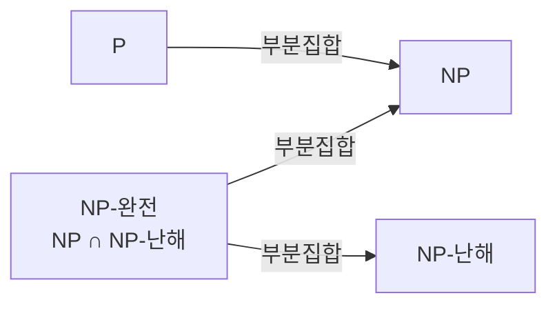

---
sidebar:
  order: 19
  label: "019. NP-완전 문제 (NP-Complete)"
  badge:
    text: "미출제 · 30%"
    variant: note
title: "NP-완전 문제 (NP-Complete)"
date: "2026-07-25T23:52:00+09:00"
tags:
  - "notes-basic-theory"
weight: 19
extra:
  question_no: "019"
  source_status: "미출제"
  source_history: ""
  priority: 30
  priority_note: "다항 환원·완전성 증명의 상위 답안 가치"
---

## 미리 알고가기

- **결정 문제(Decision Problem)**: 답이 예 또는 아니오인 계산 문제
- **다항 시간(Polynomial Time)**: 입력 크기의 다항식으로 제한되는 실행 시간
- **다항 시간 문제군(Polynomial Time, P)**: ‘피’로 읽고 다항 시간(Polynomial Time)의 머리글자를 쓰며 결정론적 알고리즘으로 다항 시간에 풀 수 있는 결정 문제 집합
- **비결정론적 다항 시간 문제군(Nondeterministic Polynomial Time, NP)**: ‘엔피’로 읽고 Nondeterministic Polynomial의 머리글자를 쓰며 긍정 인증서를 다항 시간에 검증할 수 있는 결정 문제 집합
- **인증서(Certificate)**: 긍정 답을 검증할 수 있는 보조 정보
- **다항 환원(Polynomial-Time Reduction)**: 한 문제를 답이 보존되게 다른 문제로 바꿔 난도를 전달하는 변환
- **비결정론적 다항 시간 난해(Nondeterministic Polynomial-Time Hard, NP-Hard)**: ‘엔피 하드’로 읽고 NP와 난해성 수식어를 붙임표(-)로 연결하는 관례에 따라 모든 NP 문제를 다항 환원받아 적어도 NP만큼 어려운 문제 부류를 나타냄
- **불 논리식 충족 가능성 문제(Boolean Satisfiability Problem, SAT)**: ‘새트’로 읽고 영문명의 머리글자를 쓰며 불 논리식을 참으로 만드는 변수 할당이 존재하는지 판정하는 결정 문제
- **비결정론적 다항 시간 완전(Nondeterministic Polynomial-Time Complete, NP-Complete)**: ‘엔피 컴플리트’로 읽고 NP와 완전성 수식어를 붙임표(-)로 연결하는 관례에 따라 NP에 속하면서 모든 NP 문제를 환원받는 대표 결정 문제를 나타냄
- **집합 덮개 근사(Set Cover Approximation)**: 전체 대상을 덮는 부분집합을 반복 선택해 작은 덮개를 구하는 방식
- **교집합 기호($\cap$)**: ‘교집합’으로 읽고 두 집합에 동시에 속하는 원소를 나타내는 집합론 관례 기호이며 NP와 NP-난해의 교집합이 NP-완전 문제군임을 표시함
- **피 대 엔피 명제($P=NP$)**: ‘피는 엔피와 같다’로 읽고 등호(=)로 두 문제군의 동일 여부를 나타내는 수학 관례에 따라 다항 검증 가능한 모든 문제가 다항 시간에 풀리는지를 묻는 미해결 명제
- **최적화 문제(Optimization Problem)**: 가능한 해 중 목적 함수값이 최소 또는 최대인 해를 찾는 문제이며 NP-난해성은 보일 수 있어도 결정 문제인 NP-완전과 구분함
- **특화 솔버(Specialized Solver)**: SAT처럼 특정 문제 구조에 맞춘 탐색·전파·학습 기법으로 실제 입력의 결정 가능성을 판정하는 풀이 프로그램
- **패키지 해석기(Package Resolver)**: 여러 소프트웨어 패키지의 버전·의존 조건을 논리식으로 바꿔 함께 설치 가능한 조합을 찾는 도구
- **회귀 테스트(Regression Test)**: 소프트웨어 변경이 기존 기능을 깨뜨리지 않았는지 다시 실행하는 테스트이며 집합 덮개 근사로 요구사항을 덮는 작은 테스트 집합을 선택하는 대상
- **근사해(Approximate Solution)**: 최적해와 같음을 보장하지 않지만 다항 시간에 구하며 증명된 품질 경계로 최적해와의 차이를 제한하는 해

## Ⅰ. 개요

- 정의/개념: **NP** 소속이면서 모든 NP 문제를 **다항 환원**받는 결정 문제
- 기존 한계: 문제마다 따로 보면 **다항 시간** 해법의 존재 여부 판별 불가

### 쉽게 이해하기 (학습용)
- 다 푼 스도쿠 답안을 받으면 규칙에 맞는지 1분이면 확인되지만 빈 판을 주고 답을 찾으라 하면 경우의 수를 한참 뒤져야 하듯, 답안 채점은 빠른데 답을 빨리 찾는 방법은 아직 아무도 못 찾은 문제들이 여기 모여 있다

## Ⅱ. 특징

- **NP** 소속과 모든 NP 문제의 **다항 환원** 수용
- **다항 시간** 해법 하나가 문제군 전체로 확장되는 **대표성**

### 쉽게 이해하기 (학습용)
- 이 부류의 문제들은 서로 옷만 갈아입은 같은 문제여서 어느 하나를 다항 시간에 푸는 방법이 나오면 나머지 전부를 그 문제로 번역해 같은 방법으로 풀 수 있고, 그래서 하나만 뚫려도 부류 전체가 한꺼번에 무너진다

## Ⅲ. 아키텍처 및 구성요소

| 설계 요소 | 설명 |
|:---|:---|
| 기준 NP-완전 문제 | 난해성이 이미 입증된 **환원 출발 문제** |
| 다항 환원 함수 | 기준 입력을 **다항 시간**에 대상 입력으로 변환 |
| 대상 결정 문제 | **NP-완전성**을 입증할 문제 |
| 다항 검증기 | 긍정 **인증서**의 다항 시간 검증 수행 |

> 요약: **NP 소속** 증명과 **다항 환원** 결합으로 완전성 성립

### 쉽게 이해하기 (학습용)
- 새 문제가 이 부류에 든다고 보이려면 두 가지가 필요한데, 그 문제의 답안을 빨리 채점하는 채점기가 하나 있어야 하고(다항 검증기), 이미 난제로 판명된 기준 문제의 입력을 새 문제의 입력으로 빨리 바꿔 주는 번역기가 하나 더 있어야 한다(다항 환원 함수)

## Ⅳ. 원리 및 절차 흐름도

| 절차 | 설명 |
|:---|:---|
| NP 소속 증명 | 긍정 **인증서**의 **다항 검증기** 제시 |
| 기준 문제 선택 | 이미 입증된 **NP-완전 문제** 선택 |
| 다항 환원 구성 | 기준 입력의 **다항 시간** 변환 함수 설계 |
| 정답 보존 증명 | 기준·대상의 예·아니오 **동치** 증명 |
| NP-완전 결론 | NP 소속과 **NP-난해성** 결합 |

> 요약: **NP 소속** 증명 후 기준 난제의 **다항 환원**

### 쉽게 이해하기 (학습용)
- 먼저 답안 채점이 빠름을 보여 NP 안에 든다는 것을 확인하고, 이미 난제인 문제 하나를 골라 그 입력을 새 문제의 입력으로 바꾸는 번역기를 만든 뒤, 번역 전 답이 예면 번역 후에도 예이고 아니오면 아니오임을 보이면 새 문제가 기준 난제만큼 어렵다는 결론이 선다

## Ⅴ. 종류 및 비교

| 복잡도 클래스 | NP-완전 | NP-난해 | NP | P |
|:---|:---|:---|:---|:---|
| 적용 기준 | **결정 문제** 완전성 증명 | **최적화 문제** 난도 하한 증명 | 해 후보 **검증 절차** 존재 | 입력 크기 다항식 내 **해 산출** |
| 핵심 특징 | **NP**이자 **NP-난해** | 모든 NP 문제 이상 **난도** | **인증서** 다항 시간 검증 | **결정론적 튜링 머신** 다항 판정 |
| 한계 | **근사 알고리즘** 의존 불가피 | **정지 문제** 등 비판정 문제 포함 | 풀이 시간 **지수** 가능성 잔존 | **고차 다항식** 포함으로 실용성 별개 |

> 요약: NP와 NP-난해의 **교집합**이 **NP-완전**

### 쉽게 이해하기 (학습용)
- 답안 채점이 빠르면 NP이고 그중 답 찾기까지 다항 시간에 되면 P이며, 모든 NP 문제를 옮겨 받을 만큼 어려우면 NP-난해인데 NP 안에 있으면서 NP-난해이기도 한 딱 그 교집합만 NP-완전이라, 예·아니오가 아닌 최적화 문제는 NP-난해일 수는 있어도 NP-완전이라 부르지 않는다

## Ⅵ. 실무 사례

1. **패키지 해석기**는 **SAT** 변환으로 설치 가능성 판정

### 쉽게 이해하기 (학습용)
- 설치할 패키지의 버전 조건을 이 버전을 쓰면 저 버전은 못 쓴다는 식의 참·거짓 논리식으로 통째로 바꾼 뒤 SAT 솔버에 넘겨, 모든 조건을 동시에 만족하는 버전 조합이 있는지를 판정한다

## Ⅶ. 결론

- **NP-완전** 확인 시 결정은 **특화 솔버**, 최적화는 근사해

### 쉽게 이해하기 (학습용)
- 예·아니오만 답하면 되는 문제는 그 구조에 맞춰 다듬어진 솔버에 실제 입력을 넣어 판정시키고, 가장 좋은 값을 찾아야 하는 최적화 문제는 최적해에서 얼마나 벗어날 수 있는지가 미리 증명된 근사 알고리즘으로 답을 낸다
