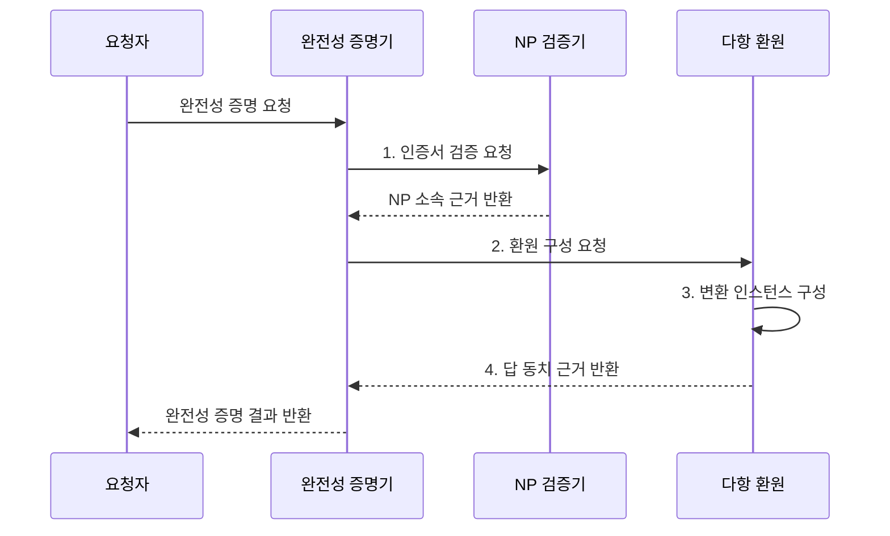

---
sidebar:
  order: 19
  label: "019. NP-완전 문제 (NP-Complete)"
  badge:
    text: "미출 • 30%"
    variant: note
title: "NP-완전 문제 (NP-Complete)"
date: "2026-08-04T09:53:42+09:00"
tags:
  - "notes-basic-theory"
weight: 19
extra:
  question_no: "019"
  source_status: "미출"
  source_history: ""
  priority: 30
  priority_note: "다항 환원•완전성 증명의 상위 답안 가치"
---

## Ⅰ. 개요

핵심 용어

- **NP-완전(NP-Complete)**: NP에 속하면서 모든 NP 문제를 다항 시간에 환원받는 결정 문제 부류
- **결정 문제(Decision Problem)**: 답이 예 또는 아니오로 정해지는 계산 문제
- **다항 환원(Polynomial-Time Reduction)**: 한 문제를 답이 보존되도록 다른 문제로 바꿔 계산 난도를 전달하는 변환
- **비결정론적 다항 시간(Nondeterministic Polynomial Time, NP)**: 긍정 답의 인증서를 다항 시간에 검증할 수 있는 결정 문제 집합

- 정의/개념: **NP에 속하면서 모든 NP 문제를 다항 시간에 환원받는 결정 문제 부류**
- 배경/필요성: 문제 간 **계산 난도** 를 환원 관계로 분류

#### 한줄 요약

- 답은 빠르게 검증되며 모든 NP 문제를 환원받는 결정 문제군이다.

## Ⅱ. 특징

핵심 용어

- **NP-난해(NP-Hard)**: 모든 NP 문제를 다항 환원받아 적어도 NP만큼 어려운 문제 부류
- **다항 시간(Polynomial Time)**: 입력 크기의 다항식으로 제한되는 실행 시간
- **대표성**: 한 NP-완전 문제의 다항 시간 해법이 모든 NP 문제의 해법으로 확장되는 성질
- **최적화 문제(Optimization Problem)**: 가능한 해 중 목적 함수값이 최소 또는 최대인 해를 찾는 문제

- **NP ∩ NP-난해** 이며 모든 NP 문제의 **다항 환원** 수용
- **다항 시간** 해법 하나가 문제군 전체로 확장되는 **대표성**
- 결정 문제의 NP-완전과 최적화 문제의 **NP-난해** 구분

#### 한줄 요약

- 대표 NP-완전 문제를 빠르게 풀면 모든 NP 문제도 빠르게 풀 수 있다.

## Ⅲ. 구조 및 구성요소

핵심 용어

- **인증서(Certificate)**: 결정 문제의 긍정 답이 맞음을 검증하는 데 사용하는 보조 정보
- **완전성 증명**: 대상 문제의 NP 소속과 NP-난해성을 함께 보이는 증명
- **답 보존**: 변환 전 문제와 변환 후 문제의 예•아니오 결과가 같은 성질
- **NP-난해성(NP-Hardness)**: 모든 NP 문제를 다항 시간에 환원받을 만큼 어렵다는 성질
- **다항 시간 검증**: 입력 크기의 다항식으로 제한되는 시간 안에 인증서의 정답 여부를 확인하는 절차

| 구성요소 | 책임 |
|:---|:---|
| 완전성 증명기 | NP 소속•**NP-난해성** 근거 결합 |
| 인증서 검증기 | 긍정 인증서의 **다항 시간 검증** 입증 |
| 다항 환원 함수 | 알려진 NP-완전 문제를 대상으로 변환 |
| 대상 문제 판정기 | 변환 인스턴스의 **예•아니오 답** 판정 |

#### 한줄 요약

- 빠른 인증서 검증과 모든 NP 문제의 환원 수용을 함께 증명해야 NP-완전이다.

## Ⅳ. 흐름도

핵심 용어

- **NP 소속 증명**: 인증서 크기와 검증 시간이 입력 크기의 다항식으로 제한됨을 보이는 과정
- **환원 구성**: 알려진 NP-완전 문제의 인스턴스를 대상 문제의 인스턴스로 변환하는 과정
- **답 동치**: 원래 인스턴스가 예일 때와 변환 인스턴스가 예일 때가 서로 같은 관계

**동작 원리**

- **1. 인증서 검증 요청**: 검증 시간의 다항성 확인
- **2. 환원 구성 요청**: 기존 NP-완전 문제에서 변환
- **3. 변환 인스턴스 구성**: 다항 시간 안에 대상 문제 입력 생성
- **4. 답 동치 근거 반환**: 변환 전후의 예•아니오가 같음을 입증

#### 한줄 요약

- 답을 빠르게 검증할 수 있음을 보이고, 기존 NP-완전 문제의 입력을 답이 유지되도록 대상 문제로 바꾼다.

## Ⅴ. 종류 및 비교

핵심 용어

- **다항 시간(Polynomial Time, P)**: 결정론적 알고리즘으로 다항 시간에 풀 수 있는 결정 문제 집합
- **정지 문제(Halting Problem)**: 임의 프로그램이 입력에서 멈추는지 판정하는 일반 알고리즘이 존재하지 않는 문제
- **결정론적 튜링 머신**: 각 상태와 입력 기호에서 다음 동작이 하나로 정해지는 계산 모델
- **비판정 문제(Undecidable Problem)**: 모든 입력에 대해 정답을 내고 종료하는 일반 알고리즘이 존재하지 않는 문제
- **고차 다항식**: 차수가 커 입력 증가에 따른 실제 계산량이 여전히 큰 다항 시간 함수

| 복잡도 클래스 | NP-완전 | NP-난해 | NP | P |
|:---|:---|:---|:---|:---|
| 적용 기준 | **결정 문제** 완전성 증명 | **최적화 문제** 난도 하한 증명 | 해 후보 **검증 절차** 존재 | 입력 크기 다항식 내 **해 산출** |
| 핵심 특징 | **NP** 이자 **NP-난해** | 모든 NP 문제 이상 **난도** | **인증서** 다항 시간 검증 | **결정론적 튜링 머신** 다항 판정 |
| 한계 | 일반 **다항 시간 해법** 미확립 | **정지 문제** 등 비판정 문제 포함 | 풀이 시간 **지수** 가능성 잔존 | **고차 다항식** 포함으로 실용성 별개 |

#### 한줄 요약

- 답안 채점이 빠른 NP 문제 중에서도 다른 모든 NP 퍼즐을 다항 시간에 번역해 받을 수 있는 결정 문제만 NP-완전이다.

## Ⅵ. 실무 고려사항 및 대책

핵심 용어

- **환원 방향**: NP-난해성을 전달하기 위해 알려진 NP-완전 문제에서 대상 문제로 향해야 하는 변환 방향
- **불 만족 가능성 문제(Boolean Satisfiability Problem, SAT)**: 불 논리식을 참으로 만드는 변수 할당의 존재 여부를 판정하는 문제
- **특화 솔버(Specialized Solver)**: 특정 문제 구조에 맞춘 탐색•전파•학습 기법으로 실제 인스턴스를 푸는 프로그램
- **임곗값 결정형**: 최적화 목적값이 주어진 기준 이상이나 이하인지 예•아니오로 묻도록 바꾼 문제

| 문제 | 대책 | 효과 |
|:---|:---|:---|
| **환원 방향** 을 반대로 구성 | 알려진 NP-완전 문제에서 **대상으로 변환** | 대상의 **NP-난해성** 전달 |
| 변환의 **답 보존** 실패 | 양방향 동치•**변환 시간** 증명 | 올바른 **다항 환원** 확보 |
| **NP 소속** 증명 누락 | 인증서 크기•검증 시간의 **다항성** 제시 | **NP-완전** 결론 완성 |
| 최적화를 **NP-완전** 으로 표현 | 임곗값 결정형•**NP-난해** 로 구분 | **복잡도 분류** 오류 방지 |
| 패키지 **버전•의존 조건** 충돌 | 조건을 **SAT** 로 바꿔 **특화 솔버** 실행 | **설치 가능 조합** 판정 |

#### 한줄 요약

- 기존 NP-완전 문제를 새 문제로 환원해 NP-난해성을 전달한다.

## Ⅶ. 결론

핵심 용어

- **근사해(Approximate Solution)**: 최적해와 같음을 보장하지 않지만 다항 시간에 구하고 품질 경계로 차이를 제한하는 해
- **결정형**: 예•아니오를 답하는 문제 형태
- **최적화형**: 목적 함수의 최선값을 찾는 문제 형태
- **품질 경계**: 근사해가 최적해에서 벗어날 수 있는 비율이나 차이의 보장 한도

- 결정형은 **특화 솔버**, 최적화형은 **근사해** 적용

#### 한줄 요약

- 예•아니오 문제는 SAT 같은 특화 솔버로 판정하고, 최적값을 찾아야 하면 다항 시간 근사해의 품질 경계를 함께 검토한다.
