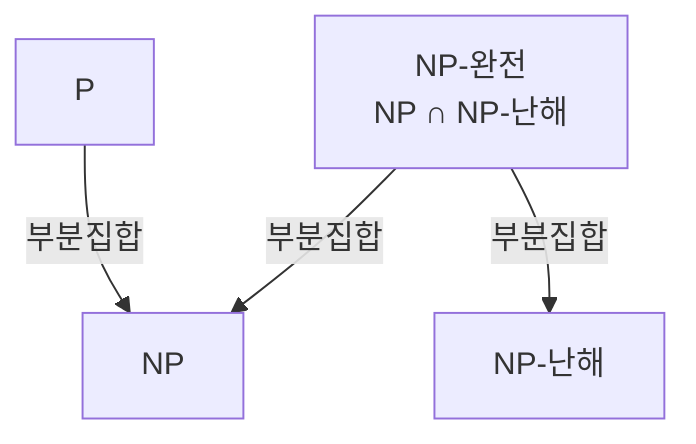

---
sidebar:
  order: 19
  label: "019. NP-완전 문제 (NP-Complete)"
  badge:
    text: "미출 · 30%"
    variant: note
title: "NP-완전 문제 (NP-Complete)"
date: "2026-07-28T22:45:00+09:00"
tags:
  - "notes-basic-theory"
weight: 19
extra:
  question_no: "019"
  source_status: "미출"
  source_history: ""
  priority: 30
  priority_note: "다항 환원·완전성 증명의 상위 답안 가치"
---

## 미리 알고가기

- **결정 문제(Decision Problem)**: 답이 예 또는 아니오인 계산 문제
- **다항 시간(Polynomial Time)**: 입력 크기의 다항식으로 제한되는 실행 시간
- **다항 시간 문제군(Polynomial Time, P)**: 결정론적 알고리즘으로 다항 시간에 풀 수 있는 결정 문제 집합
- **비결정론적 다항 시간 문제군(Nondeterministic Polynomial Time, NP)**: 긍정 인증서를 다항 시간에 검증할 수 있는 결정 문제 집합
- **인증서(Certificate)**: 긍정 답을 검증할 수 있는 보조 정보
- **다항 환원(Polynomial-Time Reduction)**: 한 문제를 답이 보존되게 다른 문제로 바꿔 난도를 전달하는 변환
- **비결정론적 다항 시간 난해(Nondeterministic Polynomial-Time Hard, NP-Hard)**: 모든 NP 문제를 다항 환원받아 적어도 NP만큼 어려운 문제 부류
- **불 논리식 충족 가능성 문제(Boolean Satisfiability Problem, SAT)**: 불 논리식을 참으로 만드는 변수 할당이 존재하는지 판정하는 결정 문제
- **비결정론적 다항 시간 완전(Nondeterministic Polynomial-Time Complete, NP-Complete)**: NP에 속하면서 모든 NP 문제를 환원받는 결정 문제 부류
- **교집합 기호($\cap$)**: 두 집합에 동시에 속하는 원소를 나타내는 기호
- **최적화 문제(Optimization Problem)**: 가능한 해 중 목적 함수값이 최소 또는 최대인 해를 찾는 문제이며 NP-난해성은 보일 수 있어도 결정 문제인 NP-완전과 구분함
- **특화 솔버(Specialized Solver)**: SAT처럼 특정 문제 구조에 맞춘 탐색·전파·학습 기법으로 실제 입력의 결정 가능성을 판정하는 풀이 프로그램
- **패키지 해석기(Package Resolver)**: 여러 소프트웨어 패키지의 버전·의존 조건을 논리식으로 바꿔 함께 설치 가능한 조합을 찾는 도구
- **근사해(Approximate Solution)**: 최적해와 같음을 보장하지 않지만 다항 시간에 구하며 증명된 품질 경계로 최적해와의 차이를 제한하는 해
- **결정론적 튜링 머신(Deterministic Turing Machine)**: 각 상태와 기호에서 다음 동작이 하나로 정해지는 계산 모형
- **정지 문제(Halting Problem)**: 임의 프로그램이 입력에서 멈추는지 판정하는 일반 알고리즘이 존재하지 않는 비판정 문제

## Ⅰ. 개요

- 정의/개념: **NP** 소속이면서 모든 NP 문제를 **다항 환원**받는 결정 문제
- 기존 한계: 문제마다 따로 보면 **다항 시간** 해법의 존재 여부 판별 불가

### 쉽게 이해하기 (학습용)

- 완성된 퍼즐 답안은 빠르게 채점할 수 있지만 답을 빠르게 찾는 법은 알려지지 않았고, 다른 NP 퍼즐을 이 형식으로 바꿀 수 있는 결정 문제군이다.

## Ⅱ. 특징

- **NP** 소속과 모든 NP 문제의 **다항 환원** 수용
- **다항 시간** 해법 하나가 문제군 전체로 확장되는 **대표성**

### 쉽게 이해하기 (학습용)

- 모든 NP 퍼즐을 한 대표 퍼즐로 빠르게 번역할 수 있으므로, 그 대표 퍼즐을 다항 시간에 풀면 번역을 거쳐 모든 NP 문제를 풀 수 있다.

## Ⅲ. 아키텍처

**도표안 A — 구조도**

| 구성요소 | 책임 |
|:---|:---|
| 인증서 검증기 | 긍정 인증서의 **다항 시간 검증** 입증 |
| 다항 환원 함수 | 알려진 NP-완전 문제를 대상으로 변환 |
| 대상 결정 문제 | 환원 전후의 **예·아니오 답** 보존 |

### 쉽게 이해하기 (학습용)

- NP 상자 안과 NP-난해 상자가 겹치는 자리에 NP-완전이 놓이므로, 인증서의 빠른 검증과 모든 NP 문제의 환원 수용을 함께 증명해야 한다.

## Ⅳ. 종류 및 비교

| 복잡도 클래스 | NP-완전 | NP-난해 | NP | P |
|:---|:---|:---|:---|:---|
| 적용 기준 | **결정 문제** 완전성 증명 | **최적화 문제** 난도 하한 증명 | 해 후보 **검증 절차** 존재 | 입력 크기 다항식 내 **해 산출** |
| 핵심 특징 | **NP**이자 **NP-난해** | 모든 NP 문제 이상 **난도** | **인증서** 다항 시간 검증 | **결정론적 튜링 머신** 다항 판정 |
| 한계 | 일반 **다항 시간 해법** 미확립 | **정지 문제** 등 비판정 문제 포함 | 풀이 시간 **지수** 가능성 잔존 | **고차 다항식** 포함으로 실용성 별개 |

### 쉽게 이해하기 (학습용)

- 답안 채점이 빠른 NP 문제 중에서도 다른 모든 NP 퍼즐을 다항 시간에 번역해 받을 수 있는 결정 문제만 NP-완전이다.

## Ⅴ. 실무 고려사항 및 대책

| 고려사항 | 대책 | 효과 |
|:---|:---|:---|
| **환원 방향**을 반대로 구성 | 알려진 NP-완전 문제에서 **대상으로 변환** | 대상의 **NP-난해성** 전달 |
| 변환의 **답 보존** 실패 | 양방향 동치·**변환 시간** 증명 | 올바른 **다항 환원** 확보 |
| **NP 소속** 증명 누락 | 인증서 크기·검증 시간의 **다항성** 제시 | **NP-완전** 결론 완성 |
| 최적화를 **NP-완전**으로 표현 | 임곗값 결정형·**NP-난해**로 구분 | **복잡도 분류** 오류 방지 |
| 패키지 **버전·의존 조건** 충돌 | 조건을 SAT로 바꿔 **특화 솔버** 실행 | **설치 가능 조합** 판정 |

### 쉽게 이해하기 (학습용)

- 새 퍼즐이 NP-완전임을 보이려면 답안 채점 시간이 다항식인지 먼저 확인하고, 이미 어려운 퍼즐을 새 퍼즐 쪽으로 번역해 난도를 전달한다.

## Ⅵ. 결론

- 결정형은 **특화 솔버**, 최적화형은 **근사 가능성·품질 경계** 검토

### 쉽게 이해하기 (학습용)

- 예·아니오 문제는 SAT 같은 특화 솔버로 판정하고, 최적값을 찾아야 하면 다항 시간 근사해의 품질 경계를 함께 검토한다.
