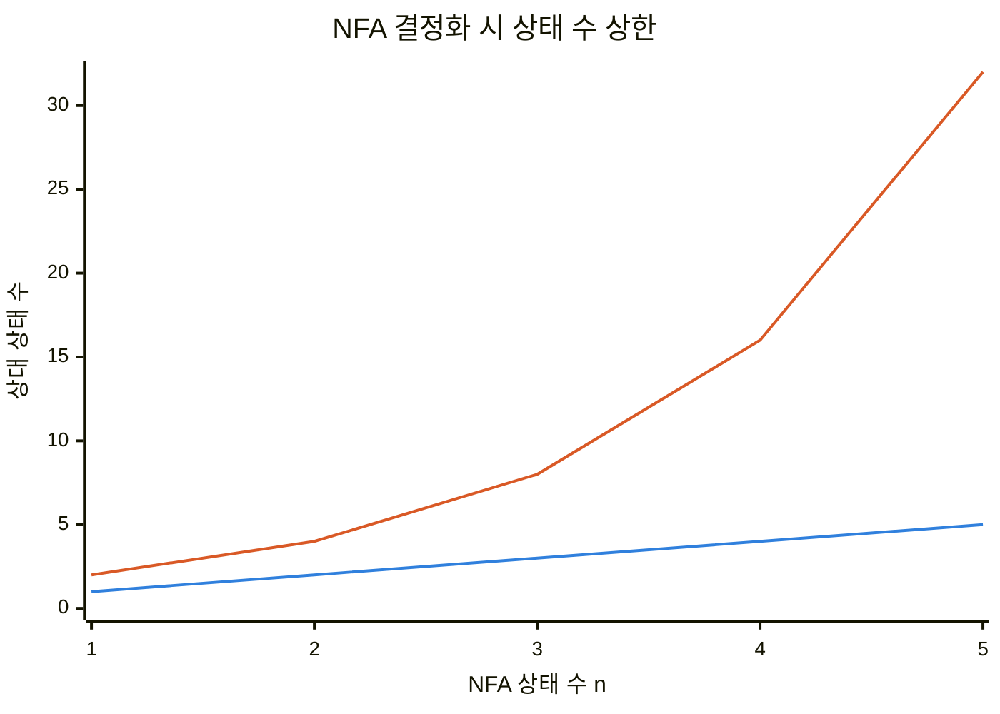
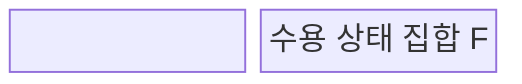
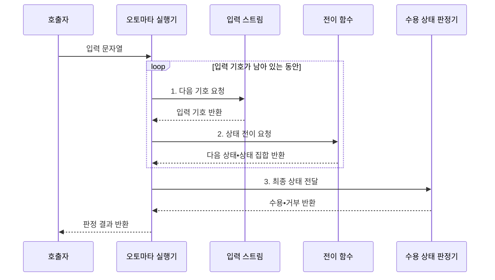

---
sidebar:
  order: 20
  label: "020. 오토마타 이론: DFA•NFA (Automata Theory)"
  badge:
    text: "미출 • 30%"
    variant: note
title: "오토마타 이론: DFA•NFA (Automata Theory)"
date: "2026-07-29T11:48:28+09:00"
tags:
  - "notes-basic-theory"
weight: 20
extra:
  question_no: "020"
  source_status: "미출"
  source_history: ""
  priority: 30
  priority_note: "정규•형식 언어를 포괄하는 오토마타 정본"
---

## 미리 알고가기

- **형식 언어(Formal Language)**: 알파벳으로 만든 문자열 중 정해진 규칙을 만족하는 집합
- **상태(State)**: 입력 이력을 구분하는 유한한 기억 단위
- **입력 알파벳(Alphabet)**: 입력에 허용되는 유한 기호 집합
- **전이 함수(Transition Function)**: 현재 상태•입력을 다음 상태에 대응시켜 처리 흐름을 결정하는 함수
- **결정적 유한 오토마타(Deterministic Finite Automaton, DFA)**: 입력 기호마다 다음 상태가 하나로 정해져 단일 상태를 추적하며 문자열의 수용 여부를 판정하는 오토마타
- **비결정적 유한 오토마타(Nondeterministic Finite Automaton, NFA)**: 한 입력에서 여러 다음 상태와 엡실론 전이를 허용해 가능한 상태 집합을 추적하며 문자열의 수용 여부를 판정하는 오토마타
- **엡실론 전이(Epsilon Transition, $\varepsilon$-transition)**: ‘엡실론 전이’로 읽으며 입력 기호를 소비하지 않고 NFA 상태를 바꾸는 전이
- **엡실론 폐쇄(Epsilon Closure)**: 한 상태나 상태 집합에서 엡실론 전이만 반복하여 입력 없이 도달할 수 있는 모든 상태의 집합
- **정규 언어(Regular Language)**: 유한 오토마타가 인식하는 문자열 집합
- **상태 집합 $Q$**: 입력 이력을 구분하는 모든 유한 상태의 집합
- **입력 알파벳 $\Sigma$**: ‘시그마’로 읽으며 처리 가능한 모든 입력 기호의 집합
- **전이 함수 $\delta$**: ‘델타’로 읽으며 현재 상태와 입력을 다음 상태에 대응시키는 함수
- **시작 상태 $q_0$**: 입력 처리 전에 오토마타가 놓이는 최초 상태
- **수용 상태 집합 $F$**: 입력 소진 뒤 문자열 수용을 확정하는 상태 집합
- **오토마타 5튜플(Five-Tuple)**: 상태 집합•입력 알파벳•전이 함수•시작 상태•수용 상태 집합의 다섯 요소를 순서 있는 한 묶음으로 정의한 오토마타의 형식 구조
- **결정화(Determinization)**: NFA의 가능한 상태 집합 하나를 DFA 상태 하나로 대응시켜 같은 정규 언어를 인식하는 DFA로 변환하는 절차
- **상태 폭증(State Explosion)**: 결정화할 때 NFA 상태 조합이 DFA의 개별 상태가 되어 상태 수가 지수적으로 늘어날 수 있는 현상
- **정규 표현식(Regular Expression)**: 문자열 패턴을 정규 언어 규칙으로 표현하며 유한 오토마타로 변환해 입력 일치 여부를 판정할 수 있는 표기
- **정규식 서비스 거부(Regular Expression Denial of Service, ReDoS)**: 비효율적인 정규식과 악성 입력이 과도한 상태 탐색을 일으켜 처리 자원을 고갈시키는 공격
- **어휘 분석기(Lexical Analyzer)**: 소스 코드의 문자 흐름을 식별자•숫자•연산자 같은 토큰으로 나누며 DFA로 정규 패턴을 판정하는 컴파일러 구성요소
- **토큰(Token)**: 어휘 분석기가 같은 문법 역할을 가진 문자 묶음에 부여하는 최소 분류 단위
- **입력 스트림(Input Stream)**: 오토마타 실행기에 문자열의 기호를 순서대로 제공하는 입력 경계

## Ⅰ. 개요

- 정의/개념: 유한 상태 **전이 함수**로 문자열 수용 판정
- 배경/필요성: **형식 언어**의 인식 범위•처리 규칙 정의

### 쉽게 이해하기 (학습용)

- 자판기가 버튼마다 상태를 바꾸듯 오토마타는 입력 기호마다 상태를 전이한다.

## Ⅱ. 특징

| 계열 | 수식•의미 |
|:---|:---|
| ■ 파란색 선언 | **NFA $n$**: 원래 상태 수 |
| ■ 주황색 선언 | **DFA $2^n$**: 최대 상태 수 |

> **결정화**: 상태 부분집합 조합이 최대 $2^n$개

- 유한 상태와 **전이 함수**만으로 문자열 수용 판정
- DFA•NFA의 **정규 언어** 인식 능력 **동등성**
- 입력 기호당 상태를 갱신하는 **순차 처리**

### 쉽게 이해하기 (학습용)

- NFA의 여러 경로를 상태 집합으로 묶으면 DFA와 같은 정규 언어를 판정한다.

## Ⅲ. 구조 및 구성요소

| 구성요소 | 책임 |
|:---|:---|
| 상태 집합 Q | 입력 이력을 구분하는 **유한 상태** 모음 |
| 입력 알파벳 Σ | 처리 가능한 **유한 기호** 집합 |
| 전이 함수 δ | 현재 상태•입력과 **다음 상태**의 대응 규칙 |
| 시작 상태 q₀ | 입력 처리 전 놓이는 **최초 상태** |
| 수용 상태 집합 F | 입력 소진 후 **수용 판정** 기준 상태 모음 |

### 쉽게 이해하기 (학습용)

- 5튜플은 사용할 상태와 입력 기호, 이동 규칙, 시작점과 수용 종착점을 한 묶음으로 정의한다.

## Ⅳ. 흐름도

**동작 원리**

- **1. 다음 기호 요청**: 입력 스트림에서 하나 소비
- **2. 상태 전이 요청**: 상태 또는 상태 집합 갱신
- **3. 최종 상태 전달**: 입력 소진 후 수용 여부 판정

### 쉽게 이해하기 (학습용)

- 5튜플은 자판기의 상태•버튼•이동 규칙처럼 오토마타 구조를 정의한다.

## Ⅴ. 종류 및 비교

| 유한 오토마타 | DFA | NFA |
|:---|:---|:---|
| 적용 기준 | **전이표** 상주 가능한 고정 패턴 | 자주 바뀌는 **동적 정규식** 매칭 |
| 핵심 특징 | 입력마다 **단일 상태 전이** | **엡실론 전이**•다중 분기 허용 |
| 한계 | 패턴 복잡도에 따른 **상태 폭증** | 실행 시 **상태 집합** 추적 부담 |

### 쉽게 이해하기 (학습용)

- DFA는 한 상태만 실행하고 NFA는 여러 후보 상태를 함께 추적한다.

## Ⅵ. 실무 고려사항 및 대책

| 고려사항 | 대책 | 효과 |
|:---|:---|:---|
| NFA 결정화의 **상태 폭증** | 도달 가능한 **상태 집합**만 생성 | **전이표 메모리** 절감 |
| **엡실론 폐쇄** 누락 | 시작•매 전이 후 **폐쇄 계산** | **수용 결과** 오류 방지 |
| 여러 패턴의 **우선순위 충돌** | 수용 상태에 **토큰 우선순위** 부여 | 결정적 **토큰 판정** |
| 악성 정규식의 **처리 시간** 급증 | DFA•패턴 제한•**시간 한도** 적용 | 정규식 **서비스 거부** 방지 |
| 어휘 분석기의 **토큰 판별** | 정규식을 **DFA 전이표**로 변환 | 문자당 **단일 상태 전이** |

### 쉽게 이해하기 (학습용)

- 도달 가능한 NFA 상태 조합만 만들어 DFA 상태 폭증을 줄인다.

## Ⅶ. 결론

- 예상 DFA 상태 수•배정 메모리로 **DFA•NFA** 선택

### 쉽게 이해하기 (학습용)

- 결정화 상태 수가 감당되면 DFA, 폭증하면 NFA 실행을 고른다.
