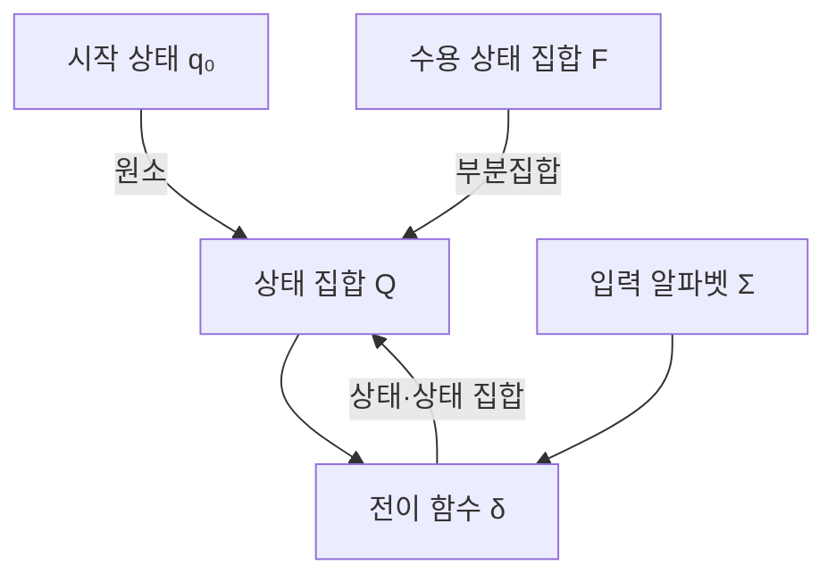
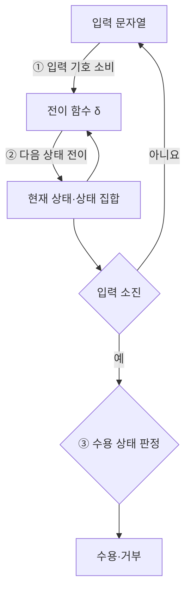
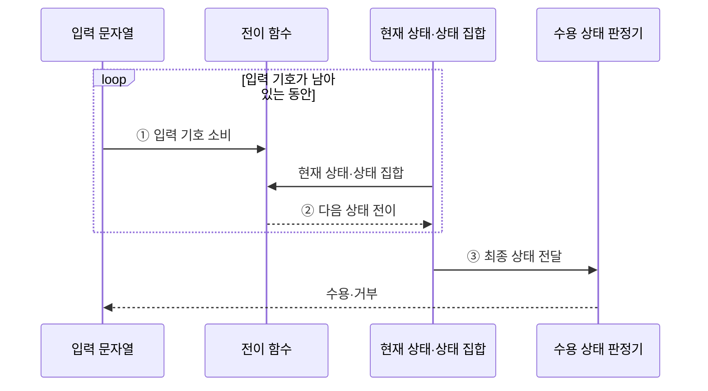

---
sidebar:
  order: 20
  label: "020. 오토마타 이론 — DFA·NFA (Automata Theory)"
  badge:
    text: "미출 · 30%"
    variant: note
title: "오토마타 이론 — DFA·NFA (Automata Theory)"
date: "2026-07-28T17:08:00+09:00"
tags:
  - "notes-basic-theory"
weight: 20
extra:
  question_no: "020"
  source_status: "미출"
  source_history: ""
  priority: 30
  priority_note: "정규·형식 언어를 포괄하는 오토마타 정본"
---

## 미리 알고가기

- **형식 언어(Formal Language)**: 알파벳으로 만든 문자열 중 정해진 규칙을 만족하는 집합
- **상태(State)**: 입력 이력을 구분하는 유한한 기억 단위
- **입력 알파벳(Alphabet)**: 입력에 허용되는 유한 기호 집합
- **전이 함수(Transition Function)**: 현재 상태·입력을 다음 상태에 대응시켜 처리 흐름을 결정하는 함수
- **결정적 유한 오토마타(Deterministic Finite Automaton, DFA)**: 입력 기호마다 다음 상태가 하나로 정해져 단일 상태를 추적하며 문자열의 수용 여부를 판정하는 오토마타
- **비결정적 유한 오토마타(Nondeterministic Finite Automaton, NFA)**: 한 입력에서 여러 다음 상태와 엡실론 전이를 허용해 가능한 상태 집합을 추적하며 문자열의 수용 여부를 판정하는 오토마타
- **엡실론 전이(Epsilon Transition, $\varepsilon$-transition)**: ‘엡실론 전이’로 읽으며 입력 기호를 소비하지 않고 NFA 상태를 바꾸는 전이
- **엡실론 폐쇄(Epsilon Closure)**: 한 상태나 상태 집합에서 엡실론 전이만 반복하여 입력 없이 도달할 수 있는 모든 상태의 집합
- **정규 언어(Regular Language)**: 유한 오토마타가 인식하는 문자열 집합
- **상태 집합 $Q$**: 입력 이력을 구분하는 모든 유한 상태의 집합
- **입력 알파벳 $\Sigma$**: ‘시그마’로 읽으며 처리 가능한 모든 입력 기호의 집합
- **전이 함수 $\delta$**: ‘델타’로 읽으며 현재 상태와 입력을 다음 상태에 대응시키는 함수
- **시작 상태 $q_0$**: 입력 처리 전에 오토마타가 놓이는 최초 상태
- **수용 상태 집합 $F$**: 입력 소진 뒤 문자열 수용을 확정하는 상태 집합
- **오토마타 5튜플(Five-Tuple)**: 상태 집합·입력 알파벳·전이 함수·시작 상태·수용 상태 집합의 다섯 요소를 순서 있는 한 묶음으로 정의한 오토마타의 형식 구조
- **소속 판정 $q\in F$**: ‘큐는 에프에 속한다’로 읽으며 DFA 최종 상태가 수용 상태인지 판정
- **NFA 수용 기호($\cap,\ne,\varnothing$)**: ‘교집합’, ‘같지 않다’, ‘공집합’으로 읽으며 가능한 상태 중 수용 상태가 있는지 판정
- **결정화(Determinization)**: NFA의 가능한 상태 집합 하나를 DFA 상태 하나로 대응시켜 같은 정규 언어를 인식하는 DFA로 변환하는 절차
- **상태 폭증(State Explosion)**: 결정화할 때 NFA 상태 조합이 DFA의 개별 상태가 되어 상태 수가 지수적으로 늘어날 수 있는 현상
- **정규 표현식(Regular Expression)**: 문자열 패턴을 정규 언어 규칙으로 표현하며 유한 오토마타로 변환해 입력 일치 여부를 판정할 수 있는 표기
- **어휘 분석기(Lexical Analyzer)**: 소스 코드의 문자 흐름을 식별자·숫자·연산자 같은 토큰으로 나누며 DFA로 정규 패턴을 판정하는 컴파일러 구성요소
- **토큰(Token)**: 어휘 분석기가 같은 문법 역할을 가진 문자 묶음에 부여하는 최소 분류 단위
- **침입 탐지 시스템(Intrusion Detection System, IDS)**: 네트워크나 시스템 활동에서 공격 패턴을 탐지하며 NFA 상태 집합으로 여러 정규식 경로를 추적하는 보안 시스템

## Ⅰ. 개요

- 정의/개념: 유한 상태 **전이 함수**로 문자열 수용을 판정하는 계산 모델
- 기존 한계: 기준 모델이 없으면 **형식 언어**의 인식 가능 범위 비교 불가

### 쉽게 이해하기 (학습용)
- 입력 이력을 유한한 상태로 구분하고 입력 소진 뒤 도달 상태로 수용 여부를 판정한다.

## Ⅱ. 특징

- 유한 상태와 **전이 함수**만으로 문자열 수용 판정
- DFA·NFA의 **정규 언어** 인식 능력 **동등성**

### 쉽게 이해하기 (학습용)
- DFA와 NFA의 전이 방식은 다르지만 인식 가능한 언어 범위는 정규 언어로 같다.

## Ⅲ. 아키텍처

**도표안 A — 구조도**

**도표안 B — 동작 흐름도**

**도표안 C — sequenceDiagram**

| 구성요소 | 책임 |
|:---|:---|
| 상태 집합 Q | 입력 이력을 구분하는 **유한 상태** 모음 |
| 입력 알파벳 Σ | 처리 가능한 **유한 기호** 집합 |
| 전이 함수 δ | 현재 상태·입력과 **다음 상태**의 대응 규칙 |
| 시작 상태 q₀ | 입력 처리 전 놓이는 **최초 상태** |
| 수용 상태 집합 F | 입력 소진 후 **수용 판정** 기준 상태 모음 |

**동작 원리**

- **① 입력 기호 소비**: 문자열에서 다음 기호 하나 선택
- **② 다음 상태 전이**: 전이 함수로 상태 또는 상태 집합 갱신
- **③ 수용 상태 판정**: 입력 소진 후 최종 상태의 수용 여부 결정

### 쉽게 이해하기 (학습용)
- 상태·입력·전이·시작 상태·수용 상태의 5튜플로 오토마타를 정의한다.

## Ⅳ. 종류 및 비교

| 유한 오토마타 | DFA | NFA |
|:---|:---|:---|
| 적용 기준 | **전이표** 상주 가능한 고정 패턴 | 자주 바뀌는 **동적 정규식** 매칭 |
| 핵심 특징 | 입력마다 **단일 상태 전이** | **엡실론 전이**·다중 분기 허용 |
| 한계 | 패턴 복잡도에 따른 **상태 폭증** | 실행 시 **상태 집합** 추적 부담 |

### 쉽게 이해하기 (학습용)
- DFA는 빠른 단일 전이, NFA는 작은 표현과 상태 집합 추적이 장점이다.

## Ⅴ. 실무 고려사항 및 대책

| 고려사항 | 대책 | 효과 |
|:---|:---|:---|
| NFA 결정화 시 상태 폭증 | 도달 가능한 상태 집합만 생성 | 전이표 메모리 절감 |
| 엡실론 폐쇄 누락 | 시작·매 전이 후 폐쇄 계산 | 수용 결과 정확성 확보 |
| 여러 패턴의 우선순위 충돌 | 수용 상태에 토큰 우선순위 부여 | 일관된 토큰 판정 |
| 악성 정규식의 처리 시간 급증 | DFA·패턴 제한·시간 한도 적용 | 정규식 서비스 거부 방지 |
| 어휘 분석기의 토큰 판별 | 정규식을 DFA 전이표로 변환 | 문자당 일정한 전이 처리 |

### 쉽게 이해하기 (학습용)
- 상태 폭증과 엡실론 폐쇄, 패턴 우선순위를 통제해 정확한 수용 판정을 보장한다.

## Ⅵ. 결론

- **결정화** 상태가 메모리 한도 이내면 DFA, 초과 시 **NFA** 추적

### 쉽게 이해하기 (학습용)
- 패턴 변경 빈도와 결정화 상태 수에 따라 DFA·NFA 실행 방식을 선택한다.
