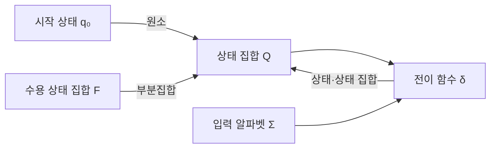
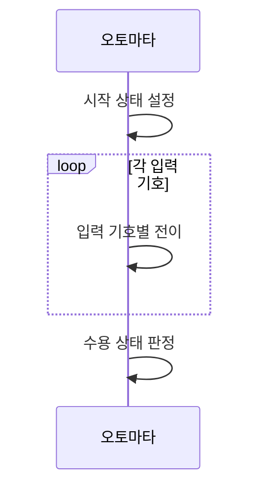

---
sidebar:
  order: 20
  label: "020. 오토마타 이론 — DFA·NFA (Automata Theory)"
  badge:
    text: "미출제 · 30%"
    variant: note
title: "오토마타 이론 — DFA·NFA (Automata Theory)"
date: "2026-07-26T22:16:20+09:00"
tags:
  - "notes-basic-theory"
weight: 20
extra:
  question_no: "020"
  source_status: "미출제"
  source_history: ""
  priority: 30
  priority_note: "정규·형식 언어를 포괄하는 오토마타 정본"
---

## 미리 알고가기

- **형식 언어(Formal Language)**: 알파벳으로 만든 문자열 중 정해진 규칙을 만족하는 집합
- **상태(State)**: 입력 이력을 구분하는 유한한 기억 단위
- **입력 알파벳(Alphabet)**: 입력에 허용되는 유한 기호 집합
- **전이 함수(Transition Function)**: 현재 상태·입력을 다음 상태에 대응시켜 처리 흐름을 결정하는 함수
- **결정적 유한 오토마타(Deterministic Finite Automaton, DFA)**: 입력 기호마다 다음 상태가 하나로 정해져 단일 상태를 추적하며 문자열의 수용 여부를 판정하는 오토마타
- **비결정적 유한 오토마타(Nondeterministic Finite Automaton, NFA)**: 한 입력에서 여러 다음 상태와 엡실론 전이를 허용해 가능한 상태 집합을 추적하며 문자열의 수용 여부를 판정하는 오토마타
- **엡실론 전이(Epsilon Transition, $\varepsilon$-transition)**: ‘엡실론 전이’로 읽고 빈 문자열을 뜻하는 그리스 소문자 엡실론을 쓰는 형식 언어 관례에 따라 입력 기호를 소비하지 않고 NFA의 상태를 바꾸는 전이
- **엡실론 폐쇄(Epsilon Closure)**: 한 상태나 상태 집합에서 엡실론 전이만 반복하여 입력 없이 도달할 수 있는 모든 상태의 집합
- **정규 언어(Regular Language)**: 유한 오토마타가 인식하는 문자열 집합
- **상태 집합 $Q$**: ‘큐’로 읽고 상태 집합에 대문자 $Q$를 쓰는 오토마타 이론 관례에 따라 입력 이력을 구분하는 모든 유한 상태의 집합을 나타냄
- **입력 알파벳 $\Sigma$**: ‘시그마’로 읽고 알파벳 집합에 그리스 대문자 시그마를 쓰는 형식 언어 관례에 따라 오토마타가 처리할 수 있는 모든 입력 기호의 집합을 나타냄
- **전이 함수 $\delta$**: ‘델타’로 읽고 변화·차이를 뜻하는 그리스 소문자 델타를 상태 변화에 대응한 관례 표기로 사용하며 현재 상태와 입력을 다음 상태 또는 상태 집합에 대응시킴
- **시작 상태 $q_0$**: ‘큐 서브 제로’로 읽고 상태를 뜻하는 관례 변수 $q$와 최초를 뜻하는 아래첨자 0을 사용하여 입력 처리 전에 오토마타가 놓이는 최초 상태를 나타냄
- **수용 상태 집합 $F$**: ‘에프’로 읽고 최종 상태(Final State)의 머리글자를 쓰는 관례에 따라 입력을 모두 읽은 뒤 문자열 수용을 확정하는 상태의 집합을 나타냄
- **오토마타 5튜플(Five-Tuple)**: 상태 집합·입력 알파벳·전이 함수·시작 상태·수용 상태 집합의 다섯 요소를 순서 있는 한 묶음으로 정의한 오토마타의 형식 구조
- **소속 판정 $q\in F$**: ‘큐는 에프에 속한다’로 읽고 집합 소속을 뜻하는 기호($\in$)를 쓰는 관례에 따라 DFA의 최종 상태 $q$가 수용 상태 집합 $F$에 포함되는지 판정함
- **NFA 수용 기호($\cap,\ne,\varnothing$)**: ‘교집합’, ‘같지 않다’, ‘공집합’으로 읽고 집합 관계를 나타내는 수학 관례 기호를 사용하여 현재 상태 집합과 $F$의 교집합이 공집합이 아니면 NFA의 가능한 상태 중 하나 이상이 수용 상태임을 판정함
- **결정화(Determinization)**: NFA의 가능한 상태 집합 하나를 DFA 상태 하나로 대응시켜 같은 정규 언어를 인식하는 DFA로 변환하는 절차
- **상태 폭증(State Explosion)**: 결정화할 때 NFA 상태 조합이 DFA의 개별 상태가 되어 상태 수가 지수적으로 늘어날 수 있는 현상
- **정규 표현식(Regular Expression)**: 문자열 패턴을 정규 언어 규칙으로 표현하며 유한 오토마타로 변환해 입력 일치 여부를 판정할 수 있는 표기
- **어휘 분석기(Lexical Analyzer)**: 소스 코드의 문자 흐름을 식별자·숫자·연산자 같은 토큰으로 나누며 DFA로 정규 패턴을 판정하는 컴파일러 구성요소
- **토큰(Token)**: 어휘 분석기가 같은 문법 역할을 가진 문자 묶음에 부여하는 최소 분류 단위
- **침입 탐지 시스템(Intrusion Detection System, IDS)**: 네트워크나 시스템 활동에서 공격 패턴을 탐지하며 NFA 상태 집합으로 여러 정규식 경로를 추적하는 보안 시스템

## Ⅰ. 개요

- 정의/개념: 유한 상태 **전이 함수**로 문자열 수용을 판정하는 계산 모델
- 기존 한계: 기준 모델이 없으면 **형식 언어**의 인식 가능 범위 비교 불가

### 쉽게 이해하기 (학습용)
- 자판기는 지금까지 넣은 동전 합만 기억하면 되지 500원을 어떤 순서로 넣었는지는 기억할 필요가 없듯, 지나온 입력을 몇 개의 기억칸으로만 구분해 두고 마지막에 어느 칸에 서 있는지로 받아들일지 말지를 정하는 것이 오토마타다

## Ⅱ. 특징

- 유한 상태와 **전이 함수**만으로 문자열 수용 판정
- DFA·NFA의 **정규 언어** 인식 능력 **동등성**

### 쉽게 이해하기 (학습용)
- 규칙이 아무리 복잡해도 기억칸 수가 유한하면 알아볼 수 있는 범위는 정규 언어까지이고, 갈림길에서 한 길만 고르든 갈 수 있는 길을 전부 동시에 걸어 보든 그 알아보는 범위 자체는 똑같다

## Ⅲ. 아키텍처 및 구성요소

| 설계 요소 | 설명 |
|:---|:---|
| 상태 집합 Q | 입력 이력을 구분하는 **유한 상태** 모음 |
| 입력 알파벳 Σ | 처리 가능한 **유한 기호** 집합 |
| 전이 함수 δ | 현재 상태·입력과 **다음 상태**의 대응 규칙 |
| 시작 상태 q₀ | 입력 처리 전 놓이는 **최초 상태** |
| 수용 상태 집합 F | 입력 소진 후 **수용 판정** 기준 상태 모음 |

> 요약: **오토마타 5튜플**로 인식 대상 언어 확정

### 쉽게 이해하기 (학습용)
- 기억칸 목록이 상태 집합, 넣을 수 있는 동전 종류가 입력 알파벳, 어느 칸에서 어떤 동전을 넣으면 어느 칸으로 옮겨 가는지 적힌 표가 전이 함수, 아무것도 안 넣었을 때 서 있는 칸이 시작 상태, 상품이 나오는 칸들이 수용 상태 집합이며 이 다섯이 다 모여야 자판기 하나가 정해진다

## Ⅳ. 원리 및 절차 흐름도

| 절차 | 설명 |
|:---|:---|
| 시작 상태 설정 | DFA는 시작 상태, NFA는 **엡실론 폐쇄** |
| 입력 기호별 전이 | DFA는 단일 상태, NFA는 **상태 집합** 갱신 |
| 수용 상태 판정 | **수용 상태 집합**과의 소속·교집합 확인 |

> 요약: 입력 소진 후 **수용 상태** 도달 여부로 판정

### 쉽게 이해하기 (학습용)
- 시작 칸에 서서 문자열을 앞에서부터 한 글자씩 읽으며 표가 시키는 대로 칸을 옮겨 다니다가 다 읽고 멈춰 선 칸이 상품 나오는 칸이면 받아들이는데, NFA는 동시에 여러 칸에 서 있을 수 있어 그중 하나만 상품 칸이어도 받아들인다

## Ⅴ. 종류 및 비교

| 유한 오토마타 | DFA | NFA |
|:---|:---|:---|
| 적용 기준 | **전이표** 상주 가능한 고정 패턴 | 자주 바뀌는 **동적 정규식** 매칭 |
| 핵심 특징 | 입력마다 **단일 상태 전이** | **엡실론 전이**·다중 분기 허용 |
| 한계 | 패턴 복잡도에 따른 **상태 폭증** | 실행 시 **상태 집합** 추적 부담 |

> 요약: 전이의 **결정성** 유무를 기준으로 DFA와 NFA 구분

### 쉽게 이해하기 (학습용)
- 전이표를 미리 다 만들어 두면 글자마다 표를 한 번만 보면 되니 실행이 빠른 대신 패턴이 복잡할수록 표가 커지고, NFA는 표를 안 펼치는 대신 지금 서 있을 수 있는 칸들을 매 글자마다 집합으로 들고 다녀야 하며 이 집합을 전부 칸으로 펼치면 그 수가 지수로 튄다

## Ⅵ. 실무 사례

1. **어휘 분석기**는 정규식을 **DFA**로 변환해 토큰 판별
2. **침입 탐지** 정규식 엔진은 **NFA 상태 집합**으로 패턴 추적

### 쉽게 이해하기 (학습용)
- 컴파일러가 소스 코드를 앞에서부터 한 글자씩 읽으며 지금 읽는 것이 변수 이름인지 숫자인지 연산자인지를 상태표대로 따라가 판정하고, 더 이어 붙일 수 없는 지점에서 토큰 하나를 끊어 낸다
- 침입 탐지기는 수천 개의 공격 패턴 정규식을 하나씩 다 돌려 보는 대신, 패킷을 한 바이트 읽을 때마다 지금 어느 패턴의 어느 지점까지 와 있는지를 상태 집합으로 한꺼번에 들고 가며 갱신한다

## Ⅶ. 결론

- **결정화** 상태가 메모리 한도 이내면 DFA, 초과 시 **NFA** 추적

### 쉽게 이해하기 (학습용)
- 전이표를 다 펼쳐 두면 매칭이 빠르니 패턴이 고정돼 있고 표가 메모리에 들어가면 DFA로 펼쳐 두고, 패턴이 자주 바뀌거나 펼친 표가 메모리 한도를 넘으면 펼치지 않고 지금 가능한 상태만 묶어 들고 다닌다
