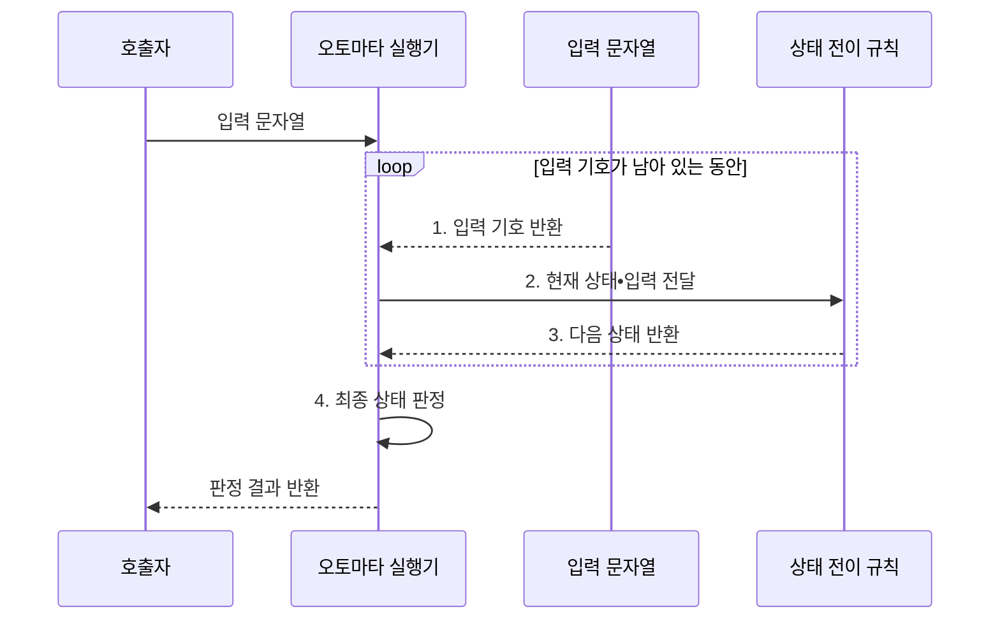

---
sidebar:
  order: 20
  label: "020. 오토마타 이론: DFA•NFA (Automata Theory)"
  badge:
    text: "미출 • 30%"
    variant: note
title: "오토마타 이론: DFA•NFA (Automata Theory)"
date: "2026-08-04T09:53:42+09:00"
tags:
  - "notes-basic-theory"
weight: 20
extra:
  question_no: "020"
  source_status: "미출"
  source_history: ""
  priority: 30
  priority_note: "정규•형식 언어를 포괄하는 오토마타 정본"
---

## Ⅰ. 개요

핵심 용어

- **유한 오토마타(Finite Automaton)**: 유한한 상태와 전이 함수로 입력 문자열의 수용 여부를 판정하는 계산 모델
- **결정적 유한 오토마타(Deterministic Finite Automaton, DFA)**: 각 입력에서 다음 상태가 하나로 정해지는 유한 오토마타
- **비결정적 유한 오토마타(Nondeterministic Finite Automaton, NFA)**: 여러 다음 상태와 엡실론 전이를 허용하는 유한 오토마타
- **형식 언어(Formal Language)**: 알파벳으로 만든 문자열 중 정해진 규칙을 만족하는 집합
- **전이 함수(Transition Function)**: 현재 상태와 입력을 다음 상태에 대응시키는 함수

- 정의/개념: 유한 상태 **전이 함수** 로 문자열 수용을 판정하는 계산 모델
- 배경/필요성: 자연어 규칙만으로는 문자열 **수용 판정 자동화** 곤란

#### 한줄 요약

- 자판기가 버튼마다 상태를 바꾸듯 오토마타는 입력 기호마다 상태를 전이한다.

## Ⅱ. 특징

핵심 용어

- **정규 언어(Regular Language)**: 유한 오토마타가 인식할 수 있는 문자열의 집합
- **순차 처리**: 입력 기호를 앞에서부터 하나씩 소비하며 현재 상태를 갱신하는 방식
- **인식 능력 동등성**: 서로 다른 오토마타가 같은 문자열 집합을 수용할 수 있는 성질

> NFA 상태가 1개에서 5개로 늘 때 원래 상태 수는 1→5지만 부분집합 결정화의 이론적 상한은 2→32로 지수 증가한다.

- 유한 상태와 **전이 함수** 만으로 문자열 수용 판정
- DFA•NFA의 **정규 언어** 인식 능력 **동등성**
- 입력 기호당 상태를 갱신하는 **순차 처리**

#### 한줄 요약

- NFA의 여러 경로를 상태 집합으로 묶으면 DFA와 같은 정규 언어를 판정한다.

## Ⅲ. 구조 및 구성요소

핵심 용어

- **오토마타 5튜플 $(Q,\Sigma,\delta,q_0,F)$**: 상태 집합•입력 알파벳•전이 함수•시작 상태•수용 상태 집합으로 구성한 형식 구조
- **입력 스트림(Input Stream)**: 문자열의 기호를 오토마타 실행기에 순서대로 제공하는 입력 경계
- **수용 상태 집합 $F$**: 입력 소진 뒤 문자열 수용을 확정하는 상태의 집합

| 구성요소 | 책임 |
|:---|:---|
| 오토마타 실행기 | 시작 상태에서 **현재 상태•상태 집합** 추적 |
| 입력 스트림 | 입력 알파벳의 **유한 기호** 를 순서대로 제공 |
| 전이 함수 | 현재 상태•입력을 **다음 상태** 에 대응 |
| 수용 상태 판정기 | 최종 상태의 **수용 상태 집합** 포함 여부 판정 |

> 요약: **Q•Σ•δ•q₀•F 5튜플** 을 실행 주체의 상태•규칙으로 구성

#### 한줄 요약

- 5튜플은 사용할 상태와 입력 기호, 이동 규칙, 시작점과 수용 종착점을 한 묶음으로 정의한다.

## Ⅳ. 흐름도

핵심 용어

- **현재 상태**: 지금까지 소비한 입력 이력을 유한하게 표현하는 오토마타의 기억 단위
- **상태 집합**: NFA가 한 입력 위치에서 동시에 도달할 수 있는 모든 상태의 묶음
- **입력 소진**: 문자열의 모든 기호를 전이 함수에 전달해 더 처리할 기호가 없는 상태
- **수용 상태 집합**: 입력을 모두 처리한 뒤 문자열 수용을 확정하는 상태들의 집합

**동작 원리**

- **1. 입력 기호 반환**: 입력 스트림에서 기호 하나 소비
- **2. 현재 상태•입력 전달**: 전이 함수의 두 입력 제공
- **3. 다음 상태 반환**: DFA 상태 또는 NFA 상태 집합 갱신
- **4. 최종 상태 판정**: 입력 소진 시 현재 상태의 수용 상태 집합 포함 여부 확인

#### 한줄 요약

- 실행기는 기호마다 전이 결과로 현재 상태를 바꾸고, 입력이 끝나면 수용 상태인지 확인한다.

## Ⅴ. 종류 및 비교

핵심 용어

- **엡실론 전이($\varepsilon$-transition)**: 입력 기호를 소비하지 않고 NFA의 상태를 바꾸는 전이
- **상태 폭증(State Explosion)**: NFA 상태 조합이 DFA의 개별 상태가 되어 결정화 후 상태 수가 지수적으로 늘어나는 현상
- **전이표(Transition Table)**: 현재 상태와 입력 기호에 대응하는 다음 상태를 표로 저장한 구조
- **동적 정규식**: 실행 중 생성되거나 자주 변경되어 미리 고정된 전이표를 만들기 어려운 정규식

| 유한 오토마타 | DFA | NFA |
|:---|:---|:---|
| 적용 기준 | **전이표** 상주 가능한 고정 패턴 | 자주 바뀌는 **동적 정규식** 매칭 |
| 핵심 특징 | 입력마다 **단일 상태 전이** | **엡실론 전이**•다중 분기 허용 |
| 한계 | 패턴 복잡도에 따른 **상태 폭증** | 실행 시 **상태 집합** 추적 부담 |

#### 한줄 요약

- DFA는 한 상태만 실행하고 NFA는 여러 후보 상태를 함께 추적한다.

## Ⅵ. 실무 고려사항 및 대책

핵심 용어

- **결정화(Determinization)**: NFA의 가능한 상태 집합을 하나의 DFA 상태로 대응시키는 변환
- **엡실론 폐쇄(Epsilon Closure)**: 엡실론 전이만 반복해 입력 없이 도달할 수 있는 모든 상태의 집합
- **정규식 서비스 거부(Regular Expression Denial of Service, ReDoS)**: 비효율적인 정규식과 악성 입력으로 자원을 고갈시키는 공격
- **어휘 분석기(Lexical Analyzer)**: 문자 흐름을 식별자•숫자•연산자 같은 토큰으로 나누는 컴파일러 구성요소
- **토큰 우선순위**: 여러 패턴이 동시에 수용될 때 반환할 토큰을 결정하는 순위 규칙

| 문제 | 대책 | 효과 |
|:---|:---|:---|
| NFA **결정화•상태 폭증** | 도달 가능한 **상태 집합** 만 생성 | **전이표 메모리** 절감 |
| **엡실론 폐쇄** 누락 | 시작•매 전이 후 **폐쇄 계산** | **수용 결과** 오류 방지 |
| 여러 패턴의 **우선순위 충돌** | 수용 상태에 **토큰 우선순위** 부여 | 결정적 **토큰 판정** |
| 악성 정규식의 **ReDoS** 위험 | DFA•패턴 제한•**시간 한도** 적용 | 정규식 **서비스 거부** 방지 |
| 어휘 분석기의 **토큰 판별** | 정규식을 **DFA 전이표** 로 변환 | 문자당 **단일 상태 전이** |

#### 한줄 요약

- 도달 가능한 NFA 상태 조합만 만들어 DFA 상태 폭증을 줄인다.

## Ⅶ. 결론

핵심 용어

- **상태 수 자원 한도**: 결정화한 DFA 상태와 전이표를 메모리에 유지할 수 있는 최대 규모

- 결정화 상태가 감당되면 **DFA**, 폭증하면 **NFA** 실행

#### 한줄 요약

- 결정화 상태 수가 자원 한도 이내면 DFA, 초과하면 NFA 실행을 선택한다.
