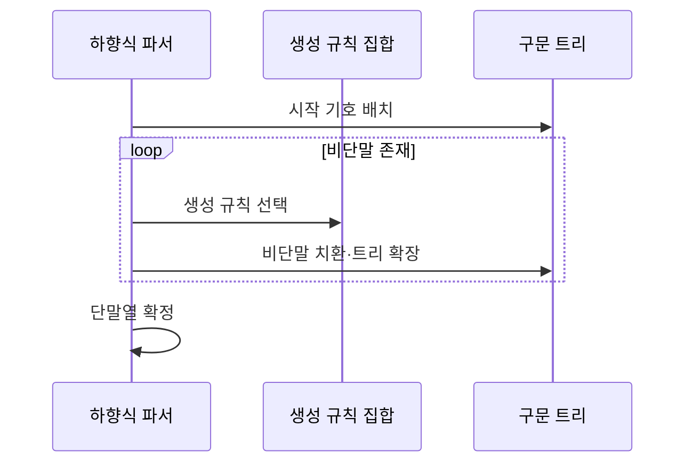

---
sidebar:
  order: 21
  label: "021. 문맥 자유 문법 (Context-Free Grammar)"
  badge:
    text: "미출제 · 15%"
    variant: note
title: "문맥 자유 문법 (Context-Free Grammar)"
date: "2026-07-25T23:56:00+09:00"
tags:
  - "notes-basic-theory"
weight: 21
extra:
  question_no: "021"
  source_status: "미출제"
  source_history: ""
  priority: 15
  priority_note: "문법·파싱 전제이며 구문 트리 설명 가능"
---

## 미리 알고가기

- **문맥 자유 문법(Context-Free Grammar, CFG)**: 좌변이 단일 비단말인 생성 규칙으로 재귀적 중첩 구문을 표현하는 문법
- **단말 기호 집합 $\Sigma$**: ‘시그마’로 읽고 알파벳 집합에 그리스 대문자 시그마를 쓰는 형식 언어 관례에 따라 생성 규칙을 모두 적용한 뒤 최종 문자열에 남을 수 있는 모든 토큰의 집합을 나타냄
- **비단말 기호 집합 $N$**: ‘엔’으로 읽고 비단말(Nonterminal)의 머리글자를 쓰는 관례에 따라 생성 규칙으로 더 치환할 수 있는 모든 구문 범주의 집합을 나타냄
- **생성 규칙 집합 $P$**: ‘피’로 읽고 생성 규칙(Production)의 머리글자를 쓰는 관례에 따라 좌변 비단말을 우변 기호열로 바꾸는 모든 규칙의 집합을 나타냄
- **시작 기호 $S$**: ‘에스’로 읽고 시작(Start)의 머리글자를 쓰는 관례에 따라 전체 문장의 유도를 시작하는 최초 비단말을 나타냄
- **유도(Derivation)**: 생성 규칙을 반복 적용해 문자열을 만드는 과정
- **구문 분석 트리(Parse Tree)**: 생성 규칙을 어느 순서로 적용했는지를 부모·자식 관계로 나타낸 트리이며 본문에서는 구문 트리로 줄여 씀
- **모호성(Ambiguity)**: 한 문자열에서 둘 이상의 구문 트리가 생성되어 해석이 달라지는 성질
- **좌재귀(Left Recursion)**: 비단말이 유도 결과의 맨 왼쪽에 다시 나타나 하향식 파서를 무한 호출시키는 재귀
- **파서(Parser)**: 입력 토큰이 문법에 맞는지 검사하고 구문 트리로 바꾸는 분석기
- **좌측 입력·좌측 유도 파서(Left-to-Right Input, Leftmost Derivation Parser, LL Parser)**: 입력을 왼쪽부터 읽고 가장 왼쪽 비단말부터 펼치며 좌재귀가 있으면 같은 규칙을 무한 호출할 수 있는 하향식 파서
- **푸시다운 오토마타(Pushdown Automaton, PDA)**: 스택에 중첩 상태를 저장해 문맥 자유 언어를 인식하는 오토마타
- **촘스키 계층(Chomsky Hierarchy)**: 문법을 규칙 제한과 표현력으로 분류하는 체계
- **정규 문법(Regular Grammar)**: 한 방향의 선형 생성 규칙으로 유한 상태 패턴을 표현하는 문법
- **문맥 의존 문법(Context-Sensitive Grammar)**: 비단말 주변 기호에 따라 규칙 적용 여부가 달라지는 문법
- **파싱 충돌(Parsing Conflict)**: 같은 입력 위치에서 적용할 문법 규칙을 하나로 결정하지 못하는 상태
- **비단말 변수 $A$**: ‘에이’로 읽고 임의의 비단말에 대문자를 쓰는 형식 문법 관례에 따라 생성 규칙 좌변의 단일 비단말을 나타냄
- **기호열 변수 $\alpha$**: ‘알파’로 읽고 임의의 문자열에 그리스 소문자 알파를 쓰는 형식 언어 관례에 따라 생성 규칙 우변의 단말·비단말 기호열을 나타냄
- **집합 소속 기호 $\in$**: ‘속한다’로 읽고 원소가 집합에 포함됨을 나타내는 집합론 관례 기호로서 $A$가 비단말 집합에, $\alpha$가 가능한 기호열 집합에 속함을 표시함
- **합집합 기호 $\cup$**: ‘합집합’으로 읽고 두 집합의 모든 원소를 합침을 나타내는 집합론 관례 기호로서 비단말 집합 $N$과 단말 집합 $\Sigma$에서 우변 기호를 선택함을 표시함
- **클레이니 별표 $^*$**: ‘클레이니 스타’로 읽고 바로 앞 기호 집합의 원소를 0회 이상 이어 붙인 모든 문자열을 뜻하는 형식 언어 관례 표기로서 $(N\cup\Sigma)^*$가 빈 문자열을 포함한 모든 유한 기호열임을 나타냄
- **생성 화살표 $\rightarrow$**: ‘생성한다’ 또는 ‘치환한다’로 읽고 좌변에서 우변으로 규칙을 적용함을 화살표로 나타내는 문법 관례에 따라 $A\rightarrow\alpha$가 비단말 $A$를 기호열 $\alpha$로 바꾸는 생성 규칙임을 표시함
- **문법 4튜플 $G=(N,\Sigma,P,S)$**: ‘지는 엔, 시그마, 피, 에스의 사튜플’로 읽고 문법(Grammar)의 머리글자 $G$와 순서 있는 묶음의 괄호·쉼표 표기를 쓰는 관례에 따라 비단말·단말·생성 규칙·시작 기호로 CFG를 정의함
- **단말열(Terminal String)**: 비단말이 모두 치환되어 단말 기호만 남은 문자열이며 문법 유도의 최종 결과
- **컴파일러(Compiler)**: 프로그래밍 언어 소스 코드를 분석해 실행 가능한 형태로 변환하며 CFG 파서로 괄호·블록의 구문 트리를 만드는 소프트웨어
- **하향식 파싱(Top-Down Parsing)**: 시작 기호에서 생성 규칙을 선택해 입력 토큰과 맞도록 구문 트리를 루트부터 말단 방향으로 확장하는 분석 방식

## Ⅰ. 개요

- 정의/개념: 좌변 **단일 비단말** 치환 규칙으로 중첩 구문을 정의하는 형식 문법
- 기존 한계: **정규 문법**은 괄호 짝 같은 재귀·중첩 구문 표현 불가

### 쉽게 이해하기 (학습용)
- 수식은 괄호 안에 또 괄호가 들어가고 그 안에 또 괄호가 들어가는 식으로 깊이가 얼마든지 깊어지는데, 이 끝없는 중첩을 괄호 안에는 다시 수식이 올 수 있다는 규칙 한 줄로 적어 두는 것이 문맥 자유 문법이다

## Ⅱ. 특징

- 좌변 **단일 비단말** 치환으로 주변 문맥과 무관한 규칙 적용
- 재귀 규칙으로 **중첩 깊이** 무제한 표현
- 동일 문자열의 복수 구문 트리에 따른 **모호성**

### 쉽게 이해하기 (학습용)
- 수식이라는 이름표를 펼칠 때 그 이름표 양옆에 무엇이 있든 상관없이 같은 규칙을 쓸 수 있어 문맥이 자유롭고 그 규칙이 자기 자신을 다시 부르니 괄호를 몇 겹으로 씌우든 적어지지만, 1+2\*3을 (1+2)\*3으로도 1+(2\*3)으로도 묶을 수 있듯 같은 문장에서 트리가 둘 나오면 해석이 갈린다

## Ⅲ. 아키텍처 및 구성요소

| 설계 요소 | 설명 |
|:---|:---|
| 비단말 집합($N$) | 치환 가능한 **구문 범주**의 유한 집합 |
| 단말 집합($\Sigma$) | 유도 종료 후 남는 **최종 토큰** 집합 |
| 생성 규칙($P$) | 비단말 하나를 **단말·비단말열**로 치환 |
| 시작 기호($S$) | 전체 **유도**를 시작하는 최초 비단말 |

> 요약: **문법 4튜플**로 기호·규칙·시작점 정의

### 쉽게 이해하기 (학습용)
- 수식·항처럼 아직 펼쳐야 할 이름표들이 비단말 집합이고 숫자와 +·( 같은 더 못 펼치는 글자들이 단말 집합이며, 수식은 수식+항이 될 수 있다는 식의 치환표가 생성 규칙이고 어느 이름표에서 펼치기를 시작할지 지정한 것이 시작 기호다

## Ⅳ. 원리 및 절차 흐름도

| 절차 | 설명 |
|:---|:---|
| 시작 기호 배치 | **시작 기호**를 트리 루트로 배치 |
| 생성 규칙 선택 | 현재 비단말에 적용할 **생성 규칙** 결정 |
| 비단말 치환·트리 확장 | 우변 기호열로 교체하고 **자식 노드** 기록 |
| 단말열 확정 | 비단말 소진 시 **단말열** 확정 |

> 요약: **비단말 치환** 이력을 트리에 기록해 단말열 생성

### 쉽게 이해하기 (학습용)
- 시작 이름표 하나를 종이에 적어 놓고 규칙표에서 하나를 골라 그 이름표를 우변 기호들로 바꿔 쓰면서 바꾼 자리마다 트리에 자식 가지를 달다가, 종이에 이름표가 하나도 안 남고 글자만 남는 순간 그 글자열이 이 문법으로 만들 수 있는 문장 하나가 된다

## Ⅴ. 종류 및 비교

| 형식 문법 | 문맥 자유 문법 | 정규 문법 | 문맥 의존 문법 |
|:---|:---|:---|:---|
| 적용 기준 | 입력에 따라 **중첩 깊이** 증가 | **유한 상태**로 패턴 구분 가능 | 주변 기호가 **규칙 적용** 여부 결정 |
| 핵심 특징 | **재귀적 중첩** 구조 표현 | **선형 반복**·선택 표현 | **주변 문맥** 제약 표현 |
| 한계 | **모호성**에 따른 파싱 충돌 | 중첩 구조 **표현 불가** | 인식 계산량 급증·**실용 파서 부재** |

> 요약: 중첩은 문맥 자유, 선형은 **정규 문법**, 주변 제약은 **문맥 의존**

### 쉽게 이해하기 (학습용)
- 이메일 주소 형식처럼 앞에서 뒤로 훑으며 상태만 바꾸면 되는 규칙은 정규 문법으로 충분하지만 괄호 짝을 맞추려면 지금 몇 겹인지 세어 둘 곳이 있어야 해 문맥 자유 문법이 필요하고, 앞에 선언된 변수만 쓸 수 있다처럼 주변 상황까지 봐야 하는 규칙은 문맥 의존 문법이 되어 계산량이 급증한다

## Ⅵ. 실무 사례

1. **컴파일러 파서**는 CFG로 괄호·블록 **구문 트리** 구성

### 쉽게 이해하기 (학습용)
- 컴파일러가 소스 코드에서 여는 중괄호를 만나면 그 안쪽을 통째로 하나의 자식 가지로 묶고 닫는 중괄호에서 그 가지를 닫는 식으로, 블록이 몇 겹으로 들어가 있든 트리 모양으로 정리한다

## Ⅶ. 결론

- 중첩 구문은 **CFG** 정의, **LL 파서**는 좌재귀 제거

### 쉽게 이해하기 (학습용)
- 괄호나 블록처럼 안에 또 같은 것이 들어가는 구조는 정규 문법으로 적을 수 없으니 CFG로 규칙을 쓰되, 그 규칙 중 자기 이름이 우변 맨 앞에 오는 것이 있으면 하향식 파서가 무한히 자기를 부르므로 그 형태부터 고쳐 놓아야 한다
