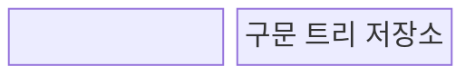
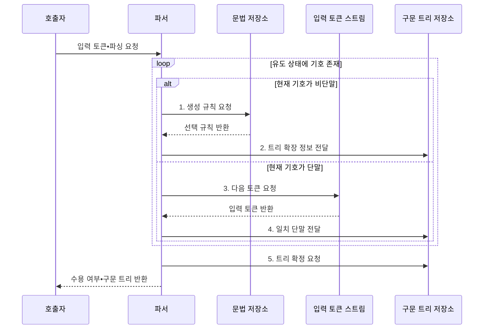
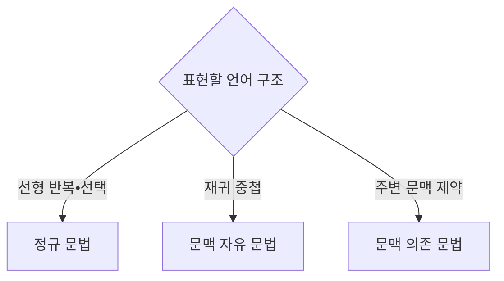

---
sidebar:
  order: 21
  label: "021. 문맥 자유 문법 (Context-Free Grammar)"
  badge:
    text: "미출 • 15%"
    variant: note
title: "문맥 자유 문법 (Context-Free Grammar)"
date: "2026-07-29T11:54:25+09:00"
tags:
  - "notes-basic-theory"
weight: 21
extra:
  question_no: "021"
  source_status: "미출"
  source_history: ""
  priority: 15
  priority_note: "문법•파싱 전제이며 구문 트리 설명 가능"
---

## 미리 알고가기

- **문맥 자유 문법(Context-Free Grammar, CFG)**: 좌변이 단일 비단말인 생성 규칙으로 재귀적 중첩 구문을 표현하는 문법
- **단말 기호 집합 $\Sigma$**: ‘시그마’로 읽으며 최종 문자열에 남는 모든 토큰의 집합
- **비단말 기호 집합 $N$**: 생성 규칙으로 더 치환할 수 있는 구문 범주의 집합
- **생성 규칙 집합 $P$**: 좌변 비단말을 우변 기호열로 바꾸는 규칙의 집합
- **시작 기호 $S$**: 전체 문장의 유도를 시작하는 최초 비단말
- **유도(Derivation)**: 생성 규칙을 반복 적용해 문자열을 만드는 과정
- **구문 분석 트리(Parse Tree)**: 생성 규칙을 어느 순서로 적용했는지를 부모•자식 관계로 나타낸 트리이며 본문에서는 구문 트리로 줄여 씀
- **모호성(Ambiguity)**: 한 문자열에서 둘 이상의 구문 트리가 생성되어 해석이 달라지는 성질
- **좌재귀(Left Recursion)**: 비단말이 유도 결과의 맨 왼쪽에 다시 나타나 하향식 파서를 무한 호출시키는 재귀
- **파서(Parser)**: 입력 토큰이 문법에 맞는지 검사하고 구문 트리로 바꾸는 분석기
- **좌측 입력•좌측 유도 파서(Left-to-Right Input, Leftmost Derivation Parser, LL Parser)**: 입력을 왼쪽부터 읽고 가장 왼쪽 비단말부터 펼치며 좌재귀가 있으면 같은 규칙을 무한 호출할 수 있는 하향식 파서
- **정규 문법(Regular Grammar)**: 한 방향의 선형 생성 규칙으로 유한 상태 패턴을 표현하는 문법
- **문맥 의존 문법(Context-Sensitive Grammar)**: 비단말 주변 기호에 따라 규칙 적용 여부가 달라지는 문법
- **파싱 충돌(Parsing Conflict)**: 같은 입력 위치에서 적용할 문법 규칙을 하나로 결정하지 못하는 상태
- **문법 4튜플 $G=(N,\Sigma,P,S)$**: 비단말•단말•생성 규칙•시작 기호로 CFG를 정의한 묶음
- **단말열(Terminal String)**: 비단말이 모두 치환되어 단말 기호만 남은 문자열이며 문법 유도의 최종 결과
- **컴파일러(Compiler)**: 프로그래밍 언어 소스 코드를 분석해 실행 가능한 형태로 변환하며 CFG 파서로 괄호•블록의 구문 트리를 만드는 소프트웨어
- **하향식 파싱(Top-Down Parsing)**: 시작 기호에서 생성 규칙을 선택해 입력 토큰과 맞도록 구문 트리를 루트부터 말단 방향으로 확장하는 분석 방식
- **우선순위•결합 규칙**: 연산자 적용 순서와 같은 우선순위일 때 묶는 방향을 정해 하나의 구문 트리를 선택하는 규칙
- **좌인수분해(Left Factoring)**: 여러 생성 규칙의 공통 접두부를 하나로 묶어 파서가 다음 입력을 보고 규칙을 결정할 수 있게 바꾸는 문법 변환
- **FIRST•FOLLOW 집합**: 비단말에서 처음 나올 수 있는 단말의 집합과 해당 비단말 바로 뒤에 올 수 있는 단말의 집합
- **파싱표(Parsing Table)**: 현재 비단말과 다음 입력 토큰의 조합에 적용할 생성 규칙을 기록한 표
- **동기화 토큰(Synchronizing Token)**: 오류가 발생했을 때 파서가 입력 처리를 재개할 위치를 찾는 기준 토큰

## Ⅰ. 개요

- 정의/개념: **단일 비단말** 치환으로 중첩 구문을 정의
- 배경/필요성: 정규 문법으로 표현 못 하는 **재귀 구문** 기술

### 쉽게 이해하기 (학습용)

- 괄호 안에 다시 수식이 오는 재귀 규칙으로 임의 깊이의 중첩 구문을 표현한다.

## Ⅱ. 특징

- 좌변 **단일 비단말** 치환으로 주변 문맥과 무관한 규칙 적용
- 재귀 규칙으로 **중첩 깊이** 무제한 표현
- 동일 문자열의 복수 구문 트리에 따른 **모호성**

### 쉽게 이해하기 (학습용)

- 주변 기호와 무관하게 규칙을 적용하며 같은 문자열에 구문 트리가 둘이면 문법이 모호하다.

## Ⅲ. 구조 및 구성요소

| 구성요소 | 책임 |
|:---|:---|
| 파서 | 생성 규칙 선택•**비단말 치환** 수행 |
| 문법 저장소 | **$N,\Sigma,P,S$** 문법 4튜플 보관 |
| 유도 상태 | 현재 **단말•비단말 기호열** 보관 |
| 구문 트리 저장소 | 규칙 적용의 **부모•자식 관계** 보관 |

### 쉽게 이해하기 (학습용)

- 파서가 문법 규칙으로 유도 상태를 바꾸고, 적용한 규칙을 구문 트리의 부모•자식 관계로 기록한다.

## Ⅳ. 흐름도

**동작 원리**

- **1. 생성 규칙 요청**: 현재 비단말의 치환 규칙 결정
- **2. 트리 확장 정보 전달**: 우변 기호열•관계 기록
- **3. 다음 토큰 요청**: 현재 단말과 비교할 입력 조회
- **4. 일치 단말 전달**: 일치 시 소비, 불일치 시 오류
- **5. 트리 확정 요청**: 입력 소진 후 완성 트리 반환

### 쉽게 이해하기 (학습용)

- 설계도의 빈 구문 칸을 생성 규칙으로 펼치고 입력 토큰과 맞춘 결과를 부모•자식 가지로 붙여 구문 트리를 완성한다.

## Ⅴ. 종류 및 비교

| 형식 문법 | 문맥 자유 문법 | 정규 문법 | 문맥 의존 문법 |
|:---|:---|:---|:---|
| 적용 기준 | 입력에 따라 **중첩 깊이** 증가 | **유한 상태**로 패턴 구분 가능 | 주변 기호가 **규칙 적용** 여부 결정 |
| 핵심 특징 | **재귀적 중첩** 구조 표현 | **선형 반복**•선택 표현 | **주변 문맥** 제약 표현 |
| 한계 | **모호성**에 따른 파싱 충돌 | 중첩 구조 **표현 불가** | 인식 계산량 급증•**실용 파서 부재** |

### 쉽게 이해하기 (학습용)

- 선형 패턴은 정규 문법, 중첩은 CFG, 주변 문맥 제약은 문맥 의존 문법이 적합하다.

## Ⅵ. 실무 고려사항 및 대책

| 고려사항 | 대책 | 효과 |
|:---|:---|:---|
| 동일 문자열의 **복수 구문 트리** | 우선순위•결합 규칙으로 **문법 재작성** | **파싱 모호성** 제거 |
| 하향식 파서의 **좌재귀 호출** | 좌재귀 제거•**좌인수분해** | **LL 파싱** 가능성 확보 |
| 같은 입력 위치의 **규칙 충돌** | **FIRST•FOLLOW**로 파싱표 검증 | 결정적 **규칙 선택** |
| 오류 입력의 **진단 연쇄** | 동기화 토큰 기반 **오류 복구** | 후속 **오류 위치** 정확도 향상 |
| 컴파일러의 **중첩 구문** | CFG로 괄호•블록 **트리 구성** | **구문 구조** 보존 |

### 쉽게 이해하기 (학습용)

- 모호성과 좌재귀를 제거하고 파싱 충돌•오류 복구 정책을 검증한다.

## Ⅶ. 결론

- 언어의 중첩•문맥 의존성으로 **형식 문법** 선택

### 쉽게 이해하기 (학습용)

- 중첩 구조는 CFG로 표현하고 하향식 파서에서는 좌재귀를 제거한다.
