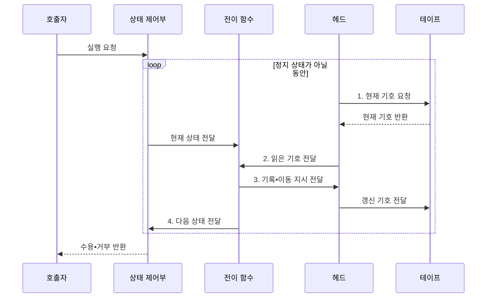

---
sidebar:
  order: 22
  label: "022. 튜링 머신 (Turing Machine)"
  badge:
    text: "기출 • 30%"
    variant: note
title: "튜링 머신 (Turing Machine)"
date: "2026-07-29T11:55:09+09:00"
tags:
  - "notes-basic-theory"
weight: 22
extra:
  question_no: "022"
  source_status: "기출"
  source_history: "129회"
  priority: 30
  priority_note: "추상 계산 모델 중심이라 반복 확장성 낮음"
---

## 미리 알고가기

- **튜링 머신(Turing Machine)**: 무한 테이프의 기호를 읽고 쓰는 헤드와 상태 전이 규칙으로 계산 과정을 표현하는 추상 기계
- **테이프(Tape)**: 기호를 저장하는 이론상 무한한 칸의 열
- **헤드(Head)**: 현재 칸을 읽고 쓰며 좌우로 이동하는 장치
- **상태(State)**: 계산 단계의 내부 제어 정보
- **전이 함수(Transition Function, $\delta$)**: 변화량을 나타내는 델타를 상태 변화에 대응한 표기이며, 현재 상태와 기호로 다음 상태•기록 기호•이동 방향을 결정
- **테이프 알파벳(Tape Alphabet, $\Gamma$)**: 기호 집합에 쓰는 대문자 감마 표기이며, 테이프에 기록 가능한 기호의 집합
- **정지 상태(Halting State)**: 계산을 끝내는 수용•거부 상태
- **결정 가능 언어•튜링 인식 가능 언어(Decidable•Turing-recognizable Language)**: 모든 입력에서 정지해 판정하는 언어와 비소속 입력에서 멈추지 않을 수 있는 언어
- **튜링 완전(Turing Complete)**: 충분한 시간과 메모리가 있으면 튜링 머신의 모든 계산을 모사할 수 있는 성질
- **정지 문제(Halting Problem)**: 임의 프로그램의 정지를 항상 판정할 수 없는 문제
- **다중 테이프 튜링 머신(Multitape Turing Machine)**: 여러 테이프와 헤드를 쓰지만 단일 테이프 머신과 계산 가능 범위가 같은 변형
- **비결정적 튜링 머신(Nondeterministic Turing Machine)**: 가능한 전이 중 하나라도 수용 경로에 도달하면 입력을 수용하는 변형
- **푸시다운 오토마타(Pushdown Automaton, PDA)**: 스택을 보조 기억장치로 사용하여 중첩 구조를 포함한 문맥 자유 언어를 인식하는 계산 모델
- **유한 오토마타(Finite Automaton, FA)**: 별도 기억장치 없이 유한한 상태와 전이 규칙으로 정규 언어를 인식하는 계산 모델
- **정규 언어(Regular Language)**: 유한 오토마타가 인식할 수 있는 반복•선택 패턴의 언어
- **문맥 의존 언어(Context-Sensitive Language)**: 기호 주변 문맥에 따라 생성 규칙 적용 여부가 달라지는 문법으로 표현하는 언어
- **샌드박스(Sandbox)**: 실행 시간•메모리•권한을 제한해 프로그램을 격리하는 환경

## Ⅰ. 개요

- 정의/개념: 무한 **테이프와 상태 전이**로 연산하는 추상 계산 모델
- 배경/필요성: 알고리즘의 **계산 가능 범위**를 공통 모델로 정의

### 쉽게 이해하기 (학습용)

- 끝없이 이어진 종이띠의 한 칸을 읽고 고쳐 쓴 뒤 좌우로 움직이는 기계만으로, 어떤 계산을 절차로 수행할 수 있는지 정의한다.

## Ⅱ. 특징

- 유한 제어부와 무한 **테이프**로 성립하는 **범용 계산 모델**
- 다중 테이프•비결정성 변형과 **계산 가능 범위** 동일
- **결정 가능** 범위 밖에는 **정지 문제** 같은 판정 불가 문제 존재

### 쉽게 이해하기 (학습용)

- 종이띠나 선택 갈래를 늘려도 계산 가능 범위는 같고, 모든 프로그램의 정지를 판정하는 기계는 만들 수 없다.

## Ⅲ. 구조 및 구성요소

| 구성요소 | 책임 |
|:---|:---|
| 상태 제어부 | 시작•현재•**수용•거부 상태** 유지 |
| 전이 함수 | 상태•읽은 기호로 **다음 행동** 결정 |
| 헤드 | 현재 칸 읽기•쓰기와 **좌우 이동** 수행 |
| 테이프 | **테이프 알파벳** 기호의 무한 저장 공간 |

### 쉽게 이해하기 (학습용)

- 상태 제어부와 전이 함수가 다음 행동을 정하고, 헤드가 테이프의 기호를 바꾸며 좌우로 이동한다.

## Ⅳ. 흐름도

### 동작 원리

- **1. 현재 기호 요청**: 헤드 위치의 기호 확인
- **2. 읽은 기호 전달**: 현재 상태와 함께 전이 입력 구성
- **3. 기록•이동 지시 전달**: 기호 기록 후 헤드 이동
- **4. 다음 상태 전달**: 상태 변경•정지 여부 판정

### 쉽게 이해하기 (학습용)

- 기계가 종이띠 한 칸을 읽으면 전이표가 새 기호•헤드 이동 방향•다음 상태를 한꺼번에 지시하고, 정지 상태까지 같은 순서를 반복한다.

## Ⅴ. 종류 및 비교

| 계산 모델 | 튜링 머신 | 푸시다운 오토마타 | 유한 오토마타 |
|:---|:---|:---|:---|
| 적용 기준 | **계산 가능성** 분석 | 괄호•블록 등 **중첩 구문** | 토큰•**제어 상태** 판별 |
| 핵심 특징 | **무한 테이프** 양방향 읽기•쓰기 | **스택 최상단**만 접근 | **유한 상태**만 유지 |
| 한계 | **정지 문제** 판정 불가 | **문맥 의존** 언어 인식 불가 | 기억 장치 부재로 **재귀 구조** 미인식 |

### 쉽게 이해하기 (학습용)

- 유한 오토마타는 머릿속 상태만, 푸시다운 오토마타는 접시 더미 같은 스택까지, 튜링 머신은 양방향 종이띠까지 기억에 사용한다.

## Ⅵ. 실무 고려사항 및 대책

| 고려사항 | 대책 | 효과 |
|:---|:---|:---|
| 프로그램 **정지 여부** 사전 판정 불가 | 실행 시간•**단계 수 제한** | **무한 실행** 차단 |
| 무한 테이프와 **실제 메모리** 차이 | 메모리 상한•**초과 정책** 정의 | **자원 고갈** 방지 |
| **인식•결정 가능** 혼동 | 비소속 입력의 **정지 여부** 증명 | **계산 가능성 분류** 정확화 |
| 범용 계산의 **권한 남용** | 샌드박스•**입출력 권한** 최소화 | 시스템 **영향 범위** 격리 |

### 쉽게 이해하기 (학습용)

- 언제 멈출지 미리 알 수 없는 프로그램을 격리실에 넣듯, 실행 단계•메모리•입출력 권한에 상한을 두어 무한 실행과 자원 고갈을 가둔다.

## Ⅶ. 결론

- 계산 범위•기억 구조로 모델을 고르고 **실행 상한** 강제

### 쉽게 이해하기 (학습용)

- 어떤 계산도 표현할 수 있는 범용 기계를 실제로 실행할 때는 타이머•메모리 벽•권한 울타리로 운영 한계를 강제한다.
