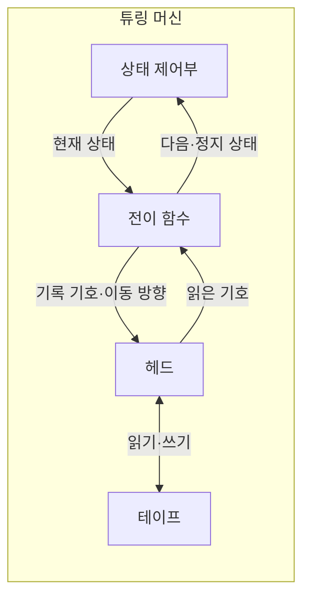

---
sidebar:
  order: 22
  label: "022. 튜링 머신 (Turing Machine)"
  badge:
    text: "기출 · 30%"
    variant: note
title: "튜링 머신 (Turing Machine)"
date: "2026-07-28T11:58:35+09:00"
tags:
  - "notes-basic-theory"
weight: 22
extra:
  question_no: "022"
  source_status: "기출"
  source_history: "129회"
  priority: 30
  priority_note: "추상 계산 모델 중심이라 반복 확장성 낮음"
---

## 미리 알고가기

- **튜링 머신(Turing Machine)**: 무한 테이프의 기호를 읽고 쓰는 헤드와 상태 전이 규칙으로 계산 과정을 표현하는 추상 기계
- **테이프(Tape)**: 기호를 저장하는 이론상 무한한 칸의 열
- **헤드(Head)**: 현재 칸을 읽고 쓰며 좌우로 이동하는 장치
- **상태(State)**: 계산 단계의 내부 제어 정보
- **전이 함수(Transition Function, $\delta$)**: ‘델타’로 읽으며 현재 상태와 기호로 다음 상태·기록 기호·이동 방향을 결정
- **테이프 알파벳(Tape Alphabet, $\Gamma$)**: ‘대문자 감마’로 읽으며 테이프에 기록 가능한 기호의 집합
- **정지 상태(Halting State)**: 계산을 끝내는 수용·거부 상태
- **결정 가능 언어·튜링 인식 가능 언어(Decidable·Turing-recognizable Language)**: 모든 입력에서 정지해 판정하는 언어와 비소속 입력에서 멈추지 않을 수 있는 언어
- **튜링 완전(Turing Complete)**: 충분한 시간과 메모리가 있으면 튜링 머신의 모든 계산을 모사할 수 있는 성질
- **정지 문제(Halting Problem)**: 임의 프로그램의 정지를 항상 판정할 수 없는 문제
- **다중 테이프 튜링 머신(Multitape Turing Machine)**: 여러 테이프와 헤드를 쓰지만 단일 테이프 머신과 계산 가능 범위가 같은 변형
- **비결정적 튜링 머신(Nondeterministic Turing Machine)**: 가능한 전이 중 하나라도 수용 경로에 도달하면 입력을 수용하는 변형
- **푸시다운 오토마타(Pushdown Automaton, PDA)**: 스택을 보조 기억장치로 사용하여 중첩 구조를 포함한 문맥 자유 언어를 인식하는 계산 모델
- **유한 오토마타(Finite Automaton, FA)**: 별도 기억장치 없이 유한한 상태와 전이 규칙으로 정규 언어를 인식하는 계산 모델
- **정규 언어(Regular Language)**: 유한 오토마타가 인식할 수 있는 반복·선택 패턴의 언어
- **샌드박스(Sandbox)**: 실행 시간·메모리·권한을 제한해 프로그램을 격리하는 환경
- **정적 분석(Static Analysis)**: 프로그램을 실행하지 않고 코드 구조와 가능한 동작을 검사하는 방법

## Ⅰ. 개요

- 정의/개념: 무한 **테이프**와 상태 전이로 계산 가능성을 정의하는 추상 기계
- 기존 한계: 공통 계산 모델이 없으면 **계산 가능성** 자체를 정의 불가

### 쉽게 이해하기 (학습용)

- 테이프 기호를 읽고 쓰며 상태를 전이하는 단순 모델로 계산 가능 범위를 정의한다.

## Ⅱ. 특징

- 유한 제어부와 무한 **테이프**로 성립하는 **범용 계산 모델**
- 다중 테이프·비결정성 변형과 **계산 가능 범위** 동일
- **결정 가능** 범위 밖에는 **정지 문제** 같은 판정 불가 문제 존재

### 쉽게 이해하기 (학습용)

- 다중 테이프와 비결정성은 계산 가능 범위를 넓히지 않으며 정지 문제는 결정 불가능하다.

## Ⅲ. 구성요소 및 관계

| 설계 요소 | 설명 |
|:---|:---|
| 상태 제어부 | 시작·현재·**수용·거부 상태** 유지 |
| 전이 함수 | 상태·읽은 기호로 **다음 행동** 결정 |
| 헤드 | 현재 칸 읽기·쓰기와 **좌우 이동** 수행 |
| 테이프 | **테이프 알파벳** 기호의 무한 저장 공간 |

> 요약: **전이 함수** 하나가 기록·이동·상태 갱신을 동시 결정

### 쉽게 이해하기 (학습용)

- 전이 함수는 현재 상태와 기호를 받아 기록·이동·다음 상태를 함께 결정한다.

## Ⅳ. 운영 고려사항

| 고려사항 | 대응 방안 | 기대 효과 |
|:---|:---|:---|
| 임의 프로그램의 정지 여부 사전 판정 불가 | 실행 시간·단계 수 제한 적용 | 무한 실행 차단 |
| 이론상 무한 테이프와 실제 메모리 차이 | 메모리 상한과 초과 처리 정책 정의 | 자원 고갈 방지 |
| 인식 가능과 결정 가능의 혼동 | 모든 비소속 입력의 정지 여부를 별도 증명 | 계산 가능성 분류 정확성 확보 |
| 범용 계산의 권한 남용 | 샌드박스와 입출력 권한 최소화 | 시스템 영향 격리 |

### 쉽게 이해하기 (학습용)

- 정지 여부를 일반적으로 판정할 수 없으므로 실행 단계와 자원, 권한을 제한한다.

## Ⅴ. 종류 및 비교

| 계산 모델 | 튜링 머신 | 푸시다운 오토마타 | 유한 오토마타 |
|:---|:---|:---|:---|
| 적용 기준 | **계산 가능성** 분석 | 괄호·블록 등 **중첩 구문** | 토큰·**제어 상태** 판별 |
| 핵심 특징 | **무한 테이프** 양방향 읽기·쓰기 | **스택 최상단**만 접근 | **유한 상태**만 유지 |
| 한계 | **정지 문제** 판정 불가 | **문맥 의존** 언어 인식 불가 | 기억 장치 부재로 **재귀 구조** 미인식 |

> 요약: 기억 장치가 줄수록 **인식 언어 범위** 축소

### 쉽게 이해하기 (학습용)

- 유한 상태, 스택, 테이프 순으로 기억 능력과 인식 가능한 언어 범위가 넓어진다.

## Ⅵ. 실무 사례

1. **스크립트 샌드박스**는 시간·메모리 한도로 무한 실행 차단

### 쉽게 이해하기 (학습용)

- 스크립트에 시간·메모리 한도를 적용해 무한 실행과 자원 고갈을 차단한다.

## Ⅶ. 결론

- 계산 가능성 판단을 위해 종료·자원 한계를 검토하여 **튜링 모델** 활용

### 쉽게 이해하기 (학습용)

- 범용 계산을 허용할수록 종료·자원·권한 한계를 명시해야 한다.
