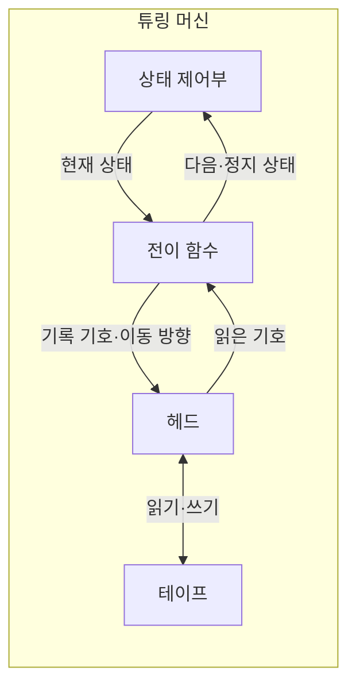
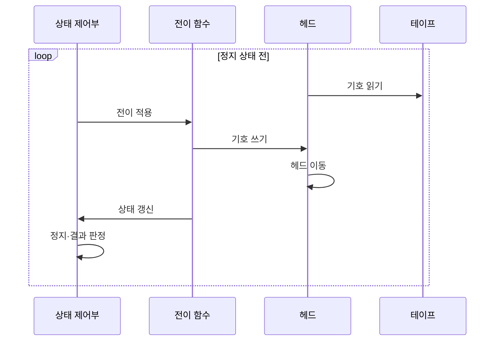

---
sidebar:
  order: 22
  label: "022. 튜링 머신 (Turing Machine)"
  badge:
    text: "기출 · 30%"
    variant: note
title: "튜링 머신 (Turing Machine)"
date: "2026-07-25T22:10:00+09:00"
tags:
  - "notes-basic-theory"
weight: 22
extra:
  question_no: "022"
  source_status: "기출"
  source_history: "129회"
  priority: 30
  priority_note: "추상 계산 모델 중심이라 반복 확장성 낮음"
---

## 미리 알고가기

- **튜링 머신(Turing Machine)**: 테이프와 상태 전이로 계산을 표현하는 추상 기계
- **테이프(Tape)**: 기호를 저장하는 이론상 무한한 칸의 열
- **헤드(Head)**: 현재 칸을 읽고 쓰며 좌우로 이동하는 장치
- **상태(State)**: 계산 단계의 내부 제어 정보
- **전이 함수(Transition Function, $\delta$)**: $\delta$는 ‘델타’로 읽고 변화·차이를 나타내는 그리스 문자를 상태 변화 함수에 관례적으로 쓴 표기이며, 현재 상태와 읽은 기호로 다음 상태·기록 기호·이동 방향을 결정한다.
- **테이프 알파벳(Tape Alphabet, $\Gamma$)**: $\Gamma$는 ‘대문자 감마’로 읽고 기호 집합에 관례적으로 쓰는 그리스 문자 표기이며, 테이프에 기록할 수 있는 모든 기호의 집합을 가리킨다.
- **정지 상태(Halting State)**: 계산을 끝내는 수용·거부 상태
- **결정 가능 언어·튜링 인식 가능 언어(Decidable·Turing-recognizable Language)**: 결정 가능 언어는 어떤 입력을 넣어도 튜링 머신이 반드시 멈추고 소속 여부를 답해 주는 언어이고, 튜링 인식 가능 언어는 소속인 입력에는 답을 주지만 비소속인 입력에서는 영원히 멈추지 않을 수 있는 언어여서, 이 둘 사이의 틈이 곧 정지 문제가 드러내는 결정 불가능 영역이다
- **튜링 완전(Turing Complete)**: 충분한 시간과 메모리가 있으면 튜링 머신의 모든 계산을 모사할 수 있는 성질
- **정지 문제(Halting Problem)**: 임의 프로그램의 정지를 항상 판정할 수 없는 문제
- **다중 테이프 튜링 머신(Multitape Turing Machine)**: 여러 테이프와 헤드를 쓰지만 단일 테이프 머신과 계산 가능 범위가 같은 변형
- **비결정적 튜링 머신(Nondeterministic Turing Machine)**: 가능한 전이 중 하나라도 수용 경로에 도달하면 입력을 수용하는 변형
- **푸시다운 오토마타(Pushdown Automaton, PDA)**: 스택의 맨 위 값을 이용해 중첩 구문을 인식하는 계산 모델
- **유한 오토마타(Finite Automaton, FA)**: 별도 기억장치 없이 유한한 상태만 바꾸며 정규 언어를 인식하는 계산 모델
- **정규 언어(Regular Language)**: 유한 오토마타가 인식할 수 있는 반복·선택 패턴의 언어
- **샌드박스(Sandbox)**: 실행 시간·메모리·권한을 제한해 프로그램을 격리하는 환경
- **정적 분석(Static Analysis)**: 프로그램을 실행하지 않고 코드 구조와 가능한 동작을 검사하는 방법

## Ⅰ. 개요

- **정의/개념**: 무한 **테이프**와 상태 전이로 계산 가능성을 정의하는 추상 기계
- **기존 한계**: 공통 계산 모델이 없으면 **계산 가능성** 자체를 정의 불가

### 쉽게 이해하기 (학습용)

- 끝없이 이어진 모눈 종이띠 위에 연필 하나를 올려놓고 지금 칸의 글자를 읽어 규칙표대로 다른 글자를 덮어쓴 뒤 한 칸 옆으로 옮기기만 되풀이하는 기계인데, 이 단순한 동작만으로 오늘날 어떤 컴퓨터의 계산도 흉내 낼 수 있어 무엇이 계산 가능한지를 재는 자로 쓴다

## Ⅱ. 특징

- 유한 제어부와 무한 **테이프**로 성립하는 **범용 계산 모델**
- 다중 테이프·비결정성 변형과 **계산 가능 범위** 동일
- **결정 가능** 범위 밖에는 **정지 문제** 같은 판정 불가 문제 존재

### 쉽게 이해하기 (학습용)

- 종이띠를 여러 장 깔아 주거나 갈림길에서 여러 길을 동시에 가 보게 해 줘도 결국 한 장짜리 기계로 흉내 낼 수 있어 계산할 수 있는 것의 범위는 그대로인데, 그러면서도 어떤 프로그램이 언제 멈출지를 모든 경우에 대해 알려 주는 기계는 아무리 만들어도 존재하지 않는다

## Ⅲ. 아키텍처 및 구성요소

| 설계 요소 | 설명 |
|:---|:---|
| 상태 제어부 | 시작·현재·**수용·거부 상태** 유지 |
| 전이 함수 | 상태·읽은 기호로 **다음 행동** 결정 |
| 헤드 | 현재 칸 읽기·쓰기와 **좌우 이동** 수행 |
| 테이프 | **테이프 알파벳** 기호의 무한 저장 공간 |

> 요약: **전이 함수** 하나가 기록·이동·상태 갱신을 동시 결정

### 쉽게 이해하기 (학습용)

- 종이띠가 테이프, 그 위에 놓인 연필이 헤드, 지금 규칙의 몇 번째 단계인지를 기억하는 머릿속이 상태 제어부이고, 지금 상태와 읽은 글자를 넣으면 무엇을 쓰고 어디로 옮기고 다음에 어떤 상태가 될지를 한꺼번에 알려 주는 표가 전이 함수다

## Ⅳ. 원리 및 절차 흐름도

| 절차 | 설명 |
|:---|:---|
| 기호 읽기 | 헤드가 **현재 칸** 기호 판독 |
| 전이 적용 | 현재 상태·기호로 **전이 함수** 조회 |
| 기호 쓰기 | 전이 결과 기호를 현재 칸에 **덮어쓰기** |
| 헤드 이동 | 전이가 지정한 **좌우 한 칸** 이동 |
| 상태 갱신 | 전이 결과를 **다음 상태**로 반영 |
| 정지·결과 판정 | 정지 상태 도달 시 **수용·거부** 확정 |

> 요약: 읽기·전이·쓰기·이동 반복 후 **정지 상태** 도달

### 쉽게 이해하기 (학습용)

- 연필 아래 글자를 읽고 그 글자와 지금 상태로 표에서 한 줄을 찾아 시키는 대로 글자를 덮어쓰고 연필을 한 칸 옮기고 상태를 바꾸는 일을 되풀이하다가, 표가 더는 시킬 것이 없는 끝 상태에 닿으면 그 자리에서 받아들임인지 거부인지가 정해진다

## Ⅴ. 종류 및 비교

| 계산 모델 | 튜링 머신 | 푸시다운 오토마타 | 유한 오토마타 |
|:---|:---|:---|:---|
| 적용 기준 | **계산 가능성** 분석 | 괄호·블록 등 **중첩 구문** | 토큰·**제어 상태** 판별 |
| 핵심 특징 | **무한 테이프** 양방향 읽기·쓰기 | **스택 최상단**만 접근 | **유한 상태**만 유지 |
| 한계 | **정지 문제** 판정 불가 | **문맥 의존** 언어 인식 불가 | 기억 장치 부재로 **재귀 구조** 미인식 |

> 요약: 기억 장치가 줄수록 **인식 언어 범위** 축소

### 쉽게 이해하기 (학습용)

- 기억할 곳이 상태 몇 개뿐이면 되풀이되는 패턴만 알아보고, 접시 쌓듯 맨 위만 꺼낼 수 있는 스택이 붙으면 괄호가 몇 겹인지 세는 것까지 되며, 아무 칸이나 오가며 읽고 쓰는 종이띠가 붙어야 비로소 일반적인 계산이 되는데 그 대신 언제 멈출지를 알 수 없어진다

## Ⅵ. 실무 사례

1. **스크립트 샌드박스**는 시간·메모리 한도로 무한 실행 차단
2. **정적 분석기**는 **종료 증명** 성공 구간만 안전 확정

### 쉽게 이해하기 (학습용)

- 사용자가 올린 스크립트가 무한 반복에 빠졌는지 미리 알아낼 방법이 없으므로, 실행에 쓸 수 있는 시간과 메모리를 정해 두고 그 선을 넘는 순간 프로세스를 끊어 버린다
- 정적 분석기는 반복문이 반드시 끝난다고 증명해 낸 곳에만 안전 표시를 붙이고, 증명이 안 된 곳은 위험하다고 단정하지도 안전하다고 넘기지도 않은 채 미정으로 남긴다

## Ⅶ. 결론

- **튜링 완전** 코드는 종료 미가정, 시간·메모리 **한도 설정**

### 쉽게 이해하기 (학습용)

- 코드가 무엇이든 계산할 만큼 강력하다는 말은 뒤집으면 그 코드가 언제 끝날지 아무도 미리 장담할 수 없다는 뜻이므로, 끝나기를 기다리는 대신 시간과 메모리 상한을 걸어 두고 넘으면 끊는다
