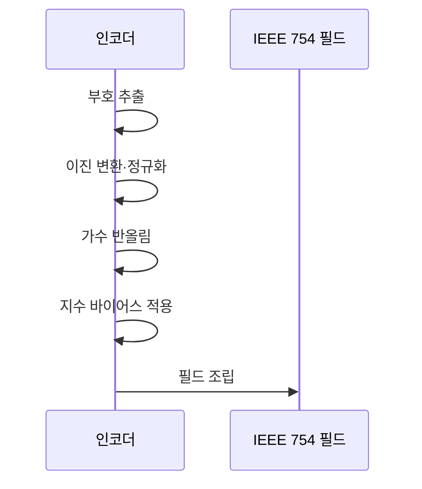

---
sidebar:
  order: 23
  label: "023. 부동소수점 표현 — IEEE 754 (Floating Point IEEE 754)"
  badge:
    text: "미출제 · 15%"
    variant: note
title: "부동소수점 표현 — IEEE 754 (Floating Point IEEE 754)"
date: "2026-07-25T23:58:00+09:00"
tags:
  - "notes-basic-theory"
weight: 23
extra:
  question_no: "023"
  source_status: "미출제"
  source_history: ""
  priority: 15
  priority_note: "수치 오차·특수값 이해를 보완하는 주제"
---

## 미리 알고가기

- **부동소수점(Floating-Point)**: 소수점이 고정된 자리에 못 박혀 있지 않고 지수 값에 따라 좌우로 떠다닌다는 뜻이며, 실수를 부호·지수·유효숫자로 나눠 유한 비트에 근사하는 수 표현 방식이다
- **국제전기전자공학회(Institute of Electrical and Electronics Engineers, IEEE) 754**: 부동소수점의 형식·연산·특수값을 일관되게 처리하도록 IEEE가 정한 국제 표준
- **정규화(Normalization)**: 유효숫자를 $1.f$로 맞추고 소수점 이동량을 지수로 분리하는 과정
- **정규수(Normal Number)**: 숨은 선행 1을 사용해 유효 비트를 늘린 일반 유한값
- **서브노멀(Subnormal Number)**: 숨은 선행 1을 없애 0 부근의 표현 공백을 잇는 유한값
- **바이어스 지수(Biased Exponent)**: 실제 지수에 바이어스를 더해 음수 지수도 비부호 값으로 저장하는 방식
- **유효숫자(Significand)**: 정규화한 수의 정밀도를 결정하는 유효 비트
- **숨은 비트(Hidden Bit)**: 정규수의 선행 1을 저장하지 않고 가정하는 규칙
- **반올림 모드(Rounding Mode)**: 정확한 값을 표현할 수 없을 때 인접 표현값을 선택하는 규칙
- **부호 있는 0(Signed Zero)**: 부호 비트가 다른 +0과 -0
- **비수(Not a Number, NaN)**: 0/0처럼 유효한 수가 없는 연산 결과
- **특수 인코딩(Special Encoding)**: 특정 지수·가수 패턴으로 0·무한대·NaN을 나타내는 방식
- **이진 교환 형식(Binary Format)**: 부호·지수·가수 비트 수가 다른 교환 형식
- **binary16·binary32·binary64**: 각각 16·32·64비트로 저장하며 비트 수가 클수록 정밀도와 지수 범위가 커지는 이진 교환 형식
- **수식 기호 $s$, $E$, $f$, $e$**: 각각 ‘에스·대문자 이·에프·소문자 이’로 읽고 sign·Exponent·fraction·exponent의 머리글자와 대소문자를 구분해 쓰는 관례적 표기이며, 부호 비트·저장 지수·가수 비트열·실제 지수를 가리킨다.
- **정규수 식 $(-1)^s \times (1.f)_2 \times 2^{E-\mathrm{bias}}$**: ‘마이너스 일의 에스 승 곱하기 이진수 일 점 에프 곱하기 이의 이 마이너스 바이어스 승’으로 읽고, 위첨자는 거듭제곱·아래첨자 2는 이진수·곱셈표는 항의 결합을 나타내는 수학 관례이며, 부호·유효숫자·복원 지수를 결합해 저장 비트의 실제 값을 계산한다.
- **바이어스(bias)**: 저장 지수에서 빼 실제 지수를 복원하는 형식별 기준값
- **오버플로(Overflow)**: 계산 결과의 크기가 해당 형식이 표현할 수 있는 최댓값을 넘는 상태
- **혼합 정밀 학습(Mixed-Precision Training)**: 작은 형식으로 주요 연산을 하고 큰 형식으로 합계·가중치를 관리해 자원 사용과 수치 오차를 조절하는 학습법
- **반정밀도·단정밀도·배정밀도**: 각각 binary16·binary32·binary64를 부르는 이름이며, 뒤로 갈수록 자릿수가 두 배씩 늘어 정밀도와 저장 비용을 함께 고르는 기준이 된다
- **동적 범위(Dynamic Range)**: 한 형식이 표현할 수 있는 가장 작은 값부터 가장 큰 값까지의 폭이며, 지수 필드 비트 수가 이 폭을 좌우한다
- **비결합성(Non-associativity)**: 수학에서는 $(a+b)+c$와 $a+(b+c)$가 같지만, 부동소수점은 더하는 순서마다 잘려 나가는 하위 비트가 달라져 결과가 어긋나는 성질
- **10진 연산(Decimal Arithmetic)**: 값을 2진수로 바꾸지 않고 사람이 쓴 10진 자릿수 그대로 계산해 0.1처럼 2진수로 딱 떨어지지 않는 소수도 오차 없이 다루는 방식이며, 결론에서 부동소수점 대신 고르는 대안으로 나온다

## Ⅰ. 개요

- 정의/개념: 실수를 **부호·지수·유효숫자**로 근사하는 **IEEE 754** 표준
- 기존 한계: 표준 없는 실수 표현은 구현마다 **연산 결과 불일치** 발생

### 쉽게 이해하기 (학습용)
- 천문학자가 별까지의 거리와 원자의 지름을 같은 크기의 카드 한 장에 적으려면 `3.2 × 10의 몇 승`이라는 과학 표기법으로 쓰듯, 부동소수점도 자릿수가 제각각인 실수를 소수점 위치(지수)와 유효숫자로 나눠 정해진 비트 안에 담고, 이 칸 나누는 방식을 기계마다 다르게 두면 같은 계산이 다른 답을 내므로 표준으로 못 박아 둔다

## Ⅱ. 특징

- 부호·**바이어스 지수**·가수 기반의 넓은 **동적 범위** 표현
- 유한 정밀도와 **반올림**에 따른 표현 오차·**비결합성**
- **NaN**·무한대·**서브노멀** 등 예외값 표준화

### 쉽게 이해하기 (학습용)
- 소수점 아래를 정해진 칸까지만 적고 나머지를 반올림해 버리는 계산기라서, 큰 수에 아주 작은 수를 더하면 작은 수가 통째로 잘려 사라지고 그래서 더하는 순서를 바꾸면 잘려 나간 몫이 달라져 합계가 어긋난다

## Ⅲ. 아키텍처 및 구성요소

| 설계 요소 | 설명 |
|:---|:---|
| 부호 비트 | 양수·음수와 **부호 있는 0**을 구분하는 1비트 |
| 지수 필드 | **바이어스**를 뺀 실제 지수와 특수 패턴 구분 |
| 가수 필드 | 정규수 $1.f$·서브노멀 $0.f$의 **유효 비트** 보관 |

> 정규수 값: $(-1)^s \times (1.f)_2 \times 2^{E-\mathrm{bias}}$
>
> 특수 패턴: $E=0$은 0·서브노멀, $E$ 전부 1은 무한대·NaN
>
> 요약: 세 필드와 **지수 패턴**으로 값·정밀도·특수값 결정

### 쉽게 이해하기 (학습용)
- 한 줄짜리 저장 칸을 왼쪽부터 세 칸으로 자른 종이라고 보면, 맨 앞 한 칸은 방향(부호), 가운데 칸은 소수점을 몇 칸 옮길지(지수), 뒤 칸은 남길 자릿수(가수)를 적어 두는데, 가운데 칸이 전부 0이거나 전부 1이면 값이 아니라 `0·서브노멀`이나 `무한대·NaN`이라는 신호로 읽는다

## Ⅳ. 원리 및 절차 흐름도

| 절차 | 설명 |
|:---|:---|
| 부호 추출 | 절댓값과 분리한 **부호 비트** 확정 |
| 이진 변환·정규화 | 절댓값을 $1.f \times 2^e$ 꼴로 맞춰 **숨은 비트** 확보 |
| 가수 반올림 | 지정 **반올림 모드**로 가수 확정, 자리 넘침 반영 |
| 지수 바이어스 적용 | 음수 지수도 저장하도록 **바이어스 지수** 산출 |
| 필드 조립 | 세 필드를 결합한 **교환 형식** 비트열 |

> 요약: 부호 추출·**정규화**·반올림 후 세 필드 조립

### 쉽게 이해하기 (학습용)
- 이삿짐을 규격 상자 하나에 맞추듯, 먼저 부호라는 꼬리표를 떼어 따로 붙이고 남은 절댓값을 2진수로 바꿔 소수점을 맨 앞 1 뒤로 옮긴 다음(정규화), 상자에 안 들어가는 뒷자리는 반올림해 잘라 내고, 옮긴 칸 수에 바이어스를 더해 음수도 담기게 만든 뒤 세 칸에 나눠 넣는다

## Ⅴ. 종류 및 비교

| 부동소수점 형식 | binary16 | binary32 | binary64 |
|:---|:---|:---|:---|
| 적용 기준 | **유효숫자** 3자리로 충분한 연산 | 범용 그래픽·**수치 해석** | **누적 오차** 민감 장기 계산 |
| 핵심 특징 | 16비트 **반정밀도** | 32비트 **단정밀도** | 64비트 **배정밀도** |
| 한계 | **지수 범위** 협소로 오버플로 빈발 | 장기 누적 시 **반올림 오차** 확대 | 저장량·**메모리 대역폭** 부담 |

> 요약: 비트 폭이 **표현 범위**와 저장 비용을 함께 결정

### 쉽게 이해하기 (학습용)
- 사진을 용량 작은 파일로 보낼지 원본으로 보관할지 고르는 것과 같아서, 화면에 잠깐 보여 주고 버리는 값은 16비트로 줄여 전송량을 아끼고, 이자처럼 더할수록 오차가 쌓여 결과가 뒤집히는 값은 64비트로 자릿수를 넉넉히 잡되 그만큼 메모리와 대역폭을 더 낸다

## Ⅵ. 실무 사례

1. 정산 시스템은 금액을 **최소 화폐 단위 정수**로 저장
2. **혼합 정밀 학습**은 반정밀도 연산·**단정밀도** 누산 조합

### 쉽게 이해하기 (학습용)
- 0.1원 같은 값은 2진수로 딱 떨어지지 않아 더할수록 잔액이 조금씩 어긋나므로, 정산 시스템은 금액을 `원`이 아니라 `전` 같은 최소 단위로 세어 소수점 없는 정수로만 저장한다
- 모델 학습은 곱셈처럼 양이 많은 계산을 눈금 거친 16비트 저울로 빠르게 하되, 조금씩 쌓이는 누적 합만 32비트 큰 저울에 옮겨 담아 작은 값이 통째로 잘려 사라지는 것을 방지한다

## Ⅶ. 결론

- 정확 일치 요구는 **정수·10진**, 넓은 범위는 **부동소수점** 선택

### 쉽게 이해하기 (학습용)
- 1원까지 딱 맞아야 하는 가계부 금액은 정수나 10진으로 세고, 별까지의 거리처럼 자릿수 폭이 큰 값은 마지막 자리 오차를 조금 허용하는 대신 넓은 범위를 담는 부동소수점으로 쓴다
