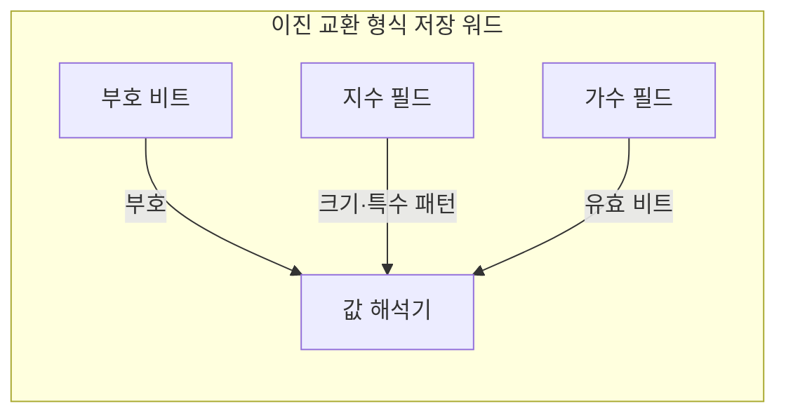
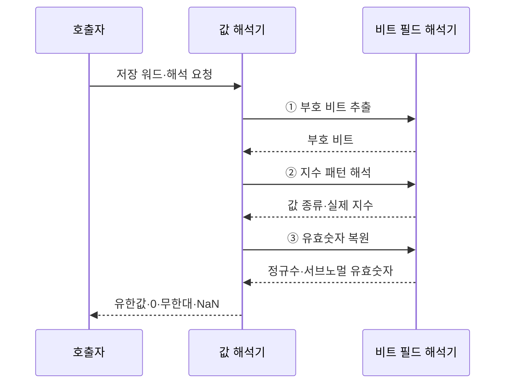

---
sidebar:
  order: 23
  label: "023. 부동소수점 표현 — IEEE 754 (Floating Point IEEE 754)"
  badge:
    text: "미출 · 15%"
    variant: note
title: "부동소수점 표현 — IEEE 754 (Floating Point IEEE 754)"
date: "2026-07-28T21:43:24+09:00"
tags:
  - "notes-basic-theory"
weight: 23
extra:
  question_no: "023"
  source_status: "미출"
  source_history: ""
  priority: 15
  priority_note: "수치 오차·특수값 이해를 보완하는 주제"
---

## 미리 알고가기

- **부동소수점(Floating-Point)**: 실수를 부호·지수·유효숫자로 나눠 유한 비트에 근사하는 표현 방식
- **국제전기전자공학회(Institute of Electrical and Electronics Engineers, IEEE) 754**: 부동소수점의 형식·연산·특수값을 일관되게 처리하도록 IEEE가 정한 국제 표준
- **정규화(Normalization)**: 유효숫자를 $1.f$로 맞추고 소수점 이동량을 지수로 분리하는 과정
- **정규수(Normal Number)**: 숨은 선행 1을 사용해 유효 비트를 늘린 일반 유한값
- **서브노멀(Subnormal Number)**: 숨은 선행 1을 없애 0 부근의 표현 공백을 잇는 유한값
- **바이어스 지수(Biased Exponent)**: 실제 지수에 바이어스를 더해 음수 지수도 비부호 값으로 저장하는 방식
- **유효숫자(Significand)**: 정규화한 수의 정밀도를 결정하는 유효 비트
- **숨은 비트(Hidden Bit)**: 정규수의 선행 1을 저장하지 않고 가정하는 규칙
- **반올림 모드(Rounding Mode)**: 정확한 값을 표현할 수 없을 때 인접 표현값을 선택하는 규칙
- **부호 있는 0(Signed Zero)**: 부호 비트가 다른 +0과 -0
- **비수(Not a Number, NaN)**: 0/0처럼 유효한 수가 없는 연산 결과
- **특수 인코딩(Special Encoding)**: 특정 지수·가수 패턴으로 0·무한대·NaN을 나타내는 방식
- **이진 교환 형식(Binary Format)**: 부호·지수·가수 비트 수가 다른 교환 형식
- **binary16·binary32·binary64**: 각각 16·32·64비트로 저장하며 비트 수가 클수록 정밀도와 지수 범위가 커지는 이진 교환 형식
- **수식 기호 $s$, $E$, $f$, $e$**: 부호 비트·저장 지수·가수 비트열·실제 지수
- **정규수 식 $(-1)^s \times (1.f)_2 \times 2^{E-\mathrm{bias}}$**: 부호·유효숫자·복원 지수를 결합한 실제 값
- **바이어스(bias)**: 저장 지수에서 빼 실제 지수를 복원하는 형식별 기준값
- **오버플로(Overflow)**: 계산 결과의 크기가 해당 형식이 표현할 수 있는 최댓값을 넘는 상태
- **언더플로(Underflow)**: 계산 결과의 절댓값이 해당 형식의 정상적인 최소 표현 범위보다 작아 0 또는 서브노멀로 처리되는 상태
- **혼합 정밀 학습(Mixed-Precision Training)**: 작은 형식으로 주요 연산을 하고 큰 형식으로 합계·가중치를 관리해 자원 사용과 수치 오차를 조절하는 학습법
- **손실 스케일링(Loss Scaling)**: 학습 손실과 기울기에 일정 배율을 곱해 작은 값의 언더플로를 피한 뒤 갱신 전에 원래 크기로 복원하는 기법
- **보상 합산(Compensated Summation)**: 매 덧셈에서 버려진 하위 비트 오차를 별도 변수에 누적해 다음 계산에 보정하는 합산법
- **메모리 대역폭(Memory Bandwidth)**: 단위 시간에 메모리와 연산 장치 사이에서 전송할 수 있는 데이터 양
- **반정밀도·단정밀도·배정밀도**: 각각 binary16·binary32·binary64를 부르는 이름이며, 뒤로 갈수록 전체 비트 수가 두 배씩 늘어 정밀도와 저장 비용이 함께 증가한다
- **동적 범위(Dynamic Range)**: 한 형식이 표현할 수 있는 가장 작은 값부터 가장 큰 값까지의 폭이며, 지수 필드 비트 수가 이 폭을 좌우한다
- **비결합성(Non-associativity)**: 수학에서는 $(a+b)+c$와 $a+(b+c)$가 같지만, 부동소수점은 더하는 순서마다 잘려 나가는 하위 비트가 달라져 결과가 어긋나는 성질
- **10진 연산(Decimal Arithmetic)**: 값을 2진수로 바꾸지 않고 사람이 쓴 10진 자릿수 그대로 계산해 0.1처럼 2진수로 딱 떨어지지 않는 소수도 오차 없이 다루는 방식이며, 결론에서 부동소수점 대신 고르는 대안으로 나온다

## Ⅰ. 개요

- 정의/개념: 실수를 **부호·지수·유효숫자**로 근사하는 **IEEE 754** 표준
- 기존 한계: 표준 없는 실수 표현은 구현마다 **연산 결과 불일치** 발생

### 쉽게 이해하기 (학습용)
- 과학 표기법처럼 소수점 위치와 유효숫자를 나눠 넓은 범위의 값을 정해진 비트에 담는다.

## Ⅱ. 특징

- 부호·**바이어스 지수**·가수 기반의 넓은 **동적 범위** 표현
- 유한 정밀도와 **반올림**에 따른 표현 오차·**비결합성**
- **NaN**·무한대·**서브노멀** 등 예외값 표준화

### 쉽게 이해하기 (학습용)
- 유한 자릿수를 반올림하므로 큰 값과 작은 값의 연산 순서에 따라 결과가 달라질 수 있다.

## Ⅲ. 아키텍처

**도표안 A — 구조도**

**도표안 B — sequenceDiagram**

| 구성요소 | 책임 |
|:---|:---|
| 부호 비트 | 양수·음수와 **부호 있는 0**을 구분하는 1비트 |
| 지수 필드 | **바이어스**를 뺀 실제 지수와 특수 패턴 구분 |
| 가수 필드 | 정규수 $1.f$·서브노멀 $0.f$의 **유효 비트** 보관 |
| 값 해석기 | 세 필드를 결합해 **실제 값·특수값** 판정 |

**동작 원리**

- **① 부호 비트 추출**: 최상위 비트로 값의 부호 결정
- **② 지수 패턴 해석**: 정규수·서브노멀·특수값 구분
- **③ 유효숫자 복원**: 숨은 비트와 가수 비트 결합

> 정규수 값: $(-1)^s \times (1.f)_2 \times 2^{E-\mathrm{bias}}$
>
> 특수 패턴: $E=0$은 0·서브노멀, $E$ 전부 1은 무한대·NaN
>
> 요약: 세 필드와 **지수 패턴**으로 값·정밀도·특수값 결정

### 쉽게 이해하기 (학습용)
- 부호·지수·가수 필드와 지수 특수 패턴으로 유한값·0·무한대·NaN을 구분한다.

## Ⅳ. 종류 및 비교

| 부동소수점 형식 | binary16 | binary32 | binary64 |
|:---|:---|:---|:---|
| 적용 기준 | **유효숫자** 3자리로 충분한 연산 | 범용 그래픽·**수치 해석** | **누적 오차** 민감 장기 계산 |
| 핵심 특징 | 16비트 **반정밀도** | 32비트 **단정밀도** | 64비트 **배정밀도** |
| 한계 | **지수 범위** 협소로 오버플로 빈발 | 장기 누적 시 **반올림 오차** 확대 | 저장량·**메모리 대역폭** 부담 |

### 쉽게 이해하기 (학습용)
- 정밀도가 높을수록 오차는 줄지만 저장량과 메모리 대역폭이 증가한다.

## Ⅴ. 실무 고려사항 및 대책

| 고려사항 | 대책 | 효과 |
|:---|:---|:---|
| 0.1 같은 값의 **이진 표현 오차** | 금액은 최소 단위 정수·**10진 형식** 사용 | 정확한 **금액 일치** 보장 |
| 합산 순서에 따른 **비결합성** | 크기순·**보상 합산** 적용 | **누적 오차** 감소 |
| **오버플로·특수값** 전파 | 범위 검사·**NaN·무한대 정책** 정의 | 비정상 **연산 결과** 조기 탐지 |
| 혼합 정밀도의 **작은 변화 소실** | 큰 형식 누산·**손실 스케일링** | **언더플로·반올림 손실** 감소 |
| 정산 시스템의 **금액 표현** | 최소 화폐 단위 **정수 저장** | **이진 소수 오차** 제거 |

### 쉽게 이해하기 (학습용)
- 오차 허용 범위와 특수값 처리, 누산 정밀도를 연산 목적에 맞게 정한다.

## Ⅵ. 결론

- 정확 일치 요구는 **정수·10진**, 넓은 범위는 **부동소수점** 선택

### 쉽게 이해하기 (학습용)
- 정확 일치가 필요하면 정수·10진, 넓은 동적 범위가 필요하면 부동소수점을 선택한다.
