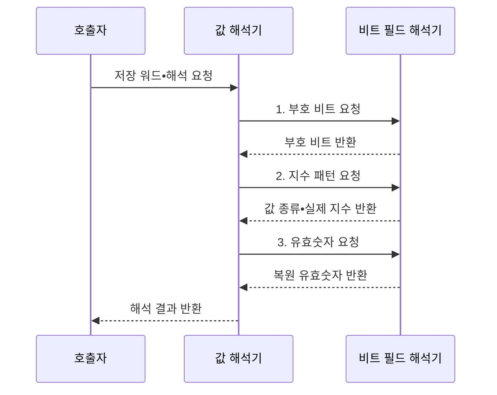

---
sidebar:
  order: 23
  label: "023. 부동소수점 표현: IEEE 754 (Floating Point IEEE 754)"
  badge:
    text: "미출 • 15%"
    variant: note
title: "부동소수점 표현: IEEE 754 (Floating Point IEEE 754)"
date: "2026-07-31T09:38:30+09:00"
tags:
  - "notes-basic-theory"
weight: 23
extra:
  question_no: "023"
  source_status: "미출"
  source_history: ""
  priority: 15
  priority_note: "수치 오차•특수값 이해를 보완하는 주제"
---

## 미리 알고가기

- **부동소수점(Floating-Point)**: 실수를 부호•지수•유효숫자로 나눠 유한 비트에 근사하는 표현 방식
- **국제전기전자공학회(Institute of Electrical and Electronics Engineers, IEEE) 754**: 부동소수점의 형식•연산•특수값을 일관되게 처리하도록 IEEE가 정한 국제 표준
- **정규화(Normalization)**: 유효숫자를 $1.f$로 맞추고 소수점 이동량을 지수로 분리하는 과정
- **정규수(Normal Number)**: 숨은 선행 1을 사용해 유효 비트를 늘린 일반 유한값
- **서브노멀(Subnormal Number)**: 숨은 선행 1을 없애 0 부근의 표현 공백을 잇는 유한값
- **바이어스 지수(Biased Exponent)**: 실제 지수에 바이어스를 더해 음수 지수도 비부호 값으로 저장하는 방식
- **유효숫자(Significand)**: 정규화한 수의 정밀도를 결정하는 유효 비트
- **숨은 비트(Hidden Bit)**: 정규수의 선행 1을 저장하지 않고 가정하는 규칙
- **반올림 모드(Rounding Mode)**: 정확한 값을 표현할 수 없을 때 인접 표현값을 선택하는 규칙
- **부호 있는 0(Signed Zero)**: 부호 비트가 다른 +0과 -0
- **비수(Not a Number, NaN)**: 0/0처럼 유효한 수가 없는 연산 결과
- **특수 인코딩(Special Encoding)**: 특정 지수•가수 패턴으로 0•무한대•NaN을 나타내는 방식
- **이진 교환 형식(Binary Format)**: 부호•지수•가수 비트 수가 다른 교환 형식
- **binary16•binary32•binary64**: 각각 16•32•64비트로 저장하며 비트 수가 클수록 정밀도와 지수 범위가 커지는 이진 교환 형식
- **수식 기호 $s$, $E$, $f$, $e$**: 부호 비트•저장 지수•가수 비트열•실제 지수
- **정규수 식 $(-1)^s \times (1.f)_2 \times 2^{E-\mathrm{bias}}$**: 부호•유효숫자•복원 지수를 결합한 실제 값
- **바이어스(bias)**: 저장 지수에서 빼 실제 지수를 복원하는 형식별 기준값
- **오버플로(Overflow)**: 계산 결과의 크기가 해당 형식이 표현할 수 있는 최댓값을 넘는 상태
- **언더플로(Underflow)**: 계산 결과의 절댓값이 해당 형식의 정상적인 최소 표현 범위보다 작아 0 또는 서브노멀로 처리되는 상태
- **혼합 정밀 학습(Mixed-Precision Training)**: 작은 형식으로 주요 연산을 하고 큰 형식으로 합계•가중치를 관리해 자원 사용과 수치 오차를 조절하는 학습법
- **손실 스케일링(Loss Scaling)**: 학습 손실과 기울기에 일정 배율을 곱해 작은 값의 언더플로를 피한 뒤 갱신 전에 원래 크기로 복원하는 기법
- **보상 합산(Compensated Summation)**: 매 덧셈에서 버려진 하위 비트 오차를 별도 변수에 누적해 다음 계산에 보정하는 합산법
- **메모리 대역폭(Memory Bandwidth)**: 단위 시간에 메모리와 연산 장치 사이에서 전송할 수 있는 데이터 양
- **반정밀도•단정밀도•배정밀도**: 각각 binary16•binary32•binary64를 부르는 이름이며, 뒤로 갈수록 전체 비트 수가 두 배씩 늘어 정밀도와 저장 비용이 함께 증가한다
- **동적 범위(Dynamic Range)**: 한 형식이 표현할 수 있는 가장 작은 값부터 가장 큰 값까지의 폭이며, 지수 필드 비트 수가 늘수록 표현 범위가 넓어진다
- **비결합성(Non-associativity)**: 수학에서는 $(a+b)+c$와 $a+(b+c)$가 같지만, 부동소수점은 더하는 순서마다 잘려 나가는 하위 비트가 달라져 결과가 어긋나는 성질
- **10진 연산(Decimal Arithmetic)**: 값을 2진수로 바꾸지 않고 사람이 쓴 10진 자릿수 그대로 계산해 0.1처럼 2진수로 딱 떨어지지 않는 소수도 오차 없이 다루는 방식이며, 결론에서 부동소수점 대신 고르는 대안으로 나온다

> **키워드:** 부동소수점 표현: IEEE 754 (Floating Point IEEE 754)

## Ⅰ. 개요

- 정의/개념: 실수를 부호•지수•유효숫자로 근사하는 **IEEE 754 표준**
- 배경/필요성: 구현 간 **실수 형식•연산 결과**의 호환성 확보

### 쉽게 이해하기 (학습용)

- $1.23\times10^4$처럼 숫자와 소수점 이동량을 나눠 적듯, 부동소수점은 부호•유효숫자•지수를 비트 칸에 나눠 넓은 범위를 담는다.

## Ⅱ. 특징

- **바이어스 지수•숨은 비트**로 동적 범위와 정규수 정밀도 확보
- 유한 정밀도와 **반올림**에 따른 표현 오차•**비결합성**
- **NaN**•무한대•**서브노멀** 등 예외값 표준화

### 쉽게 이해하기 (학습용)

- 계산기의 제한된 자릿수 밖 숫자가 매 연산마다 잘려 나가므로, 같은 수를 더해도 순서가 달라지면 버린 하위 자릿수가 달라져 결과가 어긋난다.

## Ⅲ. 구조 및 구성요소

| 구성요소 | 책임 |
|:---|:---|
| 부호 비트 | 양수•음수와 **부호 있는 0** 구분 |
| 지수 필드 | 실제 지수와 **특수 패턴** 구분 |
| 가수 필드 | 정규수•서브노멀의 **유효 비트** 보관 |
| 값 해석기 | 세 필드로 **실제 값•특수값** 판정 |

### 쉽게 이해하기 (학습용)

- 저장 워드를 부호•지수•가수로 나누고 값 해석기가 세 필드를 결합해 실제 값이나 특수값을 판정한다.

## Ⅳ. 흐름도

### 동작 원리

- **1. 부호 비트 요청**: 최상위 비트로 부호 결정
- **2. 지수 패턴 요청**: 정규수•서브노멀•특수값 구분
- **3. 유효숫자 요청**: 숨은 비트와 가수 비트 결합

> 특수 패턴: $E=0$은 0•서브노멀, $E$ 전부 1은 무한대•NaN
>
> 요약: 세 필드와 **지수 패턴**으로 값•정밀도•특수값 결정

### 쉽게 이해하기 (학습용)

- 저장 워드를 세 칸으로 잘라 부호를 읽고, 지수 칸의 특수 무늬로 0•서브노멀•무한대•NaN을 가른 뒤 가수와 결합해 값을 복원한다.

## Ⅴ. 종류 및 비교

| 부동소수점 형식 | binary16 | binary32 | binary64 |
|:---|:---|:---|:---|
| 적용 기준 | **유효숫자** 3자리로 충분한 연산 | 범용 그래픽•**수치 해석** | **누적 오차** 민감 장기 계산 |
| 핵심 특징 | 16비트 **반정밀도** | 32비트 **단정밀도** | 64비트 **배정밀도** |
| 한계 | **지수 범위** 협소로 오버플로 빈발 | 장기 누적 시 **반올림 오차** 확대 | 저장량•**메모리 대역폭** 부담 |

### 쉽게 이해하기 (학습용)

- 눈금 많은 자가 더 정밀하지만 무겁듯, binary64는 binary16보다 정밀도•범위와 메모리 사용량이 크다.

## Ⅵ. 실무 고려사항 및 대책

| 고려사항 | 대책 | 효과 |
|:---|:---|:---|
| 0.1 같은 값의 **이진 표현 오차** | 금액은 최소 단위 정수•**10진 형식** 사용 | 정확한 **금액 일치** 보장 |
| 합산 순서에 따른 **비결합성** | 크기순•**보상 합산** 적용 | **누적 오차** 감소 |
| **오버플로•특수값** 전파 | 범위 검사•**NaN•무한대 정책** 정의 | 비정상 **연산 결과** 조기 탐지 |
| 혼합 정밀도의 **작은 변화 소실** | 큰 형식 누산•**손실 스케일링** | **언더플로•반올림 손실** 감소 |

### 쉽게 이해하기 (학습용)

- 0.1원처럼 정확히 맞아야 하는 값은 정수•10진으로 담고, 많은 값을 더할 때는 버린 자릿수를 보상하며 NaN•무한대가 번지는 지점을 감시한다.

## Ⅶ. 결론

- 정확 금액은 **정수•10진**, 넓은 범위는 **부동소수점** 선택

### 쉽게 이해하기 (학습용)

- 돈처럼 한 자리도 틀리면 안 되면 정수•10진을, 매우 작고 큰 값을 같은 형식으로 빠르게 계산해야 하면 부동소수점을 선택한다.
