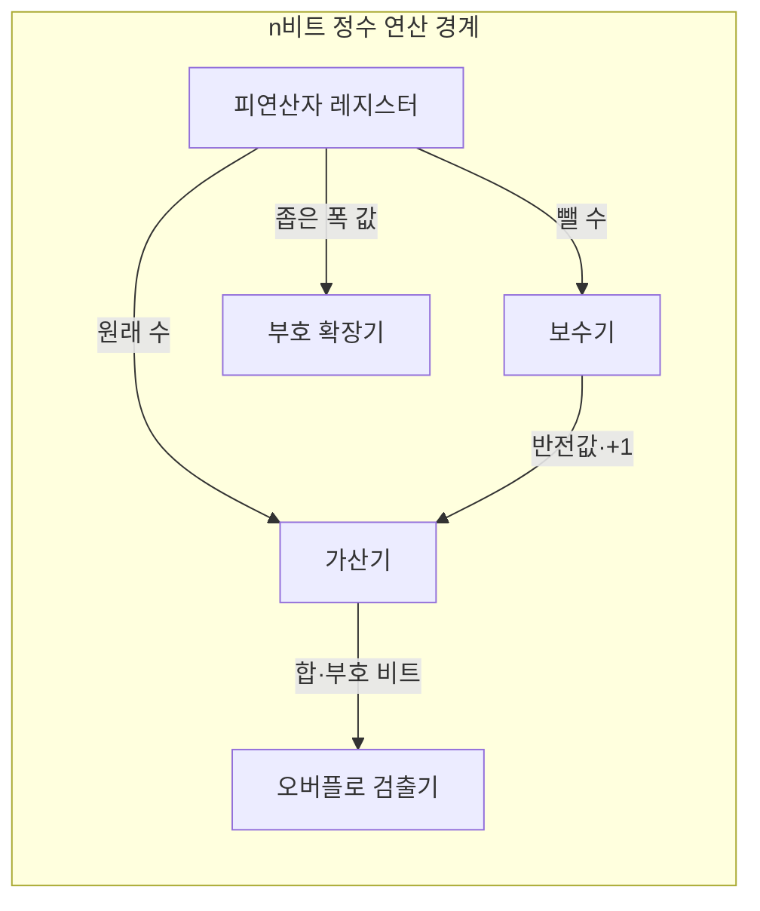
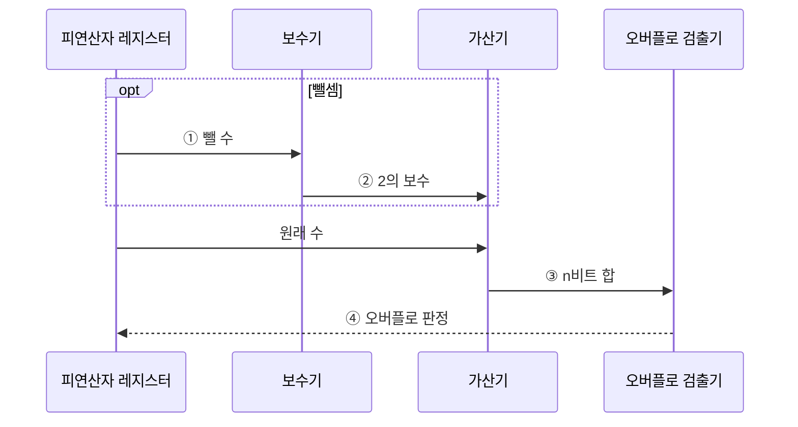

---
sidebar:
  order: 24
  label: "024. 2의 보수·부호 표현 (Two's Complement)"
  badge:
    text: "미출 · 15%"
    variant: note
title: "2의 보수·부호 표현 (Two's Complement)"
date: "2026-07-28T23:28:00+09:00"
tags:
  - "notes-basic-theory"
weight: 24
extra:
  question_no: "024"
  source_status: "미출"
  source_history: ""
  priority: 15
  priority_note: "부호 확장·오버플로 이해를 보완하는 주제"
---

## 미리 알고가기

- **2의 보수(Two's Complement)**: 고정 비트에서 반전 후 1을 더해 덧셈 역원을 만드는 부호 표현 방식
- **비트 폭(Bit Width)**: 연산과 표현 범위를 고정하는 정수 비트 수
- **최상위 비트(Most Significant Bit, MSB)**: 부호와 음의 자리 가중치를 가진 가장 왼쪽 비트
- **부호 확장(Sign Extension)**: 비트 폭을 늘릴 때 최상위 비트를 왼쪽에 복제해 정수값을 보존하는 방식
- **모듈러 연산(Modular Arithmetic)**: 결과를 $2^n$으로 나눈 나머지로 다루는 연산
- **0 표현 유일성(Single Zero)**: 0을 나타내는 비트 패턴이 하나뿐인 성질
- **비대칭 범위(Asymmetric Range)**: $n$비트 범위가 $-2^{n-1}$부터 $2^{n-1}-1$까지인 성질
- **캐리 아웃(Carry-out)**: 최상위 자리를 넘어간 비트
- **오버플로(Overflow)**: 범위를 벗어나 결과 부호가 잘못된 상태
- **부호-크기(Sign-Magnitude)**: 최상위 비트와 나머지 절댓값을 분리하는 방식
- **1의 보수(One's Complement)**: 양수 비트를 모두 반전해 음수를 나타내는 방식
- **순환 올림(End-around Carry)**: 최상위 캐리를 최하위 비트에 다시 더하는 규칙
- **가산기(Adder)**: 두 입력과 캐리를 더해 합과 캐리를 내는 회로
- **보수기(Complementer)**: 뺄 수의 비트를 모두 반전하고 1을 더해 덧셈 역원으로 바꿔 주는 회로이며, 뺄셈 전용 회로 없이 가산기만으로 뺄셈을 처리하게 한다
- **피연산자 레지스터(Operand Register)**: 연산에 쓸 두 정수를 고정된 $n$비트 폭으로 붙잡아 두는 저장소이며, 이 폭이 표현 범위와 모듈러 기준을 정한다
- **수식 기호 $n$, $A$, $B$, $\sim B$**: 비트 수·원래 수·뺄 수·뺄 수의 비트 반전값
- **거듭제곱 표기 $2^n$·$-2^{n-1}$**: $n$비트 모듈러 기준과 최상위 자리의 음수 가중치
- **직렬화(Serialization)**: 정수 같은 값을 저장·전송할 수 있는 연속 바이트 형식으로 바꾸는 과정
- **엔디언(Endian)**: 여러 바이트 정수의 최상위·최하위 바이트를 저장하는 순서

## Ⅰ. 개요

- 정의/개념: **반전+1**로 음수를 표현해 가산을 통일하는 **정수 체계**
- 기존 한계: 부호별로 뺄셈 회로를 나누면 **연산기 중복** 발생

### 쉽게 이해하기 (학습용)
- 음수를 비트 반전 후 1을 더한 값으로 표현해 뺄셈을 덧셈으로 바꾼다.

## Ⅱ. 특징

- 덧셈 회로로 뺄셈까지 수행하는 **산술 연산 통일**
- **0 표현 유일성**과 양·음수의 **비대칭 범위**

### 쉽게 이해하기 (학습용)
- 0 표현은 하나지만 음수 범위가 한 칸 넓어 최솟값의 양수 절댓값은 표현할 수 없다.

## Ⅲ. 아키텍처

**도표안 A — 구조도**

**도표안 B — sequenceDiagram**

| 구성요소 | 책임 |
|:---|:---|
| 피연산자 레지스터 | 고정 **비트 폭**으로 모듈러 기준 $2^n$ 고정 |
| 보수기 | 뺄 수를 반전·+1해 **덧셈 역원** 산출 |
| 가산기 | 폭 밖 **캐리 아웃**을 버린 $n$비트 합 산출 |
| 오버플로 검출기 | 입력·결과 부호 불일치로 **오버플로** 판정 |
| 부호 확장기 | 폭 확장 시 **최상위 비트** 복제로 값 보존 |

> 자리 가중치: 최상위 비트 $-2^{n-1}$, 나머지 자리 양의 가중치
>
**동작 원리**

- **① 뺄 수**: 보수 변환 대상의 전달
- **② 2의 보수**: 반전·1 가산 결과 전달
- **③ n비트 합**: 동일 가산기로 덧셈·뺄셈 결과 산출
- **④ 오버플로 판정**: 입력·결과 부호 관계 검사

### 쉽게 이해하기 (학습용)
- 뺄 수만 보수기를 거치게 해 덧셈과 뺄셈이 가산기·오버플로 검출기를 공유한다.

## Ⅳ. 종류 및 비교

| 음수 표현 방식 | 2의 보수 | 1의 보수 | 부호-크기 |
|:---|:---|:---|:---|
| 적용 기준 | 뺄셈을 **가산기**로 처리해야 하는 경우 | **순환 올림** 전제 레거시 장비 | 절댓값 **직접 판독**이 필요한 표시 |
| 핵심 특징 | **0 표현 유일**·보정 단계 불필요 | 전체 **비트 반전**으로 음수 표현 | **부호 비트**와 절댓값 분리 |
| 한계 | 음수 **최솟값**의 절댓값 표현 불가 | 양·음의 **0 중복** | 가감산마다 **부호 분기** 회로 필요 |

### 쉽게 이해하기 (학습용)
- 2의 보수는 0이 하나이고 순환 올림 없이 같은 가산 경로를 사용한다.

## Ⅴ. 실무 고려사항 및 대책

| 고려사항 | 대책 | 효과 |
|:---|:---|:---|
| 다른 **비트 폭**의 값 변환 | 확대 시 부호 확장·축소 시 **범위 검사** | **정수값** 보존 |
| **캐리 아웃·오버플로** 혼동 | 입력·결과의 **부호 관계**로 판정 | **부호 연산** 오류 방지 |
| 최솟값의 **절댓값 범위** 초과 | 더 넓은 형식으로 **승격 후 연산** | **비대칭 범위** 오류 방지 |
| 직렬화 양단의 **규칙 불일치** | 비트 폭·**엔디언·부호** 명시 | **송수신 값** 일치 |

### 쉽게 이해하기 (학습용)
- 부호 확장·오버플로·최솟값 예외를 비트 폭별로 검증해야 한다.

## Ⅵ. 결론

- 단일 가산 경로는 **2의 보수**, 폭 변환은 부호 확장·범위 검사 적용

### 쉽게 이해하기 (학습용)
- 단일 가산 경로를 쓰는 대신 비트 폭 변환과 범위 초과를 정확히 검사해야 한다.
