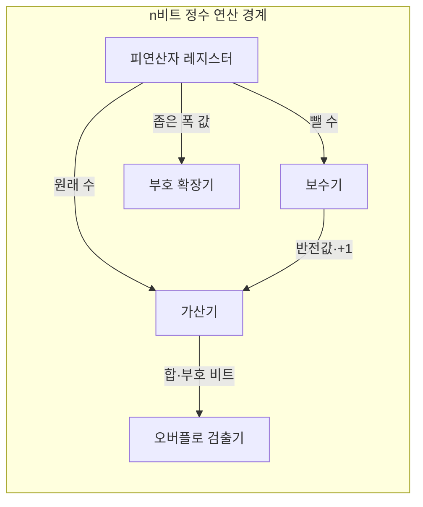
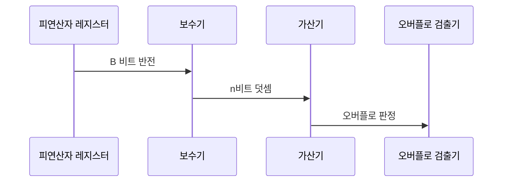

---
sidebar:
  order: 24
  label: "024. 2의 보수·부호 표현 (Two's Complement)"
  badge:
    text: "미출제 · 15%"
    variant: note
title: "2의 보수·부호 표현 (Two's Complement)"
date: "2026-07-26T00:02:00+09:00"
tags:
  - "notes-basic-theory"
weight: 24
extra:
  question_no: "024"
  source_status: "미출제"
  source_history: ""
  priority: 15
  priority_note: "부호 확장·오버플로 이해를 보완하는 주제"
---

## 미리 알고가기

- **2의 보수(Two's Complement)**: 고정 비트에서 반전 후 1을 더해 덧셈 역원을 만드는 부호 표현 방식
- **비트 폭(Bit Width)**: 연산과 표현 범위를 고정하는 정수 비트 수
- **최상위 비트(Most Significant Bit, MSB)**: 부호와 음의 자리 가중치를 가진 가장 왼쪽 비트
- **부호 확장(Sign Extension)**: 비트 폭을 늘릴 때 최상위 비트를 왼쪽에 복제해 정수값을 보존하는 방식
- **모듈러 연산(Modular Arithmetic)**: 결과를 $2^n$으로 나눈 나머지로 다루는 연산
- **0 표현 유일성(Single Zero)**: 0을 나타내는 비트 패턴이 하나뿐인 성질이며, 1의 보수·부호-크기에서 생기는 `+0`과 `-0`의 이중 표현이 없어 두 값을 비교할 때 같은 0이 다른 값으로 읽히는 일이 없다
- **비대칭 범위(Asymmetric Range)**: $n$비트 2의 보수가 담는 값이 $-2^{n-1}$부터 $2^{n-1}-1$까지라 음수 쪽이 한 칸 더 넓은 성질이며, 가장 작은 음수는 짝이 될 양수가 없어 부호만 뒤집으면 표현 범위를 벗어난다
- **캐리 아웃(Carry-out)**: 최상위 자리를 넘어간 비트
- **오버플로(Overflow)**: 범위를 벗어나 결과 부호가 잘못된 상태
- **부호-크기(Sign-Magnitude)**: 최상위 비트와 나머지 절댓값을 분리하는 방식
- **1의 보수(One's Complement)**: 양수 비트를 모두 반전해 음수를 나타내는 방식
- **순환 올림(End-around Carry)**: 최상위 캐리를 최하위 비트에 다시 더하는 규칙
- **가산기(Adder)**: 두 입력과 캐리를 더해 합과 캐리를 내는 회로
- **보수기(Complementer)**: 뺄 수의 비트를 모두 반전하고 1을 더해 덧셈 역원으로 바꿔 주는 회로이며, 뺄셈 전용 회로 없이 가산기만으로 뺄셈을 처리하게 한다
- **피연산자 레지스터(Operand Register)**: 연산에 쓸 두 정수를 고정된 $n$비트 폭으로 붙잡아 두는 저장소이며, 이 폭이 표현 범위와 모듈러 기준을 정한다
- **수식 기호 $n$, $A$, $B$, $\sim B$**: 각각 ‘엔·에이·비·틸드 비’로 읽고 $n$은 개수, $A$·$B$는 두 피연산자에 관례적으로 쓰며 틸드($\sim$)는 비트 반전을 나타내는 연산자이므로, 비트 수·뺄셈의 원래 수·뺄 수·$B$의 반전값을 가리킨다.
- **거듭제곱 표기 $2^n$·$-2^{n-1}$**: 각각 ‘이의 엔 승·마이너스 이의 엔 마이너스 일 승’으로 읽고 위첨자는 거듭제곱을 나타내는 수학 관례이며, $n$비트 모듈러 기준과 최상위 부호 자리의 음수 가중치를 계산한다.
- **직렬화(Serialization)**: 정수 같은 값을 저장·전송할 수 있는 연속 바이트 형식으로 바꾸는 과정

## Ⅰ. 개요

- **정의/개념**: **반전+1**로 음수를 표현해 가산을 통일하는 **정수 체계**
- **기존 한계**: 부호별로 뺄셈 회로를 나누면 **연산기 중복** 발생

### 쉽게 이해하기 (학습용)
- 시계에서 바늘을 뒤로 3칸 돌리는 대신 앞으로 9칸 돌려도 같은 자리에 서듯, 음수를 `비트를 다 뒤집고 1 더한 값`으로 정해 두면 빼기를 더하기로 바꿔 놓을 수 있어 뺄셈 회로를 따로 만들지 않아도 된다

## Ⅱ. 특징

- 덧셈 회로로 뺄셈까지 수행하는 **산술 연산 통일**
- **0 표현 유일성**과 양·음수의 **비대칭 범위**

### 쉽게 이해하기 (학습용)
- 12칸짜리 시계처럼 눈금 수가 짝수라 0을 한쪽에 몰아 넣고 나면 음수 자리가 양수보다 한 칸 많아지고, 그래서 가장 작은 음수는 짝이 될 양수가 없어 부호만 뒤집어도 범위를 벗어난다

## Ⅲ. 아키텍처 및 구성요소

| 설계 요소 | 설명 |
|:---|:---|
| 피연산자 레지스터 | 고정 **비트 폭**으로 모듈러 기준 $2^n$ 고정 |
| 보수기 | 뺄 수를 반전·+1해 **덧셈 역원** 산출 |
| 가산기 | 폭 밖 **캐리 아웃**을 버린 $n$비트 합 산출 |
| 오버플로 검출기 | 입력·결과 부호 불일치로 **오버플로** 판정 |
| 부호 확장기 | 폭 확장 시 **최상위 비트** 복제로 값 보존 |

> 자리 가중치: 최상위 비트 $-2^{n-1}$, 나머지 자리 양의 가중치
>
> 요약: 보수기·가산기·검출기가 **단일 가산 경로** 공유

### 쉽게 이해하기 (학습용)
- 계산기 안에 `뒤집는 기계(보수기)`, `더하는 기계(가산기)`, `자리 넘침을 보는 감시등(검출기)`이 한 줄로 놓여 있어서, 빼야 할 값만 앞의 뒤집는 기계를 통과시키면 나머지는 언제나 같은 더하기 길을 지나가고, 맨 왼쪽 자리만 음수 무게를 지녀 그 자리가 켜지면 결과가 음수가 된다

## Ⅳ. 원리 및 절차 흐름도

| 절차 | 설명 |
|:---|:---|
| B 비트 반전 | 뺄 수 $B$를 $\sim B$로 바꿔 **덧셈 역원** 준비 |
| n비트 덧셈 | $A+\sim B+1$ 계산, 폭 밖 **캐리 아웃** 폐기 |
| 오버플로 판정 | 두 입력 동부호·결과 이부호에서 **범위 초과** |

> 요약: 반전·+1 가산 후 **부호 관계**로 범위 초과 검출

### 쉽게 이해하기 (학습용)
- 빼기를 시킬 때 계산기는 먼저 뺄 수의 비트를 전부 뒤집고 1을 더해 `마이너스 그 수`를 만든 다음 평소처럼 더하고, 맨 앞에서 넘쳐 나온 자리는 시계 눈금이 한 바퀴 돈 것으로 보고 버리며, 같은 부호끼리 더했는데 결과 부호만 반대로 나오면 범위를 벗어났다고 판정한다

## Ⅴ. 종류 및 비교

| 음수 표현 방식 | 2의 보수 | 1의 보수 | 부호-크기 |
|:---|:---|:---|:---|
| 적용 기준 | 뺄셈을 **가산기**로 처리해야 하는 경우 | **순환 올림** 전제 레거시 장비 | 절댓값 **직접 판독**이 필요한 표시 |
| 핵심 특징 | **0 표현 유일**·보정 단계 불필요 | 전체 **비트 반전**으로 음수 표현 | **부호 비트**와 절댓값 분리 |
| 한계 | 음수 **최솟값**의 절댓값 표현 불가 | 양·음의 **0 중복** | 가감산마다 **부호 분기** 회로 필요 |

> 요약: 0 중복·보정 단계 없는 **2의 보수**가 현행 표준

### 쉽게 이해하기 (학습용)
- 셋 다 음수를 적는 방법이지만, 부호-크기는 사람이 읽기 쉬운 대신 더할 때마다 부호를 따져 길을 나눠야 하고, 1의 보수는 넘친 자리를 맨 뒤에 다시 더하는 손질과 `+0·-0` 두 개의 영이 남으며, 2의 보수만 영이 하나고 손질 없이 바로 더해져 오늘날 정수 연산의 기본이 됐다

## Ⅵ. 실무 사례

1. 프로토콜 **직렬화**는 송수신 비트 폭·**부호 확장** 규칙 합의
2. 입력 검증기는 정수 변환 전 목표 **비트 폭** 범위 검사

### 쉽게 이해하기 (학습용)
- 보내는 쪽이 8비트로 적은 음수를 받는 쪽이 16비트 칸에 옮길 때 왼쪽 빈칸을 0으로 채우면 음수가 큰 양수로 둔갑하므로, 두 시스템이 비트 폭과 `왼쪽을 부호 비트로 채운다`는 규칙까지 미리 맞춰 둔다
- 큰 그릇의 값을 작은 그릇으로 옮기면 넘친 부분이 소리 없이 잘려 엉뚱한 부호가 되므로, 입력 검증기가 정수로 바꾸기 전에 목표 칸이 담을 수 있는 최대·최소 안에 드는지 먼저 확인한다

## Ⅶ. 결론

- 가산 통일의 대가는 **부호 확장**·**오버플로** 검사 책임

### 쉽게 이해하기 (학습용)
- 뺄셈 회로를 없앤 값으로 자릿수를 늘릴 때는 왼쪽을 부호 비트로 채워야 하고 더한 뒤에는 부호가 뒤집혔는지 확인해야 하니, 회로를 아낀 만큼 검사를 사람이 떠안는 셈이다
