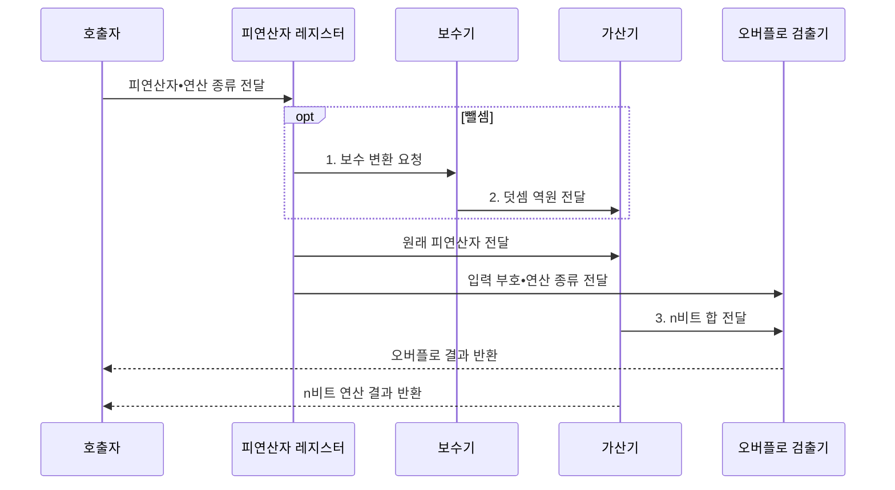

---
sidebar:
  order: 24
  label: "024. 2의 보수•부호 표현 (Two's Complement)"
  badge:
    text: "미출 • 15%"
    variant: note
title: "2의 보수•부호 표현 (Two's Complement)"
date: "2026-08-02T09:42:00+09:00"
tags:
  - "notes-basic-theory"
weight: 24
extra:
  question_no: "024"
  source_status: "미출"
  source_history: ""
  priority: 15
  priority_note: "부호 확장•오버플로 이해를 보완하는 주제"
---

## Ⅰ. 개요

핵심 용어

- **2의 보수(Two's Complement)**: 고정 비트에서 반전 후 1을 더해 덧셈 역원을 만드는 부호 표현 방식
- **가산기(Adder)**: 두 이진 입력과 캐리를 더해 합과 다음 캐리를 출력하는 회로

- 정의/개념: 비트 반전 후 1을 더해 음수를 나타내는 **부호 표현 방식**
- 배경/필요성: 덧셈•뺄셈을 **단일 가산 회로**로 처리

### 쉽게 이해하기 (학습용)

- 번호판이 끝에서 처음으로 이어지는 원형 눈금처럼, 뺄 수의 비트를 뒤집고 1을 더하면 같은 가산기로 반대 방향만큼 이동해 뺄셈이 된다.

## Ⅱ. 특징

핵심 용어

- **0 표현 유일성**: 0을 나타내는 비트 패턴이 하나뿐인 성질
- **비대칭 범위**: $n$비트 표현 범위가 $-2^{n-1}$부터 $2^{n-1}-1$까지인 성질
- **부호 확장(Sign Extension)**: 비트 폭을 늘릴 때 최상위 비트를 왼쪽에 복제해 정수값을 보존하는 방식

- 덧셈 회로로 뺄셈까지 수행하는 **산술 연산 통일**
- **0 표현 유일성**과 양•음수의 **비대칭 범위**
- 최상위 비트 복제로 값을 보존하는 **부호 확장**

### 쉽게 이해하기 (학습용)

- 4비트 눈금은 -8부터 7까지라 0 표시는 하나지만 음수 칸이 하나 더 많아, -8을 같은 폭의 +8로 뒤집어 담을 수 없다.

## Ⅲ. 구조 및 구성요소

핵심 용어

- **비트 폭(Bit Width)**: 정수의 표현 범위와 모듈러 기준을 고정하는 비트 수
- **보수기(Complementer)**: 뺄 수의 비트를 반전하고 1을 더해 덧셈 역원으로 바꾸는 회로
- **오버플로(Overflow)**: 연산 결과가 고정 비트 표현 범위를 벗어난 상태

| 구성요소 | 책임 |
|:---|:---|
| 피연산자 레지스터 | 고정 **비트 폭**과 모듈러 기준 유지 |
| 보수기 | 반전•1 가산으로 **덧셈 역원** 산출 |
| 가산기 | 캐리 아웃을 버린 **$n$비트 합** 산출 |
| 오버플로 검출기 | 입력•결과 부호로 **오버플로** 판정 |
| 부호 확장기 | 최상위 비트 복제로 **정수값** 보존 |

### 쉽게 이해하기 (학습용)

- 보수기가 뺄 수를 덧셈 역원으로 바꾸고, 가산기와 검출기가 결과와 표현 범위 초과를 함께 계산한다.

## Ⅳ. 흐름도

핵심 용어

- **덧셈 역원**: 원래 수와 더했을 때 고정 비트 모듈러 연산에서 0이 되는 값
- **모듈러 덧셈**: 결과를 $2^n$으로 나눈 나머지인 $n$비트 값만 유지하는 덧셈
- **캐리 아웃(Carry-out)**: 최상위 자리를 넘어가 고정 비트 결과에서 버려지는 비트

> **자리 가중치**: 최상위 비트만 음수
>
### 동작 원리

- **1. 보수 변환 요청**: 뺄 수의 비트 반전•1 가산
- **2. 덧셈 역원 전달**: 가산기에 변환값 입력
- **3. n비트 합 전달**: 모듈러 덧셈 결과 제공

### 쉽게 이해하기 (학습용)

- 뺄 수만 뒤집어 1을 더한 뒤 같은 계산대에 넣고, 검출기는 두 입력 부호와 결과 부호를 대조해 범위를 넘었는지 판정한다.

## Ⅴ. 종류 및 비교

핵심 용어

- **2의 보수**: 비트 반전 후 1을 더해 음수를 나타내는 방식
- **1의 보수(One's Complement)**: 양수 비트를 모두 반전해 음수를 나타내는 방식
- **부호-크기(Sign-Magnitude)**: 최상위 비트와 나머지 절댓값을 분리하는 방식
- **순환 올림(End-around Carry)**: 1의 보수 연산에서 최상위 캐리를 최하위 비트에 다시 더하는 규칙

| 음수 표현 방식 | 2의 보수 | 1의 보수 | 부호-크기 |
|:---|:---|:---|:---|
| 적용 기준 | 뺄셈을 **가산기**로 처리해야 하는 경우 | **순환 올림** 전제 레거시 장비 | 절댓값 **직접 판독**이 필요한 표시 |
| 핵심 특징 | **0 표현 유일**•보정 단계 불필요 | 전체 **비트 반전**으로 음수 표현 | **부호 비트**와 절댓값 분리 |
| 한계 | 음수 **최솟값**의 절댓값 표현 불가 | 양•음의 **0 중복** | 가감산마다 **부호 분기** 회로 필요 |

### 쉽게 이해하기 (학습용)

- 1의 보수와 부호-크기는 별도 처리가 필요하지만, 2의 보수는 0 표현이 하나이고 같은 가산기로 계산한다.

## Ⅵ. 실무 고려사항 및 대책

핵심 용어

- **범위 검사**: 형식 축소나 절댓값 연산 전에 결과가 대상 비트 폭에 들어오는지 확인하는 절차
- **직렬화(Serialization)**: 정수를 저장•전송 가능한 연속 바이트 형식으로 바꾸는 과정
- **엔디언(Endian)**: 여러 바이트 정수의 최상위•최하위 바이트를 저장하는 순서

| 고려사항 | 대책 | 효과 |
|:---|:---|:---|
| 다른 **비트 폭**의 값 변환 | 확대 시 부호 확장•축소 시 **범위 검사** | **정수값** 보존 |
| **캐리 아웃•오버플로** 혼동 | 입력•결과의 **부호 관계**로 판정 | **부호 연산** 오류 방지 |
| 최솟값의 **절댓값 범위** 초과 | 더 넓은 형식으로 **승격 후 연산** | **비대칭 범위** 오류 방지 |
| 직렬화 양단의 **규칙 불일치** | 비트 폭•**엔디언•부호** 명시 | **송수신 값** 일치 |

### 쉽게 이해하기 (학습용)

- 작은 상자를 큰 상자로 옮길 때 음수의 왼쪽 1을 채워 값을 보존하고, 반대로 줄일 때는 잘리는 비트와 최솟값 절댓값 초과를 검사한다.

## Ⅶ. 결론

핵심 용어

- **가감산 통합**: 뺄 수를 2의 보수로 바꿔 덧셈 회로 하나로 덧셈과 뺄셈을 처리하는 방식
- **폭 변환**: 정수의 비트 수를 늘리거나 줄이며 값과 범위를 조정하는 작업

- 가감산은 **2의 보수**, 폭 변환은 부호 확장•범위 검사

### 쉽게 이해하기 (학습용)

- 덧셈과 뺄셈은 2의 보수 가산기 하나로 처리하되, 상자 크기를 바꿀 때는 부호 확장과 범위 검사를 함께 적용한다.
