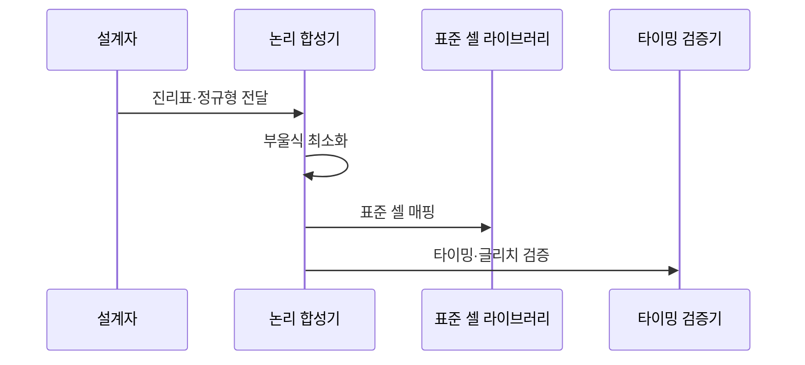

---
sidebar:
  order: 25
  label: "025. 논리 게이트·부울 대수 (Logic Gates and Boolean Algebra)"
  badge:
    text: "미출제 · 15%"
    variant: note
title: "논리 게이트·부울 대수 (Logic Gates and Boolean Algebra)"
date: "2026-07-26T00:04:00+09:00"
tags:
  - "notes-basic-theory"
weight: 25
extra:
  question_no: "025"
  source_status: "미출제"
  source_history: ""
  priority: 15
  priority_note: "부울식과 회로 구현을 연결하는 보조 주제"
---

## 미리 알고가기

- **부울 대수(Boolean Algebra)**: 0·1 변수와 AND·OR·NOT 연산을 다루는 대수 체계
- **논리 게이트(Logic Gate)**: 부울 연산을 전기적 회로로 구현한 소자
- **진리표(Truth Table)**: 모든 입력 조합과 해당 출력을 나열한 표
- **논리곱의 합(Sum of Products, SOP)**: 출력이 1인 입력 조합의 AND 항을 OR로 결합한 정규형
- **논리합의 곱(Product of Sums, POS)**: 출력이 0인 입력 조합의 OR 항을 AND로 결합한 정규형
- **리터럴(Literal)**: 입력 변수를 그대로 쓴 $A$나 부정한 $\bar A$처럼 더 쪼갤 수 없는 논리식의 최소 단위 항이며, 곱항을 이루는 재료가 된다
- **곱항(Product Term)**: 리터럴 여러 개를 AND로 묶은 항이며, 이 곱항들을 OR로 합치면 SOP 정규형이 된다
- **카르노 맵(Karnaugh Map)**: 출력이 같은 인접 항을 묶어 부울식을 최소화하는 도표
- **2단 논리(Two-level Logic)**: 입력의 부정을 먼저 만들어 둔 뒤 AND 한 단, OR 한 단만 거쳐 출력을 내는 구현 형태이며, 신호가 지나는 게이트 단수가 고정돼 도착 시간을 예측하기 쉽다
- **AND 평면·OR 평면(AND Plane, OR Plane)**: 2단 논리 회로에서 곱항을 만드는 앞단 AND 게이트 묶음과 그 곱항을 합치는 뒷단 OR 게이트 묶음을 부르는 이름이며, SOP 정규형이 그대로 두 층으로 놓인 형태다
- **기능 완전성(Functional Completeness)**: NAND나 NOR만으로 모든 논리를 구성하는 성질
- **부정 논리곱(NOT AND, NAND)**: AND 결과를 반전하며 이 게이트 하나만으로 모든 부울 연산을 만들 수 있는 범용 게이트
- **부정 논리합(NOT OR, NOR)**: OR 결과를 반전하며 이 게이트 하나만으로 모든 부울 연산을 만들 수 있는 범용 게이트
- **배타적 논리합(Exclusive OR, XOR)·배타적 논리합 부정(Exclusive NOR, XNOR)**: 입력의 다름·같음을 출력하는 게이트
- **패리티(Parity)**: 비트 1의 개수가 짝수인지 홀수인지를 나타내는 값이며, XOR 게이트를 줄줄이 이으면 바로 계산돼 오류 검출 회로의 기본 재료가 된다
- **쌍대성(Duality)**: AND·OR와 0·1을 함께 바꿔 기존 법칙에서 대응 법칙을 얻는 원리
- **드모르간 법칙(De Morgan's Law)**: 합의 부정은 부정의 곱, 곱의 부정은 부정의 합
- **흡수 법칙(Absorption Law)**: $A+AB=A$처럼 이미 있는 항이 자신을 포함한 더 긴 항을 삼켜 없애는 부울 법칙이며, 논리식 최소화에서 곱항 수를 줄이는 근거가 된다
- **전파 지연(Propagation Delay)**: 입력 변화가 출력에 도달할 때까지 걸리는 시간
- **글리치(Glitch)**: 경로 지연 차이로 생기는 순간적인 잘못된 출력
- **표준 셀(Standard Cell)**: 회로 합성에 쓰는 검증된 게이트 구현 단위
- **레지스터(Register)**: 클록 시점에 값을 저장하는 순차 소자
- **기본·배타·범용 게이트**: 각각 AND·OR·NOT, XOR·XNOR, NAND·NOR를 묶어 직접 조합·일치 판정·단일 종류 구현 용도를 구분한 분류
- **클록(Clock)**: 순차 회로의 저장·상태 변경 시점을 맞추는 주기 신호
- **식 기호 $A$, $B$, $+$, 이음선·윗줄**: 각각 ‘에이·비·플러스·붙여 읽기·바’로 읽고 $A$·$B$는 입력 변수에 관례적으로 쓰며 $+$·이음선·윗줄은 부울 대수의 논리합·논리곱·부정을 나타내는 표기이므로, 본문의 게이트 동작을 수식으로 표현한다.
- **드모르간 식 $\overline{A+B}=\bar A\bar B$**: ‘에이 오어 비 전체의 낫은 낫 에이 앤드 낫 비와 같다’로 읽고 윗줄은 부정·등호는 양변의 논리적 동치를 나타내는 수학 관례이며, OR의 부정을 각 입력의 부정 AND로 변환한다.

## Ⅰ. 개요

- **정의/개념**: **부울 대수** 연산을 **논리 게이트** 회로로 구현하는 설계 체계
- **기존 한계**: 대수 정리가 없으면 동일 기능의 **최소 게이트** 구현 미확정

### 쉽게 이해하기 (학습용)
- 현관과 거실 어느 스위치로도 전등을 켜고 끄게 만들려면 배선을 감으로 잇는 대신 "어떤 스위치 조합에서 불이 켜지는가"를 0과 1의 식으로 먼저 적어야 하고, 그 식을 AND·OR·NOT 게이트로 그대로 옮기면 같은 불빛을 내는 여러 배선 중 어느 것이 더 짧은지도 식끼리 비교해 고를 수 있다

## Ⅱ. 특징

- **진리표** 전수 열거 기반 **논리 등가성** 판정
- **논리식 최소화**로 게이트 수·**전파 지연** 동반 감소
- **NAND**·NOR의 **기능 완전성** 기반 단일 소자 구현

### 쉽게 이해하기 (학습용)
- 전등 조건표를 손에 들고 회로를 짜면 같은 불빛을 내는 배선이 여러 가지 나오는데, 조건표는 입력 조합을 하나도 빠뜨리지 않으므로 두 배선이 같은 회로인지 표만 맞춰 보면 판가름 나고, 식을 줄여 게이트를 덜 거치게 만들수록 신호가 지나는 길이 짧아져 결과가 더 빨리 안정되며, 심지어 NAND 한 종류만 반복해 쌓아도 그 조건표를 전부 만들어 낼 수 있어 부품을 한 가지로 통일할 수 있다

## Ⅲ. 아키텍처 및 구성요소

| 설계 요소 | 설명 |
|:---|:---|
| 입력 인버터 | NOT 게이트로 각 입력의 **부정 리터럴** 생성 |
| AND 평면 | 리터럴을 묶어 출력 1 조합별 **곱항** 산출 |
| OR 평면 | 곱항을 합쳐 **논리 함수** 출력 확정 |

> 요약: **쌍대성**으로 SOP는 AND·OR, POS는 OR·AND 배치

### 쉽게 이해하기 (학습용)
- 자판기가 "동전이 충분하고 재고가 있을 때" 또는 "관리자 키가 꽂혔을 때" 물건을 내보내게 만든다면, 먼저 각 조건의 반대값을 만들어 두고(입력 인버터) 한 줄짜리 조건 묶음마다 AND로 모은 뒤(AND 평면) 그렇게 만든 줄 중 하나만 참이어도 물건이 나오도록 OR로 이어 주면(OR 평면) 두 층만으로 어떤 조건표든 그려낼 수 있다

## Ⅳ. 원리 및 절차 흐름도

| 절차 | 설명 |
|:---|:---|
| 진리표·정규형 전달 | 출력 1 조합에서 **SOP** 정규형 도출 |
| 부울식 최소화 | **카르노 맵**·부울 법칙으로 곱항 축소 |
| 표준 셀 매핑 | 최소식을 **표준 셀** 게이트로 치환 |
| 타이밍·글리치 검증 | 경로 지연 차로 생기는 **글리치** 검출 |

> 주요 법칙: 드모르간 $\overline{A+B}=\bar A\bar B$, 흡수 $A+AB=A$
>
> 요약: 정규형 도출·최소화·셀 매핑 후 **전파 지연** 확인

### 쉽게 이해하기 (학습용)
- 설계자는 "어떤 입력에서 출력이 1인가"를 적은 표만 넘기고, 합성기가 그 표에서 뽑은 식을 카르노 맵 위에서 이웃한 칸끼리 묶어 짧게 줄인 다음 공정에서 미리 검증해 둔 부품 목록(표준 셀)에서 대응하는 게이트를 골라 끼우는데, 게이트마다 신호가 빠져나오는 시각이 달라 순간적으로 엉뚱한 값이 튀는 글리치가 생길 수 있으므로 마지막에 경로별 도착 시간을 맞춰 본다

## Ⅴ. 종류 및 비교

| 논리 게이트 | 기본 게이트 | 배타 게이트 | 범용 게이트 |
|:---|:---|:---|:---|
| 적용 기준 | **SOP** 최소식 직접 구현 | **패리티** 생성·값 일치 비교 | **NAND·NOR** 단일 종류 합성 |
| 핵심 특징 | **AND·OR·NOT** 조건 결합·반전 | **XOR·XNOR**의 다름·같음 판정 | 단일 종류로 **기능 완전성** 달성 |
| 한계 | **표준 셀** 종류 증가로 검증 부담 | 내부 구성 복잡으로 **셀 면적** 증가 | 단수 증가에 따른 **전파 지연** 누적 |

> 요약: 직접 구현은 기본, 홀짝 판정은 **배타**, 종류 통일은 **범용**

### 쉽게 이해하기 (학습용)
- 조건식을 그대로 회로로 옮길 때는 AND·OR·NOT을 손에 잡히는 대로 쓰고, 두 값이 같은지 다른지만 보면 되는 자리에는 XOR 하나가 여러 게이트 몫을 대신하며, 부품 종류를 하나로 줄여 대량 생산하고 싶으면 NAND만 반복해 쌓되 그만큼 신호가 거쳐 갈 층이 늘어 결과가 늦게 도착한다

## Ⅵ. 실무 사례

1. 연산 제어 회로는 **표준 셀** 매핑으로 **타이밍 제약** 충족
2. 모터 제어기는 **글리치** 방지를 위해 출력을 **레지스터**에 저장

### 쉽게 이해하기 (학습용)
- 칩 안에서 덧셈·비교 같은 제어 조건을 회로로 만들 때는 아무 게이트나 그리는 것이 아니라 공정에서 이미 검증된 부품 목록에서 골라 끼우고, 부품마다 신호가 빠져나오는 시각이 적혀 있어 정해진 클록 주기 안에 결과가 도착하도록 조합을 바꿔 가며 맞춘다
- 조합 회로의 출력은 입력이 바뀌는 순간 게이트별 도착 시각이 어긋나 잠깐 엉뚱한 값이 튀는데, 모터처럼 그 한순간에도 힘이 실리는 장치는 튀는 구간이 지난 뒤 클록 시점의 값만 레지스터에 담아 쓴다

## Ⅶ. 결론

- **논리식 최소화** 뒤 경로 지연 차의 **글리치** 검증

### 쉽게 이해하기 (학습용)
- 게이트 수를 줄여 회로를 짧게 만들었다고 끝이 아니라, 줄인 뒤에도 갈래마다 신호 도착 시각이 어긋나 순간적으로 엉뚱한 값이 튀는지 확인해야 실제로 쓸 수 있는 회로가 된다
