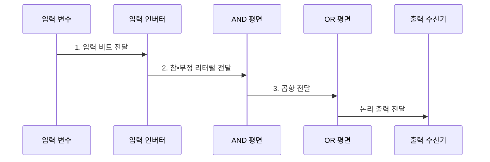

---
sidebar:
  order: 25
  label: "025. 논리 게이트•부울 대수 (Logic Gates and Boolean Algebra)"
  badge:
    text: "미출 • 15%"
    variant: note
title: "논리 게이트•부울 대수 (Logic Gates and Boolean Algebra)"
date: "2026-07-31T09:42:30+09:00"
tags:
  - "notes-basic-theory"
weight: 25
extra:
  question_no: "025"
  source_status: "미출"
  source_history: ""
  priority: 15
  priority_note: "부울식과 회로 구현을 연결하는 보조 주제"
---

## 미리 알고가기

- **부울 대수(Boolean Algebra)**: 0•1 변수와 AND•OR•NOT 연산을 다루는 대수 체계
- **논리 게이트(Logic Gate)**: 부울 연산을 전기적 회로로 구현한 소자
- **진리표(Truth Table)**: 모든 입력 조합과 해당 출력을 나열한 표
- **논리곱의 합(Sum of Products, SOP)**: 출력이 1인 입력 조합의 AND 항을 OR로 결합한 정규형
- **논리합의 곱(Product of Sums, POS)**: 출력이 0인 입력 조합의 OR 항을 AND로 결합한 정규형
- **리터럴(Literal)**: 입력 변수나 그 부정으로 이루어진 논리식의 최소 단위
- **곱항(Product Term)**: 리터럴 여러 개를 AND로 묶은 항이며, 이 곱항들을 OR로 합치면 SOP 정규형이 된다
- **카르노 맵(Karnaugh Map)**: 출력이 같은 인접 항을 묶어 부울식을 최소화하는 도표
- **2단 논리(Two-level Logic)**: AND•OR 또는 OR•AND 두 단계로 출력을 만드는 구현
- **AND 평면•OR 평면(AND Plane, OR Plane)**: 곱항을 만드는 AND 게이트 묶음과 이를 합치는 OR 게이트 묶음
- **기능 완전성(Functional Completeness)**: NAND나 NOR만으로 모든 논리를 구성하는 성질
- **부정 논리곱(NOT AND, NAND)**: AND 결과를 반전하며 이 게이트 하나만으로 모든 부울 연산을 만들 수 있는 범용 게이트
- **부정 논리합(NOT OR, NOR)**: OR 결과를 반전하며 이 게이트 하나만으로 모든 부울 연산을 만들 수 있는 범용 게이트
- **배타적 논리합(Exclusive OR, XOR)•배타적 논리합 부정(Exclusive NOR, XNOR)**: 입력의 다름•같음을 출력하는 게이트
- **패리티(Parity)**: 비트 1의 개수가 짝수인지 홀수인지를 나타내는 값이며, XOR 게이트를 줄줄이 이으면 바로 계산돼 오류 검출 회로의 기본 재료가 된다
- **쌍대성(Duality)**: AND•OR와 0•1을 함께 바꿔 기존 법칙에서 대응 법칙을 얻는 원리
- **드모르간 법칙(De Morgan's Law)**: 합의 부정은 부정의 곱, 곱의 부정은 부정의 합
- **흡수 법칙(Absorption Law)**: $A+AB=A$처럼 포함 관계의 긴 항을 제거하는 법칙
- **전파 지연(Propagation Delay)**: 입력 변화가 출력에 도달할 때까지 걸리는 시간
- **글리치(Glitch)**: 경로 지연 차이로 생기는 순간적인 잘못된 출력
- **합의항(Consensus Term)**: 서로 다른 경로의 신호 전환 순간에도 출력이 유지되도록 논리식에 추가하는 중복 곱항
- **표준 셀(Standard Cell)**: 회로 합성에 쓰는 검증된 게이트 구현 단위
- **논리 합성(Logic Synthesis)**: 논리식을 공정의 표준 셀 조합으로 변환하는 과정
- **게이트 네트리스트(Gate Netlist)**: 게이트 종류와 연결 관계를 기록한 회로 구현 목록
- **형식 등가성(Formal Equivalence)**: 모든 입력에서 원 논리식과 구현 회로의 출력이 같은지 수학적으로 검증하는 성질
- **임계 경로(Critical Path)**: 입력 변화가 출력까지 도달하는 데 가장 오래 걸리는 조합 논리 경로
- **정적 타이밍 분석(Static Timing Analysis)**: 입력 조합을 실행하지 않고 모든 경로 지연이 타이밍 제약을 만족하는지 계산하는 검증
- **레지스터(Register)**: 클록 시점에 값을 저장하는 순차 소자
- **기본•배타•범용 게이트**: 각각 AND•OR•NOT, XOR•XNOR, NAND•NOR를 묶어 직접 조합•일치 판정•단일 종류 구현 용도를 구분한 분류
- **클록(Clock)**: 순차 회로의 저장•상태 변경 시점을 맞추는 주기 신호
- **식 기호 $+$•이음선•윗줄**: 논리합•논리곱•부정을 나타내는 부울 표기
- **드모르간 식 $\overline{A+B}=\bar A\bar B$**: OR의 부정을 각 입력의 부정 AND로 변환하는 법칙

## Ⅰ. 개요

- 정의/개념: **부울 연산**을 게이트 조합으로 구현하는 논리 회로
- 배경/필요성: 동일 기능 회로의 **게이트 수•지연** 절감

### 쉽게 이해하기 (학습용)

- 스위치의 켜짐•꺼짐을 1•0 식으로 적고 같은 진리표를 만드는 더 적은 게이트로 바꿔, 기능은 유지하면서 회로를 줄인다.

## Ⅱ. 특징

- **진리표** 등가성 검증 후 **카르노 맵**으로 논리식 최소화
- **논리식 최소화**는 게이트 수 감소, **전파 지연**은 별도 검증
- **NAND**•NOR의 **기능 완전성** 기반 단일 소자 구현

### 쉽게 이해하기 (학습용)

- 모든 스위치 조합의 전등 결과를 진리표로 대조하고, 같은 출력을 만드는 식끼리 묶어 게이트 수와 신호 통과 단계를 줄인다.

## Ⅲ. 구조 및 구성요소

| 구성요소 | 책임 |
|:---|:---|
| 입력 인버터 | NOT으로 입력의 **부정 리터럴** 생성 |
| AND 평면 | 출력 1 조건별 **곱항** 산출 |
| OR 평면 | 곱항을 합쳐 **논리 함수** 확정 |

### 쉽게 이해하기 (학습용)

- 입력 인버터가 참•부정 리터럴을 만들고, AND 평면과 OR 평면이 출력 조건을 두 단계로 결합한다.

## Ⅳ. 흐름도

### 동작 원리

- **1. 입력 비트 전달**: 입력 변수의 0•1 조합 제공
- **2. 참•부정 리터럴 전달**: 원 변수•부정 변수 생성
- **3. 곱항 전달**: 출력 1 조건별 리터럴 결합

### 쉽게 이해하기 (학습용)

- 스위치 입력과 뒤집은 입력을 준비해 AND 줄에서 동시에 맞아야 할 조건을 만들고, OR 줄이 그 조건 중 하나라도 맞으면 전등을 켠다.

## Ⅴ. 종류 및 비교

| 논리 게이트 | 기본 게이트 | 배타 게이트 | 범용 게이트 |
|:---|:---|:---|:---|
| 적용 기준 | **SOP•POS** 최소식 직접 구현 | **패리티** 생성•값 일치 비교 | **NAND•NOR** 단일 종류 합성 |
| 핵심 특징 | **AND•OR•NOT** 조건 결합•반전 | **XOR•XNOR**의 다름•같음 판정 | 단일 종류로 **기능 완전성** 달성 |
| 한계 | **표준 셀** 종류 증가로 검증 부담 | 내부 구성 복잡으로 **셀 면적** 증가 | 단수 증가에 따른 **전파 지연** 누적 |

### 쉽게 이해하기 (학습용)

- 조건 조합은 AND•OR•NOT, 다름 판정은 XOR, 단일 게이트 구현은 NAND•NOR를 고른다.

## Ⅵ. 실무 고려사항 및 대책

| 고려사항 | 대책 | 효과 |
|:---|:---|:---|
| 최소화 후 **논리 기능** 변경 | 원식•최소식의 **형식 등가성** 검증 | **기능 정확성** 보장 |
| 경로 지연 차의 **글리치** | 합의항 추가•**레지스터 경계** 배치 | 순간 **오출력** 방지 |
| 게이트 축소로 **임계 경로** 증가 | 면적•전력•**지연 동시 최적화** | **타이밍 제약** 충족 |
| NAND•NOR 변환의 **논리 단수** 증가 | 표준 셀 지연 기반 **재합성** | **전파 지연** 부담 감소 |

### 쉽게 이해하기 (학습용)

- 회로를 줄인 뒤 모든 스위치 조합의 출력이 같은지 확인하고, 신호가 다른 길로 늦게 도착해 전등이 순간 깜박이는 글리치까지 검사한다.

## Ⅶ. 결론

- 조건 조합은 **기본**, 다름 판정은 **배타**, 단일 소자는 범용 게이트 선택

### 쉽게 이해하기 (학습용)

- 부울식을 가장 작은 게이트망으로 옮긴 뒤에도 진리표가 같고 가장 느린 신호 길이 클록 안에 도착해야 구현을 확정한다.
