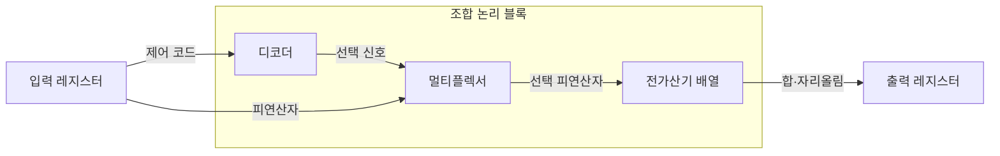
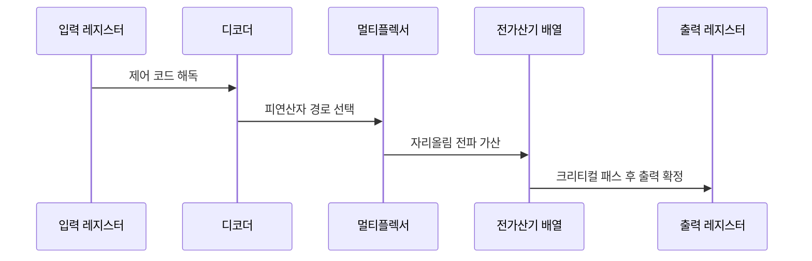

---
sidebar:
  order: 26
  label: "026. 조합 논리 회로 — 가산기·멀티플렉서 (Combinational Logic)"
  badge:
    text: "미출제 · 30%"
    variant: note
title: "조합 논리 회로 — 가산기·멀티플렉서 (Combinational Logic)"
date: "2026-07-26T00:06:00+09:00"
tags:
  - "notes-basic-theory"
weight: 26
extra:
  question_no: "026"
  source_status: "미출제"
  source_history: ""
  priority: 30
  priority_note: "가산기·선택기 비교의 짧은 구조형 주제"
---

## 미리 알고가기

- **조합 논리 회로(Combinational Logic)**: 출력이 다시 입력으로 돌아오는 피드백 경로도, 값을 담아 두는 기억 소자도 없이 현재 입력 조합만으로 출력을 정하는 무상태 회로
- **진리표(Truth Table)**: 모든 입력 조합과 출력값의 대응표
- **전가산기(Full Adder)**: 두 비트와 하위 자리올림을 더해 합과 상위 자리올림을 내는 회로
- **멀티플렉서(Multiplexer)**: 선택 신호에 따라 여러 입력 중 하나를 출력하는 회로
- **디코더(Decoder)**: $n$비트 입력값에 대응하는 $2^n$개 출력 중 하나를 활성화하는 회로
- **전파 지연(Propagation Delay)**: 입력 전이부터 대응 출력 전이까지 걸리는 시간
- **크리티컬 패스(Critical Path)**: 누적 전파 지연이 최대인 동작 속도 제한 경로
- **글리치(Glitch)**: 경로 지연 차이로 순간 발생하는 잘못된 출력
- **선견 자리올림(Carry Lookahead)**: 생성·전파 신호 기반 자리올림 병렬 계산
- **레지스터(Register)**: 클록 경계의 비트값 저장 순차 소자
- **클록 주기(Clock Period)**: 레지스터가 한 번 값을 저장하고 다음에 저장할 때까지의 시간 간격이며, 그 사이에 조합 논리의 최장 경로 신호가 도착해야 하므로 크리티컬 패스 지연이 이 주기의 하한을 정한다
- **파이프라인 분할(Pipelining)**: 한 클록 안에 끝내기 버거운 긴 조합 논리 경로 한가운데에 레지스터를 끼워 두 단계로 자르는 설계 기법이며, 각 단계가 짧아진 만큼 클록을 더 빠르게 돌릴 수 있다
- **팬인(Fan-in)**: 한 논리 게이트가 직접 받아들이는 입력 신호 수
- **데이터 경로(Data Path)**: 연산기·선택기·레지스터를 연결해 데이터를 이동·처리하는 회로 경로
- **기호 $n$과 $2^n$**: 각각 ‘엔·이의 엔 승’으로 읽고 $n$은 개수, 위첨자는 거듭제곱을 나타내는 수학 관례이며, 디코더의 입력 비트 수와 그 조합에 필요한 출력선 수를 가리킨다.

## Ⅰ. 개요

- 정의/개념: **현재 입력 조합**만으로 출력이 정해지는 **무상태 회로**
- 기존 한계: 상태 저장 방식으로는 산술·선택·해독을 **1클록 내 완결** 불가

### 쉽게 이해하기 (학습용)

- 방 안의 램프가 벽 스위치 세 개의 현재 위치만 보고 켜지고 꺼진다면 아까 어떤 순서로 눌렀는지는 전혀 결과를 바꾸지 못해 같은 조합이면 언제나 같은 램프 상태가 되고, 이렇게 지난 일을 담아 두는 칸이 없기에 덧셈·선택·해독 같은 계산을 값이 들어오는 즉시 그 자리에서 끝낼 수 있다

## Ⅱ. 특징

- **피드백 경로** 부재로 **진리표** 전수 검증 가능
- **부울식 최소화**로 게이트 수·**회로 면적** 감소
- **크리티컬 패스** 지연이 좌우하는 **클록 주기** 하한

### 쉽게 이해하기 (학습용)

- 조합 회로는 지나온 길을 되돌아보지 않고 지금 눌린 버튼 조합만 보므로 모든 조합을 한 번씩 눌러 보면 회로 전체를 확인할 수 있고, 같은 불빛을 내는 식 중 짧은 것을 골라 게이트를 덜 쓰면 칩 위 자리도 줄며, 여러 갈래 중 가장 늦게 도착하는 신호가 다음 클록까지 기다려야 할 시간을 정한다

## Ⅲ. 아키텍처 및 구성요소

| 설계 요소 | 설명 |
|:---|:---|
| 디코더 | 제어 코드를 **선택 신호**로 해독 |
| 멀티플렉서 | 선택 신호별 **데이터 경로** 확정 |
| 전가산기 배열 | 자리올림 사슬로 다비트 **이진 덧셈** 산출 |

> 요약: 해독·선택·가산이 한 **클록 주기** 안에서 완결

### 쉽게 이해하기 (학습용)

- 계산기 안에 "무슨 연산을 하라"는 번호표가 들어오면 디코더가 그 번호에 맞는 선 하나를 켜고, 켜진 선이 멀티플렉서라는 전환 스위치를 움직여 어느 값을 계산 쪽으로 보낼지 정하며, 그렇게 골라 온 값이 가산기 줄로 들어가 자리마다 더해진 뒤 마지막에 저장 칸으로 넘어간다

## Ⅳ. 원리 및 절차 흐름도

| 절차 | 설명 |
|:---|:---|
| 제어 코드 해독 | 명령 코드에서 경로별 **선택 신호** 생성 |
| 피연산자 경로 선택 | 선택 신호에 대응하는 **입력 경로** 연결 |
| 자리올림 전파 가산 | 하위 **자리올림**이 상위 비트 합 좌우 |
| 크리티컬 패스 후 출력 확정 | 최장 경로 안정 후 **글리치** 소멸 |

> 요약: 입력 전이 후 **최장 경로** 안정 시점에 출력 확정

### 쉽게 이해하기 (학습용)

- 번호표가 들어온 순간부터 신호는 디코더·멀티플렉서·가산기를 차례로 지나가는데 갈래마다 길이가 달라 도착 시각이 제각각이고, 그중 가장 오래 걸리는 길의 신호까지 도착해 값이 더는 흔들리지 않을 때 비로소 저장 칸이 그 값을 받아 적는다

## Ⅴ. 종류 및 비교

| 조합 논리 회로 | 전가산기 | 멀티플렉서 | 디코더 |
|:---|:---|:---|:---|
| 적용 기준 | 다비트 **가산기 배열** 구성 | **데이터 경로** 분기 선택 | 주소·**명령어 해독** |
| 핵심 특징 | 하위 **캐리 입력** 포함 이진 덧셈 | **선택 신호** 기준 입력 1개 통과 | 입력 코드 대응 **출력선 활성화** |
| 한계 | **자리올림 전파** 지연 누적 | 선택선 오류·**팬인** 증가 | 출력선 **지수 증가**·글리치 |

> 요약: 덧셈은 **전가산기**, 경로 선택은 **멀티플렉서**, 해독은 디코더

### 쉽게 이해하기 (학습용)

- 전가산기는 아랫자리에서 넘어온 1까지 함께 더해 그 자리 결과와 윗자리로 넘길 1을 내놓고, 멀티플렉서는 여러 갈래 중 어느 선을 통과시킬지 고르는 전환 스위치이며, 디코더는 방 번호를 받아 그 방의 등 하나만 켜는 장치라 방 번호 비트가 하나 늘 때마다 켤 등이 두 배로 늘어난다

## Ⅵ. 실무 사례

1. 프로세서 가산기는 **선견 자리올림**으로 **전파 지연** 단축

### 쉽게 이해하기 (학습용)

- 프로세서 덧셈 회로가 자리마다 아랫자리 올림을 기다렸다 더하면 맨 윗자리는 줄 끝에서 차례를 기다리는 셈이라 늦어지므로, 각 자리가 올림을 낼지 그냥 넘길지를 미리 따로 계산해 두고 모든 자리가 거의 동시에 합을 확정한다

## Ⅶ. 결론

- **크리티컬 패스**가 클록 주기 초과 시 **파이프라인 분할**

### 쉽게 이해하기 (학습용)

- 가장 느린 신호가 다음 클록까지 도착하지 못하면 회로를 더 줄이려 애쓰는 대신 그 길 한가운데에 저장 칸을 하나 끼워 두 번에 나눠 달리게 만들고, 그러면 한 구간이 짧아진 만큼 클록을 더 빠르게 돌릴 수 있다
