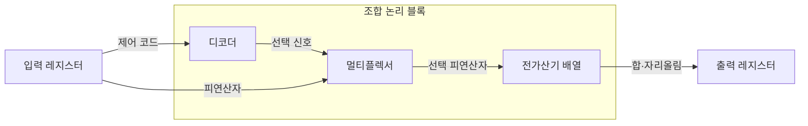

---
sidebar:
  order: 26
  label: "026. 조합 논리 회로 — 가산기·멀티플렉서 (Combinational Logic)"
  badge:
    text: "미출 · 30%"
    variant: note
title: "조합 논리 회로 — 가산기·멀티플렉서 (Combinational Logic)"
date: "2026-07-28T12:01:22+09:00"
tags:
  - "notes-basic-theory"
weight: 26
extra:
  question_no: "026"
  source_status: "미출"
  source_history: ""
  priority: 30
  priority_note: "가산기·선택기 비교의 짧은 구조형 주제"
---

## 미리 알고가기

- **조합 논리 회로(Combinational Logic)**: 기억 소자 없이 현재 입력 조합만으로 출력을 정하는 무상태 회로
- **진리표(Truth Table)**: 모든 입력 조합과 출력값의 대응표
- **전가산기(Full Adder)**: 두 비트와 하위 자리올림을 더해 합과 상위 자리올림을 내는 회로
- **멀티플렉서(Multiplexer)**: 선택 신호에 따라 여러 입력 중 하나를 출력하는 회로
- **디코더(Decoder)**: $n$비트 입력값에 대응하는 $2^n$개 출력 중 하나를 활성화하는 회로
- **전파 지연(Propagation Delay)**: 입력 전이부터 대응 출력 전이까지 걸리는 시간
- **크리티컬 패스(Critical Path)**: 누적 전파 지연이 최대인 동작 속도 제한 경로
- **글리치(Glitch)**: 경로 지연 차이로 순간 발생하는 잘못된 출력
- **선견 자리올림(Carry Lookahead)**: 생성·전파 신호 기반 자리올림 병렬 계산
- **레지스터(Register)**: 클록 경계의 비트값 저장 순차 소자
- **클록 주기(Clock Period)**: 레지스터 저장 사이의 시간 간격으로 크리티컬 패스 지연보다 길어야 함
- **파이프라인 분할(Pipelining)**: 긴 조합 논리 경로에 레지스터를 넣어 여러 단계로 나누는 기법
- **팬인(Fan-in)**: 한 논리 게이트가 직접 받아들이는 입력 신호 수
- **데이터 경로(Data Path)**: 연산기·선택기·레지스터를 연결해 데이터를 이동·처리하는 회로 경로
- **기호 $n$과 $2^n$**: 디코더 입력 비트 수와 필요한 출력선 수

## Ⅰ. 개요

- 정의/개념: **현재 입력 조합**만으로 출력이 정해지는 **무상태 회로**
- 기존 한계: 상태 저장 방식으로는 산술·선택·해독을 **1클록 내 완결** 불가

### 쉽게 이해하기 (학습용)

- 과거 상태를 저장하지 않고 현재 입력으로 덧셈·선택·해독 결과를 즉시 계산한다.

## Ⅱ. 특징

- **피드백 경로** 부재로 **진리표** 전수 검증 가능
- **부울식 최소화**로 게이트 수·**회로 면적** 감소
- **크리티컬 패스** 지연이 좌우하는 **클록 주기** 하한

### 쉽게 이해하기 (학습용)

- 진리표로 기능을 검증할 수 있으며 가장 느린 경로가 가능한 클록 주기를 제한한다.

## Ⅲ. 데이터 경로 구성

| 설계 요소 | 설명 |
|:---|:---|
| 디코더 | 제어 코드를 **선택 신호**로 해독 |
| 멀티플렉서 | 선택 신호별 **데이터 경로** 확정 |
| 전가산기 배열 | 자리올림 사슬로 다비트 **이진 덧셈** 산출 |

> 요약: 해독·선택·가산이 한 **클록 주기** 안에서 완결

### 쉽게 이해하기 (학습용)

- 디코더가 제어 신호를 만들고 멀티플렉서가 고른 피연산자를 가산기 배열이 처리한다.

## Ⅳ. 운영 고려사항

| 고려사항 | 대응 방안 | 기대 효과 |
|:---|:---|:---|
| 자리올림 사슬의 지연 누적 | 선견·선택 자리올림 구조 적용 | 가산 크리티컬 패스 단축 |
| 멀티플렉서 팬인 증가 | 계층형 선택기와 경로 분할 | 부하·배선 지연 완화 |
| 경로 지연 차로 인한 글리치 | 레지스터에서 안정 시점 샘플링 | 순간 오출력 전파 방지 |
| 조합 경로가 클록 주기 초과 | 중간 레지스터로 파이프라인 분할 | 동작 주파수 향상 |

### 쉽게 이해하기 (학습용)

- 크리티컬 패스와 글리치를 검증하고 필요하면 논리 구조나 파이프라인을 조정한다.

## Ⅴ. 종류 및 비교

| 조합 논리 회로 | 전가산기 | 멀티플렉서 | 디코더 |
|:---|:---|:---|:---|
| 적용 기준 | 다비트 **가산기 배열** 구성 | **데이터 경로** 분기 선택 | 주소·**명령어 해독** |
| 핵심 특징 | 하위 **캐리 입력** 포함 이진 덧셈 | **선택 신호** 기준 입력 1개 통과 | 입력 코드 대응 **출력선 활성화** |
| 한계 | **자리올림 전파** 지연 누적 | 선택선 오류·**팬인** 증가 | 출력선 **지수 증가**·글리치 |

> 요약: 덧셈은 **전가산기**, 경로 선택은 **멀티플렉서**, 해독은 디코더

### 쉽게 이해하기 (학습용)

- 덧셈은 전가산기, 데이터 선택은 멀티플렉서, 코드 해독은 디코더가 담당한다.

## Ⅵ. 실무 사례

1. 프로세서 가산기는 **선견 자리올림**으로 **전파 지연** 단축

### 쉽게 이해하기 (학습용)

- 자리올림 생성·전파 신호를 병렬 계산해 가산 지연을 줄인다.

## Ⅶ. 결론

- 처리 속도를 위해 크리티컬 패스·글리치를 검토하여 **조합 논리 회로** 활용

### 쉽게 이해하기 (학습용)

- 최장 경로가 클록 주기를 넘으면 논리를 줄이거나 파이프라인으로 분할한다.
