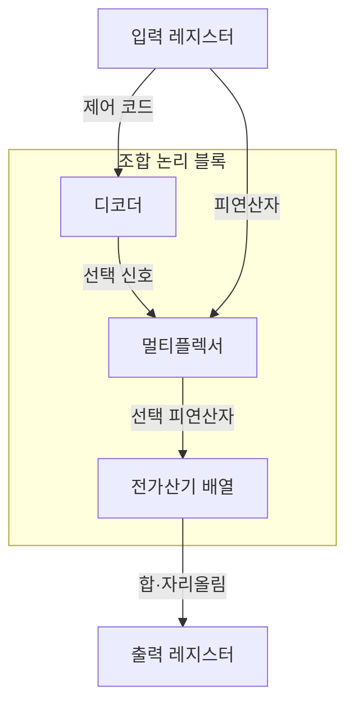
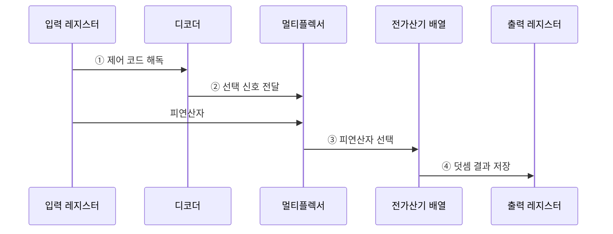

---
sidebar:
  order: 26
  label: "026. 조합 논리 회로 — 가산기·멀티플렉서 (Combinational Logic)"
  badge:
    text: "미출 · 30%"
    variant: note
title: "조합 논리 회로 — 가산기·멀티플렉서 (Combinational Logic)"
date: "2026-07-28T23:39:00+09:00"
tags:
  - "notes-basic-theory"
weight: 26
extra:
  question_no: "026"
  source_status: "미출"
  source_history: ""
  priority: 30
  priority_note: "가산기·선택기 비교의 짧은 구조형 주제"
---

## 미리 알고가기

- **조합 논리 회로(Combinational Logic)**: 기억 소자 없이 현재 입력 조합만으로 출력을 정하는 무상태 회로
- **진리표(Truth Table)**: 모든 입력 조합과 출력값의 대응표
- **전가산기(Full Adder)**: 두 비트와 하위 자리올림을 더해 합과 상위 자리올림을 내는 회로
- **멀티플렉서(Multiplexer)**: 선택 신호에 따라 여러 입력 중 하나를 출력하는 회로
- **디코더(Decoder)**: $n$비트 입력값에 대응하는 $2^n$개 출력 중 하나를 활성화하는 회로
- **전파 지연(Propagation Delay)**: 입력 전이부터 대응 출력 전이까지 걸리는 시간
- **피드백 경로(Feedback Path)**: 회로 출력을 다시 입력으로 되돌려 이전 상태가 다음 출력에 영향을 주게 하는 연결
- **부울식 최소화(Boolean Minimization)**: 같은 진리표를 유지하면서 논리항과 게이트 수를 줄이는 변환
- **회로 면적(Circuit Area)**: 회로 구현에 필요한 게이트·배선이 칩에서 차지하는 물리적 공간
- **크리티컬 패스(Critical Path)**: 누적 전파 지연이 최대인 동작 속도 제한 경로
- **글리치(Glitch)**: 경로 지연 차이로 순간 발생하는 잘못된 출력
- **선견 자리올림(Carry Lookahead)**: 생성·전파 신호 기반 자리올림 병렬 계산
- **선택 자리올림(Carry Select)**: 캐리 입력 0·1의 결과를 미리 계산한 뒤 실제 캐리에 맞춰 선택하는 가산 구조
- **레지스터(Register)**: 클록 경계의 비트값 저장 순차 소자
- **클록 주기(Clock Period)**: 레지스터 저장 사이의 시간 간격으로 크리티컬 패스 지연보다 길어야 함
- **파이프라인 분할(Pipelining)**: 긴 조합 논리 경로에 레지스터를 넣어 여러 단계로 나누는 기법
- **팬인(Fan-in)**: 한 논리 게이트가 직접 받아들이는 입력 신호 수
- **배선 지연(Wire Delay)**: 신호가 회로 연결선을 지나면서 저항·정전용량 때문에 늦게 도착하는 시간
- **동작 주파수(Operating Frequency)**: 회로가 1초에 수행할 수 있는 클록 주기의 수
- **데이터 경로(Data Path)**: 연산기·선택기·레지스터를 연결해 데이터를 이동·처리하는 회로 경로
- **기호 $n$과 $2^n$**: 디코더 입력 비트 수와 필요한 출력선 수

## Ⅰ. 개요

- 정의/개념: **현재 입력 조합**만으로 출력이 정해지는 **무상태 회로**
- 기존 한계: 기억 소자만으로는 산술·선택·해독의 **입출력 관계** 구현 불가

### 쉽게 이해하기 (학습용)

- 자동판매기 버튼을 누른 현재 조합만으로 상품선을 고르듯, 조합 회로는 과거를 기억하지 않고 입력이 바뀔 때마다 덧셈·선택·해독 출력을 계산한다.

## Ⅱ. 특징

- **피드백 경로** 부재로 **진리표** 전수 검증 가능
- **부울식 최소화**로 게이트 수·**회로 면적** 감소
- **크리티컬 패스** 지연이 좌우하는 **클록 주기** 하한

### 쉽게 이해하기 (학습용)

- 모든 버튼 조합의 출력을 진리표로 확인할 수 있지만, 신호가 가장 많은 문을 통과하는 크리티컬 패스보다 클록을 빠르게 울릴 수는 없다.

## Ⅲ. 아키텍처

**도표안 A — 구조도**

**도표안 B — sequenceDiagram**

| 구성요소 | 책임 |
|:---|:---|
| 입력 레지스터 | **제어 코드·피연산자** 유지 |
| 디코더 | 제어 코드를 **선택 신호**로 해독 |
| 멀티플렉서 | 선택 신호별 **데이터 경로** 확정 |
| 전가산기 배열 | 자리올림 사슬로 다비트 **이진 덧셈** 산출 |
| 출력 레지스터 | 안정된 **합·자리올림** 저장 |

**동작 원리**

- **① 제어 코드 해독**: 입력 레지스터의 제어 비트열을 디코더에 전달
- **② 선택 신호 전달**: 디코더가 대응 데이터 경로의 선택선을 활성화
- **③ 피연산자 선택**: 멀티플렉서가 선택 신호에 맞는 가산 입력 경로 확정
- **④ 덧셈 결과 저장**: 전가산기 배열의 안정된 합·자리올림을 출력 레지스터에 저장

### 쉽게 이해하기 (학습용)

- 제어 코드를 읽은 디코더가 통로 표지판을 켜고, 멀티플렉서가 그 통로의 피연산자를 골라 전가산기 배열로 보낸다.

## Ⅳ. 종류 및 비교

| 조합 논리 회로 | 전가산기 | 멀티플렉서 | 디코더 |
|:---|:---|:---|:---|
| 적용 기준 | 다비트 **가산기 배열** 구성 | **데이터 경로** 분기 선택 | 주소·**명령어 해독** |
| 핵심 특징 | 하위 **캐리 입력** 포함 이진 덧셈 | **선택 신호** 기준 입력 1개 통과 | 입력 코드 대응 **출력선 활성화** |
| 한계 | **자리올림 전파** 지연 누적 | 선택선 오류·**팬인** 증가 | 출력선 **지수 증가**·글리치 |

### 쉽게 이해하기 (학습용)

- 두 수와 아랫자리 올림을 합치면 전가산기, 여러 선 중 하나를 통과시키면 멀티플렉서, 코드 하나를 출력선 하나로 펼치면 디코더다.

## Ⅴ. 실무 고려사항 및 대책

| 고려사항 | 대책 | 효과 |
|:---|:---|:---|
| 자리올림 사슬의 **지연 누적** | **선견·선택 자리올림** 구조 | 가산 **크리티컬 패스** 단축 |
| 멀티플렉서 **팬인 증가** | 계층형 선택기·**경로 분할** | 부하·**배선 지연** 감소 |
| 경로 지연 차의 **글리치** | 안정 시점 **레지스터 표본화** | 순간 **오출력 전파** 방지 |
| 조합 경로의 **클록 주기** 초과 | 중간 레지스터로 **파이프라인 분할** | 최대 **동작 주파수** 향상 |

### 쉽게 이해하기 (학습용)

- 신호가 긴 게이트 길을 지나 늦거나 갈림길마다 도착 시간이 달라 순간 깜박이면, 선견 논리·계층 선택기·중간 레지스터로 경로를 줄인다.

## Ⅵ. 결론

- 최장 경로가 주기를 넘으면 **선견 논리** 또는 **파이프라인**으로 분할

### 쉽게 이해하기 (학습용)

- 가장 늦은 신호가 다음 클록 종보다 늦게 도착하면 자리올림을 미리 계산하거나 중간 레지스터를 세워 여러 구간으로 나눈다.
