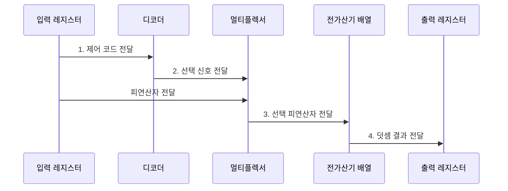

---
sidebar:
  order: 26
  label: "026. 조합 논리 회로: 가산기•멀티플렉서 (Combinational Logic)"
  badge:
    text: "미출 • 30%"
    variant: note
title: "조합 논리 회로: 가산기•멀티플렉서 (Combinational Logic)"
date: "2026-08-02T09:44:00+09:00"
tags:
  - "notes-basic-theory"
weight: 26
extra:
  question_no: "026"
  source_status: "미출"
  source_history: ""
  priority: 30
  priority_note: "가산기•선택기 비교의 짧은 구조형 주제"
---

## Ⅰ. 개요

핵심 용어

- **조합 논리 회로(Combinational Logic)**: 기억 소자 없이 현재 입력 조합만으로 출력을 정하는 무상태 회로
- **피드백 경로**: 회로 출력을 다시 입력으로 되돌려 이전 상태가 다음 출력에 영향을 주게 하는 연결

- 정의/개념: **조합 논리 회로**는 기억 소자와 피드백 없이 현재 입력의 부울 함수만으로 출력을 결정하는 **무상태 디지털 회로**
- 배경/필요성: 산술•선택•해독에는 저장 상태와 무관한 **즉시 입력•출력 변환**이 필요

### 쉽게 이해하기 (학습용)

- 자동판매기가 현재 버튼만 보고 상품을 고르듯, 조합 회로는 기억 없이 현재 입력으로 출력을 계산한다.

## Ⅱ. 특징

핵심 용어

- **진리표(Truth Table)**: 모든 입력 조합과 출력값의 대응을 나열한 표
- **부울식 최소화**: 같은 진리표를 유지하면서 논리항과 게이트 수를 줄이는 변환
- **크리티컬 패스(Critical Path)**: 누적 전파 지연이 가장 커 동작 속도를 제한하는 경로
- **클록 주기**: 레지스터 저장 사이의 시간 간격으로 크리티컬 패스 지연보다 길어야 하는 값

- **피드백 경로** 부재로 **진리표** 전수 검증 가능
- **부울식 최소화**로 게이트 수•**회로 면적** 감소
- **크리티컬 패스** 지연이 만드는 **클록 주기** 하한

### 쉽게 이해하기 (학습용)

- 모든 버튼 조합의 출력을 진리표로 확인할 수 있지만, 신호가 가장 많은 문을 통과하는 크리티컬 패스보다 클록을 빠르게 울릴 수는 없다.

## Ⅲ. 구조 및 구성요소

핵심 용어

- **디코더(Decoder)**: 입력 코드에 대응하는 출력선 하나를 활성화하는 회로
- **멀티플렉서(Multiplexer)**: 선택 신호에 따라 여러 입력 중 하나를 출력하는 회로
- **전가산기(Full Adder)**: 두 비트와 하위 자리올림을 더해 합과 상위 자리올림을 내는 회로
- **데이터 경로(Data Path)**: 연산기•선택기•레지스터를 연결해 데이터를 이동하고 처리하는 회로 경로

| 구성요소 | 책임 |
|:---|:---|
| 입력 레지스터 | **제어 코드•피연산자** 유지 |
| 디코더 | 제어 코드를 **선택 신호**로 해독 |
| 멀티플렉서 | 선택 신호별 **데이터 경로** 확정 |
| 전가산기 배열 | 자리올림을 포함한 **이진 덧셈** 산출 |
| 출력 레지스터 | 안정된 **합•자리올림** 저장 |

### 쉽게 이해하기 (학습용)

- 디코더가 제어 코드를 선택 신호로 바꾸고, 멀티플렉서와 전가산기 배열이 선택된 피연산자를 계산한다.

## Ⅳ. 흐름도

핵심 용어

- **제어 코드**: 수행할 연산이나 사용할 입력 경로를 지정하는 비트 조합
- **선택 신호**: 디코더가 제어 코드를 해석해 멀티플렉서의 입력 경로를 고르는 신호
- **자리올림(Carry)**: 낮은 자리의 덧셈 결과에서 상위 자리로 전달되는 값

### 동작 원리

- **1. 제어 코드 전달**: 디코더의 해독 입력 제공
- **2. 선택 신호 전달**: 대응 데이터 경로 활성화
- **3. 선택 피연산자 전달**: 가산 입력 경로 확정
- **4. 덧셈 결과 전달**: 안정된 합•자리올림 저장

### 쉽게 이해하기 (학습용)

- 제어 코드를 읽은 디코더가 통로 표지판을 켜고, 멀티플렉서가 그 통로의 피연산자를 골라 전가산기 배열로 보낸다.

## Ⅴ. 종류 및 비교

핵심 용어

- **전가산기•멀티플렉서•디코더**: 이진 덧셈•입력 경로 선택•코드 해독을 각각 수행하는 조합 회로
- **팬인(Fan-in)**: 한 논리 게이트가 직접 받아들이는 입력 신호의 수
- **글리치(Glitch)**: 경로 지연 차이로 순간 발생하는 잘못된 출력

| 조합 논리 회로 | 전가산기 | 멀티플렉서 | 디코더 |
|:---|:---|:---|:---|
| 적용 기준 | 다비트 **가산기 배열** 구성 | **데이터 경로** 분기 선택 | 주소•**명령어 해독** |
| 핵심 특징 | 하위 **캐리 입력** 포함 이진 덧셈 | **선택 신호** 기준 입력 1개 통과 | 입력 코드 대응 **출력선 활성화** |
| 한계 | **자리올림 전파** 지연 누적 | 선택선 오류•**팬인** 증가 | 출력선 **지수 증가**•글리치 |

### 쉽게 이해하기 (학습용)

- 두 수와 아랫자리 올림을 합치면 전가산기, 여러 선 중 하나를 통과시키면 멀티플렉서, 코드 하나를 출력선 하나로 펼치면 디코더다.

## Ⅵ. 실무 고려사항 및 대책

핵심 용어

- **선견•선택 자리올림**: 자리올림을 병렬 계산하거나 두 결과를 미리 계산해 지연을 줄이는 가산 구조
- **배선 지연(Wire Delay)**: 신호가 연결선의 저항•정전용량 때문에 늦게 도착하는 시간
- **파이프라인 분할(Pipelining)**: 긴 조합 경로에 레지스터를 넣어 여러 단계로 나누는 기법
- **동작 주파수**: 회로가 1초에 수행할 수 있는 클록 주기의 수

| 문제 | 대책 | 효과 |
|:---|:---|:---|
| 자리올림 사슬의 **지연 누적** | **선견•선택 자리올림** 구조 | 가산 **크리티컬 패스** 단축 |
| 멀티플렉서 **팬인 증가** | 계층형 선택기•**경로 분할** | 부하•**배선 지연** 감소 |
| 경로 지연 차의 **글리치** | 안정 시점 **레지스터 표본화** | 순간 **오출력 전파** 방지 |
| 조합 경로의 **클록 주기** 초과 | 중간 레지스터로 **파이프라인 분할** | 최대 **동작 주파수** 향상 |

### 쉽게 이해하기 (학습용)

- 신호가 긴 게이트 길을 지나 늦거나 갈림길마다 도착 시간이 달라 순간 깜박이면, 선견 논리•계층 선택기•중간 레지스터로 경로를 줄인다.

## Ⅶ. 결론

핵심 용어

- **가산•경로 선택•해독**: 전가산기•멀티플렉서•디코더가 담당하는 대표 조합 논리 기능
- **중간 레지스터**: 긴 조합 경로를 여러 클록 단계로 나누기 위해 사이에 배치하는 저장 소자

- 가산은 **전가산기**, 경로 선택은 **멀티플렉서**, 해독은 디코더 선택

### 쉽게 이해하기 (학습용)

- 가장 늦은 신호가 다음 클록 종보다 늦게 도착하면 자리올림을 미리 계산하거나 중간 레지스터를 세워 여러 구간으로 나눈다.
