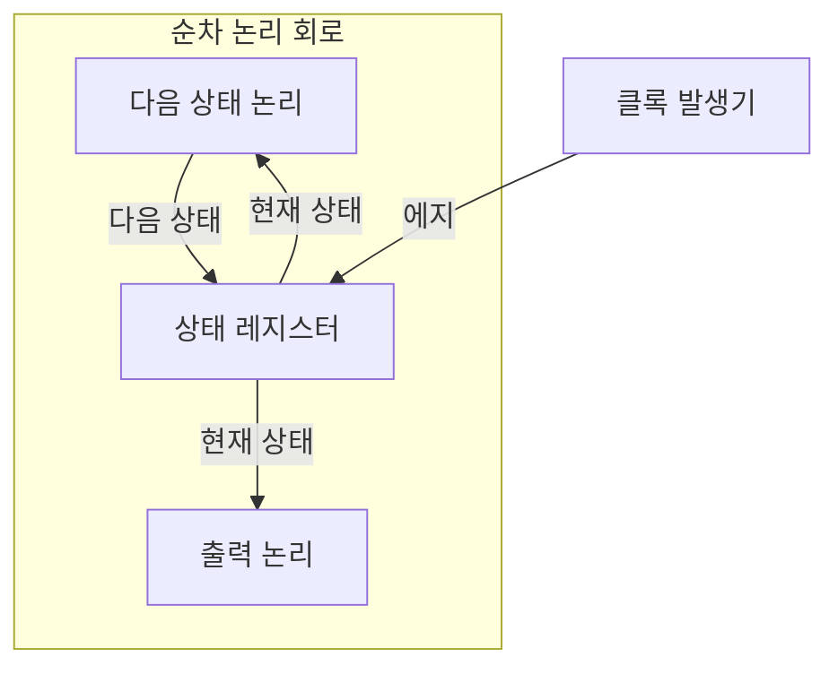
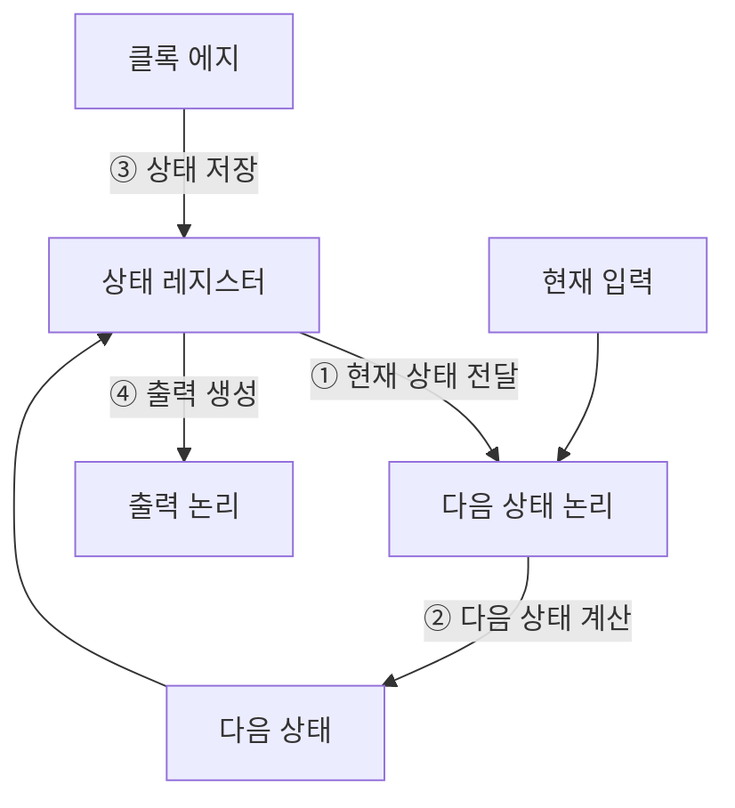
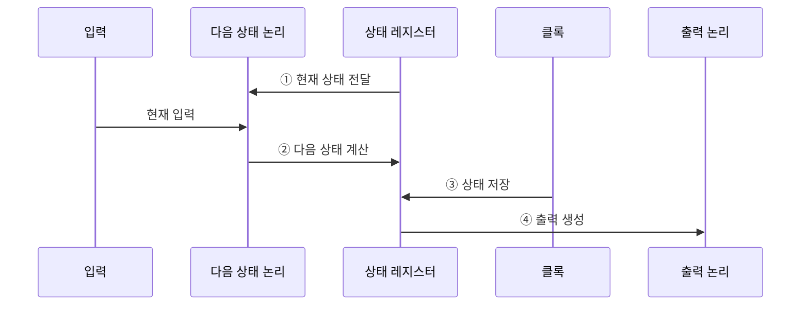

---
sidebar:
  order: 27
  label: "027. 순차 논리 회로 — 플립플롭·레지스터 (Sequential Logic)"
  badge:
    text: "미출 · 30%"
    variant: note
title: "순차 논리 회로 — 플립플롭·레지스터 (Sequential Logic)"
date: "2026-07-28T20:40:00+09:00"
tags:
  - "notes-basic-theory"
weight: 27
extra:
  question_no: "027"
  source_status: "미출"
  source_history: ""
  priority: 30
  priority_note: "상태·클록·플립플롭을 묶는 기본 회로 주제"
---

## 미리 알고가기

- **순차 논리 회로(Sequential Logic Circuit)**: 현재 입력과 저장 상태로 다음 상태와 출력을 결정하는 회로
- **플립플롭(Flip-Flop)**: 클록 에지에서 1비트를 받아 저장하는 기억 소자
- **유한 상태 머신(Finite State Machine, FSM)**: 현재 상태와 입력으로 다음 상태와 출력을 정하는 모델
- **셋업·홀드 시간(Setup and Hold Time)**: 클록 에지 전후 데이터의 최소 안정 시간
- **메타안정성(Metastability)**: 타이밍 위반으로 출력이 0·1 사이에 머무는 현상
- **클록 스큐(Clock Skew)**: 같은 클록이 레지스터마다 다르게 도달하는 편차
- **정적 타이밍 분석(Static Timing Analysis, STA)**: 경로별 셋업·홀드 여유에 따른 클록 제약 검증
- **클록 도메인 교차(Clock Domain Crossing, CDC)**: 서로 다른 클록 영역 간 신호 전달
- **동기화기(Synchronizer)**: 다단 플립플롭으로 단일 비트 CDC 위험을 낮추는 회로
- **조합 논리 회로(Combinational Logic Circuit)**: 저장 상태 없이 현재 입력만으로 출력을 정하는 회로
- **카운터(Counter)**: 클록마다 정해진 순서로 상태값을 증가·감소시키는 순차 회로
- **파이프라인(Pipeline)**: 연산 단계를 레지스터로 나눠 여러 입력을 겹쳐 처리하는 구조
- **전파 지연·글리치**: 전파 지연은 입력 변화가 출력에 닿는 시간이고 글리치는 경로 지연 차이로 생기는 순간 오출력임
- **동기 회로(Synchronous Circuit)**: 공통 클록 에지에 맞춰 상태를 저장·갱신하는 회로

## Ⅰ. 개요

- 정의/개념: 현재 입력과 **저장 상태**로 다음 상태를 정하는 **순차 회로**
- 기존 한계: 조합 논리는 **입력 이력**을 남기지 못해 순서 제어 불가

### 쉽게 이해하기 (학습용)

- 신호등처럼 현재 단계를 저장하고 클록마다 다음 상태로 전환해 순서가 있는 동작을 만든다.

## Ⅱ. 특징

- **상태 피드백**으로 같은 입력에도 다른 출력 산출
- **클록 에지** 단위 상태 갱신으로 처리 단계 **동기화**
- **셋업·홀드 시간**·**클록 스큐**가 좌우하는 동작 주파수

### 쉽게 이해하기 (학습용)

- 상태 피드백으로 입력 이력을 반영하며 클록 에지 주변의 데이터 안정 시간이 동작 속도를 제한한다.

## Ⅲ. 아키텍처

**도표안 A — 구조도**

**도표안 B — 동작 흐름도**

**도표안 C — sequenceDiagram**

| 구성요소 | 책임 |
|:---|:---|
| 다음 상태 논리 | 현재 상태·입력에서 **다음 상태** 산출 |
| 상태 레지스터 | **플립플롭** 묶음으로 **클록 에지**에 상태 보관 |
| 출력 논리 | 상태·입력 기반 **외부 출력** 생성 |

**동작 원리**

- **① 현재 상태 전달**: 레지스터의 저장 상태를 조합 논리에 제공
- **② 다음 상태 계산**: 현재 입력·상태로 다음 상태 결정
- **③ 상태 저장**: 클록 에지에서 다음 상태를 레지스터에 반영
- **④ 출력 생성**: 갱신 상태와 입력으로 외부 신호 산출

### 쉽게 이해하기 (학습용)

- 다음 상태 논리가 값을 계산하고 상태 레지스터가 클록 에지에 저장하며 출력 논리가 외부 신호를 만든다.

## Ⅳ. 종류 및 비교

| 논리 회로 | 순차 논리 회로 | 조합 논리 회로 |
|:---|:---|:---|
| 적용 기준 | 출력이 **과거 입력**에 의존할 때 | 출력이 **클록** 없이 즉시 확정될 때 |
| 핵심 특징 | **저장 상태**와 입력으로 출력 결정 | 현재 입력의 **부울 함수**로 출력 결정 |
| 한계 | 타이밍 위반 시 **메타안정성** | 경로 지연 차의 **글리치** |

### 쉽게 이해하기 (학습용)

- 순차 논리는 상태와 타이밍, 조합 논리는 현재 입력과 경로 지연이 핵심이다.

## Ⅴ. 실무 고려사항 및 대책

| 고려사항 | 대책 | 효과 |
|:---|:---|:---|
| 셋업 시간 부족 | 조합 경로 단축·클록 주기 확대 | 정상 상태 저장 |
| 홀드 시간 부족 | 데이터 경로 지연 버퍼 삽입 | 같은 에지 값 덮어쓰기 방지 |
| CDC의 메타안정성 | 단일 비트 다단 동기화기 | 불안정 상태 전파 확률 감소 |
| 클록 스큐의 타이밍 여유 감소 | 클록 트리 합성·STA 검증 | 레지스터 간 에지 편차 완화 |
| 프로세서 동기 경로 | 경로별 최대·최소 지연 STA | 셋업·홀드 위반 식별 |

### 쉽게 이해하기 (학습용)

- 셋업·홀드 여유와 클록 스큐, CDC 경로를 분리해 검증해야 한다.

## Ⅵ. 결론

- 과거 입력 의존이면 순차 논리, **STA·CDC** 통과 후 클록 주기 확정

### 쉽게 이해하기 (학습용)

- 동기 경로는 STA, 다른 클록의 단일 비트는 동기화기로 보호한다.
