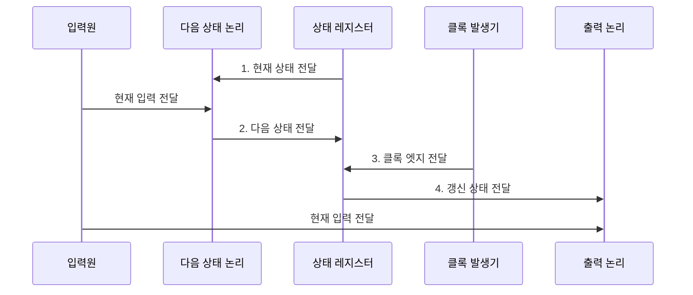

---
sidebar:
  order: 27
  label: "027. 순차 논리 회로: 플립플롭•레지스터 (Sequential Logic)"
  badge:
    text: "미출 • 30%"
    variant: note
title: "순차 논리 회로: 플립플롭•레지스터 (Sequential Logic)"
date: "2026-08-02T09:45:00+09:00"
tags:
  - "notes-basic-theory"
weight: 27
extra:
  question_no: "027"
  source_status: "미출"
  source_history: ""
  priority: 30
  priority_note: "상태•클록•플립플롭을 묶는 기본 회로 주제"
---

## Ⅰ. 개요

핵심 용어

- **순차 논리 회로(Sequential Logic Circuit)**: 현재 입력과 저장 상태로 다음 상태와 출력을 결정하는 회로
- **저장 상태**: 과거 입력의 처리 결과를 레지스터에 보존한 내부 정보

- 정의/개념: **순차 논리 회로**는 현재 입력과 레지스터에 저장된 과거 상태로 다음 상태와 출력을 결정하는 **상태 기반 디지털 회로**
- 배경/필요성: 조합 회로만으로는 입력 이력 기반 **상태 전이 불가**

#### 한줄 요약

- 신호등처럼 현재 단계를 저장하고 클록마다 다음 상태로 전환해 순서가 있는 동작을 만든다.

## Ⅱ. 특징

핵심 용어

- **유한 상태 머신(Finite State Machine, FSM)**: 현재 상태와 입력으로 다음 상태와 출력을 정하는 모델
- **클록 엣지**: 플립플롭이 입력을 받아 상태를 갱신하는 클록 신호의 변화 시점
- **셋업•홀드 시간**: 클록 엣지 전후에 데이터가 안정돼 있어야 하는 최소 시간
- **클록 스큐(Clock Skew)**: 같은 클록이 각 레지스터에 도달하는 시각의 편차
- **상태 전이(State Transition)**: 현재 상태와 입력에 따라 다음 상태로 바뀌는 관계
- **동기화(Synchronization)**: 여러 순차 회로가 같은 클록 엣지에 맞춰 상태를 갱신하는 방식
- **동작 주파수**: 회로가 1초 동안 수행하는 클록 주기의 수

- 현재 상태•입력의 **FSM 전이**로 같은 입력에도 다른 출력 산출
- **클록 엣지** 단위 상태 갱신으로 처리 단계 **동기화**
- **셋업•홀드 시간**과 **클록 스큐**가 제한하는 동작 주파수

#### 한줄 요약

- 신호등 제어기가 현재 색을 되먹임해 같은 버튼에도 다음 색을 달리 정하고, 종이 울리는 클록 엣지 전후에는 상태 입력이 흔들리지 않아야 한다.

## Ⅲ. 구조 및 구성요소

핵심 용어

- **플립플롭(Flip-Flop)**: 클록 엣지에서 1비트를 받아 저장하는 기억 소자
- **상태 레지스터**: 여러 플립플롭으로 FSM의 현재 상태를 저장하는 구성요소
- **다음 상태 논리**: 현재 상태와 입력을 조합해 다음 클록에 저장할 상태를 계산하는 회로

| 구성요소 | 책임 |
|:---|:---|
| 다음 상태 논리 | 현재 상태•입력에서 **다음 상태** 산출 |
| 상태 레지스터 | 플립플롭으로 **클록 엣지**에 상태 저장 |
| 출력 논리 | 상태•입력 기반 **외부 출력** 생성 |
| 클록 발생기 | 상태 저장 시점의 **클록 엣지** 공급 |

#### 한줄 요약

- 다음 상태 논리가 전이값을 계산하고, 상태 레지스터가 클록 엣지에 저장한 뒤 출력 논리가 외부 신호를 만든다.

## Ⅳ. 흐름도

핵심 용어

- **현재 상태•다음 상태**: 지금 레지스터에 저장된 값과 다음 클록 엣지에 저장할 계산값
- **클록 발생기**: 상태 갱신 시점을 맞추는 주기적인 클록 신호를 공급하는 회로
- **출력 논리**: 현재 상태와 입력으로 외부에 전달할 신호를 생성하는 회로
- **클록 엣지**: 상태 레지스터가 입력값을 받아 저장하는 클록 신호의 변화 시점

### 동작 원리

- **1. 현재 상태 전달**: 다음 상태 계산의 입력 제공
- **2. 다음 상태 전달**: 다음 클록의 전이값 제공
- **3. 클록 엣지 전달**: 계산된 다음 상태 저장
- **4. 갱신 상태 전달**: 상태•입력으로 외부 출력 생성

#### 한줄 요약

- 신호등 규칙표가 현재 색과 센서 입력으로 다음 색을 계산하면, 레지스터가 클록 종에 맞춰 저장하고 출력 논리가 실제 등을 켠다.

## Ⅴ. 종류 및 비교

핵심 용어

- **순차 논리 회로**: 저장 상태와 현재 입력을 함께 사용해 출력을 결정하는 회로
- **조합 논리 회로**: 기억 소자 없이 현재 입력의 부울 함수만으로 출력을 정하는 회로
- **메타안정성(Metastability)**: 타이밍 위반으로 플립플롭 출력이 일정 시간 0과 1 사이에 머무는 현상
- **글리치(Glitch)**: 조합 경로 지연 차이로 순간 발생하는 잘못된 출력

| 논리 회로 | 순차 논리 회로 | 조합 논리 회로 |
|:---|:---|:---|
| 적용 기준 | 출력이 **과거 입력**에 의존할 때 | 출력이 **클록** 없이 즉시 확정될 때 |
| 핵심 특징 | **저장 상태**와 입력으로 출력 결정 | 현재 입력의 **부울 함수**로 출력 결정 |
| 한계 | 타이밍 위반 시 **메타안정성** | 경로 지연 차의 **글리치** |

#### 한줄 요약

- 이전 상태를 기억하는 신호등은 순차 논리, 현재 스위치만 보는 전등은 조합 논리다.

## Ⅵ. 실무 고려사항 및 대책

핵심 용어

- **CDC(Clock Domain Crossing)**: 서로 다른 클록 영역 사이에서 신호를 전달하는 과정
- **동기화기(Synchronizer)**: 다단 플립플롭으로 단일 비트 CDC의 메타안정성 전파 확률을 낮추는 회로
- **정적 타이밍 분석(STA)**: 모든 경로의 셋업•홀드 여유가 클록 제약을 만족하는지 계산하는 검증
- **지연 버퍼**: 데이터 도착을 늦춰 홀드 시간 위반을 완화하는 회로
- **클록 주기**: 연속한 클록 엣지 사이의 시간 간격
- **클록 트리 합성(Clock Tree Synthesis)**: 각 레지스터에 클록이 비슷한 시각에 도달하도록 배선과 버퍼를 구성하는 작업
- **타이밍 여유(Timing Slack)**: 요구 시간과 실제 신호 도착 시간 사이에 남은 여유

| 문제 | 대책 | 효과 |
|:---|:---|:---|
| **셋업 시간** 부족 | 조합 경로 단축•**클록 주기** 확대 | 정상 **상태 저장** |
| **홀드 시간** 부족 | 데이터 경로에 **지연 버퍼** 삽입 | 같은 에지의 **값 덮어쓰기** 방지 |
| CDC의 **메타안정성** | 단일 비트 **다단 동기화기** | 불안정 상태의 **전파 확률** 감소 |
| **클록 스큐**로 타이밍 여유 감소 | 클록 트리 합성•**STA 검증** | 레지스터 간 **에지 편차** 감소 |

#### 한줄 요약

- 클록 종 직전•직후에 데이터가 흔들리지 않게 셋업•홀드 여유를 확보하고, 다른 박자의 신호는 다단 동기화기로 천천히 넘긴다.

## Ⅶ. 결론

핵심 용어

- **이력 의존**: 현재 출력이 현재 입력뿐 아니라 이전에 저장한 상태에도 영향을 받는 성질
- **단일 비트 CDC**: 서로 다른 클록 영역 사이로 한 비트의 제어 신호를 전달하는 과정
- **정적 타이밍 분석(STA)**: 모든 레지스터 경로의 셋업•홀드 시간 충족 여부를 계산하는 검증
- **동기화기(Synchronizer)**: 다단 플립플롭으로 CDC 신호의 메타안정성 전파 확률을 낮추는 회로
- **메타안정성(Metastability)**: 타이밍 위반으로 플립플롭 출력이 일정 시간 0과 1 사이에 머무는 현상

- 이력 의존은 **순차 회로**, 단일 비트 CDC는 **동기화기** 적용

#### 한줄 요약

- 같은 클록을 쓰는 레지스터 길은 STA로 도착 시간을 확인하고, 다른 클록에서 건너온 단일 비트는 동기화기로 메타안정성 전파를 낮춘다.
