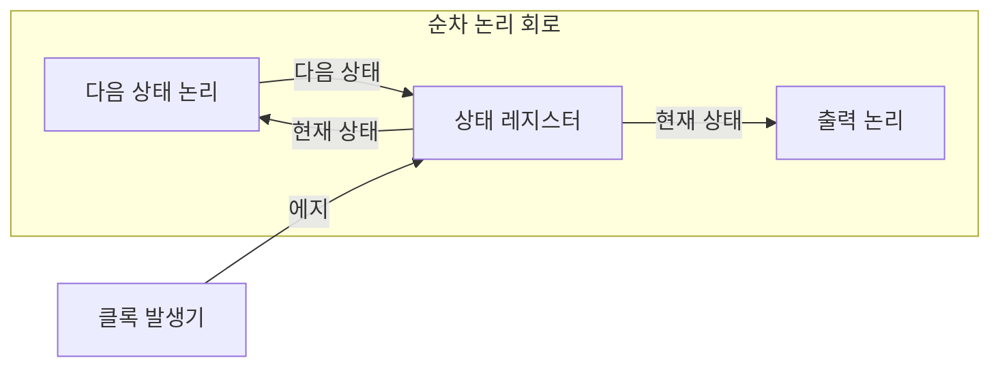
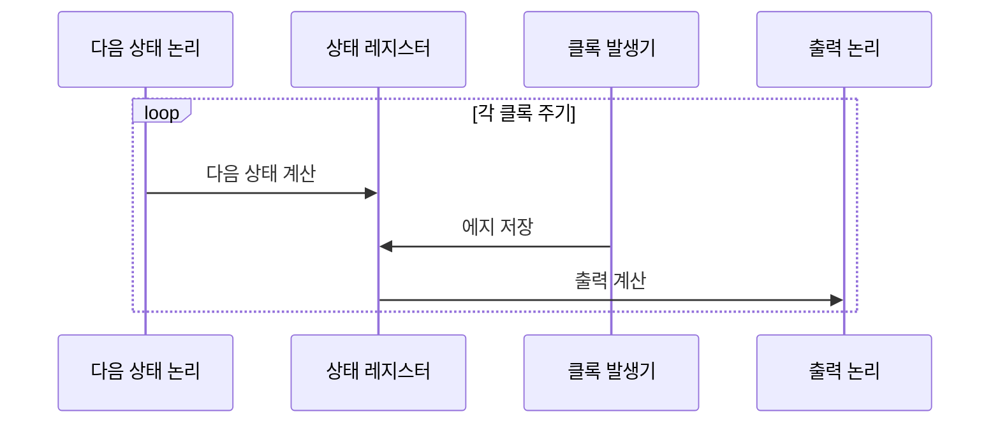

---
sidebar:
  order: 27
  label: "027. 순차 논리 회로 — 플립플롭·레지스터 (Sequential Logic)"
  badge:
    text: "미출제 · 30%"
    variant: note
title: "순차 논리 회로 — 플립플롭·레지스터 (Sequential Logic)"
date: "2026-07-26T22:16:20+09:00"
tags:
  - "notes-basic-theory"
weight: 27
extra:
  question_no: "027"
  source_status: "미출제"
  source_history: ""
  priority: 30
  priority_note: "상태·클록·플립플롭을 묶는 기본 회로 주제"
---

## 미리 알고가기

- **순차 논리 회로(Sequential Logic Circuit)**: 현재 입력과 저장 상태로 다음 상태와 출력을 결정하는 회로
- **플립플롭(Flip-Flop)**: 클록이 0에서 1로 바뀌는 가장자리 그 순간에만 1비트를 받아 저장하는 기억 소자이며, 클록이 1인 동안 내내 입력을 따라가는 래치와 달리 값이 바뀌는 시점이 한 점으로 못 박혀 타이밍 계산이 쉽다
- **유한 상태 머신(Finite State Machine, FSM)**: 현재 상태와 입력으로 다음 상태와 출력을 정하는 모델
- **셋업·홀드 시간(Setup and Hold Time)**: 클록 에지 전후 데이터의 최소 안정 시간
- **메타안정성(Metastability)**: 타이밍 위반으로 출력이 0·1 사이에 머무는 현상
- **클록 스큐(Clock Skew)**: 같은 클록이 레지스터마다 다르게 도달하는 편차
- **정적 타이밍 분석(Static Timing Analysis, STA)**: 경로별 셋업·홀드 여유에 따른 클록 제약 검증
- **클록 도메인 교차(Clock Domain Crossing, CDC)**: 서로 다른 클록 영역 간 신호 전달
- **동기화기(Synchronizer)**: 다단 플립플롭으로 단일 비트 CDC 위험을 낮추는 회로
- **조합 논리 회로(Combinational Logic Circuit)**: 저장 상태 없이 현재 입력만으로 출력을 정하는 회로
- **카운터(Counter)**: 클록마다 정해진 순서로 상태값을 증가·감소시키는 순차 회로
- **파이프라인(Pipeline)**: 연산 단계를 레지스터로 나눠 여러 입력을 겹쳐 처리하는 구조
- **전파 지연·글리치**: 전파 지연은 입력 변화가 출력에 닿는 시간이고 글리치는 경로 지연 차이로 생기는 순간 오출력임
- **동기 회로(Synchronous Circuit)**: 공통 클록 에지에 맞춰 상태를 저장·갱신하는 회로

## Ⅰ. 개요

- 정의/개념: 현재 입력과 **저장 상태**로 다음 상태를 정하는 **순차 회로**
- 기존 한계: 조합 논리는 **입력 이력**을 남기지 못해 순서 제어 불가

### 쉽게 이해하기 (학습용)

- 사거리 신호등은 지금이 빨강인지 초록인지를 스스로 붙들고 있다가 정해진 박자가 올 때만 다음 색으로 넘어가는데, 기억하는 칸이 없다면 똑같은 센서 신호에도 어느 색으로 가야 할지 정할 수 없으므로 순서가 있는 동작을 만들려면 지나온 이력을 상태로 저장해 두어야 한다

## Ⅱ. 특징

- **상태 피드백**으로 같은 입력에도 다른 출력 산출
- **클록 에지** 단위 상태 갱신으로 처리 단계 **동기화**
- **셋업·홀드 시간**·**클록 스큐**가 좌우하는 동작 주파수

### 쉽게 이해하기 (학습용)

- 순차 회로는 방금 저장한 값을 다시 자기 입력으로 되돌려 쓰므로 똑같은 버튼을 눌러도 지금이 몇 번째 단계인지에 따라 다른 결과가 나오고, 그 저장은 아무 때나가 아니라 박자의 가장자리에서만 일어나기 때문에 데이터가 그 순간 앞뒤로 잠시 가만히 있어야 하며, 박자가 회로마다 조금씩 늦게 도착하면 그 여유가 깎여 더 느린 박자로 낮춰 돌려야 한다

## Ⅲ. 아키텍처 및 구성요소

| 설계 요소 | 설명 |
|:---|:---|
| 다음 상태 논리 | 현재 상태·입력에서 **다음 상태** 산출 |
| 상태 레지스터 | **플립플롭** 묶음으로 **클록 에지**에 상태 보관 |
| 출력 논리 | 상태·입력 기반 **외부 출력** 생성 |

> 요약: 계산은 **조합 논리**, 보관은 **상태 레지스터**가 담당

### 쉽게 이해하기 (학습용)

- 관제실을 떠올리면 벽에 걸린 현황판이 지금 상태를 붙들고 있고(상태 레지스터), 그 현황판과 새로 들어온 보고를 함께 보는 담당자가 다음에 걸 상태를 미리 계산해 손에 들고 있으며(다음 상태 논리), 또 다른 담당자가 현황판 값을 읽어 밖으로 내보낼 안내 방송을 만드는데(출력 논리), 현황판이 바뀌는 것은 오직 벽시계 종이 울리는 순간뿐이다

## Ⅳ. 원리 및 절차 흐름도

| 절차 | 설명 |
|:---|:---|
| 다음 상태 계산 | 현재 상태·입력에서 **다음 상태** 확정 |
| 에지 저장 | **셋업·홀드** 충족 시에만 상태 갱신 |
| 출력 계산 | 갱신 상태·입력 기준 **출력 신호** 생성 |

> 요약: **클록 에지**마다 상태 갱신·출력 재계산 반복

### 쉽게 이해하기 (학습용)

- 담당자는 종이 울리기 한참 전에 다음에 걸 상태를 계산해 손에 들고 대기하다가 종이 울리는 그 순간에만 현황판을 바꿔 걸고 바뀐 현황판을 보고 안내 방송을 다시 만드는데, 손에 든 값이 종소리 직전과 직후 잠깐이라도 흔들리면 현황판에 반쪽짜리 값이 걸릴 수 있어 그 구간에는 값을 건드리지 않는다

## Ⅴ. 종류 및 비교

| 논리 회로 | 순차 논리 회로 | 조합 논리 회로 |
|:---|:---|:---|
| 적용 기준 | 출력이 **과거 입력**에 의존할 때 | 출력이 **클록** 없이 즉시 확정될 때 |
| 핵심 특징 | **저장 상태**와 입력으로 출력 결정 | 현재 입력의 **부울 함수**로 출력 결정 |
| 한계 | 타이밍 위반 시 **메타안정성** | 경로 지연 차의 **글리치** |

> 요약: 순서 기억이 필요하면 **순차 논리**, 즉시 계산이면 **조합 논리**

### 쉽게 이해하기 (학습용)

- 순차 논리는 지금까지 몇 번 눌렀는지를 붙들고 있는 계수기 같아서 박자를 지키지 못하면 기억이 0도 1도 아닌 어정쩡한 값으로 남는 사고가 나고, 조합 논리는 지금 눌린 것만 보는 계산기라 그런 기억 사고는 없지만 신호가 갈래마다 늦게 도착하는 사이 순간적으로 엉뚱한 값이 튄다

## Ⅵ. 실무 사례

1. 프로세서 동기 회로는 **정적 타이밍 분석**으로 **셋업·홀드** 검증
2. 단일 비트 **CDC** 신호는 2단 **동기화기** 경유

### 쉽게 이해하기 (학습용)

- 모든 경로에 실제 데이터를 흘려 보며 시험하는 대신 각 경로에서 신호가 가장 늦게·가장 이르게 도착하는 시각을 계산으로 뽑아 박자 안에 들어오는지 여유를 따지고, 여유가 마이너스로 나온 경로만 골라 회로를 손본다
- 다른 박자로 도는 회로에서 넘어온 신호는 이쪽 박자와 어긋나 저장 순간에 걸리기 쉬운데, 저장 칸을 두 개 이어 붙여 두면 첫 칸에서 값이 어정쩡하게 흔들려도 다음 박자까지 가라앉을 시간이 생겨 두 번째 칸에는 0이나 1로 또렷해진 값만 남는다

## Ⅶ. 결론

- 동기 경로는 **STA**, 단일 비트 **CDC**는 동기화기 적용

### 쉽게 이해하기 (학습용)

- 같은 박자 안에서 도는 신호는 도착 시간을 계산으로 따져 통과시키고, 다른 박자에서 건너오는 신호는 저장 칸을 두 번 거치게 해 어정쩡한 값이 그대로 퍼지지 않게 한다
