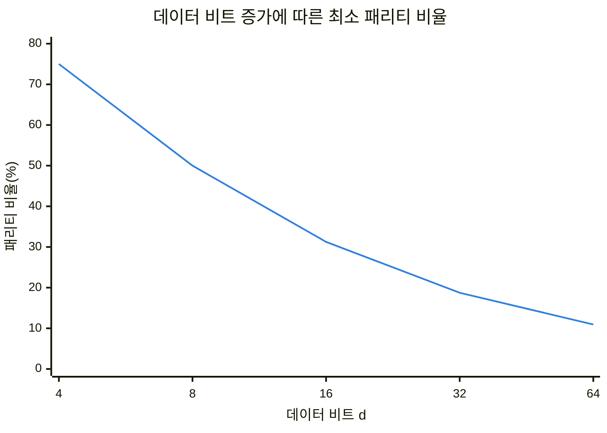
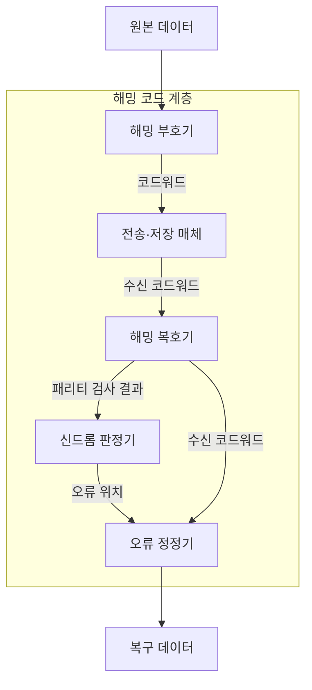
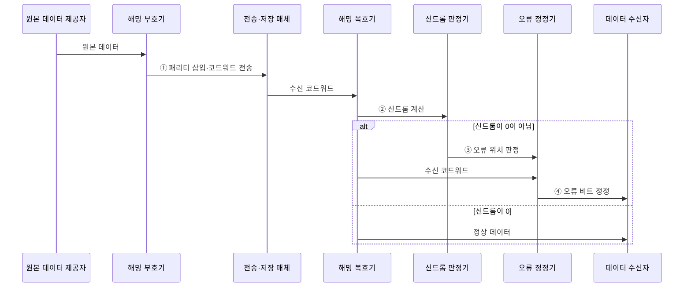

---
sidebar:
  order: 28
  label: "028. 해밍 코드·오류 검출·정정 (Hamming Code Error Detection and Correction)"
  badge:
    text: "기출 · 50%"
    variant: note
title: "해밍 코드·오류 검출·정정 (Hamming Code Error Detection and Correction)"
date: "2026-07-28T22:40:00+09:00"
tags:
  - "notes-basic-theory"
weight: 28
extra:
  question_no: "028"
  source_status: "기출"
  source_history: "125회"
  priority: 50
  priority_note: "계산형 기출의 명확한 오류 위치 산출 절차"
---

## 미리 알고가기

- **해밍 코드(Hamming Code)**: 패리티 검사 결과를 이진 위치값으로 조합해 한 비트 오류를 고치는 부호
- **오류 검출(Error Detection)**: 수신 데이터에 오류가 있는지 판별하는 처리
- **오류 정정(Error Correction)**: 오류 위치를 식별해 원본 데이터를 복구하는 처리
- **패리티 비트(Parity Bit)**: 데이터 비트 검사용으로 덧붙이는 비트
- **패리티 그룹(Parity Group)**: 특정 패리티 비트가 검사하도록 이진 위치값의 해당 자리가 1인 코드워드 위치를 묶은 집합
- **코드워드(Codeword)**: 데이터·패리티를 묶은 저장·전송 단위
- **신드롬(Syndrome)**: 패리티 재검사 결과를 조합해 얻는 단일 오류 위치 값
- **해밍 거리(Hamming Distance)**: 길이가 같은 두 비트열에서 값이 다른 자리의 개수
- **단일 오류 정정·이중 오류 검출(Single Error Correction, Double Error Detection, SECDED)**: 한 비트 오류는 정정하고 두 비트 오류는 검출할 수 있도록 패리티를 구성하는 방식
- **단일 오류 정정(Single Error Correction, SEC)**: 하나의 코드워드에서 발생한 단일 비트 오류의 위치를 식별하여 정정하는 능력
- **순환 중복 검사(Cyclic Redundancy Check, CRC)**: 생성 다항식으로 계산한 나머지를 이용하여 전송 데이터의 버스트 오류를 검출하는 방식
- **오류 정정 부호(Error-Correcting Code, ECC)**: 중복 비트를 추가하여 저장·전송 과정의 오류를 검출하고 정정하는 부호
- **메모리 스크러빙(Memory Scrubbing)**: 주기적 읽기·정정을 통한 오류 누적 방지
- **잠복 오류(Latent Error)**: 즉시 드러나지 않은 채 저장장치에 남아 이후 다른 오류와 겹칠 수 있는 손상
- **인터리빙(Interleaving)**: 연속 비트를 여러 코드워드에 분산 배치해 버스트 오류를 단일 오류들로 흩는 기법
- **데이터·패리티 수($d$, $p$)**: 코드워드의 데이터 비트 수와 패리티 비트 수
- **패리티 수 조건 $2^p \geq d+p+1$**: 모든 비트 오류 위치와 정상 상태를 구분하는 최소 패리티 수 조건
- **버스트 오류(Burst Error)**: 연속된 구간에서 여러 비트가 함께 손상되는 오류
- **오버헤드(Overhead)**: 원본 데이터 외에 오류 검출·정정을 위해 추가되는 비트와 처리 비용
- **부호기·복호기(Encoder·Decoder)**: 부호기는 패리티를 붙여 코드워드를 만들고 복호기는 신드롬으로 오류를 판정·정정함

## Ⅰ. 개요

- 정의/개념: **패리티 조합**으로 오류 위치를 찾는 **단일 오류 정정** 부호
- 기존 한계: **재전송 불가** 구간에서는 **오류 검출**만으로 복구 불가

### 쉽게 이해하기 (학습용)
- 재전송이 어려운 구간에서 겹치는 패리티 결과로 뒤집힌 비트 하나를 찾아 복구한다.

## Ⅱ. 특징

- **신드롬** 이진값이 그대로 **오류 비트 위치** 지시
- **최소 해밍 거리** 3 확보로 **단일 오류 정정**
- 전체 **패리티 비트** 추가 시 **SECDED** 확장

> 데이터가 늘수록 **패리티 오버헤드** 비율 감소

| 계열 | 수식·의미 |
|:---|:---|
| 파랑 · 1계열 | $2^p \ge d+p+1$을 만족하는 최소 $p$의 데이터 대비 비율 |

### 쉽게 이해하기 (학습용)
- 신드롬은 오류 위치를 가리키며 전체 패리티를 더하면 이중 오류를 구분할 수 있다.

## Ⅲ. 아키텍처

**도표안 A — 구조도**

**도표안 B — sequenceDiagram**

| 구성요소 | 책임 |
|:---|:---|
| 해밍 부호기 | 이진 자리값별 **패리티 그룹** 값 산출·삽입 |
| 전송·저장 매체 | **비트 반전 오류**가 유입되는 구간 |
| 해밍 복호기 | 재검사 결과를 모은 **신드롬**으로 위치 판정 |
| 신드롬 판정기 | 신드롬 0·비0으로 **정상·오류 위치** 구분 |
| 오류 정정기 | 신드롬 위치의 비트를 반전하고 **원본 데이터** 추출 |

> 비트 배치: 패리티는 1·2·4·8… 위치에 삽입
>
> 패리티 수 조건: $2^p \geq d+p+1$
>
**동작 원리**

- **① 패리티 삽입·코드워드 전송**: 위치별 패리티를 계산해 원본 데이터와 함께 매체에 전달
- **② 신드롬 계산**: 수신 코드워드의 패리티를 재검사해 결과 비트열 산출
- **③ 오류 위치 판정**: 0이 아닌 신드롬을 이진 위치값으로 해석
- **④ 오류 비트 정정**: 신드롬이 가리킨 한 비트를 반전하고 원본 데이터 추출

### 쉽게 이해하기 (학습용)
- 부호기는 패리티를 삽입하고 복호기는 신드롬으로 매체에서 뒤집힌 비트 위치를 찾는다.

## Ⅳ. 종류 및 비교

| 오류 검출·정정 부호 | 해밍 코드(SEC) | SECDED | CRC |
|:---|:---|:---|:---|
| 적용 기준 | 1비트 오류 위주이고 **오버헤드**를 줄일 때 | 2비트 검출까지 요구하는 **ECC 메모리** | 검출만으로 충분한 **패킷 전송** 구간 |
| 핵심 특징 | **신드롬** 기반 1비트 정정 | **전체 패리티** 추가로 2비트 검출 | **다항식 나머지** 기반 검출 |
| 한계 | 2비트 오류를 **오정정**해 손상 확대 | 3비트 이상 오류 **검출·정정 미보장** | **정정 불가**로 재전송 지연 |

### 쉽게 이해하기 (학습용)
- 단일 오류 정정은 SEC, 이중 오류 검출은 SECDED, 버스트 검출은 CRC가 적합하다.

## Ⅴ. 실무 고려사항 및 대책

| 고려사항 | 대책 | 효과 |
|:---|:---|:---|
| SEC의 **이중 오류 오정정** | 전체 패리티를 추가한 **SECDED** | 이중 오류 검출·**오정정 방지** |
| **잠복 단일 오류** 누적 | 주기적 **메모리 스크러빙** | **다중 오류** 발전 방지 |
| 데이터 증가의 **패리티 부족** | $2^p \geq d+p+1$ **재계산** | 모든 **단일 오류 위치** 식별 |
| **버스트 오류**에 단독 적용 | **인터리빙**으로 연속 오류 분산 | **단일 오류 정정** 범위 회복 |

### 쉽게 이해하기 (학습용)
- 오류 유형과 누적 가능성에 맞춰 SECDED·스크러빙·CRC를 함께 적용한다.

## Ⅵ. 결론

- 단일 정정은 **SEC**, 이중 검출은 **SECDED**, 버스트 오류는 CRC 병행

### 쉽게 이해하기 (학습용)
- 현장 정정 여부와 예상 오류 패턴에 따라 SEC·SECDED·CRC를 선택한다.
