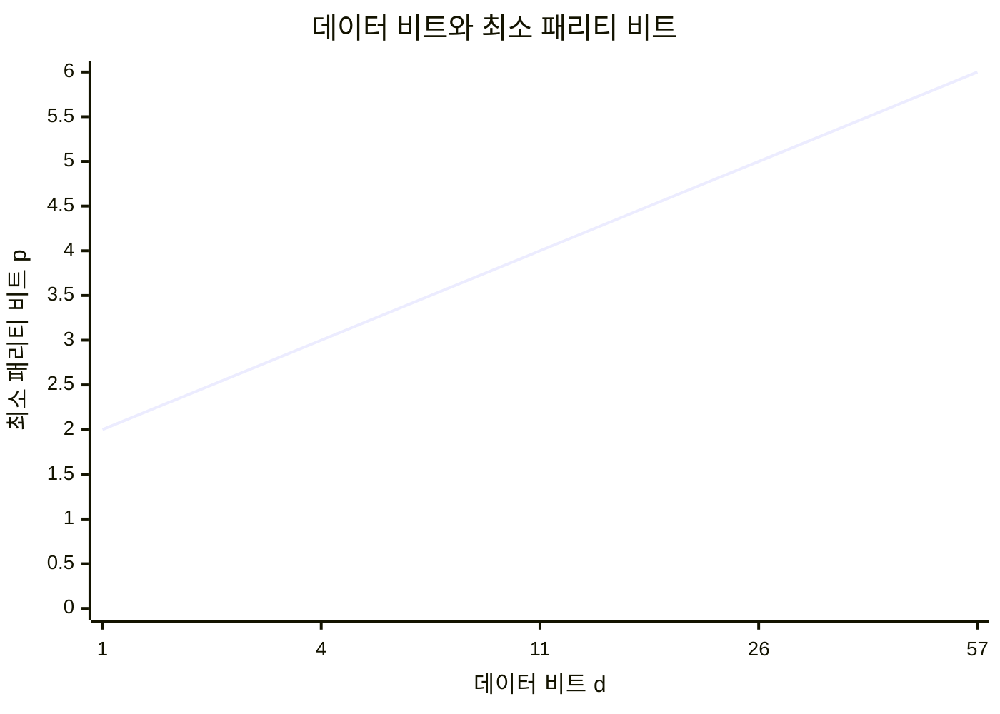
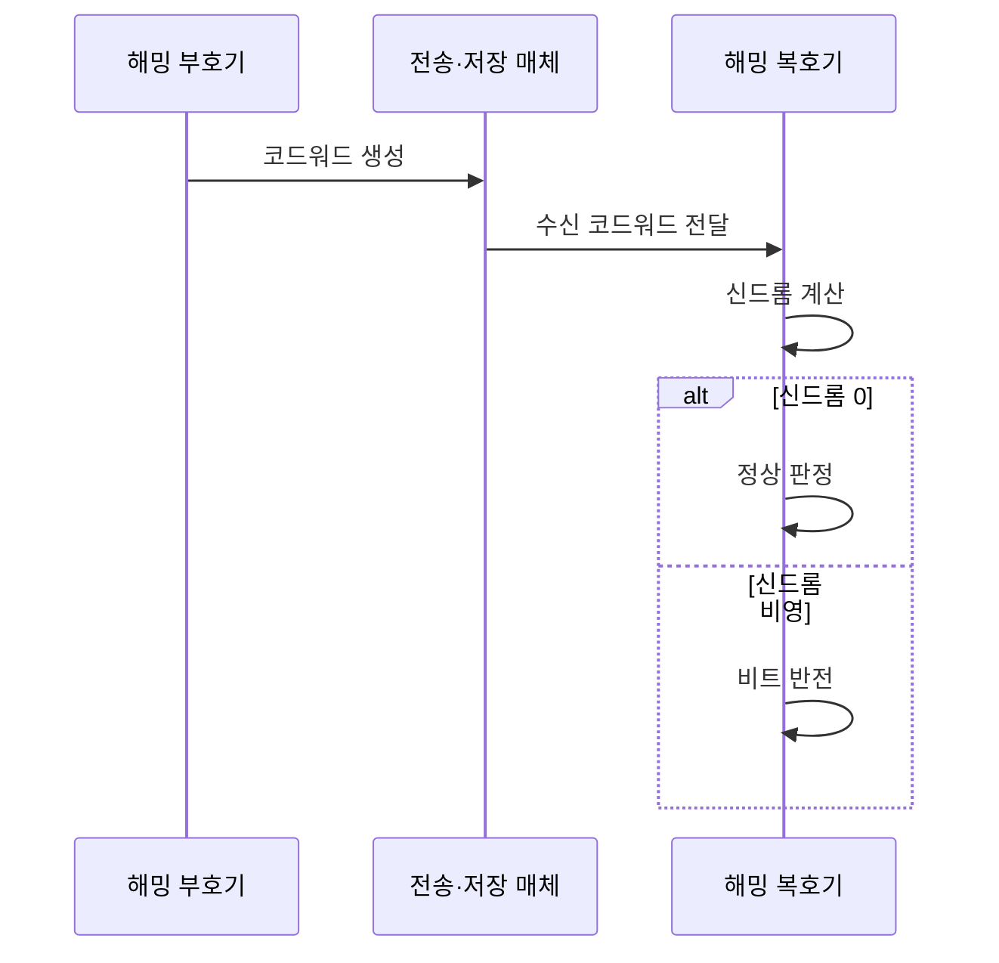

---
sidebar:
  order: 28
  label: "028. 해밍 코드·오류 검출·정정 (Hamming Code Error Detection and Correction)"
  badge:
    text: "기출 · 50%"
    variant: note
title: "해밍 코드·오류 검출·정정 (Hamming Code Error Detection and Correction)"
date: "2026-07-27T21:56:00+09:00"
tags:
  - "notes-basic-theory"
weight: 28
extra:
  question_no: "028"
  source_status: "기출"
  source_history: "125회"
  priority: 50
  priority_note: "계산형 기출의 명확한 오류 위치 산출 절차"
---

## 미리 알고가기

- **해밍 코드(Hamming Code)**: 소포의 여러 겹 점검표가 어긋난 번호를 합쳐 손상 칸을 찾듯, 패리티 검사 결과를 이진 위치값으로 조합해 한 비트 오류를 고치는 부호
- **오류 검출(Error Detection)**: 수신 데이터에 오류가 있는지 판별하는 처리
- **오류 정정(Error Correction)**: 오류 위치를 식별해 원본 데이터를 복구하는 처리
- **패리티 비트(Parity Bit)**: 데이터 비트 검사용으로 덧붙이는 비트
- **코드워드(Codeword)**: 데이터·패리티를 묶은 저장·전송 단위
- **신드롬(Syndrome)**: 패리티 재검사 결과를 조합해 얻는 단일 오류 위치 값
- **해밍 거리(Hamming Distance)**: 길이가 같은 두 비트열을 자리마다 맞대어 서로 다른 자리의 개수를 센 값이며, 한 부호에 속한 코드워드끼리의 최소 해밍 거리가 3이면 어느 한 비트가 뒤집혀도 원래 코드워드가 여전히 가장 가까워 그 자리를 특정해 되돌릴 수 있다
- **단일 오류 정정·이중 오류 검출(Single Error Correction, Double Error Detection, SECDED, 섹디드)**: 두 기능명의 머리글자를 결합한 공식 약어로, 한 비트 오류를 정정하고 두 비트 오류를 검출하는 방식
- **단일 오류 정정(Single Error Correction, SEC, 에스이시)**: 영문명의 머리글자를 조합한 공식 약어로, 한 코드워드에서 한 비트 오류의 위치를 찾아 고치는 능력
- **순환 중복 검사(Cyclic Redundancy Check, CRC, 씨알씨)**: 영문명의 머리글자를 조합한 공식 약어로, 다항식 나머지를 이용해 버스트 오류를 검출하는 방식
- **오류 정정 부호(Error-Correcting Code, ECC, 이씨씨)**: 영문명의 머리글자를 조합한 공식 약어로, 중복 비트를 이용해 저장·전송 오류를 검출·정정하는 부호
- **메모리 스크러빙(Memory Scrubbing)**: 주기적 읽기·정정을 통한 오류 누적 방지
- **데이터·패리티 수($d$, $p$)**: 각각 ‘소문자 디·소문자 피’로 읽고 data·parity의 머리글자를 개수 변수에 쓴 표기이며, 코드워드의 데이터 비트 수와 패리티 비트 수를 가리킨다.
- **패리티 수 조건 $2^p \geq d+p+1$**: ‘이의 피 승은 디 더하기 피 더하기 일보다 크거나 같다’로 읽고 위첨자는 거듭제곱·$\geq$는 이상 관계를 나타내는 수학 관례이며, $p$개 검사 결과가 모든 비트 오류 위치와 정상 상태를 구분할 수 있는지를 판정한다.
- **버스트 오류(Burst Error)**: 연속된 구간에서 여러 비트가 함께 손상되는 오류
- **오버헤드(Overhead)**: 원본 데이터 외에 오류 검출·정정을 위해 추가되는 비트와 처리 비용
- **부호기·복호기(Encoder·Decoder)**: 부호기는 패리티를 붙여 코드워드를 만들고 복호기는 신드롬으로 오류를 판정·정정함

## Ⅰ. 개요

- 정의/개념: **패리티 조합**으로 오류 위치를 찾는 **단일 오류 정정** 부호
- 기존 한계: **재전송 불가** 구간에서는 **오류 검출**만으로 복구 불가

### 쉽게 이해하기 (학습용)
- 소포를 다시 받을 수 없는 곳에서는 여러 겹 점검표가 가리키는 번호를 합쳐 손상 칸을 찾듯, 해밍 코드는 겹치는 패리티 결과로 뒤집힌 비트 하나를 찾아 복구한다

## Ⅱ. 특징

- **신드롬** 이진값이 그대로 **오류 비트 위치** 지시
- **최소 해밍 거리** 3 확보로 **단일 오류 정정**
- 전체 **패리티 비트** 추가 시 **SECDED** 확장

> 데이터가 늘수록 **패리티 오버헤드** 비율 감소

### 쉽게 이해하기 (학습용)
- 소포 칸마다 이진 번호를 붙여 여러 겹 점검표로 검사하면 어긋난 표 번호의 합이 손상 칸을 가리키며, 전체 점검표를 하나 더 붙이면 두 칸 손상도 구분할 수 있다

## Ⅲ. 아키텍처 및 구성요소

| 설계 요소 | 설명 |
|:---|:---|
| 해밍 부호기 | 이진 자리값별 **패리티 그룹** 값 산출·삽입 |
| 전송·저장 매체 | **비트 반전 오류**가 유입되는 구간 |
| 해밍 복호기 | 재검사 결과를 모은 **신드롬**으로 위치 판정 |

> 비트 배치: 패리티는 1·2·4·8… 위치에 삽입
>
> 패리티 수 조건: $2^p \geq d+p+1$
>
> 요약: 비트마다 다른 **검사 조합**으로 오류 위치 결정

### 쉽게 이해하기 (학습용)
- 보내는 쪽 담당자가 데이터 사이사이 1·2·4번 자리에 점검용 비트를 끼워 넣어 봉투를 만들고(해밍 부호기), 그 봉투가 케이블이나 메모리 칩을 지나는 동안 어느 한 비트가 조용히 뒤집힐 수 있으며(전송·저장 매체), 받는 쪽 담당자가 점검표를 다시 맞춰 어긋난 표들의 번호를 모으면 그 값이 곧 뒤집힌 자리 번호가 된다(해밍 복호기)

## Ⅳ. 원리 및 절차 흐름도

| 절차 | 설명 |
|:---|:---|
| 코드워드 생성 | **패리티 그룹**별 검사 값 계산·삽입 |
| 수신 코드워드 전달 | 매체 통과 중 **비트 반전** 유입 가능 |
| 신드롬 계산 | 재검사 결과를 **이진 위치값**으로 조합 |
| 정상 판정 | 신드롬 0이면 **오류 없음** 확정 |
| 비트 반전 | 지시 위치의 **단일 비트** 정정 |

> 요약: **신드롬** 0은 통과, 비영이면 지시 위치 정정

### 쉽게 이해하기 (학습용)
- 보낼 때 붙인 점검표를 받는 쪽에서 그대로 다시 계산해 보고 모든 표가 원래 값과 맞으면 봉투를 그냥 통과시키지만, 어긋난 표가 하나라도 있으면 그 표들의 번호를 이진수로 이어 붙인 자리 딱 하나만 0과 1을 뒤집어 원래 값으로 되돌린다

## Ⅴ. 종류 및 비교

| 오류 검출·정정 부호 | 해밍 코드(SEC) | SECDED | CRC |
|:---|:---|:---|:---|
| 적용 기준 | 1비트 오류 위주이고 **오버헤드**를 줄일 때 | 2비트 검출까지 요구하는 **ECC 메모리** | 검출만으로 충분한 **패킷 전송** 구간 |
| 핵심 특징 | **신드롬** 기반 1비트 정정 | **전체 패리티** 추가로 2비트 검출 | **다항식 나머지** 기반 검출 |
| 한계 | 2비트 오류를 **오정정**해 손상 확대 | 3비트 이상 오류 **검출·정정 미보장** | **정정 불가**로 재전송 지연 |

> 요약: **SEC**의 2비트 오정정 문제를 **SECDED**가 검출 기능으로 보완

### 쉽게 이해하기 (학습용)
- 흠이 하나뿐이면 해밍 코드가 어느 칸인지 짚어 그 자리에서 고쳐 주지만 흠이 둘이면 엉뚱한 칸을 고쳐 오히려 데이터를 더 망가뜨리므로, 점검표를 한 장 더 얹은 SECDED는 "둘은 못 고치니 손대지 말고 알리라"까지 구분해 주고, 연속으로 길게 뭉개지는 흠은 아예 고치기를 포기하고 CRC로 빠르게 찾아내 다시 보내 달라고 요청한다

## Ⅵ. 실무 사례

1. **ECC 메모리**는 스크러빙으로 잠복 1비트 오류 주기적 정정

### 쉽게 이해하기 (학습용)
- 서버 메모리 칩은 우주선이나 전기적 잡음 탓에 비트 하나가 조용히 뒤집히곤 하는데, 읽을 때마다 점검표로 그 자리를 찾아 즉시 되돌리고 오래 읽히지 않는 영역은 따로 주기적으로 훑어 읽어 흠이 둘로 늘기 전에 미리 고쳐 둔다

## Ⅶ. 결론

- 전송 오류 복구를 위해 오류 유형을 검토하여 **해밍 코드** 활용

### 쉽게 이해하기 (학습용)
- 흠 하나를 그 자리에서 고쳐야 하는 메모리에는 해밍 코드를, 흠 둘까지 구분해 알려야 하는 서버 메모리에는 SECDED를, 다시 보내 달라고 요청할 수 있는 통신 구간에는 정정을 포기하고 CRC를 쓰는 식으로 고칠 것인가 알릴 것인가에 따라 부호를 고른다
