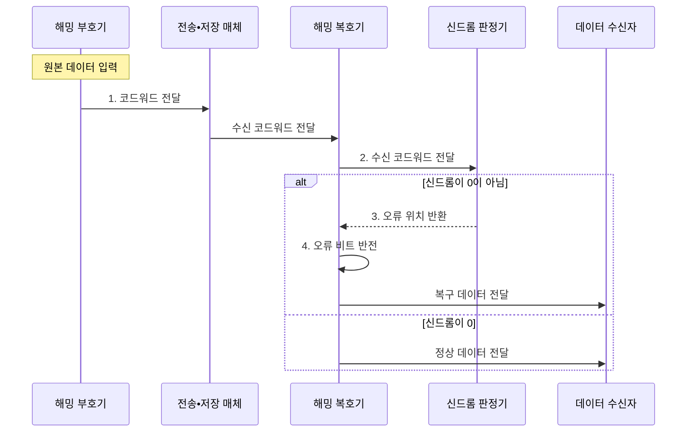

---
sidebar:
  order: 28
  label: "028. 해밍 코드•오류 검출•정정 (Hamming Code Error Detection and Correction)"
  badge:
    text: "기출 • 50%"
    variant: note
title: "해밍 코드•오류 검출•정정 (Hamming Code Error Detection and Correction)"
date: "2026-08-02T09:46:00+09:00"
tags:
  - "notes-basic-theory"
weight: 28
extra:
  question_no: "028"
  source_status: "기출"
  source_history: "125회"
  priority: 50
  priority_note: "계산형 기출의 명확한 오류 위치 산출 절차"
---

## Ⅰ. 개요

핵심 용어

- **해밍 코드(Hamming Code)**: 패리티 검사 결과를 이진 위치값으로 조합해 한 비트 오류를 고치는 부호
- **오류 정정 부호(ECC)**: 중복 비트를 추가해 저장•전송 과정의 오류를 검출하고 정정하는 부호

- 정의/개념: **패리티 조합**으로 단일 오류 위치를 판정•정정하는 오류 정정 부호
- 배경/필요성: 재전송 불가 구간의 **비트 오류 복구**

### 쉽게 이해하기 (학습용)

- 여러 검사원이 서로 다른 자리 묶음을 확인해 실패한 검사 번호를 합치면, 재전송 없이도 뒤집힌 비트 한 칸의 위치를 찾아 되돌릴 수 있다.

## Ⅱ. 특징

핵심 용어

- **신드롬(Syndrome)**: 패리티 재검사 결과를 조합해 얻는 단일 오류의 이진 위치값
- **해밍 거리(Hamming Distance)**: 길이가 같은 두 비트열에서 값이 다른 자리의 개수
- **SECDED**: 한 비트 오류는 정정하고 두 비트 오류는 검출하는 방식
- **패리티 오버헤드**: 원본 데이터 외에 오류 검사를 위해 추가되는 비트의 비율

> $2^p \ge d+p+1$을 만족하는 최소 $p$를 적용하면 데이터가 4→64비트로 늘 때 패리티 비율은 75%→10.94%로 감소한다.

- **신드롬** 이진값이 그대로 **오류 비트 위치** 지시
- **최소 해밍 거리** 3 확보로 **단일 오류 정정**
- 전체 **패리티 비트** 추가 시 **SECDED** 확장

> 데이터가 늘수록 **패리티 오버헤드** 비율 감소

### 쉽게 이해하기 (학습용)

- 1•2•4번 검사 결과인 신드롬이 오류 위치를 가리키고, 전체 패리티가 2비트 오류를 구분한다.

## Ⅲ. 구조 및 구성요소

핵심 용어

- **패리티 그룹**: 특정 패리티 비트가 검사하는 코드워드 위치의 집합
- **코드워드(Codeword)**: 데이터 비트와 패리티 비트를 묶은 저장•전송 단위
- **부호기•복호기**: 패리티를 붙여 코드워드를 만들고 신드롬으로 오류를 판정•정정하는 구성요소

| 구성요소 | 책임 |
|:---|:---|
| 해밍 부호기 | 자리값별 **패리티 그룹** 계산•삽입 |
| 전송•저장 매체 | **비트 반전 오류**가 유입되는 구간 |
| 해밍 복호기 | 오류 정정 후 **원본 데이터** 추출 |
| 신드롬 판정기 | 패리티 결과로 **오류 위치** 판정 |

### 쉽게 이해하기 (학습용)

- 부호기가 패리티를 붙이고, 복호기와 신드롬 판정기가 매체에서 바뀐 비트의 위치를 찾아 원본을 복구한다.

## Ⅳ. 흐름도

핵심 용어

- **패리티 위치**: 코드워드의 1•2•4•8처럼 2의 거듭제곱 자리에 배치하는 검사 비트 위치
- **$2^p \geq d+p+1$**: 데이터 $d$비트의 모든 오류 위치와 정상 상태를 구분하는 최소 패리티 $p$ 조건
- **오류 비트 반전**: 신드롬이 가리킨 비트를 뒤집어 원래 값으로 복구하는 정정 작업

> 비트 배치: 패리티는 1•2•4•8… 위치에 삽입
>
> 패리티 수 조건: $2^p \geq d+p+1$
>
### 동작 원리

- **1. 코드워드 전달**: 위치별 패리티를 계산해 삽입
- **2. 수신 코드워드 전달**: 패리티 재검사 요청
- **3. 오류 위치 반환**: 신드롬을 이진 위치값으로 해석
- **4. 오류 비트 반전**: 오류 정정•패리티 제거

### 쉽게 이해하기 (학습용)

- 부호기가 자리별 검사표를 붙여 보내면 복호기는 실패한 검사 번호를 이진 위치로 읽고, 그 자리만 뒤집어 원본 데이터를 꺼낸다.

## Ⅴ. 종류 및 비교

핵심 용어

- **SEC(Single Error Correction)**: 코드워드의 단일 비트 오류 위치를 식별해 정정하는 능력
- **SECDED**: 전체 패리티를 추가해 단일 오류 정정과 이중 오류 검출을 제공하는 방식
- **CRC(Cyclic Redundancy Check)**: 생성 다항식의 나머지로 버스트 오류를 검출하는 방식

| 오류 검출•정정 부호 | 해밍 코드(SEC) | SECDED | CRC |
|:---|:---|:---|:---|
| 적용 기준 | 1비트 오류 위주이고 **오버헤드**를 줄일 때 | 2비트 검출까지 요구하는 **ECC 메모리** | 검출만으로 충분한 **패킷 전송** 구간 |
| 핵심 특징 | **신드롬** 기반 1비트 정정 | **전체 패리티** 추가로 2비트 검출 | **다항식 나머지** 기반 검출 |
| 한계 | 2비트 오류를 **오정정**해 손상 확대 | 3비트 이상 오류 **검출•정정 미보장** | **정정 불가**로 재전송 지연 |

### 쉽게 이해하기 (학습용)

- 한 칸을 현장에서 고치면 SEC, 두 칸 손상까지 구별하면 SECDED, 연속 구간 손상을 찾아 재전송할 수 있으면 CRC가 맞는다.

## Ⅵ. 실무 고려사항 및 대책

핵심 용어

- **잠복 오류(Latent Error)**: 즉시 드러나지 않은 채 저장장치에 남아 다른 오류와 겹칠 수 있는 손상
- **메모리 스크러빙**: 메모리를 주기적으로 읽고 오류를 정정해 손상 누적을 막는 작업
- **인터리빙(Interleaving)**: 연속 비트를 여러 코드워드에 분산해 버스트 오류를 단일 오류들로 흩는 기법

| 고려사항 | 대책 | 효과 |
|:---|:---|:---|
| SEC의 **이중 오류 오정정** | 전체 패리티를 추가한 **SECDED** | 이중 오류 검출•**오정정 방지** |
| **잠복 단일 오류** 누적 | 주기적 **메모리 스크러빙** | **다중 오류** 발전 방지 |
| 데이터 증가의 **패리티 부족** | $2^p \geq d+p+1$ **재계산** | 모든 **단일 오류 위치** 식별 |
| **버스트 오류**에 단독 적용 | **인터리빙**으로 연속 오류 분산 | **단일 오류 정정** 범위 회복 |

### 쉽게 이해하기 (학습용)

- 메모리를 주기적으로 읽어 잠복한 한 칸 오류를 먼저 고치고, 연속 오류는 여러 코드워드에 흩어 SECDED의 정정 범위 안으로 나눈다.

## Ⅶ. 결론

핵심 용어

- **재전송 가능성**: 오류 검출 후 원본 데이터를 다시 요청해 받을 수 있는 운영 조건
- **오류 형태**: 단일•이중•버스트처럼 한 코드워드에서 예상되는 비트 손상의 분포

- 오류 형태•재전송 가능성으로 **SEC•SECDED•CRC** 선택

### 쉽게 이해하기 (학습용)

- 재전송 없이 한 비트를 고치면 SEC, 두 비트까지 구별하면 SECDED, 연속 오류를 검출해 다시 받으면 CRC를 선택한다.
