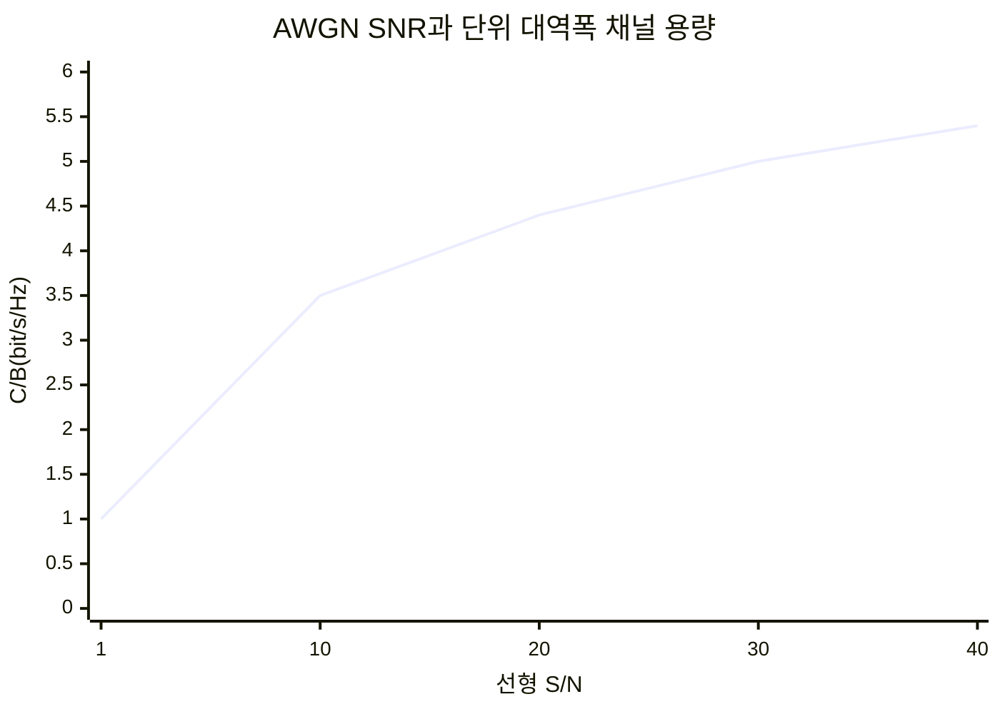
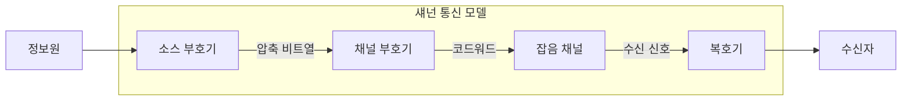
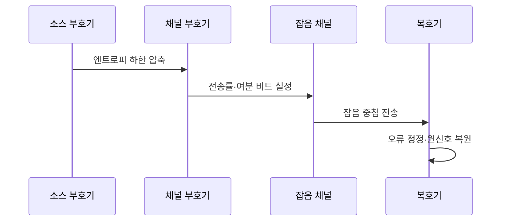

---
sidebar:
  order: 29
  label: "029. 정보이론 — 엔트로피·채널 용량·섀넌 한계 (Information Theory Shannon)"
  badge:
    text: "기출 · 50%"
    variant: note
title: "정보이론 — 엔트로피·채널 용량·섀넌 한계 (Information Theory Shannon)"
date: "2026-07-27T22:05:00+09:00"
tags:
  - "notes-basic-theory"
weight: 29
extra:
  question_no: "029"
  source_status: "기출"
  source_history: "135회"
  priority: 50
  priority_note: "채널 용량 기출과 높은 엔트로피·한계 확장성"
---

## 미리 알고가기

- **정보이론(Information Theory)**: 뜻밖의 소식일수록 큰 값을 주는 장면처럼 사건의 불확실성을 정보량으로 바꿔 압축 하한과 전송 상한을 분석하는 이론
- **자기 정보량(Self-Information)**: 사건 하나의 놀라움을 나타내는 $-\log_2 p(x)$
- **엔트로피(Entropy)**: 정보원의 평균 정보량이자 무손실 압축 하한
- **채널 용량(Channel Capacity)**: 임의로 낮은 오류율로 신뢰 전송할 수 있는 최대 정보율
- **상호정보량(Mutual Information)**: 수신값을 관측해 줄어든 송신값의 불확실성
- **섀넌 한계(Shannon Limit)**: 대역폭·잡음에서 가능한 전송 성능 한계
- **신호 대 잡음비(Signal-to-Noise Ratio, SNR, 에스엔알)**: 영문명의 머리글자를 조합한 공식 약어로, 신호 전력 $S$와 잡음 전력 $N$의 선형비
- **채널 대역폭($B$)**: 채널이 사용하는 주파수 범위의 폭
- **코드율(Code Rate)**: 전체 비트 중 원본 정보 비트의 비율
- **소스 부호화(Source Coding)**: 정보원 중복 제거를 통한 평균 부호 길이 감소
- **채널 부호화(Channel Coding)**: 전송 오류를 검출·정정할 여분 비트를 붙여 신뢰도를 높이는 부호화
- **가산성 백색 가우시안 잡음(Additive White Gaussian Noise, AWGN, 에이더블유지엔) 채널**: 영문명의 머리글자를 조합한 공식 약어로, 전 주파수에 고르게 분포한 가우시안 잡음이 신호에 더해지는 채널
- **확률 표기 $X$, $Y$, $p(x)$, $p(y|x)$**: 각각 ‘엑스·와이·피 오브 엑스·엑스가 주어졌을 때 와이의 확률’로 읽고 $X$·$Y$는 확률변수, $p$는 probability의 머리글자, 세로줄은 조건을 나타내는 관례이며, 송신값·수신값·입력 발생 확률·어떤 입력을 보냈을 때 각 출력이 나올 확률(전이확률)을 가리킨다.
- **정보량 표기 $H(X)$, $I(X;Y)$, $C$**: 각각 ‘에이치 오브 엑스·아이 오브 엑스 세미콜론 와이·시’로 읽고 $H$는 엔트로피, $I$는 information, $C$는 capacity에 관례적으로 대응하며 세미콜론은 두 확률변수의 짝을 구분해, 정보원 엔트로피·송수신 상호정보량·최대 채널 용량을 가리킨다.
- **용량식 기호 $B$, $S$, $N$, $S/N$**: 각각 ‘비·에스·엔·에스 오버 엔’으로 읽고 bandwidth·signal·noise의 머리글자와 슬래시는 비율을 나타내는 관례이며, 채널 대역폭·신호 전력·잡음 전력·선형 신호 대 잡음비를 가리킨다.
- **합·최댓값·로그 표기 $\sum$, $\max$, $\log_2$**: 각각 ‘시그마·맥스·로그 밑 이’로 읽고 $\sum$은 그리스 대문자 시그마를 합산에 쓰는 수학 관례, $\max$는 maximum의 축약, 아래첨자 2는 로그의 밑을 나타내며, 엔트로피의 확률 가중합과 채널 용량의 입력분포 최적화를 계산한다.
- **단위 bit/s/Hz**: ‘비트 퍼 세컨드 퍼 헤르츠’로 읽고 슬래시는 단위당 비율을 나타내는 공학 관례이며, 대역폭 1헤르츠마다 1초에 전송 가능한 정보 비트 수를 나타낸다.
- **낸드 플래시(NAND Flash)**: 전원을 꺼도 데이터를 유지하며 오류 정정용 여분 비트를 함께 저장하는 반도체 메모리

## Ⅰ. 개요

- **정의/개념**: **정보량**으로 압축 하한과 **전송 상한**을 정량화하는 이론
- **기존 한계**: **압축 하한·전송 상한** 부재 시 개선 한계 불명

### 쉽게 이해하기 (학습용)
- "오늘도 해가 떴다"는 소식은 누구나 예상해 알맹이가 거의 없고 "한여름에 눈이 왔다"는 소식은 뜻밖이라 알맹이가 큰데, 정보이론은 이 놀라움의 크기를 확률로 숫자화해 데이터를 어디까지 줄일 수 있고 잡음 섞인 통신로로 얼마까지 보낼 수 있는지를 실제로 만들어 보기 전에 계산해 준다

## Ⅱ. 특징

- **엔트로피**가 정하는 **무손실 압축** 하한
- **채널 용량** 미만에서만 성립하는 **신뢰 전송**
- **섀넌 한계**에서 신호 대 잡음비 대비 용량의 **로그 증가**

> 신호 전력을 키워도 전송률 이득은 **로그**로 둔화

### 쉽게 이해하기 (학습용)
- 정보이론은 짐을 줄일 수 있는 한계선과 길이 감당할 수 있는 한계선을 각각 숫자로 못 박아 주는데, 글자 출현 빈도가 한쪽으로 쏠릴수록 짐은 더 줄어들고 길 쪽은 전력을 두 배로 키워야 겨우 한 칸 넓어지는 식이라 전력만 쏟아붓는 방식은 금세 수지가 맞지 않게 된다

## Ⅲ. 아키텍처 및 구성요소

| 설계 요소 | 설명 |
|:---|:---|
| 소스 부호기 | **엔트로피** 하한까지 중복 비트 제거 |
| 채널 부호기 | 오류 정정용 여분 비트로 **코드율** 결정 |
| 잡음 채널 | 조건부 전이확률이 **채널 용량** 상한 형성 |
| 복호기 | 수신 신호에서 **코드워드** 추정·원신호 복원 |

$$
\begin{aligned}
H(X)&=-\sum_x p(x)\log_2 p(x)\\
C&=\max_{p(x)}I(X;Y)\\
C_{\mathrm{AWGN}}&=B\log_2(1+S/N)
\end{aligned}
$$

> 요약: 압축 하한과 전송 상한이 여분 비트 범위를 규정

### 쉽게 이해하기 (학습용)
- 짐을 부치는 과정을 떠올리면 먼저 포장 속 빈 공간을 눌러 짐 자체를 줄이고(소스 부호기), 운송 중 찌그러질 것에 대비해 완충재를 다시 채워 넣은 뒤(채널 부호기), 비포장 도로를 달리는 동안 흔들림이 더해지며(잡음 채널), 도착지에서 완충재를 근거로 찌그러진 부분을 되살려 원래 짐을 꺼낸다(복호기)

## Ⅳ. 원리 및 절차 흐름도

| 절차 | 설명 |
|:---|:---|
| 엔트로피 하한 압축 | 기호 확률 편중 제거로 **평균 부호 길이** 축소 |
| 전송률·여분 비트 설정 | **채널 용량** 미만 정보율과 정정 비트 배분 |
| 잡음 중첩 전송 | **신호 대 잡음비**가 비트 오류율 좌우 |
| 오류 정정·원신호 복원 | 여분 비트로 **전송 오류** 정정 후 압축 해제 |

> 요약: **소스 부호화**로 압축한 뒤 **채널 부호화**로 여분 비트 추가

### 쉽게 이해하기 (학습용)
- 압축과 오류 대비는 서로 반대 방향이라 순서가 중요한데, 먼저 중복을 짜내 짐을 엔트로피 한계까지 줄여 놓고 그다음에 길이 감당할 수 있는 용량 안에서만 완충재를 다시 넣어야 하며, 완충재를 욕심내 용량을 넘겨 실으면 오히려 짐 전체가 도착하지 못한다

## Ⅴ. 종류 및 비교

| 정보 이론 척도 | 엔트로피 | 상호정보량 | 채널 용량 |
|:---|:---|:---|:---|
| 적용 기준 | **무손실 압축**률 하한을 구할 때 | 송수신 **의존 구조**를 잴 때 | 잡음 채널의 **코드율** 상한을 구할 때 |
| 핵심 특징 | 정보원 **평균 정보량** | 입출력 **공유 정보량** | **신뢰 전송률** 상한 |
| 한계 | 정보의 **의미·응용 가치** 미반영 | **대칭성**으로 인과 방향 불명 | 무한 **블록 길이** 가정의 상한 |

> 요약: **상호정보량**의 입력분포 최댓값이 곧 **채널 용량**

### 쉽게 이해하기 (학습용)
- 엔트로피는 보낼 짐이 원래 얼마나 되는지를 재는 저울이고, 상호정보량은 도착지에서 실제로 알아볼 수 있게 건너간 몫이 얼마인지를 재는 자이며, 채널 용량은 그 건너간 몫을 가장 유리한 방식으로 실었을 때의 최댓값이라 결국 도로가 감당하는 폭을 뜻한다

## Ⅵ. 실무 사례

1. 스토리지 압축 엔진은 **기호 분포** 기반 **소스 부호화**
2. **낸드 플래시**는 셀 오류율에 맞춘 **채널 부호화** 여분 배분

### 쉽게 이해하기 (학습용)
- 스토리지가 같은 바이트 패턴을 반복해 담고 있으면 자주 나오는 조각에 짧은 부호를, 드문 조각에 긴 부호를 붙여 다시 적는데, 이때 줄일 수 있는 바닥이 그 데이터의 엔트로피라 이미 압축된 파일을 다시 압축해도 거의 줄지 않는다
- 낸드 플래시는 쓰기·지우기를 반복할수록 셀이 닳아 비트가 뒤집힐 확률이 올라가므로, 칩이 늙은 정도에 맞춰 정정용 여분 비트를 더 넉넉히 붙이고 그만큼 실제 저장 가능한 용량을 내주는 맞바꿈을 한다

## Ⅶ. 결론

- **엔트로피**·**채널 용량** 범위에서 압축률·전송률 설정

### 쉽게 이해하기 (학습용)
- 짐의 최소 부피인 엔트로피와 길의 최대 통행량인 채널 용량을 확인해, 압축률과 실제 전송률을 각각 한계 안으로 설정한다
