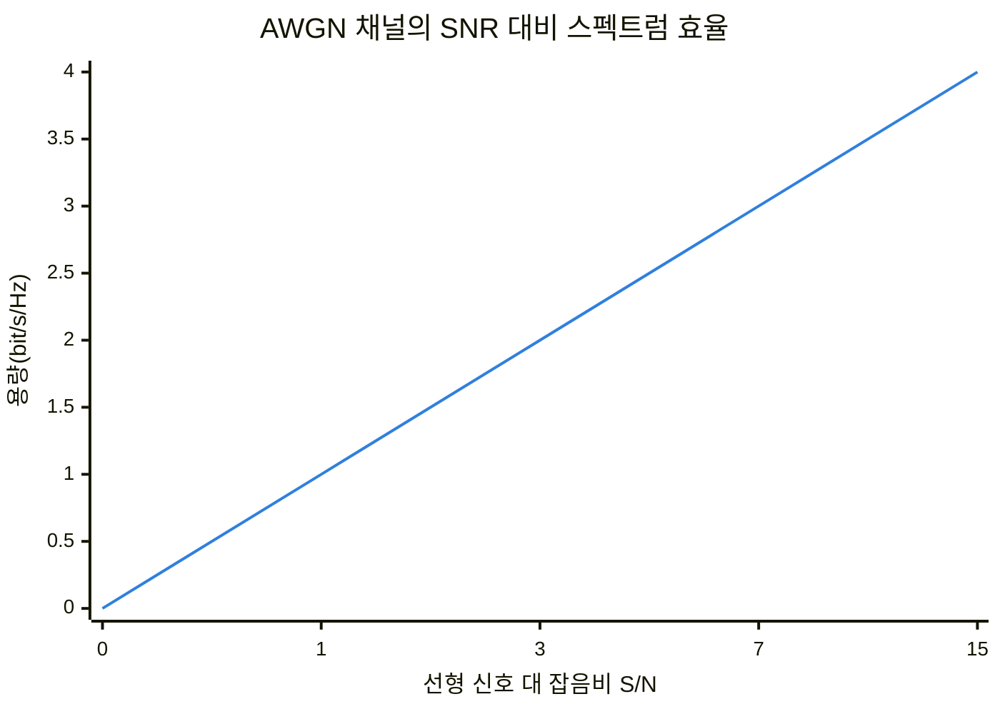
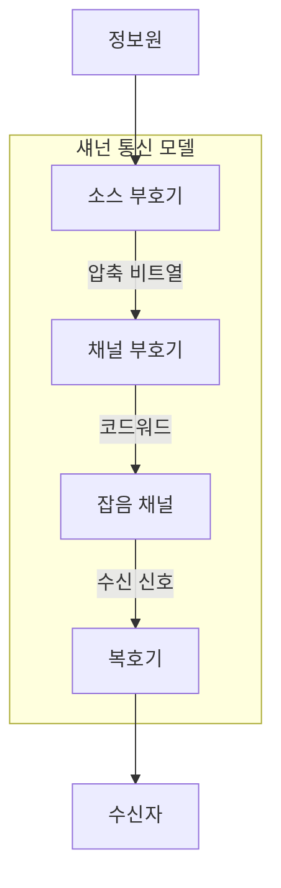
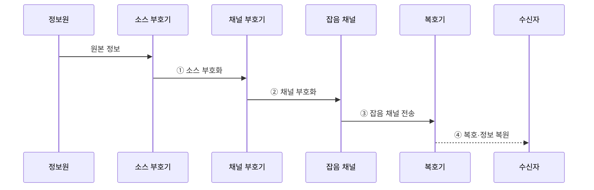

---
sidebar:
  order: 29
  label: "029. 정보이론 — 엔트로피·채널 용량·섀넌 한계 (Information Theory Shannon)"
  badge:
    text: "기출 · 50%"
    variant: note
title: "정보이론 — 엔트로피·채널 용량·섀넌 한계 (Information Theory Shannon)"
date: "2026-07-28T22:45:00+09:00"
tags:
  - "notes-basic-theory"
weight: 29
extra:
  question_no: "029"
  source_status: "기출"
  source_history: "135회"
  priority: 50
  priority_note: "채널 용량 기출과 높은 엔트로피·한계 확장성"
---

## 미리 알고가기

- **정보이론(Information Theory)**: 사건의 불확실성을 정보량으로 정량화하여 데이터 압축 한계와 통신 채널의 전송 한계를 분석하는 이론
- **자기 정보량(Self-Information)**: 사건 하나의 놀라움을 나타내는 $-\log_2 p(x)$
- **엔트로피(Entropy)**: 정보원의 평균 정보량이자 무손실 압축 하한
- **무손실 압축(Lossless Compression)**: 압축 데이터를 복원했을 때 원본 비트열이 완전히 같도록 중복을 제거하는 방식
- **채널 용량(Channel Capacity)**: 임의로 낮은 오류율로 신뢰 전송할 수 있는 최대 정보율
- **상호정보량(Mutual Information)**: 수신값을 관측해 줄어든 송신값의 불확실성
- **섀넌 한계(Shannon Limit)**: 대역폭·잡음에서 가능한 전송 성능 한계
- **신호 대 잡음비(Signal-to-Noise Ratio, SNR)**: 신호 전력과 잡음 전력의 비율로, 통신 채널의 신호 품질을 나타내는 지표
- **채널 대역폭($B$)**: 채널이 사용하는 주파수 범위의 폭
- **코드율(Code Rate)**: 전체 비트 중 원본 정보 비트의 비율
- **소스 부호화(Source Coding)**: 정보원 중복 제거를 통한 평균 부호 길이 감소
- **채널 부호화(Channel Coding)**: 전송 오류를 검출·정정할 여분 비트를 붙여 신뢰도를 높이는 부호화
- **가산성 백색 가우시안 잡음(Additive White Gaussian Noise, AWGN) 채널**: 전 주파수 대역에 균일한 전력 밀도를 갖는 가우시안 잡음이 신호에 더해지는 채널 모델
- **확률 표기 $X$, $Y$, $p(x)$, $p(y|x)$**: 송신값·수신값·입력 확률·채널 전이확률
- **정보량 표기 $H(X)$, $I(X;Y)$, $C$**: 정보원 엔트로피·상호정보량·채널 용량
- **용량식 기호 $B$, $S$, $N$, $S/N$**: 대역폭·신호 전력·잡음 전력·선형 신호 대 잡음비
- **합·최댓값·로그 표기 $\sum$, $\max$, $\log_2$**: ‘시그마·맥스·로그 밑 2’로 읽으며 합산·최댓값·이진 로그를 표시
- **단위 bit/s/Hz**: 단위 대역폭당 초당 전송 가능한 정보 비트 수
- **스펙트럼 효율(Spectral Efficiency)**: 1Hz의 대역폭에서 초당 전달할 수 있는 정보 비트 수
- **블록 길이(Block Length)**: 한 번의 부호화·복호화에서 함께 처리하는 기호 또는 비트의 수
- **변조(Modulation)**: 디지털 정보를 반송파의 진폭·주파수·위상 변화로 바꾸어 채널에 싣는 과정
- **적응형 부호화(Adaptive Coding)**: 관측한 정보원 분포나 채널 상태에 맞춰 부호 길이·코드율을 조정하는 방식

## Ⅰ. 개요

- 정의/개념: **정보량**으로 압축 하한과 **전송 상한**을 정량화하는 이론
- 기존 한계: **압축 하한·전송 상한** 부재 시 개선 한계 불명

### 쉽게 이해하기 (학습용)
- 사건의 놀라움을 확률로 정량화해 압축 하한과 잡음 채널의 전송 상한을 계산한다.

## Ⅱ. 특징

- **엔트로피**가 정하는 **무손실 압축** 하한
- **채널 용량** 미만에서만 성립하는 **신뢰 전송**
- **섀넌 한계**에서 신호 대 잡음비 대비 용량의 **로그 증가**

> 신호 전력을 키워도 전송률 이득은 **로그**로 둔화

| 계열 | 수식·의미 |
|:---|:---|
| 파랑 · 1계열 | $C/B=\log_2(1+S/N)$, 전력 증가의 용량 이득 둔화 |

### 쉽게 이해하기 (학습용)
- 기호 분포가 치우칠수록 압축 여지가 커지고 신호 전력 증가의 용량 이득은 로그로 둔화한다.

## Ⅲ. 아키텍처

**도표안 A — 구조도**

**도표안 B — sequenceDiagram**

| 구성요소 | 책임 |
|:---|:---|
| 소스 부호기 | **엔트로피** 하한까지 중복 비트 제거 |
| 채널 부호기 | 오류 정정용 여분 비트로 **코드율** 결정 |
| 잡음 채널 | 조건부 전이확률이 **채널 용량** 상한 형성 |
| 복호기 | 수신 신호에서 **코드워드** 추정·원신호 복원 |

$$
\begin{aligned}
H(X)&=-\sum_x p(x)\log_2 p(x)\\
C&=\max_{p(x)}I(X;Y)\\
C_{\mathrm{AWGN}}&=B\log_2(1+S/N)
\end{aligned}
$$

**동작 원리**

- **① 소스 부호화**: 정보원 분포에 맞춰 평균 부호 길이를 줄인 압축 비트열 생성
- **② 채널 부호화**: 목표 오류율에 맞춰 정정 비트와 코드율을 구성한 코드워드 생성
- **③ 잡음 채널 전송**: 채널 전이확률에 따라 코드워드가 변형된 수신 신호 전달
- **④ 복호·정보 복원**: 오류 정정 부호를 해석한 뒤 압축을 풀어 원본 정보 추정

### 쉽게 이해하기 (학습용)
- 소스 부호화로 중복을 제거하고 채널 부호화로 정정 비트를 더해 잡음 채널을 통과한다.

## Ⅳ. 종류 및 비교

| 정보 이론 척도 | 엔트로피 | 상호정보량 | 채널 용량 |
|:---|:---|:---|:---|
| 적용 기준 | **무손실 압축**률 하한을 구할 때 | 송수신 **의존 구조**를 잴 때 | 잡음 채널의 **코드율** 상한을 구할 때 |
| 핵심 특징 | 정보원 **평균 정보량** | 입출력 **공유 정보량** | **신뢰 전송률** 상한 |
| 한계 | 정보의 **의미·응용 가치** 미반영 | **대칭성**으로 인과 방향 불명 | 무한 **블록 길이** 가정의 상한 |

### 쉽게 이해하기 (학습용)
- 엔트로피는 평균 정보량, 상호정보량은 공유 정보량, 채널 용량은 그 최댓값이다.

## Ⅴ. 실무 고려사항 및 대책

| 고려사항 | 대책 | 효과 |
|:---|:---|:---|
| 정보율의 **채널 용량** 초과 | 변조·코드율·**대역폭 재설계** | 목표 **오류율** 달성 가능 |
| 압축·오류 정정의 **순서 혼동** | 소스 부호화 후 **채널 부호화** | 중복 제거·**복원력** 분리 |
| 짧은 블록의 **섀넌 한계** 오해 | 길이·지연·**오류율 여유** 반영 | 현실적 **처리량** 산정 |
| 분포 변화로 **압축률 저하** | 분포 추적·**적응형 부호화** | **엔트로피 변화** 대응 |
| 스토리지 **기호 분포 편향** | 빈번 기호에 **짧은 부호** 배정 | 평균 **저장 길이** 감소 |

### 쉽게 이해하기 (학습용)
- 정보율을 용량 아래로 유지하고 실제 블록 길이와 분포 변화를 함께 반영한다.

## Ⅵ. 결론

- 압축률은 **엔트로피**, 전송률은 **채널 용량** 아래에서 코드율 결정

### 쉽게 이해하기 (학습용)
- 엔트로피와 채널 용량을 기준으로 압축률과 정보율을 설계한다.
