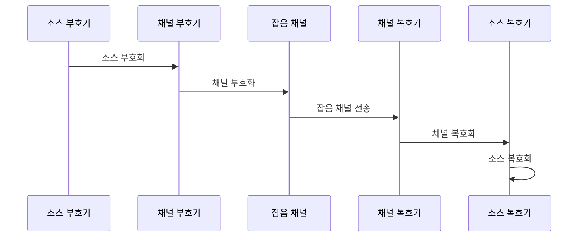

---
sidebar:
  order: 30
  label: "030. 소스 코딩 vs 채널 코딩 (Source Coding vs Channel Coding)"
  badge:
    text: "기출 · 50%"
    variant: note
title: "소스 코딩 vs 채널 코딩 (Source Coding vs Channel Coding)"
date: "2026-07-27T22:12:00+09:00"
tags:
  - "notes-basic-theory"
weight: 30
extra:
  question_no: "030"
  source_status: "기출"
  source_history: "129회"
  priority: 50
  priority_note: "비교형 기출과 선명한 압축·오류 제어 경계"
---

## 미리 알고가기

- **소스 코딩(Source Coding)**: 정보원 중복 제거·허용 왜곡으로 표현 비트를 줄이는 부호화
- **채널 코딩(Channel Coding)**: 오류 제어용 중복을 추가해 전송 비트를 보호하는 부호화
- **엔트로피(Entropy)**: 무손실 소스 코딩의 평균 비트 수 하한
- **율-왜곡 함수(Rate-Distortion Function)**: 허용 왜곡에서 필요한 최소 정보율
- **채널 용량(Channel Capacity)**: 신뢰 전송 가능한 정보율 상한
- **코드율(Code Rate)**: 전체 비트 중 원본 정보 비트의 비율
- **코드워드(Codeword)**: 채널 부호화로 만든 정보·보호 비트 묶음
- **이레이저 코딩(Erasure Coding)**: 데이터·여분 조각 기반 일부 손실 복원
- **전방 오류 정정(Forward Error Correction, FEC, 에프이씨)**: 영문명의 머리글자를 조합한 공식 약어로, 중복 비트를 이용해 재전송 없이 오류를 정정하는 방식
- **무손실·손실 압축(Lossless·Lossy Compression)**: 원본을 완전히 복원하는 압축과 허용한 정보 손실로 비트를 더 줄이는 압축
- **소스-채널 분리 정리(Source-Channel Separation Theorem)**: 충분히 긴 블록과 지연을 허용하면 압축과 오류 보호를 따로 최적화해도 이론 한계에 도달할 수 있다는 원리
- **결합 소스-채널 코딩(Joint Source-Channel Coding)**: 짧은 지연·블록 조건에서 압축과 오류 보호를 하나의 설계로 함께 조정하는 방식
- **잡음 채널(Noisy Channel)**: 전송 중 신호가 변형되어 비트 오류가 생길 수 있는 매체
- **부호기·복호기(Encoder·Decoder)**: 부호기는 비트를 압축하거나 보호 비트를 붙이고 복호기는 그 변환을 풀어 데이터를 복원함
- **오버헤드(Overhead)**: 원본 정보 외에 오류 보호를 위해 추가되는 비트와 처리 시간
- **객체 스토리지(Object Storage)**: 데이터를 객체와 메타데이터 단위로 여러 저장 장치에 분산 보관하는 저장 방식
- **지연 예산(Latency Budget)**: 전체 처리 과정에서 허용할 수 있는 최대 대기 시간을 단계별로 배분한 한도

## Ⅰ. 개요

- 정의/개념: 중복을 줄이는 **소스 코딩**과 중복을 더하는 **채널 코딩**
- 기존 한계: 단일 설계 기준의 **압축률·오류율** 상충 조정 제약

### 쉽게 이해하기 (학습용)
- 택배를 부칠 때 상자 속 빈 공간을 눌러 부피를 줄이는 일과 깨지지 말라고 완충재를 채워 넣는 일은 서로 정반대 방향인데, 트럭 칸에 해당하는 대역폭이 정해져 있으므로 짐을 얼마나 줄이고 완충재를 얼마나 넣을지 두 몫을 한 칸 안에서 나눠 잡아야 한다

## Ⅱ. 특징

- **통계적 중복** 제거로 **평균 부호 길이** 축소
- **보호 비트** 추가로 재전송 없는 **오류 정정**
- 긴 블록·지연 허용 시 성립하는 **소스-채널 분리 정리**

### 쉽게 이해하기 (학습용)
- 시간이 넉넉하고 한 번에 긴 덩어리를 처리할 수 있으면 "짐 줄이기"와 "완충재 넣기"를 각각 최선으로 따로 해도 이론상 손해가 없지만, 화상 통화처럼 지연을 몇십 밀리초밖에 못 주는 자리에서는 덩어리를 길게 잡을 수 없어 두 일을 함께 조정해야 이득이 난다

## Ⅲ. 아키텍처 및 구성요소

| 설계 요소 | 설명 |
|:---|:---|
| 소스 부호기 | **통계적 중복** 제거로 표현 비트 축소 |
| 채널 부호기 | 목표 오류율 기준 **보호 비트** 부가 |
| 잡음 채널 | 전송 중 **비트 오류**가 유입되는 매체 |
| 채널 복호기 | 보호 비트로 **오류 정정** 후 압축 비트 회복 |
| 소스 복호기 | 압축 비트에서 **원본 데이터** 재구성 |

> 요약: 송신은 압축 후 보호, 수신은 **역순 복호**

### 쉽게 이해하기 (학습용)
- 보내는 쪽에서 짐을 먼저 줄이고 그 위에 완충재를 감았으므로 받는 쪽에서는 반드시 완충재부터 벗겨야 안쪽 짐이 나오듯, 채널 복호기가 먼저 오류를 바로잡아야 소스 복호기가 온전한 압축 비트를 펼칠 수 있다

## Ⅳ. 원리 및 절차 흐름도

| 절차 | 설명 |
|:---|:---|
| 소스 부호화 | 무손실은 **엔트로피**, 손실은 **율-왜곡** 하한 접근 |
| 채널 부호화 | 정보율을 **채널 용량** 미만으로 제한·보호 비트 추가 |
| 잡음 채널 전송 | 코드워드 일부에 **비트 오류** 발생 |
| 채널 복호화 | 정정 능력 초과 시 **복호 실패** 판정 |
| 소스 복호화 | 손실 압축이면 **허용 왜곡** 안에서 근사 복원 |

> 요약: 압축률과 **오류 보호율**을 각 이론 한계 안에서 설정

### 쉽게 이해하기 (학습용)
- 편지를 줄여 포장했다 다시 푸는 순서 자체보다 중요한 것은 각 단계의 한계선인데, 줄이는 쪽은 내용의 엔트로피보다 더 줄이면 원문이 사라지고 포장하는 쪽은 길이 감당하는 용량을 넘겨 완충재를 넣으면 아예 도착하지 못하며, 받는 쪽에서도 정정 능력을 넘는 흠이 생기면 복구를 포기하고 실패로 알린다

## Ⅴ. 종류 및 비교

| 코딩 방식 | 소스 코딩 | 채널 코딩 |
|:---|:---|:---|
| 적용 기준 | 압축 이득이 **연산 비용**을 넘는 구간 | **비트 오류율**이 목표를 넘는 구간 |
| 핵심 특징 | **통계적 중복** 제거·압축 | **복구용 중복** 추가·오류 제어 |
| 한계 | **엔트로피·율-왜곡** 하한 미만 압축 불가 | 부호화 **오버헤드**·복호 지연 증가 |

> 요약: 비트 축소는 **소스 코딩**, 오류 복구는 **채널 코딩**

### 쉽게 이해하기 (학습용)
- 소스 코딩은 트럭에 실을 짐 자체를 줄여 운임을 아끼는 쪽이라 너무 줄이면 내용물이 못 쓰게 되고, 채널 코딩은 그 짐이 도중에 깨질 것에 대비해 완충재를 얹는 쪽이라 얹을수록 안전하지만 실을 수 있는 짐이 줄고 포장·해체 시간까지 늘어난다

## Ⅵ. 실무 사례

1. **객체 스토리지**는 압축 후 **이레이저 코딩** 조각 분산

### 쉽게 이해하기 (학습용)
- 여러 장비에 흩어 담는 저장소는 디스크 몇 대가 통째로 빠져도 데이터를 살려야 하므로 먼저 압축해 조각을 줄인 뒤 그 조각들로 여분 조각을 만들어 서로 다른 장비에 흩어 두고, 빠진 자리는 남은 조각들로 계산해 되살린다

## Ⅶ. 결론

- 신뢰 전송을 위해 지연·오류율을 검토하여 **부호화** 활용

### 쉽게 이해하기 (학습용)
- 덩어리를 길게 잡고 시간을 넉넉히 쓸 수 있는 저장·전송에서는 짐 줄이기와 완충재 넣기를 따로따로 최선으로 맞춰도 손해가 없지만, 실시간처럼 지연을 몇십 밀리초로 묶어 놓은 자리에서는 두 작업을 하나로 묶어 함께 조정해야 정해진 시간 안에 화면이 이어진다
