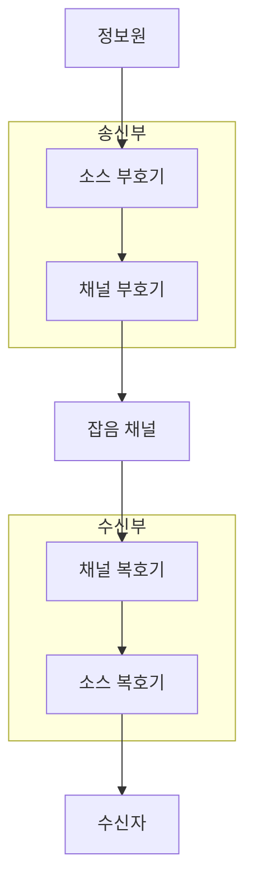
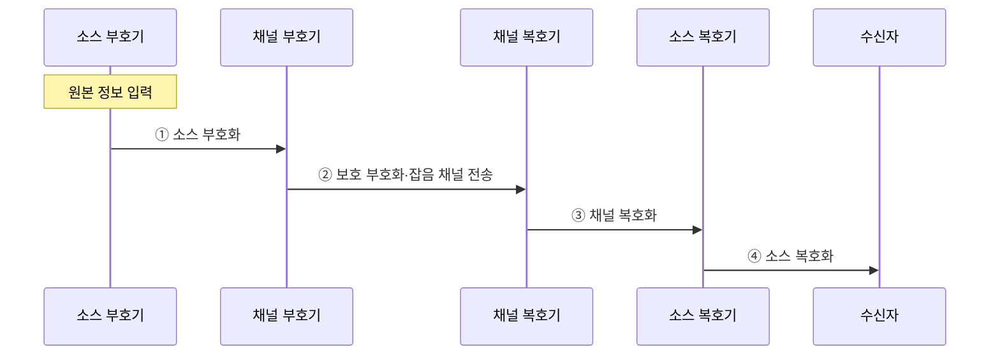

---
sidebar:
  order: 30
  label: "030. 소스 코딩 vs 채널 코딩 (Source Coding vs Channel Coding)"
  badge:
    text: "기출 · 50%"
    variant: note
title: "소스 코딩 vs 채널 코딩 (Source Coding vs Channel Coding)"
date: "2026-07-28T22:49:00+09:00"
tags:
  - "notes-basic-theory"
weight: 30
extra:
  question_no: "030"
  source_status: "기출"
  source_history: "129회"
  priority: 50
  priority_note: "비교형 기출과 선명한 압축·오류 제어 경계"
---

## 미리 알고가기

- **소스 코딩(Source Coding)**: 정보원 중복 제거·허용 왜곡으로 표현 비트를 줄이는 부호화
- **채널 코딩(Channel Coding)**: 오류 제어용 중복을 추가해 전송 비트를 보호하는 부호화
- **엔트로피(Entropy)**: 무손실 소스 코딩의 평균 비트 수 하한
- **통계적 중복(Statistical Redundancy)**: 특정 기호·패턴이 다른 것보다 자주 나타나 더 짧은 표현으로 줄일 수 있는 반복성
- **평균 부호 길이(Average Code Length)**: 각 기호의 부호 비트 수를 발생 확률로 가중해 합한 평균 길이
- **율-왜곡 함수(Rate-Distortion Function)**: 허용 왜곡에서 필요한 최소 정보율
- **채널 용량(Channel Capacity)**: 신뢰 전송 가능한 정보율 상한
- **코드율(Code Rate)**: 전체 비트 중 원본 정보 비트의 비율
- **코드워드(Codeword)**: 채널 부호화로 만든 정보·보호 비트 묶음
- **이레이저 코딩(Erasure Coding)**: 데이터·여분 조각 기반 일부 손실 복원
- **전방 오류 정정(Forward Error Correction, FEC)**: 송신 데이터에 중복 정보를 추가하여 수신 측에서 재전송 없이 오류를 정정하는 방식
- **무손실·손실 압축(Lossless·Lossy Compression)**: 원본을 완전히 복원하는 압축과 허용한 정보 손실로 비트를 더 줄이는 압축
- **소스-채널 분리 정리(Source-Channel Separation Theorem)**: 충분히 긴 블록과 지연을 허용하면 압축과 오류 보호를 따로 최적화해도 이론 한계에 도달할 수 있다는 원리
- **결합 소스-채널 코딩(Joint Source-Channel Coding)**: 짧은 지연·블록 조건에서 압축과 오류 보호를 하나의 설계로 함께 조정하는 방식
- **잡음 채널(Noisy Channel)**: 전송 중 신호가 변형되어 비트 오류가 생길 수 있는 매체
- **비트 오류율(Bit Error Rate, BER)**: 전송한 전체 비트 중 잘못 수신된 비트의 비율
- **부호기·복호기(Encoder·Decoder)**: 부호기는 비트를 압축하거나 보호 비트를 붙이고 복호기는 그 변환을 풀어 데이터를 복원함
- **오버헤드(Overhead)**: 원본 정보 외에 오류 보호를 위해 추가되는 비트와 처리 시간
- **객체 스토리지(Object Storage)**: 데이터를 객체와 메타데이터 단위로 여러 저장 장치에 분산 보관하는 저장 방식
- **지연 예산(Latency Budget)**: 전체 처리 과정에서 허용할 수 있는 최대 대기 시간을 단계별로 배분한 한도
- **적응형 코드율(Adaptive Code Rate)**: 관측한 채널 오류율에 맞춰 정보 비트와 보호 비트의 비율을 조정하는 방식
- **재동기화 지점(Resynchronization Point)**: 압축 비트열 손상 뒤 복호기가 올바른 프레임 경계를 다시 찾는 기준 위치

## Ⅰ. 개요

- 정의/개념: 중복을 줄이는 **소스 코딩**과 중복을 더하는 **채널 코딩**
- 기존 한계: 단일 설계 기준의 **압축률·오류율** 상충 조정 제약

### 쉽게 이해하기 (학습용)
- 여행 가방의 반복 물건은 빼서 압축하고 깨질 물건에는 완충재를 더하듯, 소스 코딩은 중복을 줄이고 채널 코딩은 복구용 중복을 붙인다.

## Ⅱ. 특징

- **통계적 중복** 제거로 **평균 부호 길이** 축소
- **보호 비트** 추가로 재전송 없는 **오류 정정**
- 긴 블록·지연 허용 시 성립하는 **소스-채널 분리 정리**

### 쉽게 이해하기 (학습용)
- 큰 짐을 오래 준비할 수 있으면 압축 상자와 보호 포장을 따로 최적화하고, 즉시 보내야 하는 작은 짐은 두 포장을 함께 조정한다.

## Ⅲ. 아키텍처

**도표안 A — 구조도**

**도표안 B — sequenceDiagram**

| 구성요소 | 책임 |
|:---|:---|
| 소스 부호기 | **통계적 중복** 제거로 표현 비트 축소 |
| 채널 부호기 | 목표 오류율 기준 **보호 비트** 부가 |
| 잡음 채널 | 전송 중 **비트 오류**가 유입되는 매체 |
| 채널 복호기 | 보호 비트로 **오류 정정** 후 압축 비트 회복 |
| 소스 복호기 | 압축 비트에서 **원본 데이터** 재구성 |

**동작 원리**

- **① 소스 부호화**: 정보원 분포에 맞춰 통계적 중복을 제거한 압축 비트열 생성
- **② 보호 부호화·잡음 채널 전송**: 보호 비트를 붙인 코드워드가 잡음 영향을 받아 수신부에 도착
- **③ 채널 복호화**: 보호 비트로 오류를 정정해 압축 비트열 복구
- **④ 소스 복호화**: 정정된 압축 비트열에서 원본 정보 재구성

### 쉽게 이해하기 (학습용)
- 송신자는 짐 부피를 먼저 줄이고 완충재를 붙여 보내며, 수신자는 손상부터 고친 뒤 압축을 풀어야 원본을 복원한다.

## Ⅳ. 종류 및 비교

| 코딩 방식 | 소스 코딩 | 채널 코딩 |
|:---|:---|:---|
| 적용 기준 | 압축 이득이 **연산 비용**을 넘는 구간 | **비트 오류율**이 목표를 넘는 구간 |
| 핵심 특징 | **통계적 중복** 제거·압축 | **복구용 중복** 추가·오류 제어 |
| 한계 | **엔트로피·율-왜곡** 하한 미만 압축 불가 | 부호화 **오버헤드**·복호 지연 증가 |

### 쉽게 이해하기 (학습용)
- 같은 문양의 반복을 줄여 가방을 가볍게 하는 것은 소스 코딩, 충격 뒤에도 복원하도록 여분 조각을 넣는 것은 채널 코딩이다.

## Ⅴ. 실무 고려사항 및 대책

| 고려사항 | 대책 | 효과 |
|:---|:---|:---|
| 압축 오류의 **복호 전파** | 송신·수신 **역순 경계** 검증 | 단계별 **오류 격리** |
| 채널 변화로 **보호율 부적합** | 오류율 기반 **적응형 코드율** | **처리량·신뢰도** 절충 |
| 짧은 지연의 **분리 설계 손실** | **결합 소스-채널 코딩** | 제한 지연의 **복원 품질** 향상 |
| 압축 블록의 **오류 확산** | 프레임 경계·**재동기화 지점** | **오류 전파 범위** 제한 |
| 객체 스토리지의 **장치 손실** | 압축 후 **이레이저 코딩** 분산 | **저장 효율·복원력** 확보 |

### 쉽게 이해하기 (학습용)
- 급한 작은 패킷에는 압축·보호를 함께 맞추고, 손상 한 번이 압축 블록 전체로 번지지 않도록 재동기화 지점을 세운다.

## Ⅵ. 결론

- 긴 블록은 **분리 코딩**, 짧은 지연은 **결합 소스-채널 코딩** 선택

### 쉽게 이해하기 (학습용)
- 큰 블록을 오래 처리할 수 있으면 압축과 오류 보호를 따로 최적화하고, 짧은 지연 안에 보내야 하면 두 코딩을 함께 설계한다.
