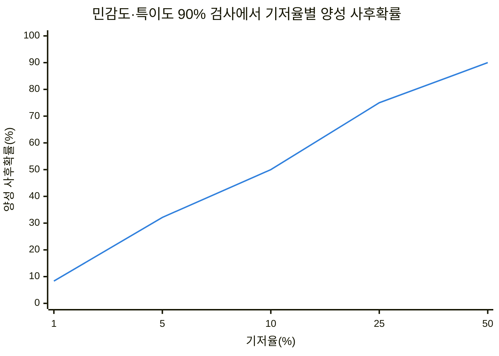
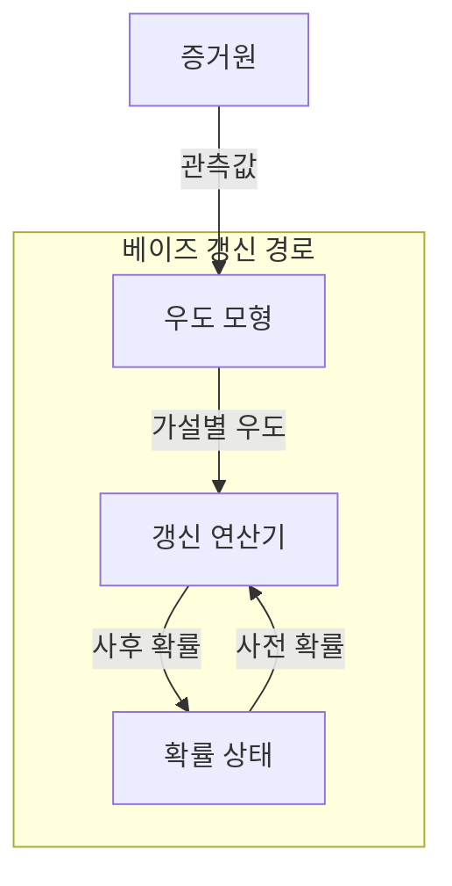
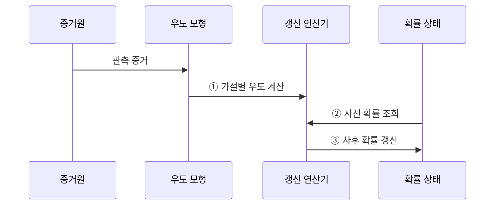

---
sidebar:
  order: 31
  label: "031. 확률 기초 — 베이즈 정리 (Bayes Theorem)"
  badge:
    text: "미출 · 30%"
    variant: note
title: "확률 기초 — 베이즈 정리 (Bayes Theorem)"
date: "2026-07-28T23:49:00+09:00"
tags:
  - "notes-basic-theory"
weight: 31
extra:
  question_no: "031"
  source_status: "미출"
  source_history: ""
  priority: 30
  priority_note: "베이즈 갱신은 불확실성 추론의 기본"
---

## 미리 알고가기

- **베이즈 정리(Bayes Theorem)**: 사전 확률과 우도로 증거 관측 후의 가설 확률을 구하는 정리
- **조건부 확률(Conditional Probability)**: 사건 B가 주어졌을 때 A의 확률
- **사전 확률(Prior Probability)**: 증거 관측 전 가설 확률
- **우도(Likelihood)**: 관측 데이터를 고정했을 때 각 가설의 적합도를 나타내는 수치
- **주변 확률(Marginal Probability)**: 특정 가설에 조건화하지 않은 증거 확률
- **사후 확률(Posterior Probability)**: 증거 반영 뒤 가설 확률
- **기저율(Base Rate)**: 모집단의 사건 발생률
- **빈도주의 통계(Frequentist Statistics)**: 반복 실험의 장기 빈도에 따른 확률 해석
- **베이지안 통계(Bayesian Statistics)**: 증거로 사전 확률을 갱신하는 통계
- **모수(Parameter)**: 확률 모형을 정하는 값
- **기호 $H$·$E$**: 갱신할 가설과 관측한 증거
- **확률 표기 $P(A)$·$P(A\mid B)$**: 사건 확률과 사건 $B$가 주어진 조건부 확률
- **오탐(False Positive)**: 실제로는 음성인데 검사나 분류기가 양성으로 잘못 판정한 결과
- **민감도·특이도(Sensitivity·Specificity)**: 실제 양성을 양성으로, 실제 음성을 음성으로 판정하는 비율
- **양성 사후확률(Positive Predictive Value, PPV)**: 검사 결과가 양성일 때 실제 양성일 조건부 확률
- **조건부 의존(Conditional Dependence)**: 다른 조건을 고정해도 두 증거의 확률 관계가 남는 성질
- **민감도 분석(Sensitivity Analysis)**: 사전 분포 등 가정을 바꿨을 때 결론이 얼마나 달라지는지 확인하는 절차
- **강건성(Robustness)**: 모형의 가정이나 입력이 일부 달라져도 결론이 크게 변하지 않는 성질
- **확률 보정(Probability Calibration)**: 예측 확률과 실제 발생 빈도가 일치하도록 조정하는 절차
- **적용 조건 $P(E)>0$**: 베이즈 식의 분모인 증거 확률이 0이 아니어야 한다는 조건

## Ⅰ. 개요

- 정의/개념: 증거 관측으로 **사전 확률**을 **사후 확률**로 갱신하는 정리
- 기존 한계: 관측되는 것은 결과뿐이라 **원인 확률**을 직접 측정 불가

### 쉽게 이해하기 (학습용)

- 의사가 질병의 평소 발생률을 출발점으로 삼고 검사 결과가 각 질병에서 나올 우도를 반영하듯, 증거로 원인의 확률을 갱신한다.

## Ⅱ. 특징

- **사전 확률**과 **우도**의 곱으로 사후 확률 산출
- 조건부 확률 방향을 뒤집는 **역확률 추론**
- **기저율**이 낮으면 **오탐** 비중 증가로 사후 확률 저하

| 계열 | 수식·의미 |
|:---|:---|
| 파랑 · 1계열 | 민감도·특이도 0.9일 때 $\mathrm{PPV}=\frac{0.9p}{0.9p+0.1(1-p)}$, 기저율 $p$가 낮으면 양성 사후확률 하락 |

### 쉽게 이해하기 (학습용)

- 만 명 중 환자 백 명인 검사에서는 건강한 사람의 10% 오탐이 실제 환자 수보다 많아질 수 있으므로, 양성 해석에 기저율을 함께 넣는다.

## Ⅲ. 아키텍처

**도표안 A — 구조도**

**도표안 B — sequenceDiagram**

| 구성요소 | 책임 |
|:---|:---|
| 우도 모형 | 가설별 **우도** $P(E \mid H)$ 산출 |
| 갱신 연산기 | **주변 확률**로 정규화한 **사후 확률** 산출 |
| 확률 상태 | 직전 갱신 결과를 다음 **사전 확률**로 보관 |

$$P(H \mid E)=\frac{P(E \mid H)P(H)}{P(E)}$$

**동작 원리**

- **① 가설별 우도 계산**: 관측 증거가 각 가설에서 발생할 조건부 확률 산출
- **② 사전 확률 조회**: 증거 관측 전 가설 확률 제공
- **③ 사후 확률 갱신**: 사전 확률과 우도를 결합하고 주변 확률로 정규화한 결과 저장

### 쉽게 이해하기 (학습용)

- 저울의 각 가설 접시에 사전 확률을 올리고 관측 증거의 우도만큼 무게를 곱한 뒤, 전체가 1이 되게 나눈 값이 새 사후 확률이다.

## Ⅳ. 종류 및 비교

| 통계적 추론 관점 | 베이지안 통계 | 빈도주의 통계 |
|:---|:---|:---|
| 적용 기준 | **사전 정보**가 있고 표본이 적을 때 | **장기 오류율** 통제가 목표일 때 |
| 핵심 특징 | 증거로 **확률 갱신** | 반복 표본으로 **고정 모수** 추정 |
| 한계 | 주관적 **사전 확률**이 결과 좌우 | 단일 표본의 **모수 불확실성** 누락 |

### 쉽게 이해하기 (학습용)

- 베이지안은 기존 믿음의 확률을 새 증거마다 고치고, 빈도주의는 같은 실험을 오래 반복했을 때의 추정값과 오류율로 고정 모수를 판단한다.

## Ⅴ. 실무 고려사항 및 대책

| 고려사항 | 대책 | 효과 |
|:---|:---|:---|
| 희귀 사건의 **기저율 무시** | 모집단 **사전 확률** 명시 | 양성 결과의 **과대해석** 방지 |
| 상관 증거의 **중복 반영** | **조건부 의존 구조**를 모형에 포함 | **과도한 확신** 방지 |
| 주관적 **사전 확률 민감도** | 복수 사전 분포 **민감도 분석** | 결론의 **강건성** 확인 |
| 우도 모형의 **분포 변화** | 확률 보정 감시·**재학습** | **사후 확률 신뢰도** 유지 |

### 쉽게 이해하기 (학습용)

- 같은 증거를 두 번 센 저울은 한쪽으로 과도하게 기울므로 증거 의존성을 모형에 넣고, 사전값과 우도 분포를 바꿔도 결론이 유지되는지 확인한다.

## Ⅵ. 결론

- 기저율이 낮으면 추가 증거로 갱신하고, **확률 보정** 후 의사결정

### 쉽게 이해하기 (학습용)

- 희귀 질병은 양성 한 번으로 확정하지 않고 기저율에서 시작해 독립적인 추가 검사 우도를 차례로 반영한 사후 확률로 결정한다.
