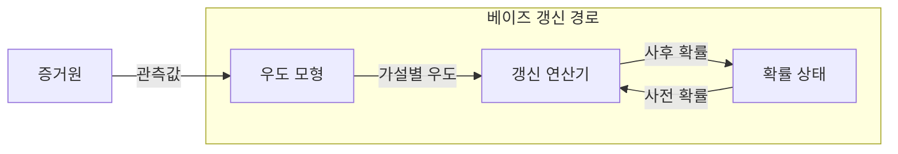
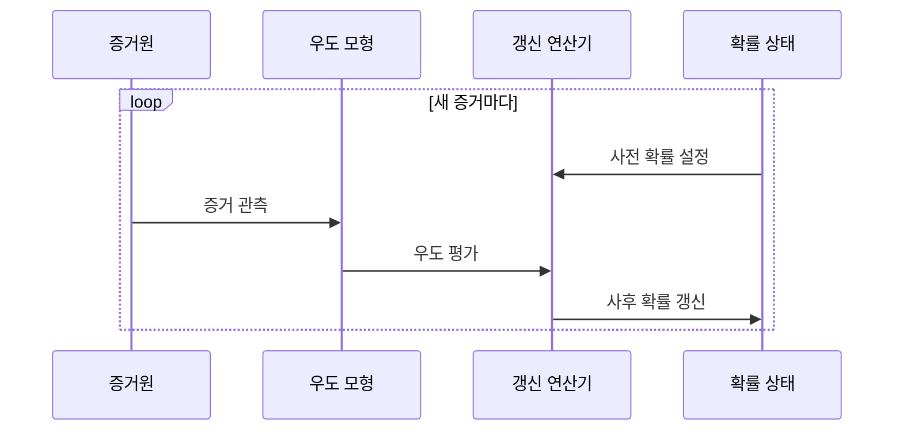

---
sidebar:
  order: 31
  label: "031. 확률 기초 — 베이즈 정리 (Bayes Theorem)"
  badge:
    text: "미출제 · 30%"
    variant: note
title: "확률 기초 — 베이즈 정리 (Bayes Theorem)"
date: "2026-07-26T00:10:00+09:00"
tags:
  - "notes-basic-theory"
weight: 31
extra:
  question_no: "031"
  source_status: "미출제"
  source_history: ""
  priority: 30
  priority_note: "베이즈 갱신은 불확실성 추론의 기본"
---

## 미리 알고가기

- **베이즈 정리(Bayes Theorem)**: 사전 확률과 우도로 증거 관측 후의 가설 확률을 구하는 정리
- **조건부 확률(Conditional Probability)**: 사건 B가 주어졌을 때 A의 확률
- **사전 확률(Prior Probability)**: 증거 관측 전 가설 확률
- **우도(Likelihood)**: ‘라이클리후드’로 읽으며, 가설·모수가 주어졌을 때 현재 데이터가 관측될 가능성을 나타내는 값
- **주변 확률(Marginal Probability)**: 특정 가설에 조건화하지 않은 증거 확률
- **사후 확률(Posterior Probability)**: 증거 반영 뒤 가설 확률
- **기저율(Base Rate)**: 모집단의 사건 발생률
- **빈도주의 통계(Frequentist Statistics)**: 반복 실험의 장기 빈도에 따른 확률 해석
- **베이지안 통계(Bayesian Statistics)**: 증거로 사전 확률을 갱신하는 통계
- **모수(Parameter)**: 확률 모형을 정하는 값
- **기호 $H$·$E$**: 각각 ‘에이치·이’로 읽고 hypothesis·evidence의 머리글자를 변수에 쓴 표기이며, 베이즈 식에서 갱신할 가설과 관측한 증거를 가리킨다.
- **확률 표기 $P(A)$·$P(A\mid B)$**: 각각 ‘피 오브 에이·비가 주어졌을 때 에이의 확률’로 읽고 $P$는 probability의 머리글자, 세로줄은 조건을 나타내는 수학 관례이며, 사건 $A$의 확률과 사건 $B$를 관측한 뒤의 조건부 확률을 가리킨다.
- **오탐(False Positive)**: 실제로는 음성인데 검사나 분류기가 양성으로 잘못 판정한 결과
- **적용 조건 $P(E)>0$**: ‘피 오브 이는 영보다 크다’로 읽고 $>$는 왼쪽 값이 오른쪽 값보다 큼을 나타내는 수학 관례이며, 베이즈 식의 분모인 증거 확률이 0이 아니어야 계산할 수 있음을 뜻한다.

## Ⅰ. 개요

- 정의/개념: 증거 관측으로 **사전 확률**을 **사후 확률**로 갱신하는 정리
- 기존 한계: 관측되는 것은 결과뿐이라 **원인 확률**을 직접 측정 불가

### 쉽게 이해하기 (학습용)

- 탐정은 처음엔 용의자 셋을 비슷하게 의심하다가 현장에 왼손잡이 흔적이 있다는 단서 하나가 나오면 그쪽으로 의심을 옮기는데, 우리가 직접 볼 수 있는 것은 결과인 흔적뿐이고 정작 알고 싶은 것은 원인인 범인이므로 "그 사람이 범인이라면 이런 흔적을 남겼을 법한가"를 거꾸로 되짚어 의심의 크기를 다시 계산하는 규칙이 필요하다

## Ⅱ. 특징

- **사전 확률**과 **우도**의 곱으로 사후 확률 산출
- 조건부 확률 방향을 뒤집는 **역확률 추론**
- **기저율**이 낮으면 **오탐** 비중 증가로 사후 확률 저하

### 쉽게 이해하기 (학습용)

- 1만 명 중 한 명만 걸리는 병을 정확도 99%인 검사로 걸러 보면 양성이 뜬 사람 대부분이 실은 건강한 사람의 오탐이라 양성만으로 병일 확률은 여전히 1%에 못 미치는데, 베이즈 정리는 "그 원인이라면 이 단서가 나올 가능성"을 거꾸로 뒤집어 쓰면서 동시에 "그 원인이 애초에 얼마나 드문가"를 함께 곱해 주기 때문에 이런 착각을 막아 준다

## Ⅲ. 아키텍처 및 구성요소

| 설계 요소 | 설명 |
|:---|:---|
| 우도 모형 | 가설별 **우도** $P(E \mid H)$ 산출 |
| 갱신 연산기 | **주변 확률**로 정규화한 **사후 확률** 산출 |
| 확률 상태 | 직전 갱신 결과를 다음 **사전 확률**로 보관 |

$$P(H \mid E)=\frac{P(E \mid H)P(H)}{P(E)}$$

> 요약: 확률 상태만 교체하며 같은 **베이즈 식** 반복 적용

### 쉽게 이해하기 (학습용)

- 탐정 수첩에 적힌 용의자별 의심도가 확률 상태이고, 그 수첩 값과 "이 사람이라면 이런 단서를 남길 확률"을 함께 넘겨받은 계산 담당이 전체 합이 1이 되도록 나눠 새 의심도를 적어 수첩을 갈아 끼우는데, 계산하는 식 자체는 언제나 같고 수첩 값만 바뀐다

## Ⅳ. 원리 및 절차 흐름도

| 절차 | 설명 |
|:---|:---|
| 사전 확률 설정 | 직전 **사후 확률**을 그대로 승계 |
| 증거 관측 | 새 관측값을 **조건부 확률**의 조건으로 확보 |
| 우도 평가 | 가설별 **관측 확률** 계산 |
| 사후 확률 갱신 | **주변 확률** 나눗셈으로 합 1 정규화 |

> 요약: 증거마다 **순차 갱신**으로 확률 상태 누적 보정

### 쉽게 이해하기 (학습용)

- 새 단서가 들어올 때마다 "이 사람이 범인이라면 이런 단서가 나올 법한가"를 따져 그 비율만큼 용의자별 의심도를 늘리거나 줄인 뒤 전체 합이 1이 되게 다시 나눠 적고, 이렇게 고쳐 적은 수첩이 다음 단서를 볼 때의 출발점이 되므로 단서가 쌓일수록 의심이 한쪽으로 모인다

## Ⅴ. 종류 및 비교

| 통계적 추론 관점 | 베이지안 통계 | 빈도주의 통계 |
|:---|:---|:---|
| 적용 기준 | **사전 정보**가 있고 표본이 적을 때 | **장기 오류율** 통제가 목표일 때 |
| 핵심 특징 | 증거로 **확률 갱신** | 반복 표본으로 **고정 모수** 추정 |
| 한계 | 주관적 **사전 확률**이 결과 좌우 | 단일 표본의 **모수 불확실성** 누락 |

> 요약: 사전 정보 활용은 **베이지안**, 반복 표본은 **빈도주의**

### 쉽게 이해하기 (학습용)

- 베이지안은 "지난 경험상 이럴 확률이 이쯤"이라는 출발점을 인정하고 새 자료로 그 숫자를 고쳐 가는 방식이라 자료가 적을 때 강한 대신 출발점을 잘못 잡으면 결론까지 끌려가고, 빈도주의는 같은 실험을 아주 여러 번 반복했을 때 몇 번 틀리는지로 판단해 출발점 논쟁은 없지만 표본 하나만 놓고 모수가 얼마나 불확실한지는 말해 주지 않는다

## Ⅵ. 실무 사례

1. 스팸 필터는 단어 **우도**·**기저율**로 사후 확률 산출
2. 장애 진단은 경보별 **사후 확률**로 원인 **점검 순서** 결정

### 쉽게 이해하기 (학습용)

- 스팸 필터는 "무료"라는 단어가 스팸 메일에 나올 확률과 정상 메일에 나올 확률의 차이를 보되 애초에 받은 메일 중 스팸이 몇 퍼센트인지도 함께 곱하기 때문에, 단어 하나만 보고 정상 메일을 스팸함으로 던지지 않는다
- 장애 진단기는 같은 응답 지연 경보라도 그 경보가 디스크 고장에서 나올 확률과 네트워크 혼잡에서 나올 확률이 다르고 평소 두 원인의 발생 빈도도 다르므로, 둘을 곱해 의심이 큰 쪽부터 점검하도록 순서를 매긴다

## Ⅶ. 결론

- **기저율**이 낮으면 단일 양성 **확정 판정** 유보

### 쉽게 이해하기 (학습용)

- 드문 원인일수록 검사 한 번의 양성만으로는 여전히 아닐 가능성이 더 크므로, 평소 발생률을 곱해 본 뒤 확신이 부족하면 그 자리에서 확정 짓지 말고 다른 단서를 하나 더 모아 다시 계산한다
