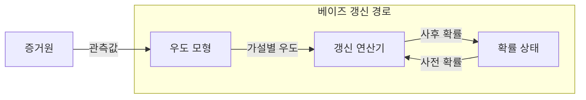

---
sidebar:
  order: 31
  label: "031. 확률 기초 — 베이즈 정리 (Bayes Theorem)"
  badge:
    text: "미출 · 30%"
    variant: note
title: "확률 기초 — 베이즈 정리 (Bayes Theorem)"
date: "2026-07-28T12:05:41+09:00"
tags:
  - "notes-basic-theory"
weight: 31
extra:
  question_no: "031"
  source_status: "미출"
  source_history: ""
  priority: 30
  priority_note: "베이즈 갱신은 불확실성 추론의 기본"
---

## 미리 알고가기

- **베이즈 정리(Bayes Theorem)**: 사전 확률과 우도로 증거 관측 후의 가설 확률을 구하는 정리
- **조건부 확률(Conditional Probability)**: 사건 B가 주어졌을 때 A의 확률
- **사전 확률(Prior Probability)**: 증거 관측 전 가설 확률
- **우도(Likelihood)**: 관측된 결과 데이터에 대한 가설의 적합도를 나타내는 수치
- **주변 확률(Marginal Probability)**: 특정 가설에 조건화하지 않은 증거 확률
- **사후 확률(Posterior Probability)**: 증거 반영 뒤 가설 확률
- **기저율(Base Rate)**: 모집단의 사건 발생률
- **빈도주의 통계(Frequentist Statistics)**: 반복 실험의 장기 빈도에 따른 확률 해석
- **베이지안 통계(Bayesian Statistics)**: 증거로 사전 확률을 갱신하는 통계
- **모수(Parameter)**: 확률 모형을 정하는 값
- **기호 $H$·$E$**: 갱신할 가설과 관측한 증거
- **확률 표기 $P(A)$·$P(A\mid B)$**: 사건 확률과 사건 $B$가 주어진 조건부 확률
- **오탐(False Positive)**: 실제로는 음성인데 검사나 분류기가 양성으로 잘못 판정한 결과
- **적용 조건 $P(E)>0$**: 베이즈 식의 분모인 증거 확률이 0이 아니어야 한다는 조건

## Ⅰ. 개요

- 정의/개념: 증거 관측으로 **사전 확률**을 **사후 확률**로 갱신하는 정리
- 기존 한계: 관측되는 것은 결과뿐이라 **원인 확률**을 직접 측정 불가

### 쉽게 이해하기 (학습용)

- 관측 가능한 결과의 우도와 원인의 사전 확률을 결합해 원인 확률을 갱신한다.

## Ⅱ. 특징

- **사전 확률**과 **우도**의 곱으로 사후 확률 산출
- 조건부 확률 방향을 뒤집는 **역확률 추론**
- **기저율**이 낮으면 **오탐** 비중 증가로 사후 확률 저하

### 쉽게 이해하기 (학습용)

- 희귀 사건은 검사 정확도가 높아도 오탐이 많을 수 있으므로 기저율을 함께 반영한다.

## Ⅲ. 갱신 구성

| 설계 요소 | 설명 |
|:---|:---|
| 우도 모형 | 가설별 **우도** $P(E \mid H)$ 산출 |
| 갱신 연산기 | **주변 확률**로 정규화한 **사후 확률** 산출 |
| 확률 상태 | 직전 갱신 결과를 다음 **사전 확률**로 보관 |

$$P(H \mid E)=\frac{P(E \mid H)P(H)}{P(E)}$$

> 요약: 확률 상태만 교체하며 같은 **베이즈 식** 반복 적용

### 쉽게 이해하기 (학습용)

- 사전 확률에 우도를 곱해 정규화하고 얻은 사후 확률을 다음 갱신의 사전 확률로 사용한다.

## Ⅳ. 운영 고려사항

| 고려사항 | 대응 방안 | 기대 효과 |
|:---|:---|:---|
| 희귀 사건의 기저율 무시 | 모집단 사전 확률을 명시적으로 반영 | 양성 결과의 과대해석 방지 |
| 상관된 증거를 독립으로 중복 반영 | 조건부 의존 구조를 모형에 포함 | 과도한 확신 방지 |
| 주관적 사전 확률 민감도 | 복수 사전 분포로 민감도 분석 | 결론의 강건성 확인 |
| 우도 모형의 분포 변화 | 보정 성능 모니터링과 재학습 | 사후 확률 신뢰도 유지 |

### 쉽게 이해하기 (학습용)

- 기저율과 증거 의존성, 사전 분포 민감도, 우도 변화까지 검증해야 한다.

## Ⅴ. 종류 및 비교

| 통계적 추론 관점 | 베이지안 통계 | 빈도주의 통계 |
|:---|:---|:---|
| 적용 기준 | **사전 정보**가 있고 표본이 적을 때 | **장기 오류율** 통제가 목표일 때 |
| 핵심 특징 | 증거로 **확률 갱신** | 반복 표본으로 **고정 모수** 추정 |
| 한계 | 주관적 **사전 확률**이 결과 좌우 | 단일 표본의 **모수 불확실성** 누락 |

> 요약: 사전 정보 활용은 **베이지안**, 반복 표본은 **빈도주의**

### 쉽게 이해하기 (학습용)

- 베이지안은 사전 정보를 갱신하고 빈도주의는 반복 표본의 장기 오류율을 기준으로 추론한다.

## Ⅵ. 실무 사례

1. 스팸 필터는 단어 **우도**·**기저율**로 사후 확률 산출

### 쉽게 이해하기 (학습용)

- 스팸 기저율과 단어별 우도를 결합해 메일의 사후 스팸 확률을 계산한다.

## Ⅶ. 결론

- 불확실성 갱신을 위해 기저율·우도·증거 의존성을 검토하여 **베이즈 정리** 활용

### 쉽게 이해하기 (학습용)

- 희귀 원인은 단일 양성만으로 확정하지 않고 추가 증거로 사후 확률을 갱신한다.
