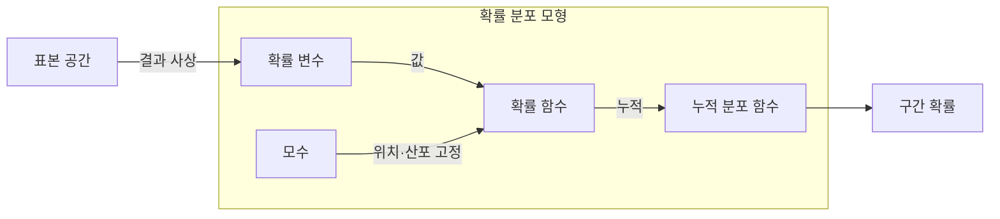

---
sidebar:
  order: 32
  label: "032. 확률 분포 — 정규·이항·포아송 (Probability Distribution)"
  badge:
    text: "미출제 · 30%"
    variant: note
title: "확률 분포 — 정규·이항·포아송 (Probability Distribution)"
date: "2026-07-26T00:14:00+09:00"
tags:
  - "notes-basic-theory"
weight: 32
extra:
  question_no: "032"
  source_status: "미출제"
  source_history: ""
  priority: 30
  priority_note: "분포 조건과 모수는 통계 모델의 기본"
---

## 미리 알고가기

- **확률 분포(Probability Distribution)**: 확률 변수의 값·구간별 발생 가능성을 정하는 법칙
- **표본 공간(Sample Space)**: 한 번의 시행에서 나올 수 있는 모든 결과를 모아 놓은 집합이며, 확률 변수는 이 집합의 결과 하나하나에 숫자를 붙여 준다
- **확률 변수(Random Variable)**: 무작위 결과를 수치로 나타낸 변수
- **모수(Parameter)**: 분포의 위치와 모양을 정하는 값
- **확률 질량 함수(Probability Mass Function, PMF)**: 이산값마다 확률을 부여하는 함수
- **확률 밀도 함수(Probability Density Function, PDF)**: 밀도를 적분해 구간 확률을 구하는 함수
- **누적 분포 함수(Cumulative Distribution Function, CDF)**: 특정 값 이하의 누적 확률
- **분위수-분위수 도표(Quantile-Quantile Plot, Q-Q 도표)**: ‘큐 큐 도표’로 읽고 두 Q는 비교할 두 quantile의 머리글자를 나란히 쓴 표기이며, 표본 분위수와 이론 분포 분위수의 일치도를 점검한다.
- **기댓값·분산(Expected Value·Variance)**: 분포의 평균 위치와 흩어짐
- **분포 기호 $n$·$p$·$\lambda$**: 각각 ‘엔·피·람다’로 읽고 $n$은 number, $p$는 probability의 머리글자, $\lambda$는 포아송 발생률에 관례적으로 쓰는 그리스 문자이며, 시행 수·성공률·단위 구간 평균 발생률을 가리킨다.
- **분포 기호 $\mu$·$\sigma^2$**: 각각 ‘뮤·시그마 제곱’으로 읽고 $\mu$와 $\sigma$는 평균과 표준편차에 관례적으로 쓰는 그리스 문자이며 위첨자 2는 제곱을 뜻해, 정규 분포의 평균과 분산을 가리킨다.
- **모수 범위 $0 \le p \le 1$·$\lambda>0$·$\sigma^2>0$**: 각각 ‘영 이상 일 이하·람다는 영보다 큼·시그마 제곱은 영보다 큼’으로 읽고 $\le$·$>$는 크기 관계를 나타내는 수학 관례이며, 확률·발생률·분산이 유효한 값이 되는 조건을 정한다.
- **정규 분포(Normal Distribution)**: 평균을 중심으로 좌우 대칭인 종 모양의 연속 분포
- **이항 분포(Binomial Distribution)**: 성공 확률이 일정한 독립 시행 $n$회에서 성공 횟수를 나타내는 이산 분포
- **포아송 분포(Poisson Distribution)**: 일정한 평균 발생률로 독립 사건이 생길 때 고정 구간의 발생 수를 나타내는 이산 분포
- **이산·연속 변수**: 이산 변수는 셀 수 있는 값을, 연속 변수는 구간 안의 실수값을 가짐
- **두꺼운 꼬리(Heavy Tail)**: 정규 분포보다 극단값의 발생 확률이 큰 분포 형태
- **군집 발생(Clustered Occurrence)**: 사건이 독립적으로 흩어지지 않고 특정 시점·구간에 몰려 발생하는 현상

## Ⅰ. 개요

- 정의/개념: **확률 변수**의 값·구간에 확률을 대응시키는 **함수**
- 기존 한계: 개별 관측만으로는 미관측 구간의 **발생 규칙** 예측 불가

### 쉽게 이해하기 (학습용)
- 주사위를 한 번 던져 3이 나왔다는 사실만으로는 다음에 뭐가 나올지 알 수 없지만 여섯 눈이 각각 6분의 1로 나온다는 표를 손에 쥐고 있으면 던지기 전에도 "3 이하가 나올 가능성은 절반"이라고 말할 수 있듯, 확률 분포는 개별 관측이 아니라 값마다 확률을 붙여 둔 규칙표를 주어 아직 일어나지 않은 일을 계산하게 해 준다

## Ⅱ. 특징

- 이산은 **PMF**, 연속은 **PDF**로 값별 확률 부여
- 전체 합·적분이 1인 **정규화 조건**
- **기댓값**·**분산**으로 중심·산포 정량화

### 쉽게 이해하기 (학습용)
- 주사위 눈처럼 셀 수 있는 값은 눈마다 확률을 적어 더하면 되지만 사람 키처럼 딱 떨어지지 않는 값은 "정확히 170.000cm일 확률"이 0이라 대신 곡선 아래 넓이로 구간 확률을 재는데, 어느 쪽이든 전부 모으면 1이 되도록 맞춰 두어야 그 위에서 평균 위치와 흩어진 정도를 계산할 수 있다

## Ⅲ. 아키텍처 및 구성요소

| 설계 요소 | 설명 |
|:---|:---|
| 확률 변수 | **표본 공간**의 결과를 실수값으로 사상 |
| 모수 | 평균·분산 등으로 **분포 형태** 고정 |
| 확률 함수 | 이산 질량·연속 밀도로 **값별 확률** 부여 |
| 누적 분포 함수 | 값 이하 확률 누적으로 **구간 확률** 산출 |

> 요약: **모수**가 정한 확률 함수에서 **누적 확률** 도출

### 쉽게 이해하기 (학습용)
- 앞면·뒷면 같은 결과 자체에는 계산할 숫자가 없으므로 먼저 결과마다 숫자를 붙여 놓고(확률 변수), 평균과 흩어짐을 정하는 손잡이 두 개를 돌려 곡선 모양을 고정한 뒤(모수), 그 곡선을 왼쪽부터 차곡차곡 쌓아 올린 값(누적 분포 함수)에서 "이 값 이하일 가능성"을 바로 읽어 낸다

## Ⅳ. 원리 및 절차 흐름도

- 이산 변수는 **확률 질량** 합산으로 구간 확률 산출
- 연속 변수는 **확률 밀도** 적분으로 같은 값 도출
- 실무 계산은 두 지점 **누적 분포** 차이로 대체

> 요약: 합·적분·차분이 모두 같은 **구간 확률** 산출

### 쉽게 이해하기 (학습용)
- 셀 수 있는 값은 해당하는 눈들의 확률을 그냥 더하고 연속 측정값은 곡선 아래 면적을 구해야 하는데, 매번 면적을 적분하는 대신 왼쪽부터 쌓아 둔 누적표에서 두 지점 값을 빼면 그 사이 면적이 바로 나오므로 실무에서는 표 두 번 조회로 끝낸다

## Ⅴ. 종류 및 비교

| 확률 분포 | 정규 분포 | 이항 분포 | 포아송 분포 |
|:---|:---|:---|:---|
| 적용 기준 | 독립 변동 합산에 **중심극한정리** 적용 시 | 시행 수·**성공률**이 고정될 때 | 단위 구간 **평균 발생률** 고정 시 |
| 핵심 특징 | 평균 중심 **좌우 대칭** 종형 | 고정 시행의 **성공 횟수** | 고정 구간의 **사건 발생 수** |
| 한계 | **두꺼운 꼬리** 사건 확률 과소평가 | 시행 간 **독립 가정** 위배 시 왜곡 | **평균=분산** 가정 위배 시 과산포 |

> 요약: 이항의 극한이 조건에 따라 **포아송**·**정규**로 근사

### 쉽게 이해하기 (학습용)
- 서로 독립인 자잘한 변동이 잔뜩 겹쳐 만들어진 값은 가운데가 불룩한 종 모양으로 몰리고, 동전을 딱 100번 던져 앞면이 몇 번 나오는지처럼 횟수가 정해진 성공 수는 이항으로, "한 시간에 문의가 몇 건 오는가"처럼 횟수 대신 구간만 정해 놓고 세는 값은 포아송으로 다루면 실제와 맞아떨어진다

## Ⅵ. 실무 사례

1. 용량 계획은 **포아송 분포**로 요청 초과 확률 산출

### 쉽게 이해하기 (학습용)
- 시간당 평균 요청이 200건이라 해도 매시간 딱 200건이 오는 것이 아니라 어떤 시간에는 260건이 몰리므로, 평균 발생률만 알면 정원을 넘길 확률이 몇 퍼센트인지 미리 계산해 그 확률이 허용치 아래로 내려가는 서버 대수를 정한다

## Ⅶ. 결론

- 독립 합산은 **정규**, 성공 횟수는 **이항**, 구간 발생 수는 포아송

### 쉽게 이해하기 (학습용)
- 손에 든 데이터가 여러 독립 요인이 겹쳐 만들어진 합인지, 정해진 횟수 안의 성공 수인지, 구간을 정해 놓고 센 발생 수인지만 먼저 가려내면 어떤 분포를 씌울지는 그에 따라 정해진다
