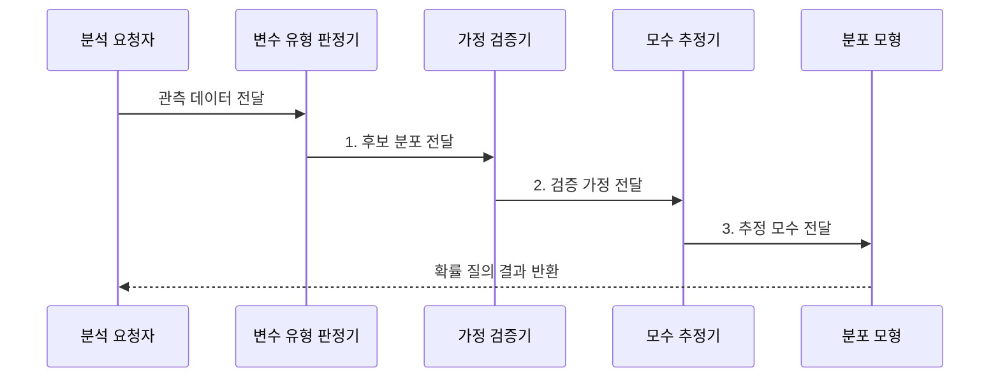

---
sidebar:
  order: 32
  label: "032. 확률 분포: 정규•이항•포아송 (Probability Distribution)"
  badge:
    text: "미출 • 30%"
    variant: note
title: "확률 분포: 정규•이항•포아송 (Probability Distribution)"
date: "2026-07-31T09:45:00+09:00"
tags:
  - "notes-basic-theory"
weight: 32
extra:
  question_no: "032"
  source_status: "미출"
  source_history: ""
  priority: 30
  priority_note: "분포 조건과 모수는 통계 모델의 기본"
---

## 미리 알고가기

- **확률 분포(Probability Distribution)**: 확률 변수의 값•구간별 발생 가능성을 정하는 법칙
- **표본 공간(Sample Space)**: 한 번의 시행에서 나올 수 있는 모든 결과의 집합
- **확률 변수(Random Variable)**: 무작위 결과를 수치로 나타낸 변수
- **모수(Parameter)**: 분포의 위치와 모양을 정하는 값
- **확률 질량 함수(Probability Mass Function, PMF)**: 이산값마다 확률을 부여하는 함수
- **확률 밀도 함수(Probability Density Function, PDF)**: 밀도를 적분해 구간 확률을 구하는 함수
- **누적 분포 함수(Cumulative Distribution Function, CDF)**: 특정 값 이하의 누적 확률
- **분위수-분위수 도표(Quantile-Quantile Plot, Q-Q 도표)**: 표본과 이론 분포의 분위수 일치도를 점검하는 도표
- **기댓값•분산(Expected Value•Variance)**: 분포의 평균 위치와 흩어짐
- **분포 기호 $n$•$p$•$\lambda$**: 시행 수•성공률•단위 구간 평균 발생률이며 $\lambda$는 ‘람다’로 읽음
- **분포 기호 $\mu$•$\sigma^2$**: ‘뮤•시그마 제곱’으로 읽으며 정규 분포의 평균과 분산
- **모수 범위 $0 \le p \le 1$•$\lambda>0$•$\sigma^2>0$**: 확률•발생률•분산의 유효 범위
- **정규 분포(Normal Distribution)**: 평균을 중심으로 좌우 대칭인 종 모양의 연속 분포
- **이항 분포(Binomial Distribution)**: 성공 확률이 일정한 독립 시행 $n$회에서 성공 횟수를 나타내는 이산 분포
- **포아송 분포(Poisson Distribution)**: 일정한 평균 발생률로 독립 사건이 생길 때 고정 구간의 발생 수를 나타내는 이산 분포
- **이산•연속 변수**: 이산 변수는 셀 수 있는 값을, 연속 변수는 구간 안의 실수값을 가짐
- **두꺼운 꼬리(Heavy Tail)**: 정규 분포보다 극단값의 발생 확률이 큰 분포 형태
- **군집 발생(Clustered Occurrence)**: 사건이 독립적으로 흩어지지 않고 특정 시점•구간에 몰려 발생하는 현상
- **중심극한정리(Central Limit Theorem)**: 독립 확률 변수의 합•평균이 표본 수 증가에 따라 정규 분포에 가까워지는 정리
- **과산포(Overdispersion)**: 관측 분산이 분포 모형이 가정한 분산보다 큰 상태
- **잔차(Residual)**: 관측값에서 분포 모형이 예측한 값을 뺀 차이
- **자기상관(Autocorrelation)**: 시차가 있는 관측값끼리 상관관계를 갖는 성질
- **변화점(Change Point)**: 확률 분포의 모수나 생성 규칙이 달라지는 시점
- **이동 창 추정(Rolling-window Estimation)**: 최근 일정 구간의 관측값만으로 모수를 반복 추정하는 방법

## Ⅰ. 개요

- 정의/개념: **확률 변수**의 값이나 구간에 확률을 대응한 함수
- 배경/필요성: 관측 빈도만으로는 미관측 구간의 **확률 산정 불가**

### 쉽게 이해하기 (학습용)
- 주사위 표에서 각 눈의 칸마다 가능성을 적듯, 확률 분포는 아직 나오지 않은 값과 구간에도 발생 가능성을 배정한다.

## Ⅱ. 특징

> 지정 모수의 계산값에서 사건 2회의 확률은 이항분포($n=4,p=0.5$) 0.375, 포아송분포($\lambda=2$) 0.271로 중심 높이가 다르다.

- 이산은 **PMF**, 연속은 **PDF**로 값별 확률 부여
- 전체 합•적분이 1인 **정규화 조건**
- **기댓값**•**분산**으로 중심•산포 정량화

### 쉽게 이해하기 (학습용)
- 주사위처럼 셀 수 있는 값은 확률을 더하고, 키처럼 연속인 값은 밀도 곡선 넓이로 확률을 구한다.

## Ⅲ. 구조 및 구성요소

| 구성요소 | 책임 |
|:---|:---|
| 표본공간 정의기 | 가능한 **사건 집합** 정의 |
| 확률변수 사상기 | 사건을 **수치값**으로 변환 |
| 모수 저장소 | 평균•분산 등 **분포 모수** 보관 |
| 분포 모형 | 질량•밀도로 **발생 가능성** 표현 |
| CDF 계산기 | 누적값 차이로 **구간 확률** 산출 |

### 쉽게 이해하기 (학습용)
- 동전 앞면을 1로 바꾸는 확률변수가 결과를 숫자로 놓고, 모수가 그래프 모양을 정하면 CDF 눈금 차이로 원하는 구간의 확률을 읽는다.

## Ⅳ. 흐름도

### 동작 원리

- **1. 후보 분포 전달**: 생성 과정에 맞는 모형 선정
- **2. 검증 가정 전달**: 독립성•산포•꼬리 확인
- **3. 추정 모수 전달**: 분포 모형의 모수 확정

### 쉽게 이해하기 (학습용)

- 값의 종류와 생성 과정을 확인해 후보 분포를 고르고, 가정 검증을 통과한 뒤 관측값으로 모수를 추정한다.

## Ⅴ. 종류 및 비교

| 확률 분포 | 정규 분포 | 이항 분포 | 포아송 분포 |
|:---|:---|:---|:---|
| 적용 기준 | 독립 변동 합산에 **중심극한정리** 적용 시 | 시행 수•**성공률**이 고정될 때 | 단위 구간 **평균 발생률** 고정 시 |
| 핵심 특징 | 평균 중심 **좌우 대칭** 종형 | 고정 시행의 **성공 횟수** | 고정 구간의 **사건 발생 수** |
| 한계 | **두꺼운 꼬리** 사건 확률 과소평가 | 시행 간 **독립 가정** 위배 시 왜곡 | **평균=분산** 가정 위배 시 과산포 |

### 쉽게 이해하기 (학습용)
- 여러 작은 오차의 합은 종 모양 정규, 동전 $n$번의 앞면 수는 이항, 한 시간에 오는 전화 수는 포아송 분포로 나타낸다.

## Ⅵ. 실무 고려사항 및 대책

| 고려사항 | 대책 | 효과 |
|:---|:---|:---|
| 데이터 유형과 **분포 불일치** | 이산•연속과 **생성 과정** 확인 | **모형 의미** 일치 |
| 독립•고정확률•**평균=분산** 위배 | 잔차•과산포•**자기상관 검정** | **확률 왜곡** 방지 |
| 정규 분포의 **꼬리 과소평가** | **Q-Q 도표**•꼬리 분포 검토 | **극단 사건 위험** 반영 |
| 시간에 따른 **모수 변화** | 이동 창 추정•**변화점 감시** | **분포 변화** 대응 |

### 쉽게 이해하기 (학습용)
- 전화가 한꺼번에 몰리면 포아송의 평균=분산 가정이 깨지므로 잔차•과산포를 보고, 시간대가 바뀌면 이동 창으로 발생률을 다시 잰다.

## Ⅶ. 결론

- 오차 합은 **정규**, 고정 시행은 **이항**, 고정 구간은 포아송 선택

### 쉽게 이해하기 (학습용)
- 값이 생긴 장면이 오차의 합인지, 고정 횟수의 성공인지, 고정 시간의 발생인지 먼저 확인한 뒤 정규•이항•포아송을 고른다.
