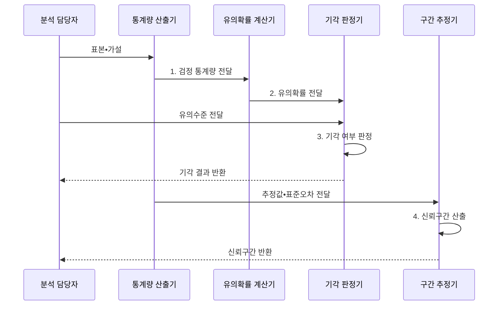

---
sidebar:
  order: 33
  label: "033. 가설 검정•신뢰 구간 (Hypothesis Testing and Confidence Interval)"
  badge:
    text: "미출 • 50%"
    variant: note
title: "가설 검정•신뢰 구간 (Hypothesis Testing and Confidence Interval)"
date: "2026-08-02T17:03:00+09:00"
tags:
  - "notes-basic-theory"
weight: 33
extra:
  question_no: "033"
  source_status: "미출"
  source_history: ""
  priority: 50
  priority_note: "유의수준•오류•신뢰구간은 검증의 기본"
---

## Ⅰ. 개요

핵심 용어

- **가설 검정**: 표본이 귀무가설과 얼마나 양립하는지 계산해 기각 여부를 정하는 통계 절차
- **신뢰구간**: 반복 표본 추출에서 정한 비율로 참모수를 포함하도록 만든 추정 구간

- 정의/개념: 표본으로 **귀무가설 기각 여부**를 검정하고 참모수의 신뢰구간을 추정하는 통계적 추론 절차
- 배경/필요성: 관측 차이와 **표본 변동성**의 영향 구분

#### 한줄 요약
- 새 약의 차이가 우연만으로도 나올 만큼 흔한지 가설 검정으로 판정하고, 실제 약효가 놓일 만한 폭은 신뢰구간으로 제시한다.

## Ⅱ. 특징

핵심 용어

- **유의수준**: 참인 귀무가설을 잘못 기각할 최대 허용 확률
- **검정력**: 거짓인 귀무가설을 올바르게 기각할 확률
- **효과 크기**: 집단 차이나 관계의 실질적인 크기
- **유의확률**: 귀무가설 아래 관측값 이상으로 극단적인 결과가 나올 확률

- **유의수준**으로 상한을 고정하는 **제1종 오류율**
- 표본 크기•**효과 크기**•유의수준에 따라 달라지는 **검정력**
- **유의확률**은 기각 여부, **신뢰구간**은 효과 범위 제시

#### 한줄 요약
- 경보기 문턱을 높이면 오경보와 감지가 함께 줄듯, 유의수준을 낮추면 제1종 오류와 검정력이 함께 감소한다.

## Ⅲ. 구조 및 구성요소

핵심 용어

- **검정 통계량**: 표본과 귀무가설의 차이를 기각 판단에 쓸 하나의 수치로 요약한 값
- **귀무분포**: 귀무가설이 참일 때 검정 통계량이 따르는 분포
- **표준오차**: 추정량 표본분포의 표준편차

| 구성요소 | 책임 |
|:---|:---|
| 검정 통계량 산출기 | 표본 차이를 **검정 통계량**으로 요약 |
| 귀무분포 모형 | 귀무가설의 **통계량 분포** 제공 |
| 유의확률 계산기 | 귀무분포의 **극단 확률** 산출 |
| 기각 판정기 | 유의확률•**유의수준** 비교 |
| 구간 추정기 | 표준오차로 **신뢰구간** 산출 |

#### 한줄 요약

- 통계량과 귀무분포로 꼬리 확률을 구해 기각 여부를 정하고, 같은 추정값의 불확실성을 신뢰구간으로 제시한다.

## Ⅳ. 흐름도

핵심 용어

- **귀무•대립가설 $H_0,H_1$**: 차이 없음을 기본으로 둔 가설과 검출하려는 차이를 나타낸 가설
- **기각역**: 귀무가설을 기각하도록 정한 검정 통계량의 극단 범위
- **$1-\beta$**: 실제 차이가 있을 때 귀무가설을 올바르게 기각하는 검정력

> **가설 표기**: 귀무 $H_0$•대립 $H_1$
>
> **검정력**: $1-\beta$
>
### 동작 원리

- **1. 검정 통계량 전달**: 표본 차이를 표준화
- **2. 유의확률 전달**: 귀무분포의 극단 확률 계산
- **3. 기각 여부 판정**: 유의수준과 비교
- **4. 신뢰구간 산출**: 효과 크기•정밀도 제시

#### 한줄 요약
- 표본 차이를 귀무분포의 눈금에 놓아 꼬리 확률을 읽으면 기각 여부가 나오고, 추정값 양옆에 표준오차 여유를 두면 효과의 신뢰구간이 나온다.

## Ⅴ. 종류 및 비교

핵심 용어

- **가설 검정**: 귀무가설과 표본의 양립성을 유의확률로 판단하는 방법
- **신뢰구간**: 모수의 가능한 범위와 추정 정밀도를 함께 제시하는 방법
- **포함률**: 같은 절차로 구간을 반복 생성할 때 참모수를 포함하는 비율

| 통계적 추론 방법 | 가설 검정 | 신뢰구간 |
|:---|:---|:---|
| 적용 기준 | **귀무가설** 양립성 판단이 목표일 때 | **효과 크기**•정밀도 판단이 목표일 때 |
| 핵심 특징 | **유의확률**•유의수준 비교로 기각 판정 | 참모수를 포함할 **구간 추정** 제시 |
| 한계 | **다중 검정** 시 1종 오류 누적 | **분포 가정** 위배 시 포함률 저하 |

> 요약: 기각 여부는 **가설 검정**, 추정 범위는 **신뢰구간**

#### 한줄 요약
- 문을 통과했는지만 묻는 가설 검정은 기각 여부를 주고, 자가 어느 구간을 덮는지 보여 주는 신뢰구간은 효과 크기와 정밀도를 함께 준다.

## Ⅵ. 실무 고려사항 및 대책

핵심 용어

- **사전 등록**: 데이터를 보기 전에 가설•분석법•중단 규칙을 기록하는 절차
- **가족별 오류율•거짓 발견률**: 다중 검정의 하나 이상 오탐 확률과 기각 중 거짓 기각의 기대 비율
- **사전 검정력 분석**: 예상 효과 크기•유의수준•목표 검정력으로 필요한 표본 수를 계산하는 절차

| 문제 | 대책 | 효과 |
|:---|:---|:---|
| 결과 확인 후 **가설•유의수준** 변경 | 분석 계획•중단 규칙 사전 등록 | **선택적 보고 편향** 방지 |
| 다중 비교의 **제1종 오류** 누적 | 가족별 오류율•거짓 발견률 보정 | 전체 **오탐률** 통제 |
| 유의확률만으로 **실무 효과** 과장 | 효과 크기•신뢰구간•업무 임계값 병기 | **실질적 의미** 판별 |
| 표본 부족의 **검정력** 저하 | 사전 검정력 분석으로 표본 수 산정 | **제2종 오류** 완화 |

#### 한줄 요약
- 화살을 많이 던질수록 우연히 과녁을 맞힐 가능성이 커지므로 다중 비교를 보정하고, 던지기 전에 표본 수•효과 크기•중단 규칙을 고정한다.

## Ⅶ. 결론

핵심 용어

- **업무 효과선**: 통계적으로 유의한 차이가 실제 적용 가치도 갖기 위해 넘어야 하는 최소 효과 크기
- **신뢰구간 하한**: 추정 구간에서 참효과가 가질 수 있다고 보는 가장 낮은 경계

- 귀무가설 기각 후 **신뢰구간 하한**이 업무 효과선을 넘을 때 적용

#### 한줄 요약
- 유의확률이 문턱을 넘었어도 신뢰구간 전체가 업무상 필요한 효과선 아래라면, 통계적으로 보인 차이를 실제 적용하지 않는다.
