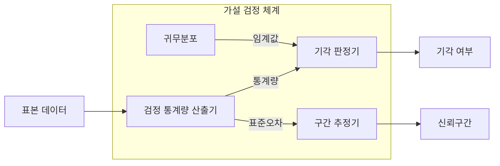

---
sidebar:
  order: 33
  label: "033. 가설 검정·신뢰 구간 (Hypothesis Testing and Confidence Interval)"
  badge:
    text: "미출 · 50%"
    variant: note
title: "가설 검정·신뢰 구간 (Hypothesis Testing and Confidence Interval)"
date: "2026-07-28T12:07:23+09:00"
tags:
  - "notes-basic-theory"
weight: 33
extra:
  question_no: "033"
  source_status: "미출"
  source_history: ""
  priority: 50
  priority_note: "유의수준·오류·신뢰구간은 검증의 기본"
---

## 미리 알고가기

- **가설 검정(Hypothesis Testing)**: 표본이 귀무가설과 얼마나 양립하는지 계산해 기각 여부를 정하는 통계 절차
- **신뢰구간(Confidence Interval)**: 같은 표본 추출을 반복할 때 정한 비율로 참모수를 포함하도록 만든 추정 구간
- **귀무가설·대립가설(Null·Alternative Hypothesis)**: 귀무가설은 차이 없음을 기본으로 두고 대립가설은 검출하려는 차이를 나타냄
- **유의수준(Significance Level)**: 참인 귀무가설을 잘못 기각할 최대 허용 확률이며, 검정 전에 미리 정해 두는 제1종 오류율의 상한
- **제1종 오류(Type I Error)**: 참인 귀무가설의 잘못된 기각
- **제2종 오류(Type II Error)**: 거짓인 귀무가설을 기각하지 못함
- **유의확률(p-value)**: 귀무가설 아래 관측값 이상으로 극단적인 결과가 나올 확률
- **표준오차(Standard Error, SE)**: 추정량 표본분포의 표준편차
- **임계값(Critical Value)**: 기각역 경계·구간 폭의 기준값
- **검정력(Statistical Power)**: 거짓인 귀무가설을 올바르게 기각할 확률
- **효과 크기(Effect Size)**: 집단 차이·관계의 실질적 크기
- **가설 기호 $H_0$·$H_1$**: 귀무가설과 대립가설
- **검정 기호 $\alpha$·$\beta$**: ‘알파·베타’로 읽으며 제1종·제2종 오류율
- **추정 기호 $\hat{\theta}$**: ‘세타 햇’으로 읽으며 표본으로 계산한 모수 추정값
- **검정력 식 $1-\beta$**: 실제 차이가 있을 때 귀무가설을 올바르게 기각할 확률
- **다중 비교 보정(Multiple Comparison Correction)**: 여러 검정을 동시에 수행할 때 늘어나는 전체 제1종 오류를 통제하는 조정
- **검정 통계량(Test Statistic)**: 표본과 귀무가설의 차이를 하나의 수치로 요약해 기각 판단에 쓰는 값
- **귀무분포(Null Distribution)**: 귀무가설이 참일 때 검정 통계량이 따르는 분포
- **조정 유의확률(Adjusted p-value)**: 여러 가설을 동시에 검정할 때 전체 1종 오류 증가를 반영해 보정한 유의확률

## Ⅰ. 개요

- 정의/개념: **표본 통계량**으로 모집단 **귀무가설**을 판정하는 추론 기법
- 기존 한계: **표본 변동성** 탓에 관측 차이가 우연인지 실제인지 미구분

### 쉽게 이해하기 (학습용)
- 관측 차이가 귀무가설 아래 얼마나 드문지 판단하고 신뢰구간으로 가능한 효과 범위를 제시한다.

## Ⅱ. 특징

- **유의수준**으로 상한을 고정하는 **제1종 오류율**
- 표본 크기·**효과 크기**·유의수준이 좌우하는 **검정력**
- **통계적 유의성**이 실무 의미를 보장하지 않는 한계

### 쉽게 이해하기 (학습용)
- 유의수준을 낮추면 제1종 오류는 줄지만 검정력이 낮아질 수 있어 표본 수와 효과 크기를 함께 본다.

## Ⅲ. 검정·추정 구성

| 설계 요소 | 설명 |
|:---|:---|
| 검정 통계량 산출기 | 표본과 귀무가설 차이를 **검정 통계량**으로 요약 |
| 귀무분포 | 귀무가설 아래 통계량 분포와 **임계값** 제공 |
| 기각 판정기 | **유의확률**과 **유의수준** 비교로 기각 결정 |
| 구간 추정기 | **표준오차**·임계값으로 **신뢰구간** 산출 |

> 표기: 귀무가설 $H_0$·대립가설 $H_1$, 모수 추정값 $\hat{\theta}$
>
> 오류율: 유의수준 $\alpha$·제2종 $\beta$, **검정력** $=1-\beta$
>
> 요약: 기각 판정과 **구간 추정**이 같은 표본분포 공유

### 쉽게 이해하기 (학습용)
- 같은 표본분포에서 가설 검정은 기각 여부를, 구간 추정은 효과 크기와 정밀도를 산출한다.

## Ⅳ. 운영 고려사항

| 고려사항 | 대응 방안 | 기대 효과 |
|:---|:---|:---|
| 결과 확인 후 가설·유의수준 변경 | 분석 계획과 중단 규칙 사전 등록 | 선택적 보고 편향 방지 |
| 다중 비교로 제1종 오류 누적 | 가족별 오류율·거짓 발견률 보정 | 전체 오탐 통제 |
| 유의확률만으로 실무 효과 과장 | 효과 크기·신뢰구간·업무 임계값 병기 | 실질적 의미 판단 |
| 표본 부족으로 검정력 저하 | 사전 검정력 분석으로 표본 수 산정 | 제2종 오류 완화 |

### 쉽게 이해하기 (학습용)
- 분석 계획을 사전에 고정하고 다중 비교·검정력·효과 크기를 함께 검토한다.

## Ⅴ. 종류 및 비교

| 통계적 추론 방법 | 가설 검정 | 신뢰구간 |
|:---|:---|:---|
| 적용 기준 | **귀무가설** 양립성 판단이 목표일 때 | **효과 크기**·정밀도 판단이 목표일 때 |
| 핵심 특징 | **유의확률**·유의수준 비교로 기각 판정 | 참모수를 포함할 **구간 추정** 제시 |
| 한계 | **다중 검정** 시 1종 오류 누적 | **분포 가정** 위배 시 포함률 저하 |

> 요약: 기각 여부는 **가설 검정**, 추정 범위는 **신뢰구간**

### 쉽게 이해하기 (학습용)
- 가설 검정은 양립성을 판정하고 신뢰구간은 효과의 가능한 범위와 정밀도를 보여 준다.

## Ⅵ. 실무 사례

1. 두 버전 지연 차 **신뢰구간**이 **개선 기준** 초과 시 배포

### 쉽게 이해하기 (학습용)
- 지연 차이 신뢰구간의 보수적 끝값이 개선 기준을 넘을 때 배포한다.

## Ⅶ. 결론

- 기각 후에도 **신뢰구간**이 **실무 기준** 미달이면 적용 보류

### 쉽게 이해하기 (학습용)
- 통계적 유의성과 별개로 신뢰구간이 실무 기준을 충족하는지 확인한다.
