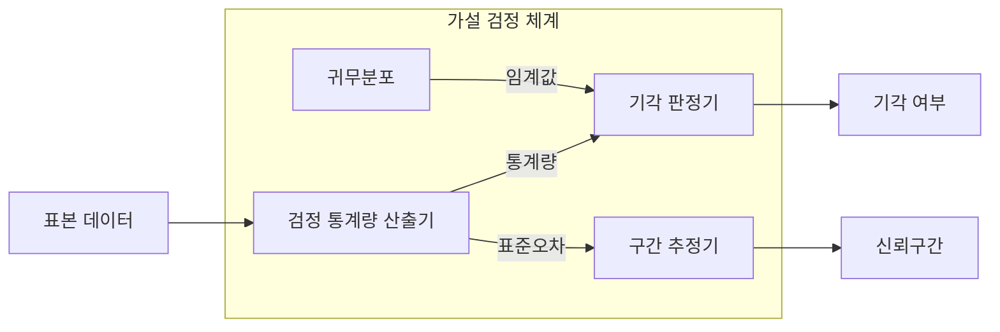
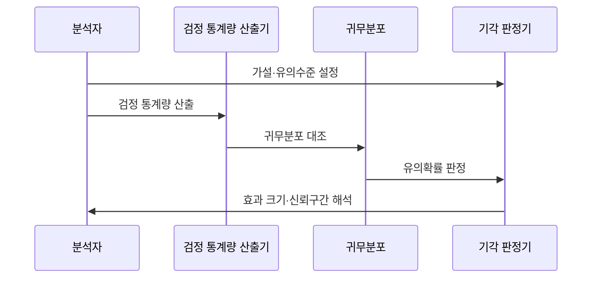

---
sidebar:
  order: 33
  label: "033. 가설 검정·신뢰 구간 (Hypothesis Testing and Confidence Interval)"
  badge:
    text: "미출제 · 50%"
    variant: note
title: "가설 검정·신뢰 구간 (Hypothesis Testing and Confidence Interval)"
date: "2026-07-26T22:16:20+09:00"
tags:
  - "notes-basic-theory"
weight: 33
extra:
  question_no: "033"
  source_status: "미출제"
  source_history: ""
  priority: 50
  priority_note: "유의수준·오류·신뢰구간은 검증의 기본"
---

## 미리 알고가기

- **가설 검정(Hypothesis Testing)**: 표본이 귀무가설과 얼마나 양립하는지 계산해 기각 여부를 정하는 통계 절차
- **신뢰구간(Confidence Interval)**: 같은 표본 추출을 반복할 때 정한 비율로 참모수를 포함하도록 만든 추정 구간
- **귀무가설·대립가설(Null·Alternative Hypothesis)**: 귀무가설은 차이 없음을 기본으로 두고 대립가설은 검출하려는 차이를 나타냄
- **유의수준(Significance Level)**: 참인 귀무가설을 잘못 기각할 최대 허용 확률이며, 검정 전에 미리 정해 두는 제1종 오류율의 상한
- **제1종 오류(Type I Error)**: 참인 귀무가설의 잘못된 기각
- **제2종 오류(Type II Error)**: 거짓인 귀무가설을 기각하지 못함
- **유의확률(p-value)**: ‘피 밸류’로 읽고 p는 probability의 머리글자이며, 귀무가설 아래 관측값 이상으로 극단적일 확률을 뜻함
- **표준오차(Standard Error, SE)**: 추정량 표본분포의 표준편차
- **임계값(Critical Value)**: 기각역 경계·구간 폭의 기준값
- **검정력(Statistical Power)**: 거짓인 귀무가설을 올바르게 기각할 확률
- **효과 크기(Effect Size)**: 집단 차이·관계의 실질적 크기
- **가설 기호 $H_0$·$H_1$**: 각각 ‘에이치 제로·에이치 원’으로 읽고 $H$는 hypothesis의 머리글자, 아래첨자 0·1은 기본 가설과 대안 가설을 구분하는 관례이며, 귀무가설과 대립가설을 가리킨다.
- **검정 기호 $\alpha$·$\beta$**: 각각 ‘알파·베타’로 읽고 두 오류율에 관례적으로 쓰는 그리스 문자이며, 제1종 오류율과 제2종 오류율을 가리킨다.
- **추정 기호 $\hat{\theta}$**: ‘세타 햇’으로 읽고 $\theta$는 미지 모수에 관례적으로 쓰는 그리스 문자이며 위의 모자표는 추정값을 나타내므로, 표본으로 계산한 모수 추정값을 가리킨다.
- **검정력 식 $1-\beta$**: ‘일 마이너스 베타’로 읽고 빼기표는 전체 확률 1에서 제2종 오류율을 제외하는 수학 관례이며, 실제 차이가 있을 때 귀무가설을 올바르게 기각할 확률을 계산한다.
- **다중 비교 보정(Multiple Comparison Correction)**: 여러 검정을 동시에 수행할 때 늘어나는 전체 제1종 오류를 통제하는 조정
- **검정 통계량(Test Statistic)**: 표본과 귀무가설의 차이를 하나의 수치로 요약해 기각 판단에 쓰는 값
- **귀무분포(Null Distribution)**: 귀무가설이 참일 때 검정 통계량이 따르는 분포
- **조정 유의확률(Adjusted p-value)**: 여러 가설을 동시에 검정할 때 전체 1종 오류 증가를 반영해 보정한 유의확률

## Ⅰ. 개요

- 정의/개념: **표본 통계량**으로 모집단 **귀무가설**을 판정하는 추론 기법
- 기존 한계: **표본 변동성** 탓에 관측 차이가 우연인지 실제인지 미구분

### 쉽게 이해하기 (학습용)
- 동전을 100번 던져 앞면이 58번 나왔다고 곧바로 "이 동전은 휘었다"고 말할 수 없는 이유는 공정한 동전으로도 58번쯤은 심심찮게 나오기 때문인데, 가설 검정은 "공정하다"를 일단 참이라 두고 지금 결과가 그 가정 아래 얼마나 드문지를 재고, 신뢰구간은 한 걸음 더 나아가 실제 앞면 비율이 어느 범위에 있을지까지 함께 보여 준다

## Ⅱ. 특징

- **유의수준**으로 상한을 고정하는 **제1종 오류율**
- 표본 크기·**효과 크기**·유의수준이 좌우하는 **검정력**
- **통계적 유의성**이 실무 의미를 보장하지 않는 한계

### 쉽게 이해하기 (학습용)
- 기각 기준선을 5%에서 1%로 조이면 아무 차이도 없는데 있다고 외치는 거짓 경보는 줄지만 정작 있는 차이를 놓치는 일이 늘어 검정력이 떨어지고, 두 실수를 동시에 줄이려면 표본을 늘리는 수밖에 없으며, 표본을 아주 크게 잡으면 이번에는 실무에서 무시해도 될 0.1% 차이까지 "통계적으로 유의하다"는 판정이 나오므로 차이의 크기를 따로 봐야 한다

## Ⅲ. 아키텍처 및 구성요소

| 설계 요소 | 설명 |
|:---|:---|
| 검정 통계량 산출기 | 표본과 귀무가설 차이를 **검정 통계량**으로 요약 |
| 귀무분포 | 귀무가설 아래 통계량 분포와 **임계값** 제공 |
| 기각 판정기 | **유의확률**과 **유의수준** 비교로 기각 결정 |
| 구간 추정기 | **표준오차**·임계값으로 **신뢰구간** 산출 |

> 표기: 귀무가설 $H_0$·대립가설 $H_1$, 모수 추정값 $\hat{\theta}$
>
> 오류율: 유의수준 $\alpha$·제2종 $\beta$, **검정력** $=1-\beta$
>
> 요약: 기각 판정과 **구간 추정**이 같은 표본분포 공유

### 쉽게 이해하기 (학습용)
- 같은 표본 하나에서 두 갈래 답이 나오는데, "차이 없음"을 가정했을 때 그려지는 분포 위에 관측값을 올려놓고 꼬리 쪽으로 얼마나 멀리 떨어졌는지 재면 기각 여부가 나오고, 그 관측값을 가운데 두고 표준오차만큼 좌우로 폭을 벌리면 참값이 들어 있을 구간이 나오므로 두 결과는 같은 흩어짐 정보를 다르게 읽은 셈이다

## Ⅳ. 원리 및 절차 흐름도

| 절차 | 설명 |
|:---|:---|
| 가설·유의수준 설정 | **귀무가설** 기각 한계로 **제1종 오류율** 고정 |
| 검정 통계량 산출 | 자료 조건에 맞는 검정법으로 **통계량** 계산 |
| 귀무분포 대조 | 통계량 위치를 **귀무분포** 꼬리와 비교 |
| 유의확률 판정 | 유의수준 이하면 기각, 초과면 **기각 불가** |
| 효과 크기·신뢰구간 해석 | **효과 크기**·**신뢰구간**으로 실질성 확인 |

> 요약: 먼저 정한 **유의수준**과 **유의확률**을 비교해 기각 여부 결정

### 쉽게 이해하기 (학습용)
- 실험 결과를 보고 나서 기준선을 정하면 유리한 쪽으로 옮기고 싶어지므로 자료를 열기 전에 "5%까지는 헛다리를 허용한다"고 먼저 못 박아 둔다. 그다음 표본에서 뽑은 값이 차이가 없을 때의 분포에서 얼마나 극단적인지를 확률로 바꿔 기준선과 비교한다. 기각 여부와 관계없이 마지막에는 차이의 크기와 범위까지 확인해야 결론이 완성된다

## Ⅴ. 종류 및 비교

| 통계적 추론 방법 | 가설 검정 | 신뢰구간 |
|:---|:---|:---|
| 적용 기준 | **귀무가설** 양립성 판단이 목표일 때 | **효과 크기**·정밀도 판단이 목표일 때 |
| 핵심 특징 | **유의확률**·유의수준 비교로 기각 판정 | 참모수를 포함할 **구간 추정** 제시 |
| 한계 | **다중 검정** 시 1종 오류 누적 | **분포 가정** 위배 시 포함률 저하 |

> 요약: 기각 여부는 **가설 검정**, 추정 범위는 **신뢰구간**

### 쉽게 이해하기 (학습용)
- 가설 검정은 "차이가 없다"는 기본 주장을 무너뜨릴 만큼 자료가 드문지를 예·아니오로 답해 주는 재판이고 신뢰구간은 같은 자료로 "실제 차이는 대략 2ms에서 9ms 사이"처럼 폭을 그려 주는 자라서, 재판 결과만 보면 그 차이가 손톱만 한지 손바닥만 한지 알 수 없으므로 둘을 함께 봐야 한다

## Ⅵ. 실무 사례

1. 두 버전 지연 차 **신뢰구간**이 **개선 기준** 초과 시 배포
2. 탐지 모델은 **조정 유의확률**로 **다중 비교 보정**

### 쉽게 이해하기 (학습용)
- 새 버전이 옛 버전보다 응답이 빨라졌다는 평균값 하나만 보고 내보내면 그 차이가 우연일 수 있으므로, 두 버전의 지연 차이가 놓일 만한 구간을 통째로 구해 그 구간의 나쁜 쪽 끝조차 팀이 정한 개선 기준을 넘을 때만 배포한다
- 탐지 규칙 후보 수십 개를 한꺼번에 시험하면 아무 효과 없는 규칙도 스무 개 중 하나꼴로 우연히 합격하므로, 합격선을 후보 개수에 맞춰 더 빡빡하게 조여 놓고 그 조정된 기준을 통과한 규칙만 실제 탐지에 올린다

## Ⅶ. 결론

- 기각 후에도 **신뢰구간**이 **실무 기준** 미달이면 적용 보류

### 쉽게 이해하기 (학습용)
- 유의하다는 판정이 나왔다고 곧바로 도입하는 것이 아니라, 그 차이가 놓일 범위의 나쁜 쪽 끝이 팀이 정한 실무 기준에 못 미치면 통계적으로는 맞아도 적용을 미룬다
