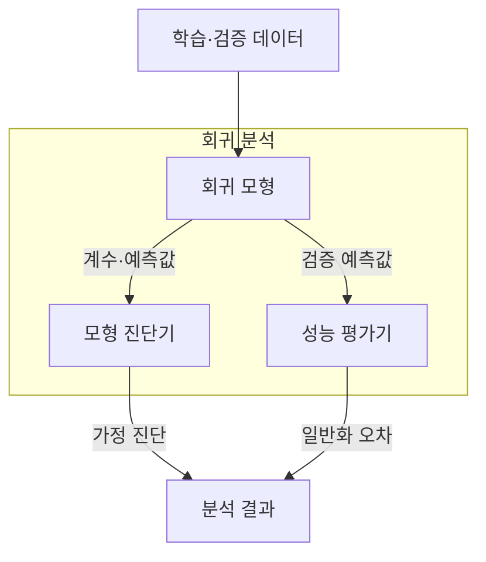
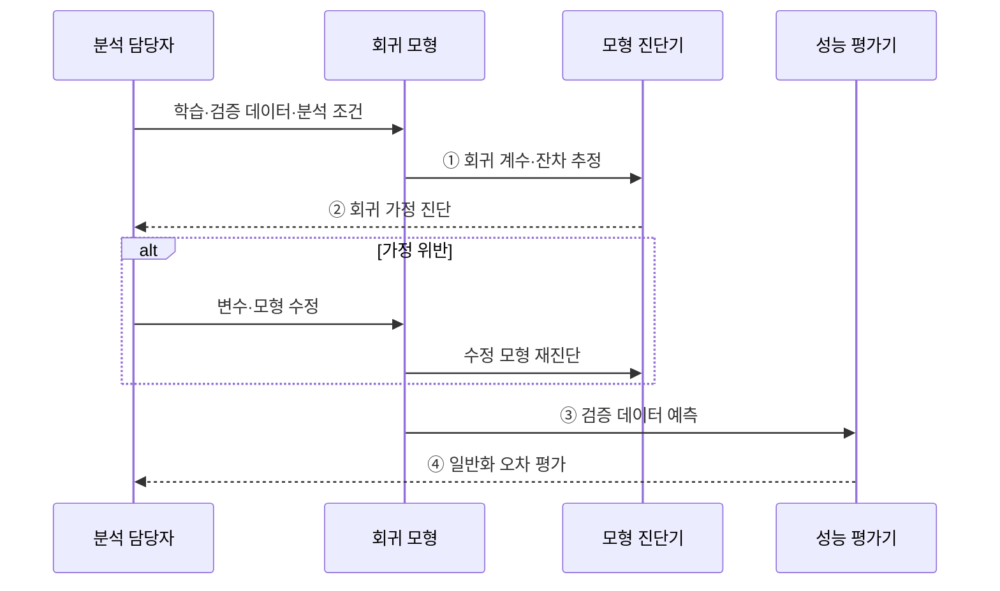

---
sidebar:
  order: 34
  label: "034. 회귀 분석 (Regression Analysis)"
  badge:
    text: "기출 · 30%"
    variant: note
title: "회귀 분석 (Regression Analysis)"
date: "2026-07-28T22:54:00+09:00"
tags:
  - "notes-basic-theory"
weight: 34
extra:
  question_no: "034"
  source_status: "기출"
  source_history: "120회"
  priority: 30
  priority_note: "기출 간격은 길지만 잔차 진단은 실무적"
---

## 미리 알고가기

- **회귀 분석(Regression Analysis)**: 입력과 연속형 결과의 관계를 모형화해 영향력을 추정하고 값을 예측하는 기법
- **종속 변수 $Y$·독립 변수 $X$**: 예측 대상과 결과를 설명하는 입력
- **회귀 계수(Regression Coefficient, $\beta$)**: 계수에 관례적으로 쓰는 베타 표기이며, 다른 입력이 같을 때 예측값의 변화 방향과 크기
- **잔차(Residual, $e$)**: 오차를 뜻하는 error의 첫 글자 표기이며, 관측값에서 예측값을 뺀 차이
- **최소제곱법(Ordinary Least Squares, OLS)**: 잔차 제곱합이 가장 작은 회귀 계수를 추정하는 방법
- **다중공선성(Multicollinearity)**: 입력 변수끼리 강하게 연관되어 각 변수의 계수 추정이 불안정해지는 상태
- **평균제곱근오차(Root Mean Squared Error, RMSE)**: 오차 제곱 평균의 제곱근으로 큰 오차에 더 민감한 예측 지표
- **평균절대오차(Mean Absolute Error, MAE)**: 오차 절댓값의 평균으로 RMSE보다 이상치 영향이 작은 예측 지표
- **분산팽창지수(Variance Inflation Factor, VIF)**: 입력 변수 간 연관성이 회귀 계수 분산을 키운 정도를 나타내는 공선성 지표
- **릿지 회귀(Ridge Regression)**: 계수 제곱합에 벌점을 부여해 다중공선성에 따른 계수 변동을 줄이는 회귀
- **등분산성(Homoscedasticity)**: 입력·예측 구간이 달라도 잔차가 흩어진 폭이 일정한 성질
- **외삽(Extrapolation)**: 학습한 입력 범위 밖에서도 같은 관계가 이어진다고 가정해 값을 예측하는 일
- **상관 분석(Correlation Analysis)**: 두 변수의 공동 변화 방향과 강도를 재지만 예측식·인과 방향은 제공하지 않는 분석
- **중앙 처리 장치(Central Processing Unit, CPU)**: 명령어 실행과 연산을 담당하는 처리 장치로, 실무 사례에서는 사용률이 회귀 예측 대상이 된다.
- **회귀 기호 $\hat{Y}$·$p$**: 회귀 모형의 예측값과 입력 변수 개수
- **선형성·독립성**: 선형성은 입력이 한 단위 변할 때 결과의 평균이 일정한 폭으로 변한다는 가정이고, 독립성은 한 관측의 잔차가 다른 관측의 잔차에 영향을 주지 않는다는 가정이다.
- **일반화 오차(Generalization Error)**: 학습에 쓰지 않은 새 데이터에서 발생하는 예측 오차이며, 학습 자료의 오차만 작다고 이 값이 함께 작아지지는 않는다.
- **오토스케일링(Auto Scaling)**: 요청량이나 자원 사용량에 따라 서버 수와 용량을 자동으로 늘리고 줄이는 기능이며, 언제 늘릴지 판단할 임계값이 필요하다.
- **입력 분포 변화(Input Distribution Shift)**: 운영에서 들어오는 입력값의 범위와 빈도가 학습 데이터와 달라지는 현상이며, 모형은 그대로인데 예측 오차만 조용히 커지게 만든다.
- **이분산성(Heteroscedasticity)**: 입력 구간에 따라 잔차의 분산이 달라져 통상적인 계수 불확실성 추정을 왜곡하는 상태
- **강건 표준오차(Robust Standard Error)**: 이분산성이 있어도 회귀 계수의 불확실성을 더 타당하게 추정하도록 보정한 표준오차
- **예측구간(Prediction Interval)**: 새 관측값이 포함될 범위를 정해 점 예측의 불확실성을 함께 나타내는 구간
- **조건부 평균(Conditional Mean)**: 특정 입력값이 주어졌을 때 결과 변수의 평균
- **인과관계(Causality)**: 한 변수의 변화가 다른 변수의 변화를 실제로 일으키는 원인·결과 관계

## Ⅰ. 개요

- 정의/개념: 입력 변수와의 **조건부 관계**로 연속값을 예측하는 **통계 기법**
- 기존 한계: **상관 분석**만으로는 미관측 값 예측·**영향력** 산출 불가

### 쉽게 이해하기 (학습용)

- 집 넓이·연식에 가격표를 맞추는 식처럼, 회귀는 새 입력의 연속값을 예측하고 다른 조건이 같을 때 각 입력의 계수만큼 결과가 변한다고 설명한다.

## Ⅱ. 특징

- 독립·종속 변수 간 **조건부 관계**의 함수 모형화
- **잔차 분석** 기반 선형성·독립성·**등분산성** 검증
- 관측된 **조건부 평균** 추정만으로 인과관계 미보장

### 쉽게 이해하기 (학습용)

- 예측선 주변의 점이 한쪽으로 휘거나 부채꼴로 벌어지면 선형성·등분산성 가정이 깨진 것이며, 선이 맞아도 원인 관계까지 증명한 것은 아니다.

## Ⅲ. 아키텍처

**도표안 A — 구조도**

**도표안 B — sequenceDiagram**

| 구성요소 | 책임 |
|:---|:---|
| 회귀 모형 | **회귀식**·추정 **계수** 보유와 예측값 산출 |
| 모형 진단기 | **잔차 패턴**·**VIF** 기반 가정 위반 판정 |
| 성능 평가기 | 검증 자료 **RMSE**·**MAE** 산출 |

**동작 원리**

- **① 회귀 계수·잔차 추정**: 잔차 제곱합을 줄이는 회귀 계수와 관측값·예측값의 차이 산출
- **② 회귀 가정 진단**: 잔차 패턴과 VIF로 선형성·독립성·등분산성·공선성 판정
- **③ 검증 데이터 예측**: 학습에 쓰지 않은 입력의 예측값을 성능 평가기에 전달
- **④ 일반화 오차 평가**: 검증 자료의 RMSE·MAE를 계산해 새 데이터 성능 판단

### 쉽게 이해하기 (학습용)

- 모형이 학습선과 계수를 만들면 진단기는 잔차 무늬와 VIF를 보고, 평가기는 보지 않은 데이터의 RMSE·MAE로 새 입력 성능을 확인한다.

## Ⅳ. 종류 및 비교

| 변수 간 관계 분석 | 회귀 분석 | 상관 분석 |
|:---|:---|:---|
| 적용 기준 | 특정 입력의 **예측값**이 필요할 때 | **연관 방향**·강도만 확인할 때 |
| 핵심 특징 | **회귀식** 계수로 변수별 영향력 산출 | 두 변수의 **공동 변화** 정도 측정 |
| 한계 | **다중공선성**·외삽 시 오차 급증 | **인과관계·예측식** 미제공 |

> 요약: 예측값이 필요하면 **회귀 분석**, 연관 확인이면 **상관 분석**

### 쉽게 이해하기 (학습용)

- 집값 예측식과 넓이 한 단위의 조건부 변화를 알고 싶으면 회귀, 넓이와 가격이 함께 움직이는 정도만 알고 싶으면 상관 분석을 쓴다.

## Ⅴ. 실무 고려사항 및 대책

| 고려사항 | 대책 | 효과 |
|:---|:---|:---|
| 비선형·**이분산 잔차** 패턴 | 변수 변환·비선형항·강건 표준오차 적용 | **가정 위반 영향** 완화 |
| **다중공선성**으로 계수 불안정 | VIF 점검·변수 축소·릿지 회귀 적용 | **계수 분산** 감소 |
| 학습 범위 밖 **외삽** | 입력 범위 감시·예측 거부 정책 | 근거 없는 **예측 방지** |
| 운영 **입력 분포 변화** | 잔차·오차 감시와 재학습 | **일반화 성능** 유지 |
| 오토스케일링의 **CPU 사용률** 예측 | 요청량별 예측구간으로 증설 임계값 설정 | 임계 도달 전 **용량 확보** |

### 쉽게 이해하기 (학습용)

- 평균 오차가 작아도 잔차가 부채꼴이거나 운영 입력이 학습 범위 밖이면 예측을 멈추고, 예측구간 상단으로 서버 증설 시점을 잡는다.

## Ⅵ. 결론

- 잔차 가정·검증 오차가 충족될 때만 **회귀 모형**의 예측 적용

### 쉽게 이해하기 (학습용)

- 검증 오차와 잔차 무늬가 안정된 입력 범위에서만 회귀값을 쓰고, 운영 분포가 범위를 벗어나면 재학습 전까지 예측을 거부한다.
