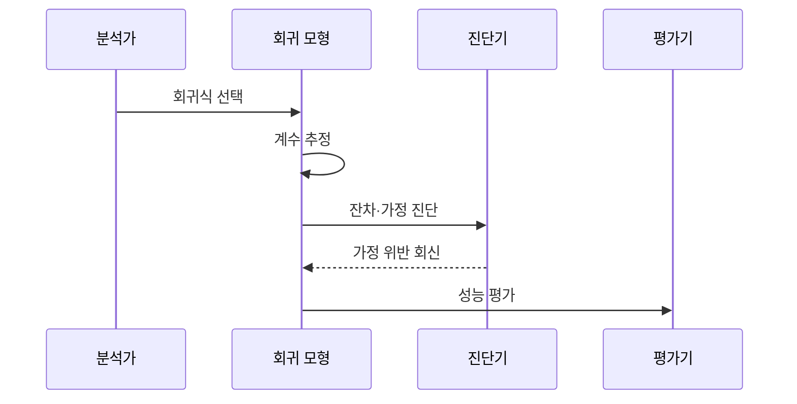

---
sidebar:
  order: 34
  label: "034. 회귀 분석 (Regression Analysis)"
  badge:
    text: "기출 · 30%"
    variant: note
title: "회귀 분석 (Regression Analysis)"
date: "2026-07-27T22:20:00+09:00"
tags:
  - "notes-basic-theory"
weight: 34
extra:
  question_no: "034"
  source_status: "기출"
  source_history: "120회"
  priority: 30
  priority_note: "기출 간격은 길지만 잔차 진단은 실무적"
---

## 미리 알고가기

- **회귀 분석(Regression Analysis)**: 흩어진 점들 사이에 자를 대고 가장 잘 지나가는 직선 하나를 긋는 장면을 떠올리면 되며, 그 직선의 기울기로 입력이 결과에 얼마나 영향을 주는지 설명하고 아직 관측하지 않은 입력의 결과값까지 예측하는 통계 기법이다.
- **종속 변수 $Y$·독립 변수 $X$**: 각각 ‘와이·엑스’로 읽고 결과와 입력 변수에 관례적으로 쓰는 문자 표기이며, 회귀 모형이 예측할 대상과 그 결과를 설명하는 입력을 가리킨다.
- **회귀 계수(Regression Coefficient, $\beta$)**: $\beta$는 ‘베타’로 읽고 회귀 계수에 관례적으로 쓰는 그리스 문자이며, 다른 입력이 같을 때 해당 입력 변화에 따른 예측값의 변화 방향과 크기를 나타낸다.
- **잔차(Residual, $e$)**: $e$는 ‘이’로 읽고 error의 머리글자를 오차에 쓴 표기이며, 관측값에서 예측값을 뺀 차이로 모형 가정을 진단한다.
- **최소제곱법(Ordinary Least Squares, OLS)**: ‘오엘에스’로 읽고 영문 머리글자를 딴 약어이며, 잔차를 각각 제곱해 모두 더한 값이 가장 작아지는 지점을 찾아 회귀 계수를 정하는 추정 방법이다.
- **다중공선성(Multicollinearity)**: 입력 변수끼리 서로 강한 선형 관계를 가져 결과 변화가 어느 변수의 몫인지 가릴 수 없게 되는 상태이며, 이때 계수 추정값이 표본이 조금만 바뀌어도 크게 흔들려 해석을 믿기 어려워진다.
- **평균제곱근오차(Root Mean Squared Error, RMSE)**: ‘알엠에스이’로 읽고 영문 머리글자를 딴 약어이며, 오차를 제곱해 평균 낸 뒤 제곱근을 취하므로 큰 오차 하나가 지표에 크게 반영되는 예측 오차 지표다.
- **평균절대오차(Mean Absolute Error, MAE)**: ‘엠에이이’로 읽고 영문 머리글자를 딴 약어이며, 오차의 절댓값을 그대로 평균 내므로 큰 오차 하나에 덜 민감한 예측 오차 지표다.
- **분산팽창지수(Variance Inflation Factor, VIF)**: ‘브이아이에프’로 읽고 영문 머리글자를 딴 약어이며, 다른 입력과의 상관 때문에 그 변수의 계수 분산이 몇 배로 부풀었는지 나타내 다중공선성 여부를 판정한다.
- **릿지 회귀(Ridge Regression)**: 회귀 계수의 제곱합에 벌점을 매겨 계수가 지나치게 커지지 못하게 누르는 회귀 방법이며, 다중공선성으로 흔들리던 계수 추정을 안정시킨다.
- **등분산성(Homoscedasticity)**: 예측값이 크든 작든 잔차가 흩어진 폭이 일정한 성질이며, 이 성질이 깨지면 특정 구간에서만 예측이 크게 빗나가도 전체 오차 지표에서는 드러나지 않는다.
- **외삽(Extrapolation)**: 학습 데이터가 다룬 입력 범위 바깥의 값을 모형에 넣어 예측하는 일이며, 그 구간에도 같은 직선 관계가 이어진다는 근거가 없어 오차가 급격히 커질 수 있다.
- **상관 분석(Correlation Analysis)**: 두 변수가 같이 커지고 같이 작아지는 정도와 방향만 하나의 수로 재는 방법이며, 예측식을 만들지도 어느 쪽이 원인인지 가리지도 않는다.
- **중앙 처리 장치(Central Processing Unit, CPU)**: ‘시피유’로 읽고 영문 머리글자를 딴 약어이며, 명령 실행과 연산을 담당하는 장치로 실무 사례에서는 그 사용률이 회귀 예측 대상이 된다.
- **회귀 기호 $\hat{Y}$·$p$**: 각각 ‘와이 햇·피’로 읽고 모자표는 추정값, $p$는 변수 개수에 관례적으로 쓰는 표기이며, 회귀 모형의 연속 예측값과 입력 변수 개수를 가리킨다.
- **선형성·독립성**: 선형성은 입력이 한 단위 변할 때 결과의 평균이 일정한 폭으로 변한다는 가정이고, 독립성은 한 관측의 잔차가 다른 관측의 잔차에 영향을 주지 않는다는 가정이다.
- **일반화 오차(Generalization Error)**: 학습에 쓰지 않은 새 데이터에서 발생하는 예측 오차이며, 학습 자료의 오차만 작다고 이 값이 함께 작아지지는 않는다.
- **오토스케일링(Auto Scaling)**: 요청량이나 자원 사용량에 따라 서버 수와 용량을 자동으로 늘리고 줄이는 기능이며, 언제 늘릴지 판단할 임계값이 필요하다.
- **입력 분포 변화(Input Distribution Shift)**: 운영에서 들어오는 입력값의 범위와 빈도가 학습 데이터와 달라지는 현상이며, 모형은 그대로인데 예측 오차만 조용히 커지게 만든다.

## Ⅰ. 개요

- 정의/개념: 입력 변수와의 **조건부 관계**로 연속값을 예측하는 **통계 기법**
- 기존 한계: **상관 분석**만으로는 미관측 값 예측·**영향력** 산출 불가

### 쉽게 이해하기 (학습용)

- 답안이 정의에 `예측`과 `설명`을 함께 넣은 이유는, 라면 끓인 시간과 물 양을 적어 둔 표에 직선 하나를 그어 두면 아직 해 보지 않은 조합의 맛 점수를 미리 찍어 보는 일과 물을 50mL 더 부으면 점수가 몇 점 떨어지는지 재료별 몫을 따져 보는 일이 그 직선 하나에서 동시에 나오기 때문이다.

## Ⅱ. 특징

- 독립·종속 변수 간 **조건부 관계**의 함수 모형화
- **잔차 분석** 기반 선형성·독립성·**등분산성** 검증
- 관측된 **조건부 평균** 추정만으로 인과관계 미보장

### 쉽게 이해하기 (학습용)

- 답안이 특징에 굳이 `잔차`와 `인과 해석 제한`을 함께 넣은 이유는, 그은 직선이 데이터를 제대로 지나가는지는 점들이 직선 위아래로 고르게 흩어졌는지를 봐야만 알 수 있고, 아이스크림 판매량과 익사 사고가 나란히 늘어난다고 해서 아이스크림이 원인이 아니듯 직선이 잘 맞는다는 사실만으로는 원인을 말할 수 없기 때문이다.

## Ⅲ. 아키텍처 및 구성요소

| 설계 요소 | 설명 |
|:---|:---|
| 회귀 모형 | **회귀식**·추정 **계수** 보유와 예측값 산출 |
| 모형 진단기 | **잔차 패턴**·**VIF** 기반 가정 위반 판정 |
| 성능 평가기 | 검증 자료 **RMSE**·**MAE** 산출 |

> 요약: 모형 **예측**·가정 진단·오차 측정의 역할 분담

### 쉽게 이해하기 (학습용)

- 답안이 회귀 계수나 잔차 같은 값을 구성요소에서 빼고 세 덩어리만 남긴 이유는, 계수와 잔차는 저울에 찍힌 눈금일 뿐이고 실제로 일하는 주체는 직선식을 들고 값을 내놓는 회귀 모형, 그 직선이 점들과 어긋난 패턴을 잡아내는 잔차 진단기, 처음 보는 데이터로 오차를 재는 성능 평가기 셋뿐이기 때문이다.

## Ⅳ. 원리 및 절차 흐름도

| 절차 | 설명 |
|:---|:---|
| 회귀식 선택 | 예측 대상·관계 형태에 맞는 **모형 설정** |
| 계수 추정 | **최소제곱** 기준 **잔차 제곱합** 최소화 |
| 잔차·가정 진단 | 잔차 패턴·**VIF**로 **가정 위반** 판정 |
| 가정 위반 회신 | 위반 시 변수·**벌점항** 재설정 요구 |
| 성능 평가 | 검증 자료 **RMSE**·**MAE** 측정 |

> 요약: 계수 추정 후 **잔차 진단**·일반화 오차 검증

### 쉽게 이해하기 (학습용)

- 답안이 `잔차·가정 진단`을 성능 평가보다 앞에 세운 이유는, 시험 총점이 높아도 답안지를 넘겨 보면 특정 유형만 계속 틀린 자국이 보이듯 오차 숫자가 작아도 잔차가 한쪽으로 휘어 있으면 그 모형은 특정 구간에서 계속 빗나가는 중이므로, 가정을 먼저 통과시킨 뒤에야 RMSE 값을 믿을 수 있기 때문이다.

## Ⅴ. 종류 및 비교

| 변수 간 관계 분석 | 회귀 분석 | 상관 분석 |
|:---|:---|:---|
| 적용 기준 | 특정 입력의 **예측값**이 필요할 때 | **연관 방향**·강도만 확인할 때 |
| 핵심 특징 | **회귀식** 계수로 변수별 영향력 산출 | 두 변수의 **공동 변화** 정도 측정 |
| 한계 | **다중공선성**·외삽 시 오차 급증 | **인과관계·예측식** 미제공 |

> 요약: 예측값이 필요하면 **회귀 분석**, 연관 확인이면 **상관 분석**

### 쉽게 이해하기 (학습용)

- 답안이 두 방법을 나란히 놓은 이유는, 상관 분석은 키가 큰 사람이 대체로 무겁다는 사실을 숫자 하나로 알려 주고 끝나지만 회귀 분석은 키 170cm인 사람의 몸무게가 몇 kg일지 값을 실제로 찍어 주기 때문이며, 그래서 값이 필요하면 회귀를 쓰고 함께 움직이는지만 궁금하면 상관을 쓴다.

## Ⅵ. 실무 사례

1. **오토스케일링** 임계 산정에 요청 수 기반 **CPU 사용률** 예측

### 쉽게 이해하기 (학습용)

- 분당 요청 수와 CPU 사용률의 관계를 직선으로 잡아 두면 요청이 늘어나는 순간 사용률이 한계선에 닿을 시점을 미리 계산할 수 있어, 서버가 버거워진 뒤가 아니라 그 전에 대수를 늘리게 된다.

## Ⅶ. 결론

- **잔차 패턴·입력 분포 변화** 시 모형 재설정·재학습

### 쉽게 이해하기 (학습용)

- 회귀 모형은 한 번 잘 맞았다고 계속 맞는 물건이 아니어서, 잔차가 한쪽으로 휘는 규칙이 생기거나 운영에서 들어오는 입력 범위가 학습 때와 달라지면 그 직선은 이미 낡은 것이므로 다시 그어야 한다.
